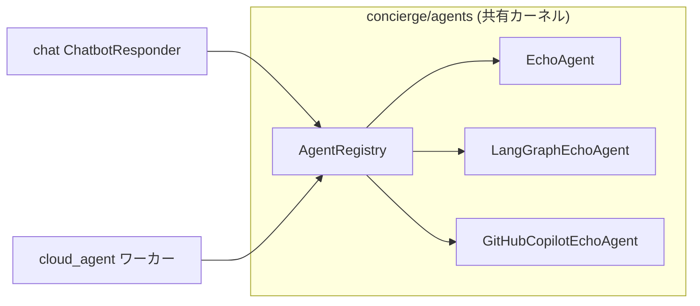

## 概要

`concierge/agents` は、トランスポート非依存のエージェント契約
（`AgentRequest` / `AgentResponse` / `Agent` Protocol / `AgentRegistry`）を定義する
**共有バウンデッドコンテキスト**です。`cloud_agent` ワーカと `chat` の AI 応答経路の
両方から同一のエージェント実装を呼び出すことができます。



## ディレクトリ構成

```
concierge/agents/
  domain/
    exceptions.py          # AgentNotFoundError, AgentExecutionError
  application/
    contracts.py           # AgentRequest, AgentResponse, AgentChunk, Agent, StreamingAgent
    registry.py            # AgentRegistry
  infrastructure/
    echo_agent.py          # EchoAgent
    langgraph_echo_agent.py # LangGraphEchoAgent
    github_copilot_echo_agent.py # GitHubCopilotEchoAgent
    microsoft_agent_framework_echo_agent.py # MicrosoftAgentFrameworkEchoAgent
    registry_factory.py    # get_agent_registry() (lru_cache)
```

## 契約

### AgentRequest / AgentResponse

```python
from concierge.agents.application.contracts import AgentRequest, AgentResponse

request = AgentRequest(
    agent_type="echo",
    payload={"message": "こんにちは"},
    context={"conversation_id": "<uuid>"},
)

response: AgentResponse = await agent.handle(request)
# response.status: "succeeded" | "failed"
# response.result: dict | None
# response.error: str | None
```

### Agent Protocol

```python
from typing import ClassVar
from concierge.agents.application.contracts import Agent, AgentRequest, AgentResponse

class MyAgent:
    agent_type: ClassVar[str] = "my-agent"

    async def handle(self, request: AgentRequest) -> AgentResponse:
        ...
```

## 組み込みエージェント

| agent_type | クラス | 説明 |
|------------|--------|------|
| `echo` | `EchoAgent` | `payload.message` をそのまま返す。LLM 不要。 |
| `langgraph-echo` | `LangGraphEchoAgent` | `echo` ツールを持つ LangGraph エージェント。Azure AI チャットモデルを使用。 |
| `github-copilot-echo` | `GitHubCopilotEchoAgent` | リクエストごとに GitHub Copilot SDK セッションを開き、ユーザーメッセージを `send` し、アシスタント応答を返します。 |
| `microsoft-agent-framework-echo` | `MicrosoftAgentFrameworkEchoAgent` | Microsoft Agent Framework の `Agent` を `echo` ツール付きで実行し、最終応答テキストを返します。 |

## 設定

エージェント設定は **`AGENTS_`** プレフィックスの環境変数から読み込まれます。

| 変数 | デフォルト | 説明 |
|------|-----------|------|
| `AGENTS_LANGGRAPH_MODEL` | `azure_ai:gpt-5` | `init_chat_model` に渡すモデル文字列。 |
| `AGENTS_LANGGRAPH_SYSTEM_PROMPT` | _(組み込み)_ | LangGraph エージェントへのシステムプロンプト。 |
| `AGENTS_GITHUB_COPILOT_MODEL` | `gpt-5-mini` | `CopilotClient.create_session(model=...)` に渡すモデル名。 |
| `AGENTS_GITHUB_COPILOT_SYSTEM_PROMPT` | _(組み込み)_ | `github-copilot-echo` 用システムプロンプト（`create_session` に `system_message={"mode": "replace", "content": ...}` として渡される）。デフォルト: `You are a helpful coding assistant that provides code suggestions and explanations to users.` |
| `AGENTS_MICROSOFT_AGENT_FRAMEWORK_MODEL` | `gpt-5` | `microsoft-agent-framework-echo` の `FoundryChatClient(model=...)` に渡すモデル名。 |
| `AGENTS_MICROSOFT_AGENT_FRAMEWORK_SYSTEM_PROMPT` | _(組み込み)_ | `microsoft-agent-framework-echo` の `Agent(instructions=...)` に渡すシステムプロンプト。 |

## cloud_agent ワーカーからの利用

```bash
uv run cloud-agent-cli task dispatch \
  --agent-type langgraph-echo \
  --payload '{"message": "Hello LangGraph"}'
```

## chat からの利用

`CHAT_BOT_AGENT_TYPE` に登録済みのエージェント名を設定すると、チャット返信が共有エージェント経由になります（デフォルトの `foundry` は従来通り Foundry ストリーミングを使用）。

```bash
export CHAT_BOT_AGENT_TYPE=echo   # LLM 不要のスモークテスト
uv run chat-web
```

`github-copilot-echo` を使う場合:

```bash
export CHAT_BOT_AGENT_TYPE=github-copilot-echo
uv run chat-web
```

`github-copilot-echo` は LangChain/LangGraph ベースではないため、MLflow の
LangChain autologging では内部 SDK スパンは自動収集されません。

## 依存方向

`concierge.agents` は `concierge.chat` / `concierge.cloud_agent` / `concierge.todo`
に依存しません。この制約は `pyproject.toml` の `agents-no-service-coupling`
import-linter 契約によって静的に強制されます。
