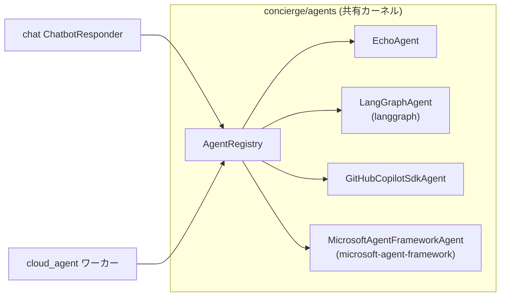

## 概要

`concierge/agents` は、トランスポート非依存のエージェント契約
（`AgentRequest` / `AgentResponse` / `Agent` Protocol / `AgentRegistry`）を定義する
**共有バウンデッドコンテキスト**です。`cloud_agent` ワーカと `chat` の AI 応答経路の
両方から同一のエージェント実装を呼び出すことができます。



## ディレクトリ構成

```
concierge/agents/
  domain/
    agent_types.py         # AgentType (StrEnum) — agent_type 定数・preset 識別子
    exceptions.py          # AgentNotFoundError, AgentExecutionError
  application/
    contracts.py           # AgentRequest, AgentResponse, AgentChunk, Agent, StreamingAgent
    registry.py            # AgentRegistry
  infrastructure/
    echo_agent.py                          # EchoAgent (LLM 不要)
    github_copilot_sdk_agent.py           # GitHubCopilotSdkAgent
    langgraph_agent.py                     # LangGraphAgent (preset ごとに tools を代入)
    microsoft_agent_framework_agent.py     # MicrosoftAgentFrameworkAgent (preset 構成可)
    tools/
      echo_tool.py             # build_echo_langchain_tool / build_echo_maf_tool
      file_management.py       # sandboxed file operation core（パス検証 + IO）
      file_management_tool.py  # LangChain / MAF / Copilot SDK 向け file tool builders
      shell_command.py         # 許可リスト方式 shell 実行コア（shell=False subprocess）
      shell_command_tool.py    # LangChain / MAF / Copilot SDK 向け shell tool builders
      image_generation.py      # フレームワーク不要の generate_image() 関数
      image_generation_tool.py # image_gen_langchain_tool_factory / image_gen_maf_tool_factory
    registry_factory.py    # get_agent_registry() — 統合クラス + preset を配線
```

## 契約

### AgentRequest / AgentResponse

```python
from concierge.agents.application.contracts import AgentRequest, AgentResponse

request = AgentRequest(
    agent_type="echo",
    payload={"message": "こんにちは"},
    context={"conversation_id": "<uuid>"},
)

response: AgentResponse = await agent.handle(request)
# response.status: "succeeded" | "failed"
# response.result: dict | None
# response.error: str | None
```

### Agent Protocol

```python
from concierge.agents.application.contracts import Agent, AgentRequest, AgentResponse

class MyAgent:
    # ``agent_type`` はクラス属性とインスタンス属性のどちらでも可。
    # 複数 preset を同一クラスで提供する場合 (`LangGraphAgent` など) は
    # インスタンス属性とする。
    agent_type: str = "my-agent"

    async def handle(self, request: AgentRequest) -> AgentResponse:
        ...
```

## 組み込みエージェント

| agent_type | クラス | 説明 |
|------------|--------|------|
| `echo` | `EchoAgent` | `payload.message` をそのまま返す。LLM 不要。 |
| `langgraph` | `LangGraphAgent` | `echo` / `generate_image_tool` と、共有のサンドボックス化ファイル操作ツール（デフォルト: `read_file` / `list_directory` / `file_search`）、および任意有効化の許可リスト方式 shell ツール（`shell_exec`）を備える LangGraph (`create_agent`) preset。LLM がユーザー入力に応じてツールを選択します。 |
| `github-copilot-sdk` | `GitHubCopilotSdkAgent` | リクエストごとに GitHub Copilot SDK セッションを開き、ユーザーメッセージを `send` し、アシスタント応答を返します。 |
| `microsoft-agent-framework` | `MicrosoftAgentFrameworkAgent` | `echo` / `generate_image_tool` と、共有のサンドボックス化ファイル操作ツール（デフォルト: `read_file` / `list_directory` / `file_search`）、および任意有効化の許可リスト方式 shell ツール（`shell_exec`）を備える Microsoft Agent Framework preset。LLM がユーザー入力に応じてツールを選択します。 |

フレームワークベースの 2 つのエージェント (`langgraph` /
`microsoft-agent-framework`) は *汎用* で、それぞれ全ツールビルダーを
登録した状態で 1 度だけ登録されます。新しいツールを追加するときは
`registry_factory.py` のリストにビルダーを追加するだけで済み、新しい
`agent_type` を増やす必要はありません。

## 設定

エージェント設定は **`AGENTS_`** プレフィックスの環境変数から読み込まれます。

| 変数 | デフォルト | 説明 |
|------|-----------|------|
| `AGENTS_LANGGRAPH_MODEL` | `azure_ai:gpt-5` | `init_chat_model` に渡すモデル文字列。 |
| `AGENTS_LANGGRAPH_SYSTEM_PROMPT` | *(組み込み)* | `langgraph` エージェントのシステムプロンプト。デフォルトでは `echo` と `generate_image_tool` を使い分けるよう指示します。 |
| `AGENTS_GITHUB_COPILOT_SDK_MODEL` | `gpt-5-mini` | `CopilotClient.create_session(model=...)` に渡すモデル名。 |
| `AGENTS_GITHUB_COPILOT_SDK_SYSTEM_PROMPT` | *(組み込み)* | `github-copilot-sdk` 用システムプロンプト（`create_session` に `system_message={"mode": "replace", "content": ...}` として渡される）。デフォルト: `You are a helpful coding assistant that provides code suggestions and explanations to users.` |
| `AGENTS_MICROSOFT_AGENT_FRAMEWORK_MODEL` | `gpt-5` | `microsoft-agent-framework` の `FoundryChatClient(model=...)` に渡すモデル名。 |
| `AGENTS_MICROSOFT_AGENT_FRAMEWORK_SYSTEM_PROMPT` | *(組み込み)* | `microsoft-agent-framework` の `Agent(instructions=...)` に渡すシステムプロンプト。デフォルトでは `echo` と `generate_image_tool` を使い分けるよう指示します。 |
| `AGENTS_FILE_ROOT_DIR` | `""`（`<cwd>/workspace`） | ファイル操作ツールの sandbox root。相対パスはカレントディレクトリ起点で解決され、起動時に自動作成されます。 |
| `AGENTS_FILE_TOOLS_ENABLED` | `read_file,list_directory,file_search` | 有効化するファイル操作ツール名のカンマ区切り。`""` で全無効化。書き込み系（`write_file` / `copy_file` / `move_file` / `delete_file`）は明示的に opt-in が必要です。 |
| `AGENTS_SHELL_TOOLS_ENABLED` | `""` | 有効化する shell ツール名のカンマ区切り。空文字のままなら shell ツールは無効（デフォルト・完全 opt-in）。 |
| `AGENTS_SHELL_ALLOWED_COMMANDS` | `""` | `shell_exec` で許可するコマンド名のカンマ区切り（shell ツール有効時は必須）。コマンドパス指定は拒否されます。 |
| `AGENTS_SHELL_ROOT_DIR` | `""`（`AGENTS_FILE_ROOT_DIR` にフォールバック） | shell 実行時に固定される作業ディレクトリ。 |
| `AGENTS_SHELL_TIMEOUT_SECONDS` | `30` | 1 コマンドあたりのタイムアウト秒数。 |
| `AGENTS_SHELL_MAX_OUTPUT_BYTES` | `65536` | `stdout` / `stderr` 各ストリームの最大バイト数（超過時は末尾に truncate マーカー付与）。 |
| `AGENTS_IMAGE_MODEL` | `gpt-image-2` | 共有画像生成ツールが使う Foundry デプロイ名。 |
| `AGENTS_IMAGE_SIZE` | `1024x1024` | 既定サイズ（`1024x1024` / `1536x1024` / `1024x1536` / `4K`）。 |
| `AGENTS_IMAGE_N` | `1` | 1 回の呼び出しで要求する既定画像枚数。 |
| `AGENTS_IMAGE_API_VERSION` | `2025-04-01-preview` | `openai.AzureOpenAI` に渡す API バージョン。 |

画像生成ツールは [`MicrosoftFoundrySettings`](../tutorial/02-observability.md)
から以下の Foundry エンドポイント変数も読み込みます:

| 変数 | デフォルト | 説明 |
|------|-----------|------|
| `AZURE_AI_PROJECT_ENDPOINT` | `""` | 全エージェント共通で使う Foundry プロジェクトエンドポイント。 |
| `AZURE_AI_PROJECT_ENDPOINT_IMAGE` | `""` | `gpt-image-2` デプロイをホストする別の Foundry プロジェクトを指す任意のオーバーライド。`gpt-image-2` は現在 GA 提供されているリージョンが限定的であるため、メインの Foundry プロジェクトが対応リージョン外の場合に設定します。空の場合は共有の `AZURE_AI_PROJECT_ENDPOINT` が使われます。

ファイル操作ツールは `AGENTS_FILE_ROOT_DIR` 配下に厳密にサンドボックス化され、
絶対パスやパストラバーサルは拒否されます。shell ツールも固定 `cwd` かつ
`shell=False`、コマンド名許可リスト（`AGENTS_SHELL_ALLOWED_COMMANDS`）で実行されます。
書き込み系ツールや shell ツールを有効化する場合は
[LangChain Security Notice](https://python.langchain.com/docs/security) を必ず確認してください。

## cloud_agent ワーカーからの利用

```bash
uv run cloud-agent-cli task dispatch \
  --agent-type langgraph \
  --payload '{"message": "Hello LangGraph"}'
```

## chat からの利用

`CHAT_BOT_AGENT_TYPE` に登録済みのエージェント名を設定すると、チャット返信が共有エージェント経由になります（デフォルトの `foundry` は従来通り Foundry ストリーミングを使用）。

```bash
export CHAT_BOT_AGENT_TYPE=echo   # LLM 不要のスモークテスト
uv run chat-web
```

`github-copilot-sdk` を使う場合:

```bash
export CHAT_BOT_AGENT_TYPE=github-copilot-sdk
uv run chat-web
```

`microsoft-agent-framework` を使う場合:

```bash
export CHAT_BOT_AGENT_TYPE=microsoft-agent-framework
uv run chat-web
```

`github-copilot-sdk` は LangChain/LangGraph ベースではないため、MLflow の
LangChain autologging では内部 SDK スパンは自動収集されません。
`microsoft-agent-framework` も LangChain/LangGraph ではなく Microsoft
Agent Framework（`agent_framework.Agent` + `agent_framework.foundry.FoundryChatClient`）
で実装されているため同様で、内部スパンが必要な場合は Microsoft Agent
Framework 側の OTLP / Foundry トレーシングを有効化してください。

## エージェント別の最小動作検証手順

以下は `agents-cli` から各登録エージェントを最小限の構成で実行するための手順です。
レジストリへの配線が正しく、必要な設定（モデル名・エンドポイント・認証）が
揃っていることを確認できる "スモークテスト" の最小集合です。

LLM を使うエージェントに共通する事前準備:

```bash
# 1. .env を読み込み（uv が自動的に読み込みます）、Entra ID 認証のため az login する
az login
# 2. Foundry 系エージェントすべてに必須
export AZURE_AI_PROJECT_ENDPOINT="https://<resource>.services.ai.azure.com/api/projects/<project>"
```

### `echo` (LLM 不要)

```bash
uv run agents-cli invoke --agent-type echo --message "hello"
# 期待値: {"status": "succeeded", "result": {"message": "hello", "reply": "hello"}, "error": null}
```

### `langgraph`

`AZURE_AI_PROJECT_ENDPOINT` と `az login` が必要です。

```bash
uv run agents-cli info --agent-type langgraph             # 設定確認のみ（LLM 呼び出しなし）
uv run agents-cli invoke --agent-type langgraph --message "Say hi"
# 画像生成パス（AGENTS_IMAGE_MODEL のデプロイが必要、下記の注意点も参照）:
uv run agents-cli invoke --agent-type langgraph --message "Draw a red fox in watercolor style"
```

### `github-copilot-sdk`

デフォルトの echo パスでは
[GitHub Copilot CLI](https://github.com/github/copilot-cli) のインストールと
認証が必要で、Foundry エンドポイントは不要です。

```bash
uv run agents-cli info --agent-type github-copilot-sdk
uv run agents-cli invoke --agent-type github-copilot-sdk --message "Say hi"
```

### `microsoft-agent-framework`

`AZURE_AI_PROJECT_ENDPOINT` と `az login` が必要です。

```bash
uv run agents-cli info --agent-type microsoft-agent-framework
uv run agents-cli invoke --agent-type microsoft-agent-framework --message "Say hi"
# 画像生成パス:
uv run agents-cli invoke --agent-type microsoft-agent-framework --message "Draw a red fox in watercolor style"
```

### `image generate` (LLM 経由なしの直接実行)

`gpt-image-2` は現在 GA リージョンが限定的なため、`AZURE_AI_PROJECT_ENDPOINT`
が対象外リージョンを指している場合は、画像モデルをホストする別の Foundry
プロジェクトを `AZURE_AI_PROJECT_ENDPOINT_IMAGE` で指定してください。

```bash
export AZURE_AI_PROJECT_ENDPOINT_IMAGE="https://<image-resource>.services.ai.azure.com/api/projects/<project>"
mkdir -p ./tmp_out
uv run agents-cli image generate \
  --prompt "A photo of a Shibuya crossing at night" \
  --output-dir ./tmp_out
ls ./tmp_out/*.png
```

## 依存方向

`concierge.agents` は `concierge.chat` / `concierge.cloud_agent` / `concierge.todo`
に依存しません。この制約は `pyproject.toml` の `agents-no-service-coupling`
import-linter 契約によって静的に強制されます。
