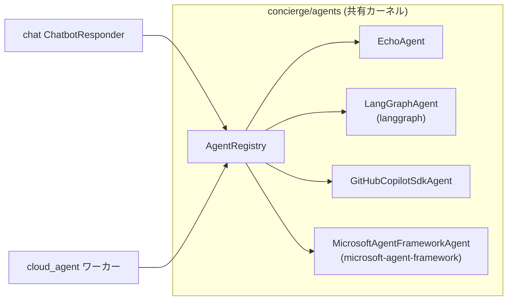

## 概要

`concierge/agents` は、トランスポート非依存のエージェント契約
（`AgentRequest` / `AgentResponse` / `Agent` Protocol / `AgentRegistry`）を定義する
**共有バウンデッドコンテキスト**です。`cloud_agent` ワーカと `chat` の AI 応答経路の
両方から同一のエージェント実装を呼び出すことができます。



## ディレクトリ構成

```
concierge/agents/
  domain/
    agent_types.py         # AgentType (StrEnum) — agent_type 定数・preset 識別子
    exceptions.py          # AgentNotFoundError, AgentExecutionError
  application/
    contracts.py           # AgentRequest, AgentResponse, AgentChunk, Agent, StreamingAgent
    registry.py            # AgentRegistry
  infrastructure/
    echo_agent.py                          # EchoAgent (LLM 不要)
    github_copilot_sdk_agent.py           # GitHubCopilotSdkAgent
    langgraph_agent.py                     # LangGraphAgent (preset ごとに tools を代入)
    microsoft_agent_framework_agent.py     # MicrosoftAgentFrameworkAgent (preset 構成可)
    tools/
      echo_tool.py             # build_echo_langchain_tool / build_echo_maf_tool
      image_generation.py      # フレームワーク不要の generate_image() 関数
      image_generation_tool.py # image_gen_langchain_tool_factory / image_gen_maf_tool_factory
    registry_factory.py    # get_agent_registry() — 統合クラス + preset を配線
```

## 契約

### AgentRequest / AgentResponse

```python
from concierge.agents.application.contracts import AgentRequest, AgentResponse

request = AgentRequest(
    agent_type="echo",
    payload={"message": "こんにちは"},
    context={"conversation_id": "<uuid>"},
)

response: AgentResponse = await agent.handle(request)
# response.status: "succeeded" | "failed"
# response.result: dict | None
# response.error: str | None
```

### Agent Protocol

```python
from concierge.agents.application.contracts import Agent, AgentRequest, AgentResponse

class MyAgent:
    # ``agent_type`` はクラス属性とインスタンス属性のどちらでも可。
    # 複数 preset を同一クラスで提供する場合 (`LangGraphAgent` など) は
    # インスタンス属性とする。
    agent_type: str = "my-agent"

    async def handle(self, request: AgentRequest) -> AgentResponse:
        ...
```

## 組み込みエージェント

| agent_type | クラス | 説明 |
|------------|--------|------|
| `echo` | `EchoAgent` | `payload.message` をそのまま返す。LLM 不要。 |
| `langgraph` | `LangGraphAgent` | `echo` と `generate_image_tool` の両方を備える LangGraph (`create_agent`) preset。LLM がユーザー入力に応じてツールを選択します。 |
| `github-copilot-sdk` | `GitHubCopilotSdkAgent` | リクエストごとに GitHub Copilot SDK セッションを開き、ユーザーメッセージを `send` し、アシスタント応答を返します。 |
| `microsoft-agent-framework` | `MicrosoftAgentFrameworkAgent` | `echo` と `generate_image_tool` の両方を備える Microsoft Agent Framework preset。LLM がユーザー入力に応じてツールを選択します。 |

フレームワークベースの 2 つのエージェント (`langgraph` /
`microsoft-agent-framework`) は *汎用* で、それぞれ全ツールビルダーを
登録した状態で 1 度だけ登録されます。新しいツールを追加するときは
`registry_factory.py` のリストにビルダーを追加するだけで済み、新しい
`agent_type` を増やす必要はありません。

## 設定

エージェント設定は **`AGENTS_`** プレフィックスの環境変数から読み込まれます。

| 変数 | デフォルト | 説明 |
|------|-----------|------|
| `AGENTS_LANGGRAPH_MODEL` | `azure_ai:gpt-5` | `init_chat_model` に渡すモデル文字列。 |
| `AGENTS_LANGGRAPH_SYSTEM_PROMPT` | *(組み込み)* | `langgraph` エージェントのシステムプロンプト。デフォルトでは `echo` と `generate_image_tool` を使い分けるよう指示します。 |
| `AGENTS_GITHUB_COPILOT_SDK_MODEL` | `gpt-5-mini` | `CopilotClient.create_session(model=...)` に渡すモデル名。 |
| `AGENTS_GITHUB_COPILOT_SDK_SYSTEM_PROMPT` | *(組み込み)* | `github-copilot-sdk` 用システムプロンプト（`create_session` に `system_message={"mode": "replace", "content": ...}` として渡される）。デフォルト: `You are a helpful coding assistant that provides code suggestions and explanations to users.` |
| `AGENTS_MICROSOFT_AGENT_FRAMEWORK_MODEL` | `gpt-5` | `microsoft-agent-framework` の `FoundryChatClient(model=...)` に渡すモデル名。 |
| `AGENTS_MICROSOFT_AGENT_FRAMEWORK_SYSTEM_PROMPT` | *(組み込み)* | `microsoft-agent-framework` の `Agent(instructions=...)` に渡すシステムプロンプト。デフォルトでは `echo` と `generate_image_tool` を使い分けるよう指示します。 |
| `AGENTS_IMAGE_MODEL` | `gpt-image-2` | 共有画像生成ツールが使う Foundry デプロイ名。 |
| `AGENTS_IMAGE_SIZE` | `1024x1024` | 既定サイズ（`1024x1024` / `1536x1024` / `1024x1536` / `4K`）。 |
| `AGENTS_IMAGE_N` | `1` | 1 回の呼び出しで要求する既定画像枚数。 |
| `AGENTS_IMAGE_API_VERSION` | `2025-04-01-preview` | `openai.AzureOpenAI` に渡す API バージョン。 |

## cloud_agent ワーカーからの利用

```bash
uv run cloud-agent-cli task dispatch \
  --agent-type langgraph \
  --payload '{"message": "Hello LangGraph"}'
```

## chat からの利用

`CHAT_BOT_AGENT_TYPE` に登録済みのエージェント名を設定すると、チャット返信が共有エージェント経由になります（デフォルトの `foundry` は従来通り Foundry ストリーミングを使用）。

```bash
export CHAT_BOT_AGENT_TYPE=echo   # LLM 不要のスモークテスト
uv run chat-web
```

`github-copilot-sdk` を使う場合:

```bash
export CHAT_BOT_AGENT_TYPE=github-copilot-sdk
uv run chat-web
```

`microsoft-agent-framework` を使う場合:

```bash
export CHAT_BOT_AGENT_TYPE=microsoft-agent-framework
uv run chat-web
```

`github-copilot-sdk` は LangChain/LangGraph ベースではないため、MLflow の
LangChain autologging では内部 SDK スパンは自動収集されません。
`microsoft-agent-framework` も LangChain/LangGraph ではなく Microsoft
Agent Framework（`agent_framework.Agent` + `agent_framework.foundry.FoundryChatClient`）
で実装されているため同様で、内部スパンが必要な場合は Microsoft Agent
Framework 側の OTLP / Foundry トレーシングを有効化してください。

## 依存方向

`concierge.agents` は `concierge.chat` / `concierge.cloud_agent` / `concierge.todo`
に依存しません。この制約は `pyproject.toml` の `agents-no-service-coupling`
import-linter 契約によって静的に強制されます。
