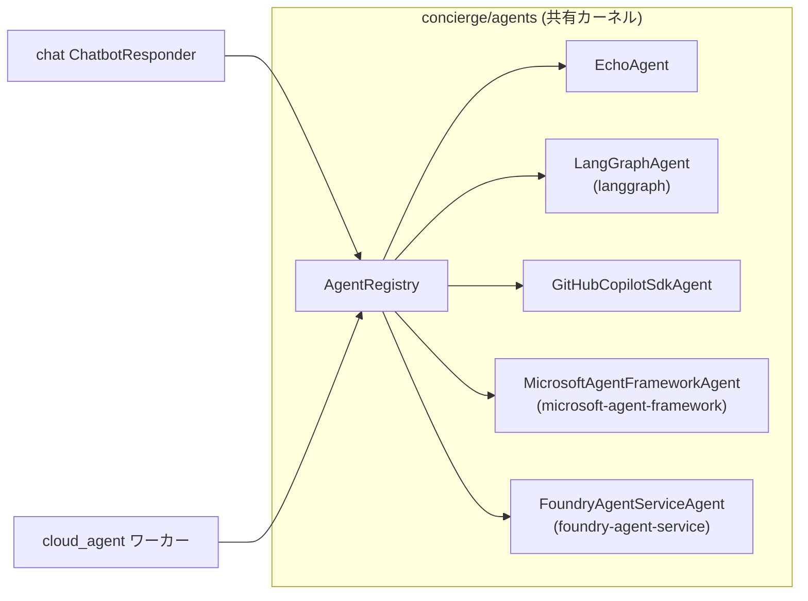
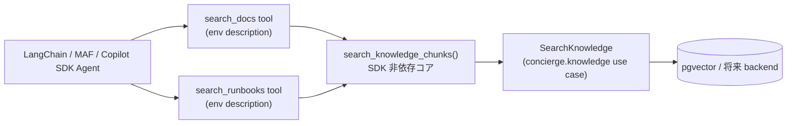

## 概要

`concierge/agents` は、トランスポート非依存のエージェント契約
（`AgentRequest` / `AgentResponse` / `Agent` Protocol / `AgentRegistry`）を定義する
**共有バウンデッドコンテキスト**です。`cloud_agent` ワーカと `chat` の AI 応答経路の
両方から同一のエージェント実装を呼び出すことができます。



## ディレクトリ構成

```
concierge/agents/
  domain/
    agent_types.py         # AgentType (StrEnum) — agent_type 定数・preset 識別子
    exceptions.py          # AgentNotFoundError, AgentExecutionError
  application/
    contracts.py           # AgentRequest, AgentResponse, AgentChunk, Agent, StreamingAgent
    registry.py            # AgentRegistry
  infrastructure/
    echo_agent.py                          # EchoAgent (LLM 不要)
    github_copilot_sdk_agent.py           # GitHubCopilotSdkAgent
    langgraph_agent.py                     # LangGraphAgent (preset ごとに tools を代入)
    microsoft_agent_framework_agent.py     # MicrosoftAgentFrameworkAgent (preset 構成可)
    foundry_agent_service_agent.py         # FoundryAgentServiceAgent (Azure AI Foundry Prompt Agent)
    tools/
      echo_tool.py             # build_echo_langchain_tool / build_echo_maf_tool
      file_management.py       # sandboxed file operation core（パス検証 + IO）
      file_management_tool.py  # LangChain / MAF / Copilot SDK 向け file tool builders
      shell_command.py         # 許可リスト方式 shell 実行コア（shell=False subprocess）
      shell_command_tool.py    # LangChain / MAF / Copilot SDK 向け shell tool builders
      image_generation.py      # フレームワーク不要の generate_image() 関数
      image_generation_tool.py # image_gen_langchain_tool_factory / image_gen_maf_tool_factory
    registry_factory.py    # get_agent_registry() — 統合クラス + preset を配線
```

## 契約

### AgentRequest / AgentResponse

```python
from concierge.agents.application.contracts import AgentRequest, AgentResponse

request = AgentRequest(
    agent_type="echo",
    payload={"message": "こんにちは"},
    context={"conversation_id": "<uuid>"},
)

response: AgentResponse = await agent.handle(request)
# response.status: "succeeded" | "failed"
# response.result: dict | None
# response.error: str | None
```

### Agent Protocol

```python
from concierge.agents.application.contracts import Agent, AgentRequest, AgentResponse

class MyAgent:
    # ``agent_type`` はクラス属性とインスタンス属性のどちらでも可。
    # 複数 preset を同一クラスで提供する場合 (`LangGraphAgent` など) は
    # インスタンス属性とする。
    agent_type: str = "my-agent"

    async def handle(self, request: AgentRequest) -> AgentResponse:
        ...
```

## 組み込みエージェント

| agent_type | クラス | 説明 |
|------------|--------|------|
| `echo` | `EchoAgent` | `payload.message` をそのまま返す。LLM 不要。 |
| `langgraph` | `LangGraphAgent` | `echo` / `generate_image_tool` と、共有のサンドボックス化ファイル操作ツール（デフォルト: `read_file` / `list_directory` / `file_search`）、単一ページ取得ツール（デフォルト: `fetch_webpage`）、および任意有効化の許可リスト方式 shell ツール（`shell_exec`）を備える LangGraph (`create_agent`) preset。LLM がユーザー入力に応じてツールを選択します。 |
| `github-copilot-sdk` | `GitHubCopilotSdkAgent` | リクエストごとに GitHub Copilot SDK セッションを開き、ユーザーメッセージを `send` し、アシスタント応答を返します。他のツール対応エージェントと同じ共有クライアント側ツールビルダーも配線されます。 |
| `microsoft-agent-framework` | `MicrosoftAgentFrameworkAgent` | `echo` / `generate_image_tool` と、共有のサンドボックス化ファイル操作ツール（デフォルト: `read_file` / `list_directory` / `file_search`）、単一ページ取得ツール（デフォルト: `fetch_webpage`）、および任意有効化の許可リスト方式 shell ツール（`shell_exec`）を備える Microsoft Agent Framework preset。LLM がユーザー入力に応じてツールを選択します。 |
| `foundry-agent-service` | `FoundryAgentServiceAgent` | Azure AI Foundry の **Prompt Agent**（サーバーサイドホストされるエージェント）を呼び出します。初回起動時に Foundry プロジェクト上に名前付きの `PromptAgentDefinition` を作成し、`openai.responses.create()` に `agent_reference` を渡して騆動します。クライアント側のツールは読み込まれず、ツールや knowledge は Foundry 側のエージェント定義で設定します。 |

クライアント側ツールに対応するエージェント (`langgraph` / `github-copilot-sdk` /
`microsoft-agent-framework`) は *汎用* で、それぞれ全ツールビルダーを
登録した状態で 1 度だけ登録されます。新しいツールを追加するときは
`registry_factory.py` のリストにビルダーを追加するだけで済み、新しい
`agent_type` を増やす必要はありません。

`foundry-agent-service` は **サーバーサイド** で、システムプロンプトや
ツールリストは Foundry プロジェクト側に保持されます。Foundry 側でエージェント
定義（バージョニング / 評価 / オブザーバビリティフック等）を一元管理したい
場合に選びます。クライアント側 SDK で `FoundryChatClient` を使う側のエージェント
が欲しい場合は `microsoft-agent-framework` を使います。

## 設定

エージェント設定は **`AGENTS_`** プレフィックスの環境変数から読み込まれます。

| 変数 | デフォルト | 説明 |
|------|-----------|------|
| `AGENTS_LANGGRAPH_MODEL` | `azure_ai:gpt-5` | `init_chat_model` に渡すモデル文字列。 |
| `AGENTS_LANGGRAPH_SYSTEM_PROMPT` | *(組み込み)* | `langgraph` エージェントのシステムプロンプト。デフォルトでは `echo` / `generate_image_tool` / ファイルツール / shell ツール / `fetch_webpage` などをリクエストに応じて使い分けるよう指示します。 |
| `AGENTS_GITHUB_COPILOT_SDK_MODEL` | `gpt-5-mini` | `CopilotClient.create_session(model=...)` に渡すモデル名。 |
| `AGENTS_GITHUB_COPILOT_SDK_SYSTEM_PROMPT` | *(組み込み)* | `github-copilot-sdk` 用システムプロンプト（`create_session` に `system_message={"mode": "replace", "content": ...}` として渡される）。デフォルトでは `echo` / `generate_image_tool` / ファイルツール / shell ツール / `fetch_webpage` などをリクエストに応じて使い分けるよう指示します。 |
| `AGENTS_MICROSOFT_AGENT_FRAMEWORK_MODEL` | `gpt-5` | `microsoft-agent-framework` の `FoundryChatClient(model=...)` に渡すモデル名。 |
| `AGENTS_MICROSOFT_AGENT_FRAMEWORK_SYSTEM_PROMPT` | *(組み込み)* | `microsoft-agent-framework` の `Agent(instructions=...)` に渡すシステムプロンプト。デフォルトでは `echo` / `generate_image_tool` / ファイルツール / shell ツール / `fetch_webpage` などをリクエストに応じて使い分けるよう指示します。 |
| `AGENTS_FOUNDRY_AGENT_SERVICE_MODEL` | `gpt-5` | `foundry-agent-service` の `PromptAgentDefinition.model` に使う Foundry デプロイ名。 |
| `AGENTS_FOUNDRY_AGENT_SERVICE_SYSTEM_PROMPT` | `You are a helpful assistant.` | Foundry 側 `PromptAgentDefinition` に永続化される instructions。値を変更すると次回呼び出し時に新しいエージェントバージョンが作成されます。 |
| `AGENTS_FOUNDRY_AGENT_SERVICE_AGENT_NAME` | `concierge-foundry-agent` | Foundry 側 Prompt Agent の名前。同じ名前を使い回すと既存エージェントレコードが再利用され、環境間で分離したいときは異なる名前を設定します。 |
| `AGENTS_FILE_ROOT_DIR` | `""`（`<cwd>/workspace`） | ファイル操作ツールの sandbox root。相対パスはカレントディレクトリ起点で解決され、起動時に自動作成されます。 |
| `AGENTS_FILE_TOOLS_ENABLED` | `read_file,list_directory,file_search` | 有効化するファイル操作ツール名のカンマ区切り。`""` で全無効化。書き込み系（`write_file` / `copy_file` / `move_file` / `delete_file`）は明示的に opt-in が必要です。 |
| `AGENTS_SHELL_TOOLS_ENABLED` | `""` | 有効化する shell ツール名のカンマ区切り。空文字のままなら shell ツールは無効（デフォルト・完全 opt-in）。 |
| `AGENTS_SHELL_ALLOWED_COMMANDS` | `""` | `shell_exec` で許可するコマンド名のカンマ区切り（shell ツール有効時は必須）。コマンドパス指定は拒否されます。 |
| `AGENTS_SHELL_ROOT_DIR` | `""`（`AGENTS_FILE_ROOT_DIR` にフォールバック） | shell 実行時に固定される作業ディレクトリ。 |
| `AGENTS_SHELL_TIMEOUT_SECONDS` | `30` | 1 コマンドあたりのタイムアウト秒数。 |
| `AGENTS_SHELL_MAX_OUTPUT_BYTES` | `65536` | `stdout` / `stderr` 各ストリームの最大バイト数（超過時は末尾に truncate マーカー付与）。 |
| `AGENTS_WEB_TOOLS_ENABLED` | `fetch_webpage` | 有効化する web ツール名のカンマ区切り。`""` で web 取得を無効化。 |
| `AGENTS_WEB_FETCH_TIMEOUT_SECONDS` | `10` | 1 ページ取得のタイムアウト秒数。 |
| `AGENTS_WEB_FETCH_MAX_BYTES` | `3000000` | truncate 前に読み込む最大レスポンスバイト数。 |
| `AGENTS_WEB_FETCH_MAX_CONTENT_CHARS` | `8000` | モデルへ返す抽出 Markdown の既定最大文字数。 |
| `AGENTS_WEB_FETCH_USER_AGENT` | `conciergebot/1.0 (+https://github.com/ks6088ts-labs/concierge)` | `fetch_webpage` が送信する User-Agent。 |
| `AGENTS_WEB_FETCH_ALLOW_DOMAINS` | `""` | 任意のカンマ区切りドメイン allowlist。空なら deny されていない公開 http(s) ホストを許可。 |
| `AGENTS_WEB_FETCH_DENY_DOMAINS` | `""` | 任意のカンマ区切りドメイン denylist。 |
| `AGENTS_WEB_FETCH_MAX_REDIRECTS` | `5` | 追跡する最大リダイレクト数。各リダイレクト先も再検証されます。 |
| `AGENTS_WEB_FETCH_ALLOW_PRIVATE_IPS` | `false` | 開発・テスト用の回避設定。通常利用では `false` のままにし、private / loopback / link-local / metadata アドレスへの SSRF をブロックします。 |
| `AGENTS_IMAGE_MODEL` | `gpt-image-2` | 共有画像生成ツールが使う Foundry デプロイ名。 |
| `AGENTS_IMAGE_SIZE` | `1024x1024` | 既定サイズ（`1024x1024` / `1536x1024` / `1024x1536` / `4K`）。 |
| `AGENTS_IMAGE_N` | `1` | 1 回の呼び出しで要求する既定画像枚数。 |
| `AGENTS_IMAGE_API_VERSION` | `2025-04-01-preview` | `openai.AzureOpenAI` に渡す API バージョン。 |

画像生成ツールは [`MicrosoftFoundrySettings`](../tutorial/02-observability.md)
から以下の Foundry エンドポイント変数も読み込みます:

| 変数 | デフォルト | 説明 |
|------|-----------|------|
| `AZURE_AI_PROJECT_ENDPOINT` | `""` | 全エージェント共通で使う Foundry プロジェクトエンドポイント。 |
| `AZURE_AI_PROJECT_ENDPOINT_IMAGE` | `""` | `gpt-image-2` デプロイをホストする別の Foundry プロジェクトを指す任意のオーバーライド。`gpt-image-2` は現在 GA 提供されているリージョンが限定的であるため、メインの Foundry プロジェクトが対応リージョン外の場合に設定します。空の場合は共有の `AZURE_AI_PROJECT_ENDPOINT` が使われます。

ファイル操作ツールは `AGENTS_FILE_ROOT_DIR` 配下に厳密にサンドボックス化され、
絶対パスやパストラバーサルは拒否されます。shell ツールも固定 `cwd` かつ
`shell=False`、コマンド名許可リスト（`AGENTS_SHELL_ALLOWED_COMMANDS`）で実行されます。
`fetch_webpage` は静的な HTTP(S) ページを 1 件だけ取得し、本文を Markdown として
抽出します。リンクのクロール、Web 検索、JavaScript 実行は行いません。既定では
非公開 IP へ解決されるホストを拒否し、各リダイレクト先も再検証します。
書き込み系ツールや shell ツールを有効化する場合は
[LangChain Security Notice](https://python.langchain.com/docs/security) を必ず確認してください。

## Knowledge retrieval tools（環境変数駆動）

`concierge.knowledge.application.use_cases.SearchKnowledge` を呼び出す
セマンティック検索ツールを複数登録できます。ツール名や description は
`AGENTS_KNOWLEDGE__*` で差し替え可能です。



### 環境変数スキーマ（`AGENTS_KNOWLEDGE__*`）

| 変数 | 必須 | 説明 |
|------|------|------|
| `AGENTS_KNOWLEDGE__TOOLS` | 有効化時は必須 | ツール名のカンマ区切り（`snake_case`、重複不可）。未設定/空なら no-op（後方互換）。 |
| `AGENTS_KNOWLEDGE__TARGET` | 任意 | 全 knowledge ツール共通の PostgreSQL バックエンド。`docker`（`POSTGRES_*` / ローカル pgvector、既定）または `azure`（`AZURE_*` / Azure Database for PostgreSQL）。realtime 音声・text・agents の全サーフェスに反映されます。 |
| `AGENTS_KNOWLEDGE__<NAME>__COLLECTION` | 必須 | そのツールが検索する collection。 |
| `AGENTS_KNOWLEDGE__<NAME>__DESCRIPTION` | 任意 | LLM に見せる description。 |
| `AGENTS_KNOWLEDGE__<NAME>__TOP_K` | 任意 | モデルが `k` を省略した場合の既定件数（既定 `4`、上限 `20`）。 |
| `AGENTS_KNOWLEDGE__<NAME>__MAX_CHARS` | 任意 | 1 hit あたりの本文上限（`len()` ベース、既定 `1200`）。 |

最小 `.env` 例:

```bash
AGENTS_KNOWLEDGE__TOOLS=search_docs,search_runbooks
AGENTS_KNOWLEDGE__SEARCH_DOCS__COLLECTION=knowledge_default
AGENTS_KNOWLEDGE__SEARCH_DOCS__DESCRIPTION=Search the product docs.
AGENTS_KNOWLEDGE__SEARCH_RUNBOOKS__COLLECTION=runbooks
AGENTS_KNOWLEDGE__SEARCH_RUNBOOKS__DESCRIPTION=Search operational runbooks.
```

ツール返却値は compact JSON 文字列です:

```json
{"collection":"knowledge_default","hits":[{"source":"docs/index.md","chunk_index":3,"score":0.83,"content":"..."}],"truncated":false}
```

0 件時は `hits: []` + `message`、失敗時は
`{"error":"knowledge search failed: ...","collection":"..."}` を返し、
エージェント全体のクラッシュを避けます。

> トレース範囲: LangChain 経路は LangChain/MLflow autologging の対象です。
> Microsoft Agent Framework と GitHub Copilot SDK は SDK 側の OpenTelemetry
> span emit に依存する best-effort です。

### 最小動作確認手順（docs/ → LangGraph エージェント）

環境変数駆動の knowledge ツールが
`LLM → search_docs tool → SearchKnowledge use case → pgvector` まで
実際に流れることを確認する最小ルートです。本リポジトリの `docs/` を
デフォルト collection に取り込み、`langgraph` エージェントから検索します。

> エージェント実行時のバックエンド解決は
> [`get_search_knowledge_use_case`](../../concierge/knowledge/__init__.py)
> が行い、`AGENTS_KNOWLEDGE__TARGET`（既定 `docker` = `POSTGRES_*` ブロック、
> または `azure` = `AZURE_*` ブロック）で切り替えます。インジェストと
> エージェント検索は同じ target を指す必要があるため、以下の最小手順では
> Docker Compose の postgres（`docker` target）を使います。Azure に向ける
> 手順は本節末尾の「Azure Database for PostgreSQL に向ける」を参照してください。

```bash
# 1. ローカル pgvector を起動（エージェント runtime と同じ target）。
docker compose up -d postgres

# 2. Entra ID 認証で Foundry（埋め込み + チャットモデル）にサインイン。
az login
export AZURE_AI_PROJECT_ENDPOINT="https://<resource>.services.ai.azure.com/api/projects/<project>"

# 3. docs/ をデフォルト collection に取り込み。
uv run knowledge-cli ingest run --collection knowledge_default docs
uv run knowledge-cli ingest stats --collection knowledge_default
# 期待値: {"collection": "knowledge_default", "records": <N > 0>}

# 4. エージェント runtime にツールを登録（.env）。
#    AGENTS_KNOWLEDGE__TOOLS=search_docs
#    AGENTS_KNOWLEDGE__SEARCH_DOCS__COLLECTION=knowledge_default
#    AGENTS_KNOWLEDGE__SEARCH_DOCS__DESCRIPTION=Search the concierge docs.

# 5. ツールがエージェントレジストリに登録されたことを確認。
uv run agents-cli knowledge list
# [{"name":"search_docs","collection":"knowledge_default", ...}]

# 6. LangGraph エージェントを起動し、LLM に search_docs を呼ばせる。
uv run agents-cli invoke --agent-type langgraph \
  --message "search_docs ツールを使って 'agents registry' に関するドキュメントを取得し、要点を 3 行で要約してください。"
# 返却 JSON の tool_calls に search_docs が含まれ、最終メッセージで docs/ の
# 内容が引用されることを確認します。
```

スモークテスト中に観測された注意点:

- AIServices S0 上の `text-embedding-3-small` は `docs/` 一括取り込み時に
  HTTP 429 を返すことがあります。`IngestMarkdown` は all-or-nothing なので
  途中で 429 になると collection は 0 件のままになります。60 秒程度待って
  再実行するか、サブディレクトリ単位（例: `docs/agents`, `docs/chat` …）
  に分割して取り込んでください。
- インジェスト（`knowledge-cli --target azure`）とエージェント検索
  （`AGENTS_KNOWLEDGE__TARGET=azure`）は**同じ Azure Postgres**を指す必要が
  あります。target がずれるとテーブルが存在せず `search_docs` が「該当なし」
  を返します。具体的な手順は次節を参照してください。

### Azure Database for PostgreSQL に向ける

realtime 音声アシスタントや LangGraph / MAF / Copilot SDK エージェントの
knowledge 検索先を、ローカル Docker Compose から Azure Database for
PostgreSQL Flexible Server に切り替える手順です。全サーフェスが
`search_knowledge_chunks()` を共有するため、`AGENTS_KNOWLEDGE__TARGET=azure`
を設定すれば realtime / text / agents すべてが Azure を参照します。

```bash
# 1. Flexible Server で pgvector を許可リストへ追加（未設定だと CREATE
#    EXTENSION vector が失敗し、ingest/検索が落ちます）。
az postgres flexible-server parameter set \
  -g <resource-group> -s <server-name> \
  --name azure.extensions --value vector

# 2. Entra 認証（AZURE_USE_ENTRA_AUTH=true）の場合、接続するプリンシパルを
#    サーバーの Microsoft Entra 管理者として登録する。
az postgres flexible-server microsoft-entra-admin create \
  -g <resource-group> -s <server-name> \
  --object-id "$(az ad signed-in-user show --query id -o tsv)" \
  --display-name "$(az ad signed-in-user show --query userPrincipalName -o tsv)"

# 3. .env を Azure 接続へ向ける（AZURE_* + AGENTS_KNOWLEDGE__TARGET）。
#    AZURE_DBHOST=<server-name>.postgres.database.azure.com
#    AZURE_DBNAME=<database>
#    AZURE_DBUSER=<entra-principal>   # 例: admin@contoso.onmicrosoft.com
#    AZURE_USE_ENTRA_AUTH=true        # パスワード認証なら false + AZURE_DBPASSWORD
#    AGENTS_KNOWLEDGE__TARGET=azure

# 4. エージェントが読むのと同じ target（azure）で docs/ を取り込む。
uv run knowledge-cli ingest run   --collection knowledge_default --target azure docs
uv run knowledge-cli ingest stats --collection knowledge_default --target azure
uv run knowledge-cli search run   --collection knowledge_default --target azure "MLflow" -k 4

# 5. 常駐サーバ（chat-web など）は .env をキャッシュするため再起動する。
```

!!! warning "埋め込みプロバイダは ingest と検索で一致させる"
    `KNOWLEDGE_EMBEDDING_PROVIDER` は ingest 時にベクターを確定します。意味
    検索では `foundry` を使い、`fake` で作ったコレクションは drop して入れ
    直してください。詳細は
    [Knowledge Indexer のトラブルシューティング](../knowledge/index.ja.md#トラブルシューティング)
    を参照。

### search_docs ツールの動作確認とよくある失敗の見分け方

最小手順を実行したら、`agents-cli invoke` の返却 JSON を確認します。正常時は
次の 3 点が揃います。

- `status` が `"succeeded"`
- `result.tool_calls` に `name: "search_docs"` を含むエントリが 1 つ以上ある
- `result.reply` が取り込んだドキュメントの内容に言及している

トレース系のログに埋もれないよう stderr を捨てて確認すると分かりやすいです:

```bash
uv run agents-cli -m invoke --agent-type langgraph \
  --message "search_docs ツールを使って 'agents registry' に関するドキュメントを 2 件取得し、要点を 3 行で要約してください" \
  2>/dev/null
```

期待される返却 JSON（抜粋）:

```json
{
  "status": "succeeded",
  "result": {
    "tool_calls": [{"name": "search_docs", "args": {"query": "agents registry", "k": 2}}],
    "reply": "... docs/agents/index.md ... AgentRegistry ..."
  },
  "error": null
}
```

`result.reply` に `OperationalError` や `ValueError` という単語が出ている場合、
LLM は `search_docs` を**正しく呼んでいます**。ツール側が内部で失敗を捕捉して
`{"error":"knowledge search failed: <ExceptionClass>","collection":"..."}` を
返し、LLM がそれを自然言語化しているだけです。よくある 2 ケース:

| `result.reply` に出る症状 | 原因 | 対処 |
|---|---|---|
| `... OperationalError ...` | ローカルの pgvector（または Azure Postgres）に接続できない。 | `docker compose up -d postgres` でコンテナを起動し、`docker exec concierge-postgres pg_isready -U concierge -d concierge` で疎通確認。 |
| `... ValueError ...` | 対象 collection の pgvector テーブルがまだ作成されていない（ingest 未実施）。 | `uv run knowledge-cli ingest run --collection <name> docs/agents` を実行し、`uv run knowledge-cli ingest stats --collection <name>` で `records > 0` を確認。 |

エージェントの配線側の問題か、knowledge バックエンド側の問題かを切り分け
たいときは、LLM を介さずに同じ `SearchKnowledge` ユースケースを直接呼び出せます:

```bash
uv run knowledge-cli search run --collection knowledge_default --k 2 "agents registry"
```

このコマンドが成功するなら、エージェント経由（`langgraph` / `microsoft-agent-framework`
/ `github-copilot-sdk`）でも検索パスは動作します。あとは LLM に
`search_docs` を選ばせるかどうかの問題です。失敗するなら、エージェント経由でも
同じエラーになります。

## cloud_agent ワーカーからの利用

```bash
uv run cloud-agent-cli task dispatch \
  --agent-type langgraph \
  --payload '{"message": "Hello LangGraph"}'
```

## chat からの利用

`CHAT_BOT_AGENT_TYPE` に登録済みのエージェント名を設定すると、チャット返信が共有エージェント経由になります（デフォルトの `foundry` は従来通り Foundry ストリーミングを使用）。

```bash
export CHAT_BOT_AGENT_TYPE=echo   # LLM 不要のスモークテスト
uv run chat-web
```

`github-copilot-sdk` を使う場合:

```bash
export CHAT_BOT_AGENT_TYPE=github-copilot-sdk
uv run chat-web
```

`microsoft-agent-framework` を使う場合:

```bash
export CHAT_BOT_AGENT_TYPE=microsoft-agent-framework
uv run chat-web
```

`github-copilot-sdk` は LangChain/LangGraph ベースではないため、MLflow の
LangChain autologging では内部 SDK スパンは自動収集されません。
`microsoft-agent-framework` も LangChain/LangGraph ではなく Microsoft
Agent Framework（`agent_framework.Agent` + `agent_framework.foundry.FoundryChatClient`）
で実装されているため同様で、内部スパンが必要な場合は Microsoft Agent
Framework 側の OTLP / Foundry トレーシングを有効化してください。

## エージェント別の最小動作検証手順

以下は `agents-cli` から各登録エージェントを最小限の構成で実行するための手順です。
レジストリへの配線が正しく、必要な設定（モデル名・エンドポイント・認証）が
揃っていることを確認できる "スモークテスト" の最小集合です。

LLM を使うエージェントに共通する事前準備:

```bash
# 1. .env を読み込み（uv が自動的に読み込みます）、Entra ID 認証のため az login する
az login
# 2. Foundry 系エージェントすべてに必須
export AZURE_AI_PROJECT_ENDPOINT="https://<resource>.services.ai.azure.com/api/projects/<project>"
```

### `echo` (LLM 不要)

```bash
uv run agents-cli invoke --agent-type echo --message "hello"
# 期待値: {"status": "succeeded", "result": {"message": "hello", "reply": "hello"}, "error": null}
```

### `langgraph`

`AZURE_AI_PROJECT_ENDPOINT` と `az login` が必要です。

```bash
uv run agents-cli info --agent-type langgraph             # 設定確認のみ（LLM 呼び出しなし）
uv run agents-cli invoke --agent-type langgraph --message "Say hi"
# 画像生成パス（AGENTS_IMAGE_MODEL のデプロイが必要、下記の注意点も参照）:
uv run agents-cli invoke --agent-type langgraph --message "Draw a red fox in watercolor style"
```

### `github-copilot-sdk`

デフォルトの echo パスでは
[GitHub Copilot CLI](https://github.com/github/copilot-cli) のインストールと
認証が必要で、Foundry エンドポイントは不要です。

```bash
uv run agents-cli info --agent-type github-copilot-sdk
uv run agents-cli invoke --agent-type github-copilot-sdk --message "Say hi"
```

### `microsoft-agent-framework`

`AZURE_AI_PROJECT_ENDPOINT` と `az login` が必要です。

```bash
uv run agents-cli info --agent-type microsoft-agent-framework
uv run agents-cli invoke --agent-type microsoft-agent-framework --message "Say hi"
# 画像生成パス:
uv run agents-cli invoke --agent-type microsoft-agent-framework --message "Draw a red fox in watercolor style"
```

### `foundry-agent-service`

`AZURE_AI_PROJECT_ENDPOINT` と `az login` が必要です。初回起動時に
`project.agents.create_version()` を呼び出すため、サインインした
プリンシパルに Foundry プロジェクト上で **Azure AI Developer** ロールが
必要です。

```bash
uv run agents-cli info --agent-type foundry-agent-service
uv run agents-cli invoke --agent-type foundry-agent-service --message "フランスの面積を平方マイルで教えて"
```

正常時のレスポンスには、Foundry 側エージェントの返答とともに
実際に使われた model / agent_name が入ります。

```json
{
  "status": "succeeded",
  "result": {
    "message": "フランスの面積を平方マイルで教えて",
    "reply": "France is approximately 248,573 square miles.",
    "model": "gpt-5",
    "agent_name": "concierge-foundry-agent"
  },
  "error": null
}
```

初回呼び出しは `create_version` を伴う 1 ラウンドトリップが発生し、
2 回目以降は同一プロセス内で同じエージェントを再利用します（内部
ロックでキャッシュ）。agents-cli を介さずに同じコードパスを踏む
ための小さなプローブスクリプトも用意されています:

```bash
uv run python -m scripts.microsoft_foundry.prompt_agent invoke \
  --message "フランスの面積を平方マイルで教えて"
```

### `image generate` (LLM 経由なしの直接実行)

`gpt-image-2` は現在 GA リージョンが限定的なため、`AZURE_AI_PROJECT_ENDPOINT`
が対象外リージョンを指している場合は、画像モデルをホストする別の Foundry
プロジェクトを `AZURE_AI_PROJECT_ENDPOINT_IMAGE` で指定してください。

```bash
export AZURE_AI_PROJECT_ENDPOINT_IMAGE="https://<image-resource>.services.ai.azure.com/api/projects/<project>"
mkdir -p ./tmp_out
uv run agents-cli image generate \
  --prompt "A photo of a Shibuya crossing at night" \
  --output-dir ./tmp_out
ls ./tmp_out/*.png
```

## 依存方向

`concierge.agents` は `concierge.chat` / `concierge.cloud_agent` / `concierge.todo`
に依存しません。この制約は `pyproject.toml` の `agents-no-service-coupling`
import-linter 契約によって静的に強制されます。
