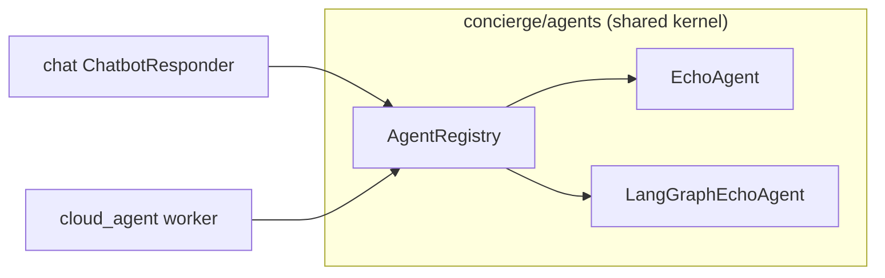
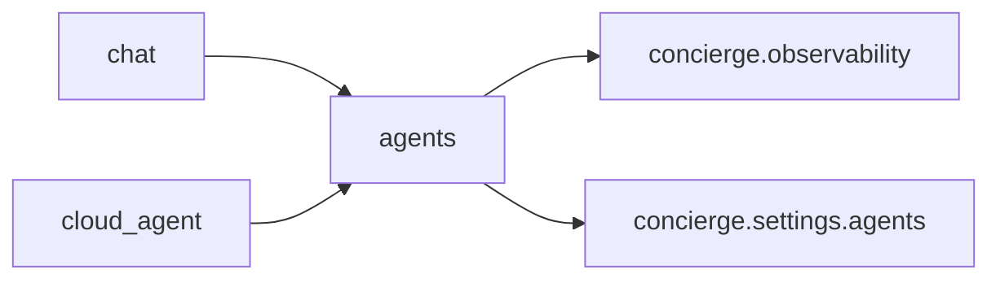

## Overview

`concierge/agents` is a **shared bounded context** that defines transport-independent
agent contracts (`AgentRequest` / `AgentResponse` / `Agent` Protocol / `AgentRegistry`).
Both the `cloud_agent` worker and the `chat` AI responder path can call the same
agent implementations without any cross-context import violations.



## Directory Layout

```
concierge/agents/
  domain/
    exceptions.py          # AgentNotFoundError, AgentExecutionError
  application/
    contracts.py           # AgentRequest, AgentResponse, AgentChunk, Agent, StreamingAgent
    registry.py            # AgentRegistry
  infrastructure/
    echo_agent.py          # EchoAgent
    langgraph_echo_agent.py # LangGraphEchoAgent
    registry_factory.py    # get_agent_registry() (lru_cache)
```

## Contracts

### AgentRequest / AgentResponse

```python
from concierge.agents.application.contracts import AgentRequest, AgentResponse

request = AgentRequest(
    agent_type="echo",
    payload={"message": "hello"},
    context={"conversation_id": "<uuid>"},  # transport-specific metadata
)

response: AgentResponse = await agent.handle(request)
# response.status: "succeeded" | "failed"
# response.result: dict | None
# response.error: str | None
```

### Agent Protocol

```python
from typing import ClassVar
from concierge.agents.application.contracts import Agent, AgentRequest, AgentResponse

class MyAgent:
    agent_type: ClassVar[str] = "my-agent"

    async def handle(self, request: AgentRequest) -> AgentResponse:
        ...
```

### AgentRegistry

```python
from concierge.agents.application.registry import AgentRegistry

registry = AgentRegistry()
registry.register(MyAgent())
agent = registry.resolve("my-agent")
```

## Built-in Agents

| agent_type | Class | Description |
|------------|-------|-------------|
| `echo` | `EchoAgent` | Returns `payload.message` verbatim. No LLM required. |
| `langgraph-echo` | `LangGraphEchoAgent` | LangGraph agent with `echo` tool backed by an Azure AI chat model. |

## Configuration

Agent settings are read from environment variables with the **`AGENTS_`** prefix.

| Variable | Default | Description |
|----------|---------|-------------|
| `AGENTS_LANGGRAPH_MODEL` | `azure_ai:gpt-5` | Model string for `init_chat_model` (e.g. `azure_ai:gpt-4o-mini`). |
| `AGENTS_LANGGRAPH_SYSTEM_PROMPT` | _(built-in)_ | System prompt for LangGraph agents. |

## Using from cloud_agent worker

The `cloud_agent` CLI dispatches tasks to the shared registry:

```bash
uv run cloud-agent-cli task dispatch \
  --agent-type langgraph-echo \
  --payload '{"message": "Hello LangGraph"}'
```

## Using from chat

Set `CHAT_RESPONDER_BACKEND=agent` to route chat replies through the shared agent:

```bash
export CHAT_RESPONDER_BACKEND=agent
export CHAT_BOT_AGENT_TYPE=echo   # LLM-free smoke test
uv run chat-web
```

Verify with:

```bash
# 1. Create a conversation
curl -s -X POST http://localhost:8000/conversations \
  -H 'Content-Type: application/json' \
  -d '{"title": "test"}' | jq .

# 2. Post a user message
curl -s -X POST http://localhost:8000/conversations/<id>/messages \
  -H 'Content-Type: application/json' \
  -d '{"content": "hello"}' | jq .

# 3. Request an agent reply
curl -s -X POST http://localhost:8000/conversations/<id>/agent-replies \
  -H 'Content-Type: application/json' \
  -d '{}' | jq .
```

## Dependency Direction



`concierge.agents` does **not** import from `concierge.chat`, `concierge.cloud_agent`,
or `concierge.todo`. This constraint is enforced by the `agents-no-service-coupling`
import-linter contract in `pyproject.toml`.
