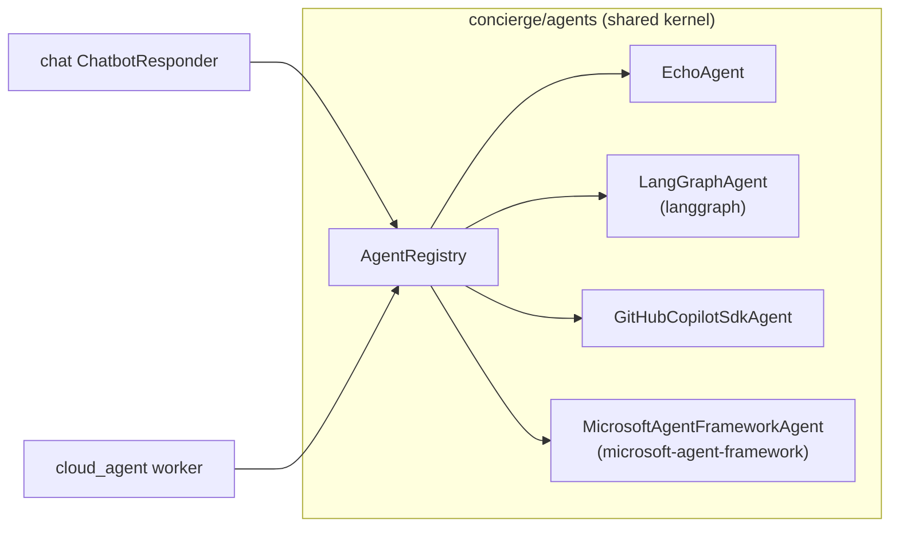
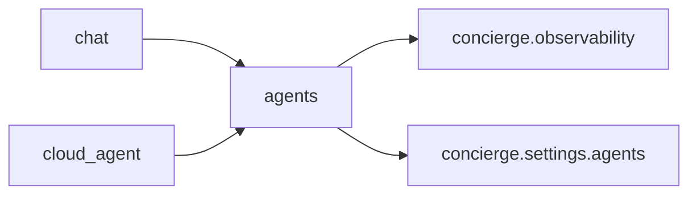

## Overview

`concierge/agents` is a **shared bounded context** that defines transport-independent
agent contracts (`AgentRequest` / `AgentResponse` / `Agent` Protocol / `AgentRegistry`).
Both the `cloud_agent` worker and the `chat` AI responder path can call the same
agent implementations without any cross-context import violations.



## Directory Layout

```
concierge/agents/
  domain/
    agent_types.py         # AgentType (StrEnum) — canonical agent_type identifiers / presets
    exceptions.py          # AgentNotFoundError, AgentExecutionError
  application/
    contracts.py           # AgentRequest, AgentResponse, AgentChunk, Agent, StreamingAgent
    registry.py            # AgentRegistry
  infrastructure/
    echo_agent.py                          # EchoAgent (no LLM)
    github_copilot_sdk_agent.py           # GitHubCopilotSdkAgent
    langgraph_agent.py                     # LangGraphAgent (configurable; tools supplied per preset)
    microsoft_agent_framework_agent.py     # MicrosoftAgentFrameworkAgent (configurable)
    tools/
      echo_tool.py             # build_echo_langchain_tool / build_echo_maf_tool
      image_generation.py      # pure async generate_image() (no framework deps)
      image_generation_tool.py # image_gen_langchain_tool_factory / image_gen_maf_tool_factory
    registry_factory.py    # get_agent_registry() — wires presets onto unified classes
```

## Contracts

### AgentRequest / AgentResponse

```python
from concierge.agents.application.contracts import AgentRequest, AgentResponse

request = AgentRequest(
    agent_type="echo",
    payload={"message": "hello"},
    context={"conversation_id": "<uuid>"},  # transport-specific metadata
)

response: AgentResponse = await agent.handle(request)
# response.status: "succeeded" | "failed"
# response.result: dict | None
# response.error: str | None
```

### Agent Protocol

```python
from concierge.agents.application.contracts import Agent, AgentRequest, AgentResponse

class MyAgent:
    # ``agent_type`` may be a class attribute (single-purpose agents) or an
    # instance attribute (configurable agents that register as multiple
    # presets under different ids — see ``LangGraphAgent``).
    agent_type: str = "my-agent"

    async def handle(self, request: AgentRequest) -> AgentResponse:
        ...
```

### AgentRegistry

```python
from concierge.agents.application.registry import AgentRegistry

registry = AgentRegistry()
registry.register(MyAgent())
agent = registry.resolve("my-agent")
```

## Built-in Agents

| agent_type | Class | Description |
|------------|-------|-------------|
| `echo` | `EchoAgent` | Returns `payload.message` verbatim. No LLM required. |
| `langgraph` | `LangGraphAgent` | LangGraph (`create_agent`) preset wired with both the `echo` tool and the shared `generate_image_tool`. The LLM picks the appropriate tool based on user input. |
| `github-copilot-sdk` | `GitHubCopilotSdkAgent` | Opens a GitHub Copilot SDK session per request, `send`s the user message, and returns the assistant reply. |
| `microsoft-agent-framework` | `MicrosoftAgentFrameworkAgent` | Microsoft Agent Framework preset wired with both the `echo` tool and the shared `generate_image_tool`. The LLM picks the appropriate tool based on user input. |

The two framework-backed agents (`langgraph` /
`microsoft-agent-framework`) are *generic*: they are each registered once
with the full set of tool builders, and the LLM picks the right tool for
each request. Adding a new tool means adding another builder to the
lists in `registry_factory.py` — no new `agent_type` is required.

## Configuration

Agent settings are read from environment variables with the **`AGENTS_`** prefix.

| Variable | Default | Description |
|----------|---------|-------------|
| `AGENTS_LANGGRAPH_MODEL` | `azure_ai:gpt-5` | Model string for `init_chat_model` (e.g. `azure_ai:gpt-4o-mini`). |
| `AGENTS_LANGGRAPH_SYSTEM_PROMPT` | *(built-in)* | System prompt for the `langgraph` agent. Defaults instruct the LLM to pick between the `echo` and `generate_image_tool` tools based on the user request. |
| `AGENTS_GITHUB_COPILOT_MODEL` | `gpt-5-mini` | Model name passed to `CopilotClient.create_session(model=...)`. |
| `AGENTS_GITHUB_COPILOT_SYSTEM_PROMPT` | *(built-in)* | System prompt for `github-copilot-sdk` (sent to `create_session` via `system_message={"mode": "replace", "content": ...}`). Default: `You are a helpful coding assistant that provides code suggestions and explanations to users.` |
| `AGENTS_MICROSOFT_AGENT_FRAMEWORK_MODEL` | `gpt-5` | Model string passed to `FoundryChatClient(model=...)` for `microsoft-agent-framework`. |
| `AGENTS_MICROSOFT_AGENT_FRAMEWORK_SYSTEM_PROMPT` | *(built-in)* | System prompt passed as `Agent(instructions=...)` for `microsoft-agent-framework`. Defaults instruct the LLM to pick between the `echo` and `generate_image_tool` tools based on the user request. |
| `AGENTS_IMAGE_MODEL` | `gpt-image-2` | Foundry deployment name used by shared image generation tool. |
| `AGENTS_IMAGE_SIZE` | `1024x1024` | Default image size (`1024x1024` / `1536x1024` / `1024x1536` / `4K`). |
| `AGENTS_IMAGE_N` | `1` | Default number of images requested per call. |
| `AGENTS_IMAGE_API_VERSION` | `2025-04-01-preview` | API version passed to `openai.AzureOpenAI`. |

## Using from cloud_agent worker

The `cloud_agent` CLI dispatches tasks to the shared registry:

```bash
uv run cloud-agent-cli task dispatch \
  --agent-type langgraph \
  --payload '{"message": "Hello LangGraph"}'
```

## Using from chat

## Using from chat

Set `CHAT_BOT_AGENT_TYPE` to a registered agent type to route chat replies
through the shared agent runtime (the default `foundry` value bypasses the
registry and uses the streaming Foundry responder):

```bash
export CHAT_BOT_AGENT_TYPE=echo   # LLM-free smoke test
uv run chat-web
```

You can also route chat replies through `github-copilot-sdk`:

```bash
export CHAT_BOT_AGENT_TYPE=github-copilot-sdk
uv run chat-web
```

Or `microsoft-agent-framework`:

```bash
export CHAT_BOT_AGENT_TYPE=microsoft-agent-framework
uv run chat-web
```

`github-copilot-sdk` is not a LangChain/LangGraph agent, so MLflow LangChain
autologging does not capture its internal SDK spans automatically.
`microsoft-agent-framework` is built on Microsoft Agent Framework
(`agent_framework.Agent` + `agent_framework.foundry.FoundryChatClient`) rather
than LangChain/LangGraph, so the same caveat applies: enable Microsoft Agent
Framework's own OTLP / Foundry tracing if you need internal spans for that
agent.

Verify with:

```bash
# 1. Create a conversation
curl -s -X POST http://localhost:8000/conversations \
  -H 'Content-Type: application/json' \
  -d '{"title": "test"}' | jq .

# 2. Post a user message
curl -s -X POST http://localhost:8000/conversations/<id>/messages \
  -H 'Content-Type: application/json' \
  -d '{"content": "hello"}' | jq .

# 3. Request an agent reply
curl -s -X POST http://localhost:8000/conversations/<id>/agent-replies \
  -H 'Content-Type: application/json' \
  -d '{}' | jq .
```

## Dependency Direction



`concierge.agents` does **not** import from `concierge.chat`, `concierge.cloud_agent`,
or `concierge.todo`. This constraint is enforced by the `agents-no-service-coupling`
import-linter contract in `pyproject.toml`.
