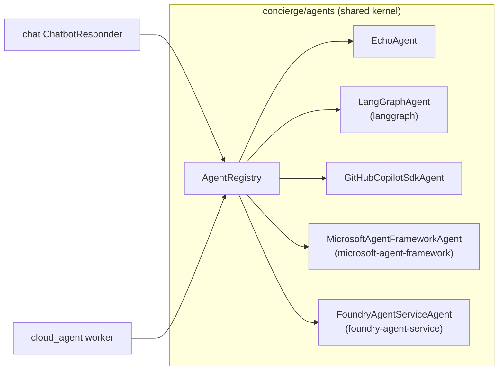
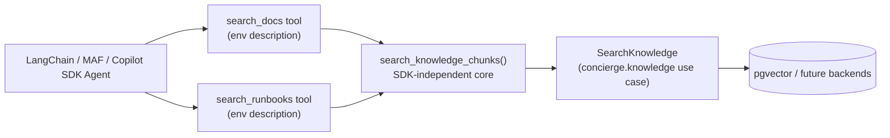
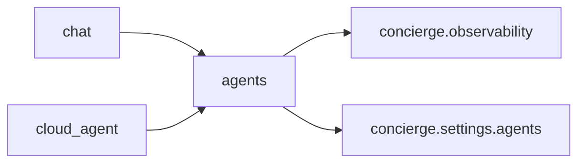

## Overview

`concierge/agents` is a **shared bounded context** that defines transport-independent
agent contracts (`AgentRequest` / `AgentResponse` / `Agent` Protocol / `AgentRegistry`).
Both the `cloud_agent` worker and the `chat` AI responder path can call the same
agent implementations without any cross-context import violations.



## Directory Layout

```
concierge/agents/
  domain/
    agent_types.py         # AgentType (StrEnum) — canonical agent_type identifiers / presets
    exceptions.py          # AgentNotFoundError, AgentExecutionError
  application/
    contracts.py           # AgentRequest, AgentResponse, AgentChunk, Agent, StreamingAgent
    registry.py            # AgentRegistry
  infrastructure/
    echo_agent.py                          # EchoAgent (no LLM)
    github_copilot_sdk_agent.py           # GitHubCopilotSdkAgent
    langgraph_agent.py                     # LangGraphAgent (configurable; tools supplied per preset)
    microsoft_agent_framework_agent.py     # MicrosoftAgentFrameworkAgent (configurable)
    foundry_agent_service_agent.py         # FoundryAgentServiceAgent (Azure AI Foundry Prompt Agent)
    tools/
      echo_tool.py             # build_echo_langchain_tool / build_echo_maf_tool
      file_management.py       # sandboxed file operation core (path validation + io)
      file_management_tool.py  # file tool builders for LangChain / MAF / Copilot SDK
      shell_command.py         # allowlisted shell command core (shell=False subprocess)
      shell_command_tool.py    # shell tool builders for LangChain / MAF / Copilot SDK
      image_generation.py      # pure async generate_image() (no framework deps)
      image_generation_tool.py # image_gen_langchain_tool_factory / image_gen_maf_tool_factory
    registry_factory.py    # get_agent_registry() — wires presets onto unified classes
```

## Contracts

### AgentRequest / AgentResponse

```python
from concierge.agents.application.contracts import AgentRequest, AgentResponse

request = AgentRequest(
    agent_type="echo",
    payload={"message": "hello"},
    context={"conversation_id": "<uuid>"},  # transport-specific metadata
)

response: AgentResponse = await agent.handle(request)
# response.status: "succeeded" | "failed"
# response.result: dict | None
# response.error: str | None
```

### Agent Protocol

```python
from concierge.agents.application.contracts import Agent, AgentRequest, AgentResponse

class MyAgent:
    # ``agent_type`` may be a class attribute (single-purpose agents) or an
    # instance attribute (configurable agents that register as multiple
    # presets under different ids — see ``LangGraphAgent``).
    agent_type: str = "my-agent"

    async def handle(self, request: AgentRequest) -> AgentResponse:
        ...
```

### AgentRegistry

```python
from concierge.agents.application.registry import AgentRegistry

registry = AgentRegistry()
registry.register(MyAgent())
agent = registry.resolve("my-agent")
```

## Built-in Agents

| agent_type | Class | Description |
|------------|-------|-------------|
| `echo` | `EchoAgent` | Returns `payload.message` verbatim. No LLM required. |
| `langgraph` | `LangGraphAgent` | LangGraph (`create_agent`) preset wired with `echo`, `generate_image_tool`, shared sandboxed file-management tools (`read_file`, `list_directory`, `file_search` by default), and optional allowlisted shell tool (`shell_exec`). The LLM picks the appropriate tool based on user input. |
| `github-copilot-sdk` | `GitHubCopilotSdkAgent` | Opens a GitHub Copilot SDK session per request, `send`s the user message, and returns the assistant reply. |
| `microsoft-agent-framework` | `MicrosoftAgentFrameworkAgent` | Microsoft Agent Framework preset wired with `echo`, `generate_image_tool`, shared sandboxed file-management tools (`read_file`, `list_directory`, `file_search` by default), and optional allowlisted shell tool (`shell_exec`). The LLM picks the appropriate tool based on user input. |
| `foundry-agent-service` | `FoundryAgentServiceAgent` | Azure AI Foundry **Prompt Agent** (server-side hosted agent). Creates a named `PromptAgentDefinition` on the Foundry project on first invocation, then drives it through `openai.responses.create()` with an `agent_reference`. No client-side tools are wired — tools/knowledge are configured on the Foundry agent itself. |

The two framework-backed agents (`langgraph` /
`microsoft-agent-framework`) are *generic*: they are each registered once
with the full set of tool builders, and the LLM picks the right tool for
each request. Adding a new tool means adding another builder to the
lists in `registry_factory.py` — no new `agent_type` is required.

`foundry-agent-service` is **server-side**: the prompt and the tool list
live inside the Foundry project, not in this codebase. Use this agent
when you want Foundry to own the agent definition (versioning,
evaluations, observability hooks, ...). Use `microsoft-agent-framework`
when you want a client-side Agent Framework SDK agent backed by
`FoundryChatClient` chat completions instead.

## Configuration

Agent settings are read from environment variables with the **`AGENTS_`** prefix.

| Variable | Default | Description |
|----------|---------|-------------|
| `AGENTS_LANGGRAPH_MODEL` | `azure_ai:gpt-5` | Model string for `init_chat_model` (e.g. `azure_ai:gpt-4o-mini`). |
| `AGENTS_LANGGRAPH_SYSTEM_PROMPT` | *(built-in)* | System prompt for the `langgraph` agent. Defaults instruct the LLM to pick between the `echo` and `generate_image_tool` tools based on the user request. |
| `AGENTS_GITHUB_COPILOT_SDK_MODEL` | `gpt-5-mini` | Model name passed to `CopilotClient.create_session(model=...)`. |
| `AGENTS_GITHUB_COPILOT_SDK_SYSTEM_PROMPT` | *(built-in)* | System prompt for `github-copilot-sdk` (sent to `create_session` via `system_message={"mode": "replace", "content": ...}`). Default: `You are a helpful coding assistant that provides code suggestions and explanations to users.` |
| `AGENTS_MICROSOFT_AGENT_FRAMEWORK_MODEL` | `gpt-5` | Model string passed to `FoundryChatClient(model=...)` for `microsoft-agent-framework`. |
| `AGENTS_MICROSOFT_AGENT_FRAMEWORK_SYSTEM_PROMPT` | *(built-in)* | System prompt passed as `Agent(instructions=...)` for `microsoft-agent-framework`. Defaults instruct the LLM to pick between the `echo` and `generate_image_tool` tools based on the user request. |
| `AGENTS_FOUNDRY_AGENT_SERVICE_MODEL` | `gpt-5` | Foundry deployment name used as `PromptAgentDefinition.model` for the `foundry-agent-service` agent. |
| `AGENTS_FOUNDRY_AGENT_SERVICE_SYSTEM_PROMPT` | `You are a helpful assistant.` | Instructions persisted on the Foundry-side `PromptAgentDefinition`. Updated on the next call when changed (a new agent version is created). |
| `AGENTS_FOUNDRY_AGENT_SERVICE_AGENT_NAME` | `concierge-foundry-agent` | Name of the Foundry-side Prompt Agent. Reuse the same name across runs to reuse the existing agent record; use a different name for isolation between environments. |
| `AGENTS_FILE_ROOT_DIR` | `""` (`<cwd>/workspace`) | Sandbox root for file-management tools. Relative paths are resolved from current working directory; root is auto-created at startup. |
| `AGENTS_FILE_TOOLS_ENABLED` | `read_file,list_directory,file_search` | Comma-separated enabled file tools. Set `""` to disable all file tools; write tools (`write_file`,`copy_file`,`move_file`,`delete_file`) require explicit opt-in. |
| `AGENTS_SHELL_TOOLS_ENABLED` | `""` | Comma-separated enabled shell tools. Keep empty to disable shell tools (default, fully opt-in). |
| `AGENTS_SHELL_ALLOWED_COMMANDS` | `""` | Comma-separated command-name allowlist for `shell_exec` (required when shell tools are enabled). Command paths are rejected. |
| `AGENTS_SHELL_ROOT_DIR` | `""` (`AGENTS_FILE_ROOT_DIR` fallback) | Fixed working directory for shell commands. |
| `AGENTS_SHELL_TIMEOUT_SECONDS` | `30` | Per-command timeout in seconds. |
| `AGENTS_SHELL_MAX_OUTPUT_BYTES` | `65536` | Per-stream (`stdout`/`stderr`) output cap in bytes before truncation marker is appended. |
| `AGENTS_IMAGE_MODEL` | `gpt-image-2` | Foundry deployment name used by shared image generation tool. |
| `AGENTS_IMAGE_SIZE` | `1024x1024` | Default image size (`1024x1024` / `1536x1024` / `1024x1536` / `4K`). |
| `AGENTS_IMAGE_N` | `1` | Default number of images requested per call. |
| `AGENTS_IMAGE_API_VERSION` | `2025-04-01-preview` | API version passed to `openai.AzureOpenAI`. |

The image generation tool also reads two Foundry endpoint variables from
[`MicrosoftFoundrySettings`](../tutorial/02-observability.md):

| Variable | Default | Description |
|----------|---------|-------------|
| `AZURE_AI_PROJECT_ENDPOINT` | `""` | Shared Foundry project endpoint used by all built-in agents. |
| `AZURE_AI_PROJECT_ENDPOINT_IMAGE` | `""` | Optional override pointing at a different Foundry project that hosts the `gpt-image-2` deployment. `gpt-image-2` is currently only GA in a limited set of regions, so set this when your main Foundry project is in a region where it is not available. When empty, the shared `AZURE_AI_PROJECT_ENDPOINT` is used.

File-management tools are sandboxed to `AGENTS_FILE_ROOT_DIR` and reject absolute
paths or traversal attempts. Shell tools are also sandboxed and run with
`shell=False` plus command-name allowlisting (`AGENTS_SHELL_ALLOWED_COMMANDS`).
Keep write tools and shell tools disabled unless required, and follow the
[LangChain security guidance](https://python.langchain.com/docs/security).

## Knowledge retrieval tools (env-driven)

You can register one or more semantic-retrieval tools that call
`concierge.knowledge.application.use_cases.SearchKnowledge`.
Tool names and descriptions are fully environment-driven.



### Environment schema (`AGENTS_KNOWLEDGE__*`)

| Variable | Required | Description |
|----------|----------|-------------|
| `AGENTS_KNOWLEDGE__TOOLS` | Yes (to enable) | Comma-separated tool names (`snake_case`, no duplicates). Empty/unset = no-op (backward compatible). |
| `AGENTS_KNOWLEDGE__TARGET` | No | PostgreSQL backend shared by every knowledge tool: `docker` (`POSTGRES_*` / local pgvector, default) or `azure` (`AZURE_*` / Azure Database for PostgreSQL). Applies to all surfaces (realtime voice, text, agents). |
| `AGENTS_KNOWLEDGE__<NAME>__COLLECTION` | Yes | Logical knowledge collection for that tool. |
| `AGENTS_KNOWLEDGE__<NAME>__DESCRIPTION` | No | Tool description shown to the LLM. |
| `AGENTS_KNOWLEDGE__<NAME>__TOP_K` | No | Default result count when the model omits `k` (default `4`, max `20`). |
| `AGENTS_KNOWLEDGE__<NAME>__MAX_CHARS` | No | Per-hit content cap (`len()`-based, default `1200`). |

Minimal `.env` sample:

```bash
AGENTS_KNOWLEDGE__TOOLS=search_docs,search_runbooks
AGENTS_KNOWLEDGE__SEARCH_DOCS__COLLECTION=knowledge_default
AGENTS_KNOWLEDGE__SEARCH_DOCS__DESCRIPTION=Search the product docs.
AGENTS_KNOWLEDGE__SEARCH_RUNBOOKS__COLLECTION=runbooks
AGENTS_KNOWLEDGE__SEARCH_RUNBOOKS__DESCRIPTION=Search operational runbooks.
```

Tool output is a compact JSON envelope string:

```json
{"collection":"knowledge_default","hits":[{"source":"docs/index.md","chunk_index":3,"score":0.83,"content":"..."}],"truncated":false}
```

No-match output includes `hits: []` and a message; failures return
`{"error":"knowledge search failed: ...","collection":"..."}` so the agent does
not crash.

> Tracing note: LangChain path is covered by LangChain/MLflow autologging.
> Microsoft Agent Framework and GitHub Copilot SDK paths are best-effort and
> depend on SDK OpenTelemetry span emission.

### Minimum end-to-end procedure (docs/ → LangGraph agent)

The following is the smallest path to confirm the env-driven knowledge tool
actually flows from `LLM → search_docs tool → SearchKnowledge use case →
pgvector`. It indexes the repository's own `docs/` directory into the default
collection and lets the `langgraph` agent retrieve it.

> The agent runtime resolves the knowledge backend via
> [`get_search_knowledge_use_case`](../../concierge/knowledge/__init__.py),
> switched by `AGENTS_KNOWLEDGE__TARGET` (default `docker` = the `POSTGRES_*`
> block, or `azure` = the `AZURE_*` block). Ingest with the same target the
> agent will read from. The steps below use the local Docker Compose postgres
> (`docker` target); see "Pointing at Azure Database for PostgreSQL" at the end
> of this section to target the cloud instead.

```bash
# 1. Start the local pgvector instance (same target as the agent runtime).
docker compose up -d postgres

# 2. Sign in for Entra ID-backed Foundry calls (embeddings + chat model).
az login
export AZURE_AI_PROJECT_ENDPOINT="https://<resource>.services.ai.azure.com/api/projects/<project>"

# 3. Index docs/ into the default collection.
uv run knowledge-cli ingest run --collection knowledge_default docs
uv run knowledge-cli ingest stats --collection knowledge_default
# expected: {"collection": "knowledge_default", "records": <N > 0>}

# 4. Register the tool with the agent runtime (in .env).
#    AGENTS_KNOWLEDGE__TOOLS=search_docs
#    AGENTS_KNOWLEDGE__SEARCH_DOCS__COLLECTION=knowledge_default
#    AGENTS_KNOWLEDGE__SEARCH_DOCS__DESCRIPTION=Search the concierge docs.

# 5. Confirm the tool is wired into the agent registry.
uv run agents-cli knowledge list
# [{"name":"search_docs","collection":"knowledge_default", ...}]

# 6. Drive the LangGraph agent so the LLM calls search_docs.
uv run agents-cli invoke --agent-type langgraph \
  --message "Use the search_docs tool to look up 'agents registry' and summarise the hits in 3 bullets."
# Inspect the JSON response: tool_calls should include search_docs, and the
# final message should reference content from docs/.
```

Caveats observed during smoke-testing:

- The `text-embedding-3-small` deployment on AIServices S0 may return HTTP 429
  during a full `docs/` ingest. `IngestMarkdown` is all-or-nothing, so a 429
  mid-run leaves the collection at 0 records. Retry after ~60 s, or split
  the ingest path-by-path (e.g. `docs/agents`, `docs/chat`, ...).
- Ingest (`knowledge-cli --target azure`) and agent search
  (`AGENTS_KNOWLEDGE__TARGET=azure`) must point at the **same** Azure Postgres.
  A target mismatch leaves the table missing, so `search_docs` returns
  "no matches". See the next section for the full procedure.

### Pointing at Azure Database for PostgreSQL

Switch the knowledge backend for the realtime voice assistant and the
LangGraph / MAF / Copilot SDK agents from local Docker Compose to an Azure
Database for PostgreSQL Flexible Server. Every surface shares
`search_knowledge_chunks()`, so setting `AGENTS_KNOWLEDGE__TARGET=azure` once
points realtime, text, and agents at Azure.

```bash
# 1. Allowlist pgvector on the Flexible Server (without it, CREATE EXTENSION
#    vector fails and ingest/search break).
az postgres flexible-server parameter set \
  -g <resource-group> -s <server-name> \
  --name azure.extensions --value vector

# 2. With Entra auth (AZURE_USE_ENTRA_AUTH=true), register the connecting
#    principal as the server's Microsoft Entra administrator.
az postgres flexible-server microsoft-entra-admin create \
  -g <resource-group> -s <server-name> \
  --object-id "$(az ad signed-in-user show --query id -o tsv)" \
  --display-name "$(az ad signed-in-user show --query userPrincipalName -o tsv)"

# 3. Point .env at Azure (AZURE_* block + AGENTS_KNOWLEDGE__TARGET).
#    AZURE_DBHOST=<server-name>.postgres.database.azure.com
#    AZURE_DBNAME=<database>
#    AZURE_DBUSER=<entra-principal>   # e.g. admin@contoso.onmicrosoft.com
#    AZURE_USE_ENTRA_AUTH=true        # or false + AZURE_DBPASSWORD for password auth
#    AGENTS_KNOWLEDGE__TARGET=azure

# 4. Ingest docs/ with the same target the agent reads from.
uv run knowledge-cli ingest run   --collection knowledge_default --target azure docs
uv run knowledge-cli ingest stats --collection knowledge_default --target azure
uv run knowledge-cli search run   --collection knowledge_default --target azure "MLflow" -k 4

# 5. Restart long-running servers (chat-web, ...) since they cache .env.
```

!!! warning "Match the embedding provider across ingest and search"
    `KNOWLEDGE_EMBEDDING_PROVIDER` fixes the vectors at ingest time. Use
    `foundry` for semantic search and re-ingest (drop first) any collection
    built with `fake`. See
    [Knowledge Indexer troubleshooting](../knowledge/index.md#troubleshooting).

### Verifying the search_docs tool (and recognising common failures)

After the minimum end-to-end procedure, inspect the JSON returned by
`agents-cli invoke`. A working configuration looks like this:

- `status` is `"succeeded"`,
- `result.tool_calls` contains at least one entry with `name: "search_docs"`,
- `result.reply` references content actually present in the indexed docs.

Strip the verbose tracing noise so the response is the only thing printed to
stdout:

```bash
uv run agents-cli -m invoke --agent-type langgraph \
  --message "Use the search_docs tool to look up 'agents registry' and summarise the hits in 3 bullets." \
  2>/dev/null
```

Expected (abridged) shape:

```json
{
  "status": "succeeded",
  "result": {
    "tool_calls": [{"name": "search_docs", "args": {"query": "agents registry", "k": 2}}],
    "reply": "... docs/agents/index.md ... AgentRegistry ..."
  },
  "error": null
}
```

If `result.reply` mentions `OperationalError` or `ValueError`, the LLM **is**
calling `search_docs` correctly — the tool internally caught the failure and
returned `{"error":"knowledge search failed: <ExceptionClass>","collection":"..."}`,
which the LLM then paraphrased. The two common cases:

| Symptom in `result.reply` | Root cause | Fix |
|---|---|---|
| `... OperationalError ...` | Local pgvector (or Azure Postgres) is unreachable. | Start the local container: `docker compose up -d postgres`, then confirm with `docker exec concierge-postgres pg_isready -U concierge -d concierge`. |
| `... ValueError ...` | The pgvector table for the configured collection has not been created yet (no successful ingest). | `uv run knowledge-cli ingest run --collection <name> docs/agents`, then verify with `uv run knowledge-cli ingest stats --collection <name>` (`records` must be `> 0`). |

To isolate whether the failure is in the agent wiring or in the knowledge
backend, bypass the LLM and call the same `SearchKnowledge` use case the tool
uses:

```bash
uv run knowledge-cli search run --collection knowledge_default --k 2 "agents registry"
```

If this command succeeds, the agent path (`langgraph` / `microsoft-agent-framework`
/ `github-copilot-sdk`) will also succeed — the only thing left is for the LLM
to choose `search_docs`. If this command fails, the agent path will see the
same error.

## Using from cloud_agent worker

The `cloud_agent` CLI dispatches tasks to the shared registry:

```bash
uv run cloud-agent-cli task dispatch \
  --agent-type langgraph \
  --payload '{"message": "Hello LangGraph"}'
```

## Using from chat

## Using from chat

Set `CHAT_BOT_AGENT_TYPE` to a registered agent type to route chat replies
through the shared agent runtime (the default `foundry` value bypasses the
registry and uses the streaming Foundry responder):

```bash
export CHAT_BOT_AGENT_TYPE=echo   # LLM-free smoke test
uv run chat-web
```

You can also route chat replies through `github-copilot-sdk`:

```bash
export CHAT_BOT_AGENT_TYPE=github-copilot-sdk
uv run chat-web
```

Or `microsoft-agent-framework`:

```bash
export CHAT_BOT_AGENT_TYPE=microsoft-agent-framework
uv run chat-web
```

`github-copilot-sdk` is not a LangChain/LangGraph agent, so MLflow LangChain
autologging does not capture its internal SDK spans automatically.
`microsoft-agent-framework` is built on Microsoft Agent Framework
(`agent_framework.Agent` + `agent_framework.foundry.FoundryChatClient`) rather
than LangChain/LangGraph, so the same caveat applies: enable Microsoft Agent
Framework's own OTLP / Foundry tracing if you need internal spans for that
agent.

Verify with:

```bash
# 1. Create a conversation
curl -s -X POST http://localhost:8000/conversations \
  -H 'Content-Type: application/json' \
  -d '{"title": "test"}' | jq .

# 2. Post a user message
curl -s -X POST http://localhost:8000/conversations/<id>/messages \
  -H 'Content-Type: application/json' \
  -d '{"content": "hello"}' | jq .

# 3. Request an agent reply
curl -s -X POST http://localhost:8000/conversations/<id>/agent-replies \
  -H 'Content-Type: application/json' \
  -d '{}' | jq .
```

## Minimum verification steps per agent

The following commands exercise each registered agent against the standalone
`agents-cli`. They are the smallest "smoke tests" that confirm the agent is
correctly wired into the registry and that the surrounding settings (model,
endpoint, credentials) are usable.

Prerequisites for every LLM-backed agent:

```bash
# 1. Load .env (uv reads it automatically) and sign in for Entra ID auth.
az login
# 2. Required for all Foundry-backed agents.
export AZURE_AI_PROJECT_ENDPOINT="https://<resource>.services.ai.azure.com/api/projects/<project>"
```

### `echo` (no LLM required)

```bash
uv run agents-cli invoke --agent-type echo --message "hello"
# expected: {"status": "succeeded", "result": {"message": "hello", "reply": "hello"}, "error": null}
```

### `langgraph`

Requires `AZURE_AI_PROJECT_ENDPOINT` plus `az login`.

```bash
uv run agents-cli info --agent-type langgraph             # confirms wired settings (no LLM call)
uv run agents-cli invoke --agent-type langgraph --message "Say hi"
# Image-generation path (requires AGENTS_IMAGE_MODEL deployed; see note below):
uv run agents-cli invoke --agent-type langgraph --message "Draw a red fox in watercolor style"
```

### `github-copilot-sdk`

Requires the [GitHub Copilot CLI](https://github.com/github/copilot-cli) to
be installed and authenticated; no Foundry endpoint is needed for the
default echo path.

```bash
uv run agents-cli info --agent-type github-copilot-sdk
uv run agents-cli invoke --agent-type github-copilot-sdk --message "Say hi"
```

### `microsoft-agent-framework`

Requires `AZURE_AI_PROJECT_ENDPOINT` plus `az login`.

```bash
uv run agents-cli info --agent-type microsoft-agent-framework
uv run agents-cli invoke --agent-type microsoft-agent-framework --message "Say hi"
# Image-generation path:
uv run agents-cli invoke --agent-type microsoft-agent-framework --message "Draw a red fox in watercolor style"
```

### `foundry-agent-service`

Requires `AZURE_AI_PROJECT_ENDPOINT` plus `az login`. The signed-in
principal must hold the **Azure AI Developer** role on the Foundry
project (the agent calls `project.agents.create_version()` on first
invocation).

```bash
uv run agents-cli info --agent-type foundry-agent-service
uv run agents-cli invoke --agent-type foundry-agent-service --message "What is the size of France in square miles?"
```

A successful response surfaces the Foundry agent reply along with the
model and agent name actually used on the Foundry side:

```json
{
  "status": "succeeded",
  "result": {
    "message": "What is the size of France in square miles?",
    "reply": "France is approximately 248,573 square miles.",
    "model": "gpt-5",
    "agent_name": "concierge-foundry-agent"
  },
  "error": null
}
```

The first invocation incurs a `create_version` round-trip; subsequent
calls within the same process reuse the agent (cached behind an internal
lock). To exercise the same code path without the agents CLI, use the
dedicated probe script:

```bash
uv run python -m scripts.microsoft_foundry.prompt_agent invoke \
  --message "What is the size of France in square miles?"
```

### `image generate` (direct, no LLM mediation)

`gpt-image-2` is currently only GA in a limited set of Foundry regions, so
if `AZURE_AI_PROJECT_ENDPOINT` points at a different region, also set
`AZURE_AI_PROJECT_ENDPOINT_IMAGE` to a Foundry project that hosts the
`gpt-image-2` deployment.

```bash
export AZURE_AI_PROJECT_ENDPOINT_IMAGE="https://<image-resource>.services.ai.azure.com/api/projects/<project>"
mkdir -p ./tmp_out
uv run agents-cli image generate \
  --prompt "A photo of a Shibuya crossing at night" \
  --output-dir ./tmp_out
ls ./tmp_out/*.png
```

## Dependency Direction



`concierge.agents` does **not** import from `concierge.chat`, `concierge.cloud_agent`,
or `concierge.todo`. This constraint is enforced by the `agents-no-service-coupling`
import-linter contract in `pyproject.toml`.
