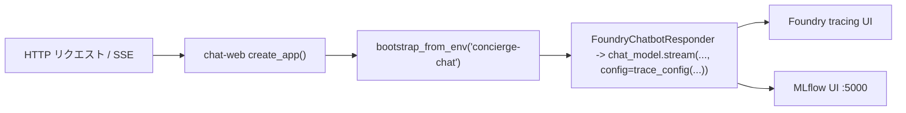

`chat-web` は Chat アプリの FastAPI エントリポイントです。`http://localhost:8080` で待ち受け、Swagger UI を `/docs` に、簡易 HTML/JS クライアントを `/` に配信します。

```bash
uv run chat-web
# → Uvicorn running on http://0.0.0.0:8080
```

## observability 配線

環境変数で Web 起動時の配線を有効化します。

```bash
CONCIERGE_TRACING_ENABLED=true CONCIERGE_MLFLOW_ENABLED=true uv run chat-web
```



## ページとポート

| URL | 内容 |
|---|---|
| <http://localhost:8080/> | 同梱のチャット UI（日本語ラベル） |
| <http://localhost:8080/docs> | Swagger UI（対話的 REST ドキュメント） |
| <http://localhost:8080/openapi.json> | OpenAPI スキーマ |
| <http://localhost:8080/healthz> | 死活監視（`{"status":"ok"}`） |

## 認証

会話を扱うエンドポイントはすべて `X-User-Id` ヘッダで呼び出し元を識別します。値は UUID 必須で、それ以外は `422` を返します。同梱クライアントは自動で生成・保存しますが、スクリプトから叩く場合は一度生成して使い回してください：

```bash
export USER_ID=$(python -c 'import uuid; print(uuid.uuid4())')
```

## エンドポイント一覧

| Method | Path | 説明 |
|---|---|---|
| POST | `/conversations` | 会話作成 |
| GET | `/conversations` | 会話一覧（`?mine=true` で自分の参加分のみ） |
| GET | `/conversations/{conversation_id}` | 会話取得 |
| DELETE | `/conversations/{conversation_id}` | 会話削除 |
| POST | `/conversations/{conversation_id}/participants` | 参加者追加 |
| POST | `/conversations/{conversation_id}/messages` | ユーザーメッセージを保存（ボット応答は別 API） |
| GET | `/conversations/{conversation_id}/messages` | メッセージ一覧 |
| POST | `/conversations/{conversation_id}/agent-replies` | AI エージェント応答を Server-Sent Events でストリーミング |
| GET | `/healthz` | ヘルスチェック |
| GET | `/` | 静的 HTML フロント |

## curl で一通り叩く

書き込み・読み出しエンドポイントを一通り実行するスクリプトです。

```bash
export USER_ID=$(python -c 'import uuid; print(uuid.uuid4())')

# 作成
CONV_ID=$(curl -s -X POST http://localhost:8080/conversations \
  -H "X-User-Id: ${USER_ID}" -H 'content-type: application/json' \
  -d '{"title":"general","display_name":"alice"}' \
  | python -c 'import json,sys; print(json.load(sys.stdin)["id"])')
echo "CONV_ID=$CONV_ID"

# 一覧
curl -s -H "X-User-Id: ${USER_ID}" http://localhost:8080/conversations

# 取得
curl -s -H "X-User-Id: ${USER_ID}" \
  "http://localhost:8080/conversations/${CONV_ID}"

# メッセージ投稿
curl -s -X POST "http://localhost:8080/conversations/${CONV_ID}/messages" \
  -H "X-User-Id: ${USER_ID}" -H 'content-type: application/json' \
  -d '{"content":"こんにちは","display_name":"alice"}'

# メッセージ一覧
curl -s -H "X-User-Id: ${USER_ID}" \
  "http://localhost:8080/conversations/${CONV_ID}/messages"

# 削除
curl -s -o /dev/null -w "HTTP %{http_code}\n" -X DELETE \
  -H "X-User-Id: ${USER_ID}" \
  "http://localhost:8080/conversations/${CONV_ID}"
# → HTTP 204
```

`ConversationResponse` の例：

```json
{
  "id": "3fa85f64-5717-4562-b3fc-2c963f66afa6",
  "title": "general",
  "participants": [
    {
      "id": "3fa85f64-5717-4562-b3fc-2c963f66afa7",
      "kind": "USER",
      "display_name": "alice"
    }
  ],
  "created_at": "2026-05-14T06:03:22.642785Z",
  "updated_at": "2026-05-14T06:03:22.642785Z"
}
```

`MessageResponse` の例：

```json
{
  "id": "ac815590-189b-42c4-92a0-a9a9874e87c0",
  "conversation_id": "3fa85f64-5717-4562-b3fc-2c963f66afa6",
  "sender": {
    "id": "3fa85f64-5717-4562-b3fc-2c963f66afa7",
    "kind": "USER",
    "display_name": "alice"
  },
  "role": "USER",
  "content": "こんにちは",
  "created_at": "2026-05-14T06:03:23.000000Z"
}
```

## ステータスコード

| ステータス | 発生条件 |
|---|---|
| `200 OK` | GET の正常終了 |
| `201 Created` | リソース作成系 POST の正常終了 |
| `204 No Content` | `DELETE /conversations/{id}` の正常終了 |
| `404 Not Found` | `conversation_id` が存在しない |
| `503 Service Unavailable` | `/agent-replies` 呼び出し時に `AZURE_AI_PROJECT_ENDPOINT` 未設定 |
| `422 Unprocessable Entity` | 不正なリクエストボディや UUID でない `X-User-Id` |

## AI エージェント応答エンドポイント

`POST /conversations/{conversation_id}/messages` は**ユーザー発言の保存のみ**を行い、ボット応答はトリガーしません。AI 応答はクライアントが明示的に要求できるよう、専用エンドポイントに分離されています。セットアップ手順は [AI チャットボット応答（任意）](index.ja.md#ai) を参照。

このエンドポイントを共有エージェントランタイム経由で動かすには次のように設定します。

```bash
export CHAT_BOT_AGENT_TYPE=github-copilot-sdk
```

### `POST .../agent-replies` でストリーミング応答

レスポンスは **Server-Sent Events** で返るため、クライアントは応答を逐次レンダリングでき、ポーリング不要です。`Content-Type: text/event-stream` で次のイベントを送信します。

| イベント | data | 説明 |
|---|---|---|
| `delta` | `{"content": "<chunk>"}` | 部分トークンごとに発生。順番に連結すると最終本文になります。 |
| `complete` | `MessageResponse` JSON | 永続化された `AGENT` メッセージ。最後に 1 回だけ送信。 |
| `error` | `{"detail": "<message>"}` | 生成中に失敗した場合に `complete` の代わりに送信。 |

ストリーム開始**前**に同期的なバリデーションを行うため、未知の `conversation_id` や設定不足は通常の JSON エラーレスポンスとして返ります。

| ステータス | 発生条件 | レスポンス |
|---|---|---|
| `200 OK` | ストリーム開始（以降イベント配信） | `text/event-stream` |
| `404 Not Found` | `conversation_id` が存在しない | `{"detail": "..."}` |
| `503 Service Unavailable` | `AZURE_AI_PROJECT_ENDPOINT` 未設定 | `{"detail": "..."}` |

```bash
curl -N -s -X POST "http://localhost:8080/conversations/${CONV_ID}/agent-replies" \
  -H "X-User-Id: ${USER_ID}"
# event: delta
# data: {"content": "こんに"}
#
# event: delta
# data: {"content": "ちは！"}
#
# event: complete
# data: {"id": "...", "role": "AGENT", ...}
```

`complete` イベントの本文は `MessageResponse` スキーマ：

```json
{
  "id": "f1c1e4cb-...",
  "conversation_id": "3fa85f64-5717-4562-b3fc-2c963f66afa6",
  "sender": {
    "id": "00000000-0000-0000-0000-000000000001",
    "kind": "AGENT",
    "display_name": "Concierge AI"
  },
  "role": "AGENT",
  "content": "こんにちは、何をお手伝いしましょうか？",
  "created_at": "2026-05-14T06:03:23.000000Z"
}
```
