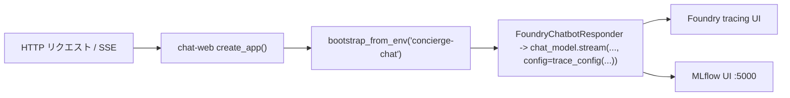

`chat-web` は Chat アプリの FastAPI エントリポイントです。`http://localhost:8080` で待ち受け、Swagger UI を `/docs` に、簡易 HTML/JS クライアントを `/` に配信します。

```bash
uv run chat-web
# → Uvicorn running on http://0.0.0.0:8080
```

## observability 配線

環境変数で Web 起動時の配線を有効化します。

```bash
CONCIERGE_TRACING_ENABLED=true CONCIERGE_MLFLOW_ENABLED=true uv run chat-web
```



## ページとポート

| URL | 内容 |
|---|---|
| <http://localhost:8080/> | 統合チャット UI — テキスト + リアルタイム音声（日本語ラベル） |
| <http://localhost:8080/accessible> | 盲ろう者向けの最小アクセシビリティ UI（画面全体トグル + 対話テキストのみ） |
| <http://localhost:8080/accessible/config> | `/accessible` 用の実行時設定（`{"realtime": bool, "tts_rate": number, "transcription": bool}`） |
| <http://localhost:8080/realtime> | 旧 URL。`/` へ `301` リダイレクト（下位互換用） |
| <http://localhost:8080/capabilities> | UI が読む機能フラグ JSON（`{"realtime": bool}`、通話ボタンの表示/非表示判定に使用） |
| <http://localhost:8080/docs> | Swagger UI（対話的 REST ドキュメント） |
| <http://localhost:8080/openapi.json> | OpenAPI スキーマ |
| <http://localhost:8080/healthz> | 死活監視（`{"status":"ok"}`） |

## 認証

会話を扱うエンドポイントはすべて `X-User-Id` ヘッダで呼び出し元を識別します。値は UUID 必須で、それ以外は `422` を返します。同梱クライアントは自動で生成・保存しますが、スクリプトから叩く場合は一度生成して使い回してください：

```bash
export USER_ID=$(python -c 'import uuid; print(uuid.uuid4())')
```

## エンドポイント一覧

| Method | Path | 説明 |
|---|---|---|
| POST | `/conversations` | 会話作成 |
| GET | `/conversations` | 会話一覧（`?mine=true` で自分の参加分のみ） |
| GET | `/conversations/{conversation_id}` | 会話取得 |
| DELETE | `/conversations/{conversation_id}` | 会話削除 |
| POST | `/conversations/{conversation_id}/participants` | 参加者追加 |
| POST | `/conversations/{conversation_id}/messages` | ユーザーメッセージを保存（ボット応答は別 API） |
| GET | `/conversations/{conversation_id}/messages` | メッセージ一覧 |
| POST | `/conversations/{conversation_id}/agent-replies` | AI エージェント応答を Server-Sent Events でストリーミング |
| WS | `/conversations/{conversation_id}/realtime` | リアルタイム音声セッション（Foundry への WebSocket プロキシ） |
| GET | `/healthz` | ヘルスチェック |
| GET | `/capabilities` | `{"realtime": bool}` — `AZURE_AI_PROJECT_ENDPOINT_REALTIME` 設定済みなら `true` |
| GET | `/` | 統合 HTML フロントエンド（テキスト + リアルタイム音声） |
| GET | `/accessible` | 盲ろう者向けの最小アクセシビリティフロントエンド |
| GET | `/accessible/config` | `/accessible` 用の実行時設定（`{"realtime": bool, "tts_rate": number}`） |
| GET | `/realtime` | `/` へ `301` リダイレクト（下位互換用） |

## curl で一通り叩く

書き込み・読み出しエンドポイントを一通り実行するスクリプトです。

```bash
export USER_ID=$(python -c 'import uuid; print(uuid.uuid4())')

# 作成
CONV_ID=$(curl -s -X POST http://localhost:8080/conversations \
  -H "X-User-Id: ${USER_ID}" -H 'content-type: application/json' \
  -d '{"title":"general","display_name":"alice"}' \
  | python -c 'import json,sys; print(json.load(sys.stdin)["id"])')
echo "CONV_ID=$CONV_ID"

# 一覧
curl -s -H "X-User-Id: ${USER_ID}" http://localhost:8080/conversations

# 取得
curl -s -H "X-User-Id: ${USER_ID}" \
  "http://localhost:8080/conversations/${CONV_ID}"

# メッセージ投稿
curl -s -X POST "http://localhost:8080/conversations/${CONV_ID}/messages" \
  -H "X-User-Id: ${USER_ID}" -H 'content-type: application/json' \
  -d '{"content":"こんにちは","display_name":"alice"}'

# メッセージ一覧
curl -s -H "X-User-Id: ${USER_ID}" \
  "http://localhost:8080/conversations/${CONV_ID}/messages"

# 削除
curl -s -o /dev/null -w "HTTP %{http_code}\n" -X DELETE \
  -H "X-User-Id: ${USER_ID}" \
  "http://localhost:8080/conversations/${CONV_ID}"
# → HTTP 204
```

`ConversationResponse` の例：

```json
{
  "id": "3fa85f64-5717-4562-b3fc-2c963f66afa6",
  "title": "general",
  "participants": [
    {
      "id": "3fa85f64-5717-4562-b3fc-2c963f66afa7",
      "kind": "USER",
      "display_name": "alice"
    }
  ],
  "created_at": "2026-05-14T06:03:22.642785Z",
  "updated_at": "2026-05-14T06:03:22.642785Z"
}
```

`MessageResponse` の例：

```json
{
  "id": "ac815590-189b-42c4-92a0-a9a9874e87c0",
  "conversation_id": "3fa85f64-5717-4562-b3fc-2c963f66afa6",
  "sender": {
    "id": "3fa85f64-5717-4562-b3fc-2c963f66afa7",
    "kind": "USER",
    "display_name": "alice"
  },
  "role": "USER",
  "content": "こんにちは",
  "created_at": "2026-05-14T06:03:23.000000Z"
}
```

## ステータスコード

| ステータス | 発生条件 |
|---|---|
| `200 OK` | GET の正常終了 |
| `201 Created` | リソース作成系 POST の正常終了 |
| `204 No Content` | `DELETE /conversations/{id}` の正常終了 |
| `404 Not Found` | `conversation_id` が存在しない |
| `503 Service Unavailable` | `/agent-replies` 呼び出し時に `AZURE_AI_PROJECT_ENDPOINT` 未設定 |
| `422 Unprocessable Entity` | 不正なリクエストボディや UUID でない `X-User-Id` |

## AI エージェント応答エンドポイント

`POST /conversations/{conversation_id}/messages` は**ユーザー発言の保存のみ**を行い、ボット応答はトリガーしません。AI 応答はクライアントが明示的に要求できるよう、専用エンドポイントに分離されています。セットアップ手順は [AI チャットボット応答（任意）](index.ja.md#ai) を参照。

このエンドポイントを共有エージェントランタイム経由で動かすには次のように設定します。

```bash
export CHAT_BOT_AGENT_TYPE=github-copilot-sdk
```

### `POST .../agent-replies` でストリーミング応答

レスポンスは **Server-Sent Events** で返るため、クライアントは応答を逐次レンダリングでき、ポーリング不要です。`Content-Type: text/event-stream` で次のイベントを送信します。

| イベント | data | 説明 |
|---|---|---|
| `delta` | `{"content": "<chunk>"}` | 部分トークンごとに発生。順番に連結すると最終本文になります。 |
| `complete` | `MessageResponse` JSON | 永続化された `AGENT` メッセージ。最後に 1 回だけ送信。 |
| `error` | `{"detail": "<message>"}` | 生成中に失敗した場合に `complete` の代わりに送信。 |

ストリーム開始**前**に同期的なバリデーションを行うため、未知の `conversation_id` や設定不足は通常の JSON エラーレスポンスとして返ります。

| ステータス | 発生条件 | レスポンス |
|---|---|---|
| `200 OK` | ストリーム開始（以降イベント配信） | `text/event-stream` |
| `404 Not Found` | `conversation_id` が存在しない | `{"detail": "..."}` |
| `503 Service Unavailable` | `AZURE_AI_PROJECT_ENDPOINT` 未設定 | `{"detail": "..."}` |

```bash
curl -N -s -X POST "http://localhost:8080/conversations/${CONV_ID}/agent-replies" \
  -H "X-User-Id: ${USER_ID}"
# event: delta
# data: {"content": "こんに"}
#
# event: delta
# data: {"content": "ちは！"}
#
# event: complete
# data: {"id": "...", "role": "AGENT", ...}
```

`complete` イベントの本文は `MessageResponse` スキーマ：

```json
{
  "id": "f1c1e4cb-...",
  "conversation_id": "3fa85f64-5717-4562-b3fc-2c963f66afa6",
  "sender": {
    "id": "00000000-0000-0000-0000-000000000001",
    "kind": "AGENT",
    "display_name": "Concierge AI"
  },
  "role": "AGENT",
  "content": "こんにちは、何をお手伝いしましょうか？",
  "created_at": "2026-05-14T06:03:23.000000Z"
}
```

## リアルタイム音声 WebSocket { #realtime-voice-websocket }

リアルタイム音声機能は、マイク音声をサーバ側の WebSocket プロキシ経由で
Microsoft Foundry の GPT Realtime API へ転送し、やり取りされたユーザー / AI の
transcript を通常の `Message` として永続化します。セットアップ、`.env` 設定、
UI の使い方は概要ページの
[リアルタイム音声（任意）](index.ja.md#realtime-voice-optional) を参照してください。

このセクションではワイヤープロトコルのみを説明します。

### エンドポイント

```
WS /conversations/{conversation_id}/realtime
   ?user_id=<uuid>
   [&display_name=<string>]
   [&mode=accessible]
```

`user_id` クエリパラメータは REST エンドポイントで使う `X-User-Id` ヘッダと同じ UUID です。
ブラウザは WebSocket ハンドシェイクにカスタムヘッダを追加できないため、ヘッダではなく
クエリで渡します。

`mode=accessible` を指定すると、盲ろう者向けの `/accessible` UI 用セッションになります。
`CHAT_REALTIME_ACCESSIBLE_SYSTEM_PROMPT`（ゆっくり・平易な指示）が適用され、ハンズフリーの
`capture_image` カメラツールが追加されます。詳細は
[アクセシビリティモード](index.ja.md#accessibility-mode) を参照してください。

### サーバー → クライアント イベント

| `type` | ペイロード | 備考 |
|--------|-----------|------|
| `concierge.session.ready` | `{"conversation_id": "..."}` | accept 直後の最初のメッセージ |
| `oai-event` | `{"payload": <Foundry イベント JSON>}` | Foundry イベントの透過リレー（`response.output_audio.delta`、`response.output_audio_transcript.delta` など） |
| `concierge.message.persisted` | `{"message": <MessageResponse>}` | USER/AGENT transcript の永続化通知 |
| `concierge.camera.capture` | `{"prompt": "..."?}` | `mode=accessible` のみ。モデルが `capture_image` を呼んだときに送られ、クライアントは自動で撮影して `concierge.image.input`（`auto_describe: true`）を返す |
| `concierge.error` | `{"detail": "..."}` | サーバ側の未処理エラー |

### クライアント → サーバー イベント

| `type` | ペイロード | 備考 |
|--------|-----------|------|
| `oai-event` | `{"payload": <Foundry イベント JSON>}` | Foundry への透過転送（通常は `input_audio_buffer.append` ＋ base64 PCM16） |
| `concierge.image.input` | `{"image_url": "data:image/*;base64,...", "prompt": "..."?, "auto_describe": bool?}` | カメラ画像をライブ会話に注入。`auto_describe: true`（ハンズフリー撮影）のときはモデルに即時説明を促す |

!!! note "ツール呼び出しはサーバ側で処理されます"
    モデルがツールを要求すると、リレーが `response.output_item.done`
    （`function_call`）イベントを自分で処理します。ツールを実行し、
    `conversation.item.create`（`function_call_output`）と `response.create` を
    Foundry に返します。ブラウザは透過リレーされる `oai-event` フレームと
    最終的な発話／transcript の回答を受け取るだけで、function-calling の
    往復を実装する必要はありません。新しいツールの登録方法は
    [ツール呼び出し（function calling）](index.ja.md#realtime-tool-calling) を参照してください。

### クローズコード

| コード | 意味 |
|--------|------|
| `4400` | `user_id` が未指定または UUID として不正 |
| `4404` | `conversation_id` が存在しない |
| `4503` | `AZURE_AI_PROJECT_ENDPOINT_REALTIME` が未設定 |
| `1000` | クライアント側から正常切断 |

### 機能プローブ

クライアントはリアルタイム UI を表示する前に `GET /capabilities` を叩き、
`{"realtime": true}` のときだけ WebSocket を開くべきです。このフラグは
`create_realtime_responder()` が成功する（つまり `AZURE_AI_PROJECT_ENDPOINT_REALTIME` が
空でない）ときに `true` になります。

```bash
curl -s http://localhost:8080/capabilities
# → {"realtime":true}
```

### CLI ステータス確認

WebSocket を開かずにリアルタイム設定の正常性をチェックしたい場合は、
[`chat-cli realtime status`](cli.ja.md#realtime-status) を使います。
