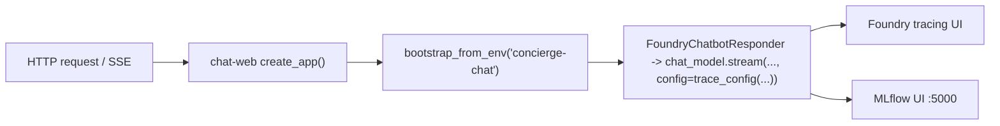

`chat-web` is the FastAPI entry point for the Chat app. It listens on
`http://localhost:8080`, serves Swagger UI at `/docs`, and ships a small
HTML/JS client at `/`.

```bash
uv run chat-web
# → Uvicorn running on http://0.0.0.0:8080
```

## Observability wiring

Set environment variables before startup to enable shared observability wiring:

```bash
CONCIERGE_TRACING_ENABLED=true CONCIERGE_MLFLOW_ENABLED=true uv run chat-web
```



## Pages and ports

| URL | What it is |
|---|---|
| <http://localhost:8080/> | Unified chat UI — text chat + realtime voice (Japanese labels) |
| <http://localhost:8080/realtime> | Legacy path; returns `301` redirect to `/` |
| <http://localhost:8080/capabilities> | Feature-flag JSON (`{"realtime": bool}`) consumed by the UI to show / hide the call button |
| <http://localhost:8080/docs> | Swagger UI (interactive REST docs) |
| <http://localhost:8080/openapi.json> | OpenAPI schema |
| <http://localhost:8080/healthz> | Liveness probe (`{"status":"ok"}`) |

## Authentication

Every endpoint that touches a conversation requires the caller to identify
themselves via the `X-User-Id` header. The value must be a UUID; FastAPI
returns `422` otherwise. The bundled web client generates and stores one for
you; from a script, generate one once and reuse it:

```bash
export USER_ID=$(python -c 'import uuid; print(uuid.uuid4())')
```

## Endpoints at a glance

| Method | Path | Description |
|---|---|---|
| POST | `/conversations` | Create conversation |
| GET | `/conversations` | List conversations (`?mine=true` filters to your own) |
| GET | `/conversations/{conversation_id}` | Get conversation |
| DELETE | `/conversations/{conversation_id}` | Delete conversation |
| POST | `/conversations/{conversation_id}/participants` | Join conversation |
| POST | `/conversations/{conversation_id}/messages` | Post a user message (no bot reply; agent reply is a separate request) |
| GET | `/conversations/{conversation_id}/messages` | List messages |
| POST | `/conversations/{conversation_id}/agent-replies` | Stream an AI agent reply over Server-Sent Events |
| WS | `/conversations/{conversation_id}/realtime` | Realtime voice session (WebSocket proxy to Foundry) |
| GET | `/healthz` | Health check |
| GET | `/capabilities` | `{"realtime": bool}` — `true` when `AZURE_AI_PROJECT_ENDPOINT_REALTIME` is configured |
| GET | `/` | Unified HTML front-end (text + realtime voice) |
| GET | `/realtime` | `301` redirect to `/` (kept for backward compatibility) |

## End-to-end curl walkthrough

This is a copy-pasteable script that exercises every read/write endpoint
once.

```bash
export USER_ID=$(python -c 'import uuid; print(uuid.uuid4())')

# Create
CONV_ID=$(curl -s -X POST http://localhost:8080/conversations \
  -H "X-User-Id: ${USER_ID}" -H 'content-type: application/json' \
  -d '{"title":"general","display_name":"alice"}' \
  | python -c 'import json,sys; print(json.load(sys.stdin)["id"])')
echo "CONV_ID=$CONV_ID"

# List
curl -s -H "X-User-Id: ${USER_ID}" http://localhost:8080/conversations

# Get
curl -s -H "X-User-Id: ${USER_ID}" \
  "http://localhost:8080/conversations/${CONV_ID}"

# Post a message
curl -s -X POST "http://localhost:8080/conversations/${CONV_ID}/messages" \
  -H "X-User-Id: ${USER_ID}" -H 'content-type: application/json' \
  -d '{"content":"hello","display_name":"alice"}'

# List messages
curl -s -H "X-User-Id: ${USER_ID}" \
  "http://localhost:8080/conversations/${CONV_ID}/messages"

# Delete
curl -s -o /dev/null -w "HTTP %{http_code}\n" -X DELETE \
  -H "X-User-Id: ${USER_ID}" \
  "http://localhost:8080/conversations/${CONV_ID}"
# → HTTP 204
```

Sample `ConversationResponse`:

```json
{
  "id": "3fa85f64-5717-4562-b3fc-2c963f66afa6",
  "title": "general",
  "participants": [
    {
      "id": "3fa85f64-5717-4562-b3fc-2c963f66afa7",
      "kind": "USER",
      "display_name": "alice"
    }
  ],
  "created_at": "2026-05-14T06:03:22.642785Z",
  "updated_at": "2026-05-14T06:03:22.642785Z"
}
```

Sample `MessageResponse`:

```json
{
  "id": "ac815590-189b-42c4-92a0-a9a9874e87c0",
  "conversation_id": "3fa85f64-5717-4562-b3fc-2c963f66afa6",
  "sender": {
    "id": "3fa85f64-5717-4562-b3fc-2c963f66afa7",
    "kind": "USER",
    "display_name": "alice"
  },
  "role": "USER",
  "content": "hello",
  "created_at": "2026-05-14T06:03:23.000000Z"
}
```

## Status codes

| Status | When |
|---|---|
| `200 OK` | Successful GETs |
| `201 Created` | Successful POSTs that create resources |
| `204 No Content` | Successful DELETE `/conversations/{id}` |
| `404 Not Found` | `conversation_id` does not exist |
| `503 Service Unavailable` | `AZURE_AI_PROJECT_ENDPOINT` is not configured when calling `/agent-replies` |
| `422 Unprocessable Entity` | Bad request body or non-UUID `X-User-Id` |

## AI agent reply endpoint

`POST /conversations/{conversation_id}/messages` is intentionally agent-free:
it only persists the caller's message. AI replies live behind a dedicated
endpoint so client apps can opt-in explicitly. See
[AI chatbot replies (optional)](index.md#ai-chatbot-replies-optional) for
the setup steps.

To route this endpoint through the shared agents runtime, set:

```bash
export CHAT_BOT_AGENT_TYPE=github-copilot-sdk
```

### Streaming reply via `POST .../agent-replies`

The endpoint returns a **Server-Sent Events** stream so the client can
render the reply incrementally and never has to poll. The response uses
`Content-Type: text/event-stream` and emits the following events:

| Event | Data | Notes |
|---|---|---|
| `delta` | `{"content": "<chunk>"}` | Emitted once per partial token. Concatenate `content` values in order. |
| `complete` | `MessageResponse` JSON | Final event with the persisted `AGENT` message. |
| `error` | `{"detail": "<message>"}` | Emitted instead of `complete` if generation fails mid-stream. |

Synchronous validation runs **before** the stream starts, so unknown
conversation IDs and missing configuration are surfaced via the regular
JSON error response.

| Status | When | Body |
|---|---|---|
| `200 OK` | Stream opened — events follow | `text/event-stream` |
| `404 Not Found` | `conversation_id` does not exist | `{"detail": "..."}` |
| `503 Service Unavailable` | `AZURE_AI_PROJECT_ENDPOINT` is not configured | `{"detail": "..."}` |

```bash
curl -N -s -X POST "http://localhost:8080/conversations/${CONV_ID}/agent-replies" \
  -H "X-User-Id: ${USER_ID}"
# event: delta
# data: {"content": "Hello"}
#
# event: delta
# data: {"content": "! How can I help?"}
#
# event: complete
# data: {"id": "...", "role": "AGENT", ...}
```

The `complete` event payload matches the `MessageResponse` schema:

```json
{
  "id": "f1c1e4cb-...",
  "conversation_id": "3fa85f64-5717-4562-b3fc-2c963f66afa6",
  "sender": {
    "id": "00000000-0000-0000-0000-000000000001",
    "kind": "AGENT",
    "display_name": "Concierge AI"
  },
  "role": "AGENT",
  "content": "Hello! How can I help?",
  "created_at": "2026-05-14T06:03:23.000000Z"
}
```

## Realtime voice WebSocket

The realtime voice feature streams microphone audio to Microsoft Foundry's
GPT Realtime API through a server-side WebSocket proxy and persists the
resulting user / AI transcripts as regular `Message` objects. See the
[Realtime voice (optional)](index.md#realtime-voice-optional) section of
the overview for setup, the `.env` reference, and UI walkthrough.

This section documents the wire protocol only.

### Endpoint

```
WS /conversations/{conversation_id}/realtime
   ?user_id=<uuid>
   [&display_name=<string>]
```

The `user_id` query parameter is the same UUID as the `X-User-Id` header
used by the REST endpoints. WebSocket frames must not include the header
because browsers cannot attach custom headers to a WebSocket handshake.

### Server → Client events

| `type` | Payload | Notes |
|--------|---------|-------|
| `concierge.session.ready` | `{"conversation_id": "..."}` | First message after accept |
| `oai-event` | `{"payload": <Foundry event JSON>}` | Transparent relay of all Foundry events (`response.output_audio.delta`, `response.output_audio_transcript.delta`, etc.) |
| `concierge.message.persisted` | `{"message": <MessageResponse>}` | USER or AGENT transcript saved |
| `concierge.error` | `{"detail": "..."}` | Unhandled server error |

### Client → Server events

| `type` | Payload | Notes |
|--------|---------|-------|
| `oai-event` | `{"payload": <Foundry event JSON>}` | Forwarded to Foundry (typically `input_audio_buffer.append` with base64 PCM16) |

### Close codes

| Code | Meaning |
|------|---------|
| `4400` | `user_id` is missing or not a valid UUID |
| `4404` | `conversation_id` does not exist |
| `4503` | `AZURE_AI_PROJECT_ENDPOINT_REALTIME` is not configured |
| `1000` | Normal client-initiated close |

### Capability probe

Clients should call `GET /capabilities` before showing realtime UI and only
open the WebSocket when the response is `{"realtime": true}`. The flag is
`true` whenever `create_realtime_responder()` succeeds, which currently
means `AZURE_AI_PROJECT_ENDPOINT_REALTIME` is non-empty.

```bash
curl -s http://localhost:8080/capabilities
# → {"realtime":true}
```

### CLI status check

For a non-interactive sanity check that the realtime endpoint is wired
correctly without opening a WebSocket, use
[`chat-cli realtime status`](cli.md#realtime-status).
