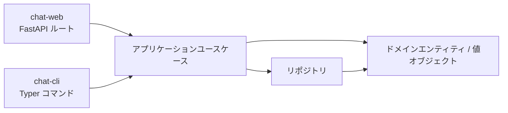
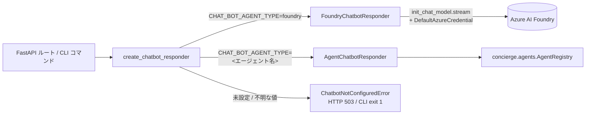

## このアプリは何？

ビジネスロジックを共有する 2 つの入口を持つ、最小構成のテキストチャットアプリです。永続化バックエンドはユースケースを書き換えずに差し替えられます。

| 入口 | 内容 | 使いどころ |
|---|---|---|
| **`chat-web`** | `:8080` の FastAPI サーバ。REST + 同梱の Web UI | Swagger UI、curl、付属クライアントを使いたい |
| **`chat-cli`** | Typer CLI（`conversation` / `message` / `db` サブコマンド） | スクリプト用に JSON 出力が欲しい、ローカルで素早く確認したい |

どちらも同じ `concierge.chat.application.use_cases` を呼ぶため、片側に機能を足せばもう片側にも自動で反映されます。



次に読むもの：

- **まず触ってみたい** → 下の [5 分で動作確認（REST のみ）](#5-rest)
- **REST API リファレンス** → [REST API リファレンス](api.ja.md)
- **CLI リファレンス** → [CLI リファレンス](cli.ja.md)
- **音声会話（Realtime）** → [リアルタイム音声会話](realtime.ja.md)

---

## 5 分で動作確認（REST のみ） { #5-rest }

Azure アカウント・Docker・`.env` の編集すべて不要です。デフォルトの `memory` バックエンドを使い、データは `chat-web` プロセスが生きている間だけメモリ上に保持されます。

!!! warning "`memory` バックエンドはプロセスごとに独立"
    `chat-web` で作った会話は `chat-cli` からは**見えません**（別プロセスのため）。エンドツーエンドで確認するときは片方の入口に絞ってください。本セクションは REST のみで完結します。CLI のみは [CLI のみで動作確認](#cli-only) を参照。CLI ↔ Web を共有させたい場合は `postgres` バックエンドに切り替えてください。

### 1. API サーバ起動

```bash
uv run chat-web
# → Uvicorn running on http://0.0.0.0:8080
```

### 2. Swagger UI を開く

```bash
open http://localhost:8080/docs
```

または同梱の Web クライアント <http://localhost:8080/> を開きます。

### 3. curl で操作する

別ターミナルで以下を貼り付けます。同じ `chat-web` プロセスに対する呼び出しなので、メモリ上のデータはコール間で保持されます。

```bash
# このセッション内で使い回すユーザ ID
export USER_ID=$(python -c 'import uuid; print(uuid.uuid4())')

# 会話を作って ID を取得
CONV_ID=$(curl -s -X POST http://localhost:8080/conversations \
  -H "X-User-Id: ${USER_ID}" \
  -H 'content-type: application/json' \
  -d '{"title":"smoke-test","display_name":"alice"}' \
  | python -c 'import json,sys; print(json.load(sys.stdin)["id"])')
echo "CONV_ID=$CONV_ID"

# メッセージを投稿
curl -s -X POST "http://localhost:8080/conversations/${CONV_ID}/messages" \
  -H "X-User-Id: ${USER_ID}" \
  -H 'content-type: application/json' \
  -d '{"content":"hello from curl","display_name":"alice"}'

# メッセージ一覧
curl -s "http://localhost:8080/conversations/${CONV_ID}/messages"
```

期待結果：最初の 2 つの POST が `201 Created`、最後の GET で投稿内容を含む JSON 配列が返ります。`AZURE_AI_PROJECT_ENDPOINT` 未設定のとき `/agent-replies` を叩くと `503 Service Unavailable` が返るのは**正常**です。有効化手順は [AI チャットボット応答（任意）](#ai) を参照。

---

## 音声入力（Speech-to-Text）

同梱 Web UI（<http://localhost:8080/>）では、ブラウザの Web Speech API
を使った音声入力を利用できます。

### 使い方

1. 会話を作成/選択して入力欄を有効化します。
2. 送信ボタンの左にあるマイクボタン（`🎤`）を押します。
3. 話すと、認識途中/確定テキストが入力欄の末尾に追記されます。
4. もう一度ボタン（`⏹`）を押すと停止します。
5. 従来どおり送信ボタン（または `Shift+Enter`）で送信します。

音声入力で自動送信はされません。明示的に送信したテキストだけが投稿されます。

### 対応ブラウザ

- 対応: 最新の Google Chrome / Microsoft Edge / Safari（macOS / iOS）
- 非対応: Firefox（Web Speech API が標準利用できないため）
- 非対応ブラウザではマイクボタンは無効化され、UI に警告トーストが表示されます。

### プライバシーに関する注意

- マイク権限はブラウザの標準プロンプトに従います。
- 音声認識はブラウザベンダーのクラウドで処理される場合があります
  （例: Chrome / Edge の実装）。
- concierge バックエンドには生音声データは送信されず、ユーザーが送信操作をした
  後のテキストのみ既存 API で送信されます。

---

## 音声出力（Text-to-Speech）

同梱 Web UI（<http://localhost:8080/>）では、ブラウザの Web Speech API を使って
**AGENT** メッセージを読み上げできます。

### 使い方

1. 会話画面で AGENT メッセージを受信します。
2. メッセージ右側のスピーカーボタン（`🔊`）を押します。
3. 読み上げ中は同じボタンが停止（`■`）に切り替わります。
4. `■` を押すと即時停止し、別 AGENT メッセージの `🔊` を押すとそちらへ切り替わります。

### 対応ブラウザ

- 対応: 最新の Google Chrome / Microsoft Edge（Chromium 系）
- 既定で非対応: Firefox（Web Speech API の音声合成が利用できない場合あり）
- 非対応ブラウザではスピーカーボタンは表示されません。

### プライバシーに関する注意

- 音声合成は、ブラウザ実装や選択 voice によってブラウザベンダーのクラウドで
  処理される場合があります。
- concierge バックエンドに対して、新しい TTS API への本文送信は行いません。
  読み上げはブラウザに表示済みのテキストのみを利用します。

---

## CLI のみで動作確認 { #cli-only }

CLI も同じユースケースを呼びますが、コマンド 1 つごとに別プロセスです。`memory` バックエンドで `create` と `post` をつなぐような流れは**動きません**。次のどちらかを選んでください：

1. **`postgres` バックエンドに切り替える**（複数ステップで CLI を使うならこちらを推奨）。すべてのコマンドが同じ DB を参照します。[PostgreSQL クイックスタート](#postgresql) を参照。
2. **REST API を使う**：ユーザ目線で連続する操作は REST に寄せ、CLI は `db init` / `db ping` / `conversation list` などのワンショット操作に絞る。

単発で必ず動く正常性確認はヘルプ表示です：

```bash
uv run chat-cli --help
uv run chat-cli conversation --help
uv run chat-cli message --help
uv run chat-cli db --help
```

`postgres` バックエンドでの一通りの流れは [CLI リファレンスの「ウォークスルー」](cli.ja.md#postgres-) を参照。

---

## 永続化バックエンドを選ぶ

Chat アプリの設定は `concierge.settings.ChatSettings` に集約されています。`.env`（または環境変数）で切り替えます。

| `CHAT_REPOSITORY_BACKEND` | 列挙メンバー | 使いどころ | スキーマ初期化 |
|---|---|---|---|
| `memory`（デフォルト） | `ChatRepositoryBackend.MEMORY` | 最速の試運転。再起動でデータ消失、**プロセスをまたいで共有もされない** | 不要 |
| `postgres` | `ChatRepositoryBackend.POSTGRES` | ローカル Docker Compose PostgreSQL（`POSTGRES_*`） | **必要**（下記参照） |
| `azure-postgres` | `ChatRepositoryBackend.AZURE_POSTGRES` | Azure Database for PostgreSQL Flexible Server（`AZURE_*`） | **必要**（下記参照） |

!!! warning "`postgres` / `azure-postgres` を使う前に `chat-cli db init` を必ず実行してください"
    バックエンドを切り替えただけでは会話用テーブル（`chat_conversations` / `chat_participants` / `chat_messages`）は作成されません。初期化を忘れると `chat-web` でメッセージを送信した瞬間に `relation "chat_conversations" does not exist` で失敗します。

### セットアップ手順（共通）

```bash
# 1. .env に切替を書く（例: ローカル Postgres）
echo "CHAT_REPOSITORY_BACKEND=postgres" >> .env

# 2. 接続確認
uv run chat-cli db ping
# → Connection OK.

# 3. テーブルを作成（CREATE TABLE IF NOT EXISTS なので冪等）
uv run chat-cli db init
# → Database schema initialised successfully.

# 4. API / CLI を起動
uv run chat-web
```

関連コマンド：

| コマンド | 説明 |
|---|---|
| `uv run chat-cli db ping` | 接続確認（`SELECT 1`） |
| `uv run chat-cli db init` | テーブル作成（冪等） |
| `uv run chat-cli db drop --yes` | テーブル削除（破壊的） |

### PostgreSQL クイックスタート（Docker Compose） { #postgresql }

[`.env.template`](https://github.com/ks6088ts-labs/concierge/blob/main/.env.template) の `POSTGRES_*` の値で `compose.yml` の Postgres サービスに接続します。

```bash
docker compose up -d postgres
echo "CHAT_REPOSITORY_BACKEND=postgres" >> .env
uv run chat-cli db ping
uv run chat-cli db init   # 初回 1 回だけ
uv run chat-web
```

### Azure Database for PostgreSQL クイックスタート

`.env` に `AZURE_DBHOST` / `AZURE_DBNAME` / `AZURE_DBUSER`（Entra プリンシパル名）などを設定したうえで：

```bash
echo "CHAT_REPOSITORY_BACKEND=azure-postgres" >> .env
uv run chat-cli db ping
uv run chat-cli db init   # 初回 1 回だけ
uv run chat-web
```

Entra ID 認証（`AZURE_USE_ENTRA_AUTH=true`）を使う場合は事前に `az login` などで `DefaultAzureCredential` が解決可能な状態にしてください。

---

## AI チャットボット応答（任意） { #ai }

Chat アプリは LangChain 経由で **Microsoft Foundry** を呼び出し、エージェント参加者として応答させることができます。配線は [`concierge/chat/infrastructure/ai/`](https://github.com/ks6088ts-labs/concierge/tree/main/concierge/chat/infrastructure/ai) に集約：

- `application/responders.py`：`ChatbotResponder` プロトコルを定義（`stream_reply` でトークンストリームを yield）
- `infrastructure/ai/foundry_responder.py`：`langchain.chat_models.init_chat_model` と `DefaultAzureCredential` で実装し、`chat_model.stream(...)` を利用
- `infrastructure/ai/agent_responder.py`：共有 `concierge.agents` レジストリ経由で実装（LLM オプション経路）
- `infrastructure/ai/factory.py`：`create_chatbot_responder()` を公開（設定未満たし時に `ChatbotNotConfiguredError` を送出）



`create_chatbot_responder()` は `CHAT_BOT_AGENT_TYPE`（既定 `foundry`）でレスポンダを選択します。`foundry` の場合は `AZURE_AI_PROJECT_ENDPOINT` の設定が必須で、未設定だと `ChatbotNotConfiguredError` を送出します（FastAPI ルートは HTTP 503、`chat-cli message reply` は終了コード 1）。`foundry` 以外の値（`echo` / `langgraph` / `github-copilot-sdk` / `microsoft-agent-framework` など）は共有 `AgentRegistry` から解決されます。

### 設定一覧

| 変数 | デフォルト | 説明 |
|---|---|---|
| `CHAT_BOT_MODEL` | `azure_ai:gpt-5` | `init_chat_model` に渡すモデル識別子 |
| `CHAT_BOT_SYSTEM_PROMPT` | `あなたは Concierge Chat のアシスタントです。日本語で簡潔に応答してください。` | 毎回先頭に挿入されるシステムメッセージ |
| `CHAT_BOT_DISPLAY_NAME` | `Concierge AI` | エージェント参加者の表示名 |
| `CHAT_BOT_PARTICIPANT_ID` | `00000000-0000-0000-0000-000000000001` | エージェント参加者の固定 UUID |
| `CHAT_BOT_HISTORY_LIMIT` | `20` | コンテキストとして渡す過去メッセージの最大数 |
| `AZURE_AI_PROJECT_ENDPOINT` | 未設定 | `CHAT_BOT_AGENT_TYPE=foundry` のときに必須 |
| `CHAT_BOT_AGENT_TYPE` | `foundry` | レスポンダ選択。`foundry`（既定、ストリーミング）か登録済みエージェント名（`echo` / `langgraph` / `github-copilot-sdk` / `microsoft-agent-framework`） |

> **メモ:** 旧 `CHAT_RESPONDER_BACKEND` 変数は廃止されました。`.env` に残っていても無視されますが、起動時に `DeprecationWarning` が出ます。

### チャットボットを有効にする（Foundry バックエンド）

```bash
# 1. Foundry エンドポイントの設定
echo "AZURE_AI_PROJECT_ENDPOINT=https://<resource>.services.ai.azure.com/api/projects/<project>" >> .env

# 2. DefaultAzureCredential がトークンを発行できる状態に
az login

# 3. API 起動
uv run chat-web
```

### エージェント駆動レスポンダ（LLM オプション）

LLM 不要のスモークテストには `echo` エージェントを使います。

```bash
export CHAT_BOT_AGENT_TYPE=echo
uv run chat-web
```

LangGraph echo エージェント（`AZURE_AI_PROJECT_ENDPOINT` が必要）:

```bash
export CHAT_BOT_AGENT_TYPE=langgraph
export AGENTS_LANGGRAPH_MODEL=azure_ai:gpt-5
az login
uv run chat-web
```

利用可能なエージェントと設定の詳細は [共有エージェントランタイム](../agents/index.ja.md) を参照してください。

### API 呼び出し設計

- `POST /conversations/{id}/messages` — **ユーザ発言の保存のみ**。ボット応答は一切トリガーしません。クライアントは送信完了を確実に待てます。
- `POST /conversations/{id}/agent-replies` — Server-Sent Events (`text/event-stream`) でエージェント応答をストリーミング。`delta` イベントで部分トークンを送り、最後に `complete` イベントで永続化された `AGENT` メッセージを返します。`AZURE_AI_PROJECT_ENDPOINT` 未設定時は HTTP 503、CLI (`chat-cli message reply`) は終了コード 1。
- CLI も同じ責務分離：`message post` は保存のみ、`message reply` がストリーミング応答を要求します。

---

## 動作確認チェックリスト

変更後に貼り付けて流せばよい一連のコマンドです。利用バックエンドに合わせて選んでください。

### A. `memory` バックエンド（REST のみ）

ターミナル 1：

```bash
# .env を上書きして memory モードで起動
CHAT_REPOSITORY_BACKEND=memory uv run chat-web
```

ターミナル 2：

```bash
curl -s http://localhost:8080/healthz
# → {"status":"ok"}

export USER_ID=$(python -c 'import uuid; print(uuid.uuid4())')
CONV_ID=$(curl -s -X POST http://localhost:8080/conversations \
  -H "X-User-Id: ${USER_ID}" -H 'content-type: application/json' \
  -d '{"title":"smoke","display_name":"alice"}' \
  | python -c 'import json,sys; print(json.load(sys.stdin)["id"])')
echo "CONV_ID=$CONV_ID"

curl -s -X POST "http://localhost:8080/conversations/${CONV_ID}/messages" \
  -H "X-User-Id: ${USER_ID}" -H 'content-type: application/json' \
  -d '{"content":"hello","display_name":"alice"}'

curl -s "http://localhost:8080/conversations/${CONV_ID}/messages"

# Foundry エンドポイント未設定時の期待値
curl -s -o /dev/null -w "agent-replies → HTTP %{http_code}\n" \
  -X POST "http://localhost:8080/conversations/${CONV_ID}/agent-replies" \
  -H "X-User-Id: ${USER_ID}"
# → agent-replies → HTTP 503
```

合格条件：

- `healthz` が `{"status":"ok"}` を返す
- POST 2 件がそれぞれ `role: USER` の JSON を返す
- `GET .../messages` が投稿メッセージを含む配列を返す
- `agent-replies` は HTTP 503（`AZURE_AI_PROJECT_ENDPOINT` 設定済みなら 200 + SSE ストリーム）

### B. `postgres` バックエンド（REST ↔ CLI 共有）

```bash
docker compose up -d postgres
echo "CHAT_REPOSITORY_BACKEND=postgres" >> .env

uv run chat-cli db ping
uv run chat-cli db init

# サーバを背景起動して、同じシェルで CLI を実行
uv run chat-web &
SERVER_PID=$!
sleep 2

# CLI とサーバが同じ DB を参照する
RESPONSE=$(uv run chat-cli conversation create --title "shared" --display-name "alice")
echo "$RESPONSE"
CONV_ID=$(echo "$RESPONSE" | python -c 'import json,sys; print(json.load(sys.stdin)["id"])')

curl -s "http://localhost:8080/conversations/${CONV_ID}"
# → CLI で作った会話が返る

uv run chat-cli message post "$CONV_ID" --content "hi" --display-name "alice"
uv run chat-cli message list "$CONV_ID"

kill $SERVER_PID
```

合格条件：

- `db ping` が `Connection OK.`
- `db init` が `Database schema initialised successfully.`
- `GET /conversations/{id}` が CLI 作成の会話を返す
- `message list` が CLI 投稿のメッセージを含む

### C. チャットボット（Foundry）有効

```bash
# 前提：AZURE_AI_PROJECT_ENDPOINT 設定済み、az login 済み

uv run chat-web &
SERVER_PID=$!
sleep 2

export USER_ID=$(python -c 'import uuid; print(uuid.uuid4())')
CONV_ID=$(curl -s -X POST http://localhost:8080/conversations \
  -H "X-User-Id: ${USER_ID}" -H 'content-type: application/json' \
  -d '{"title":"ai","display_name":"alice"}' \
  | python -c 'import json,sys; print(json.load(sys.stdin)["id"])')

# 1. ユーザ発言を保存（応答はトリガーされない）
curl -s -X POST "http://localhost:8080/conversations/${CONV_ID}/messages" \
  -H "X-User-Id: ${USER_ID}" -H 'content-type: application/json' \
  -d '{"content":"自己紹介して","display_name":"alice"}'

# 2. SSE でエージェント応答をストリーミング
curl -N -s -X POST "http://localhost:8080/conversations/${CONV_ID}/agent-replies" \
  -H "X-User-Id: ${USER_ID}"

# 3. 保存された AGENT メッセージを確認
curl -s "http://localhost:8080/conversations/${CONV_ID}/messages"

kill $SERVER_PID
```

合格条件：手順 2 で `event: delta` / `event: complete` フレームがストリーミングされ、手順 3 で 2 件のメッセージ（`role: USER` と `role: AGENT`/`display_name: Concierge AI`）が返ること。

---

## トラブルシューティング

### `relation "chat_conversations" does not exist`

**原因**：バックエンドを `postgres` / `azure-postgres` に切り替えたものの、テーブル未作成。

**対処**：

```bash
uv run chat-cli db ping   # 接続できることを確認
uv run chat-cli db init   # テーブル作成
```

初期化後は `chat-web` を再起動しなくても次のリクエストから成功します。

### CLI コマンドの間で `Conversation not found: ...` になる

`memory` バックエンドは**プロセスごとに独立**しています。`uv run chat-cli ...` ごとに新しい Python プロセスが起動し、ストアは空からやり直しになります。`postgres` バックエンドに切り替えて `chat-cli db init` を実行してから再試行してください。

### `AZURE_DBUSER must be set ...` / `AZURE_DBHOST and AZURE_DBNAME must be set`

`azure-postgres` バックエンドで必須の環境変数が未設定です。[`.env.template`](https://github.com/ks6088ts-labs/concierge/blob/main/.env.template) の `AZURE_*` セクションを参照して `.env` を埋めてください。

### `Chatbot is not configured`（HTTP 503） / `chat-cli message reply` が `1` で終了する

`create_chatbot_responder()` が `ChatbotNotConfiguredError` を送出した状態です。`AZURE_AI_PROJECT_ENDPOINT` が未設定なときに発生します。設定を加えたうえで `chat-web` を再起動してください。`POST /messages` は一切応答をトリガーしないため、このエラーは `/agent-replies`（または `chat-cli message reply`）でのみ表出します。

### Foundry 呼び出しが `ClientAuthenticationError` / `DefaultAzureCredential failed` で落ちる

`FoundryChatbotResponder` は構築時に `DefaultAzureCredential()` を使います。`az login` やマネージド ID、`DefaultAzureCredential` がサポートする環境変数など、シェルからトークンを取得できる状態に整えてください。
