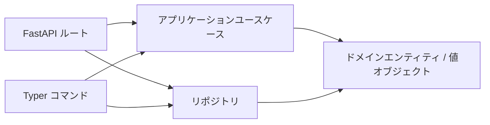

## 概要

**クリーンアーキテクチャ**で実装された最小構成のテキストチャットアプリです。
同じビジネスロジック (`application/use_cases.py` と `domain/entities.py`) を
Typer CLI と FastAPI Web API の 2 つの入口から呼び出します。



## 60 秒で試す（in-memory）

デフォルトの `memory` バックエンドは追加セットアップ不要です。**再起動で会話履歴は消える**ため、まず動作確認用に使ってください。

```bash
# 1. API サーバ起動（デフォルトは in-memory）
uv run chat-web

# 2. Swagger UI を開く
open http://localhost:8080/docs

# 3. CLI で会話作成・投稿
uv run chat-cli conversation create --title "general" --display-name "alice"
uv run chat-cli message post <conversation_id> --content "こんにちは" --display-name "alice"
```

## 永続化バックエンドを選ぶ

Chat アプリの設定は `concierge.settings.ChatSettings` に集約されています。`.env`（または環境変数）で切り替えます。

| `CHAT_REPOSITORY_BACKEND` | 列挙メンバー | 使いどころ | スキーマ初期化 |
|---|---|---|---|
| `memory`（デフォルト） | `ChatRepositoryBackend.MEMORY` | 最初の試運転。再起動でデータ消失 | 不要 |
| `postgres` | `ChatRepositoryBackend.POSTGRES` | ローカル Docker Compose PostgreSQL | **必要**（下記参照） |
| `azure-postgres` | `ChatRepositoryBackend.AZURE_POSTGRES` | Azure Database for PostgreSQL Flexible Server | **必要**（下記参照） |

!!! warning "`postgres` / `azure-postgres` を使う前に `chat-cli db init` を必ず実行してください"
    バックエンドを切り替えただけでは会話用テーブル（`chat_conversations` / `chat_participants` / `chat_messages`）は作成されません。初期化を忘れると `chat-web` でメッセージを送信した瞬間に `relation "chat_conversations" does not exist` で失敗します。

### セットアップ手順（共通）

DB バックエンドを使うときの最短手順です。

```bash
# 1. .env に切替を書く（例: ローカル Postgres）
echo "CHAT_REPOSITORY_BACKEND=postgres" >> .env

# 2. 接続確認（任意だが推奨）
uv run chat-cli db ping

# 3. テーブルを作成（CREATE TABLE IF NOT EXISTS なので冪等）
uv run chat-cli db init

# 4. API / CLI を起動
uv run chat-web
```

関連コマンド：

| コマンド | 説明 |
|---|---|
| `uv run chat-cli db ping` | 接続確認（`SELECT 1`） |
| `uv run chat-cli db init` | テーブル作成（冪等） |
| `uv run chat-cli db drop --yes` | テーブル削除（破壊的） |

### PostgreSQL クイックスタート（ローカル）

[.env.template](https://github.com/ks6088ts-labs/concierge/blob/main/.env.template) の `POSTGRES_*` の値で `compose.yml` の Postgres コンテナに接続します。

```bash
docker compose up -d postgres
echo "CHAT_REPOSITORY_BACKEND=postgres" >> .env
uv run chat-cli db ping
uv run chat-cli db init   # ← 初回 1 回だけ
uv run chat-web
```

### Azure Database for PostgreSQL クイックスタート

`.env` の `AZURE_DBHOST` / `AZURE_DBNAME` / `AZURE_DBUSER`（Entra プリンシパル名）などを設定したうえで：

```bash
echo "CHAT_REPOSITORY_BACKEND=azure-postgres" >> .env
uv run chat-cli db ping
uv run chat-cli db init   # ← 初回 1 回だけ
uv run chat-web
```

Entra ID 認証 (`AZURE_USE_ENTRA_AUTH=true`) を使う場合は事前に `az login` などで `DefaultAzureCredential` が解決可能な状態にしてください。

## トラブルシューティング

### `relation "chat_conversations" does not exist`

**原因**: バックエンドを `postgres` / `azure-postgres` に切り替えたものの、テーブル未作成。

**対処**:

```bash
uv run chat-cli db ping   # 接続できることを確認
uv run chat-cli db init   # テーブル作成
```

初期化後は `chat-web` を再起動しなくても次のリクエストから成功します。

### `AZURE_DBUSER must be set ...` / `AZURE_DBHOST and AZURE_DBNAME must be set`

`azure-postgres` バックエンドで必須の環境変数が未設定です。[.env.template](https://github.com/ks6088ts-labs/concierge/blob/main/.env.template) の `AZURE_*` セクションを参照して `.env` を埋めてください。
