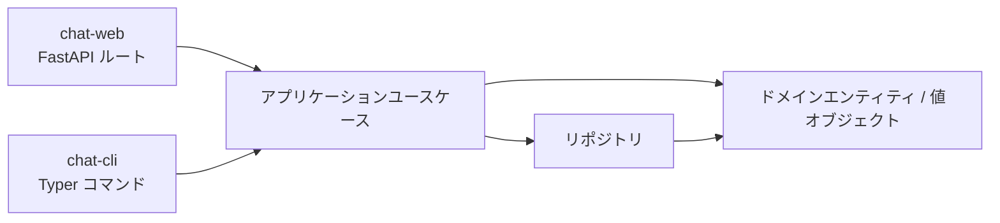
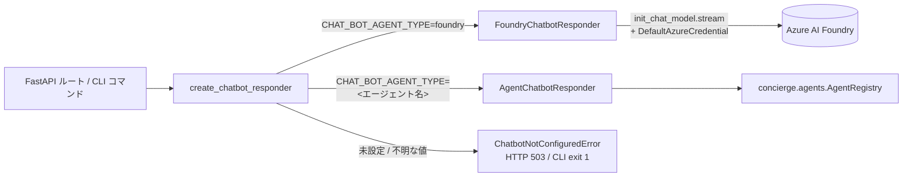

## このアプリは何？

ビジネスロジックを共有する 2 つの入口を持つ、最小構成のテキストチャットアプリです。永続化バックエンドはユースケースを書き換えずに差し替えられます。

| 入口 | 内容 | 使いどころ |
|---|---|---|
| **`chat-web`** | `:8080` の FastAPI サーバ。REST + 同梱の Web UI | Swagger UI、curl、付属クライアントを使いたい |
| **`chat-cli`** | Typer CLI（`conversation` / `message` / `db` / `realtime` サブコマンド） | スクリプト用に JSON 出力が欲しい、ローカルで素早く確認したい |

どちらも同じ `concierge.chat.application.use_cases` を呼ぶため、片側に機能を足せばもう片側にも自動で反映されます。



次に読むもの：

- **まず触ってみたい** → 下の [5 分で動作確認（REST のみ）](#5-rest)
- **REST API リファレンス** → [REST API リファレンス](api.ja.md)
- **CLI リファレンス** → [CLI リファレンス](cli.ja.md)
- **音声会話（Realtime）** → 下の [リアルタイム音声（任意）](#realtime-voice-optional)

---

## 5 分で動作確認（REST のみ） { #5-rest }

Azure アカウント・Docker・`.env` の編集すべて不要です。デフォルトの `memory` バックエンドを使い、データは `chat-web` プロセスが生きている間だけメモリ上に保持されます。

!!! warning "`memory` バックエンドはプロセスごとに独立"
    `chat-web` で作った会話は `chat-cli` からは**見えません**（別プロセスのため）。エンドツーエンドで確認するときは片方の入口に絞ってください。本セクションは REST のみで完結します。CLI のみは [CLI のみで動作確認](#cli-only) を参照。CLI ↔ Web を共有させたい場合は `postgres` バックエンドに切り替えてください。

### 1. API サーバ起動

```bash
uv run chat-web
# → Uvicorn running on http://0.0.0.0:8080
```

### 2. Swagger UI を開く

```bash
open http://localhost:8080/docs
```

または同梱の Web クライアント <http://localhost:8080/> を開きます。

### 3. curl で操作する

別ターミナルで以下を貼り付けます。同じ `chat-web` プロセスに対する呼び出しなので、メモリ上のデータはコール間で保持されます。

```bash
# このセッション内で使い回すユーザ ID
export USER_ID=$(python -c 'import uuid; print(uuid.uuid4())')

# 会話を作って ID を取得
CONV_ID=$(curl -s -X POST http://localhost:8080/conversations \
  -H "X-User-Id: ${USER_ID}" \
  -H 'content-type: application/json' \
  -d '{"title":"smoke-test","display_name":"alice"}' \
  | python -c 'import json,sys; print(json.load(sys.stdin)["id"])')
echo "CONV_ID=$CONV_ID"

# メッセージを投稿
curl -s -X POST "http://localhost:8080/conversations/${CONV_ID}/messages" \
  -H "X-User-Id: ${USER_ID}" \
  -H 'content-type: application/json' \
  -d '{"content":"hello from curl","display_name":"alice"}'

# メッセージ一覧
curl -s "http://localhost:8080/conversations/${CONV_ID}/messages"
```

期待結果：最初の 2 つの POST が `201 Created`、最後の GET で投稿内容を含む JSON 配列が返ります。`AZURE_AI_PROJECT_ENDPOINT` 未設定のとき `/agent-replies` を叩くと `503 Service Unavailable` が返るのは**正常**です。有効化手順は [AI チャットボット応答（任意）](#ai) を参照。

---

## 音声入力（Speech-to-Text）

同梱 Web UI（<http://localhost:8080/>）では、ブラウザの Web Speech API
を使った音声入力を利用できます。

### 使い方

1. 会話を作成/選択して入力欄を有効化します。
2. 送信ボタンの左にあるマイクボタン（`🎤`）を押します。
3. 話すと、認識途中/確定テキストが入力欄の末尾に追記されます。
4. もう一度ボタン（`⏹`）を押すと停止します。
5. 従来どおり送信ボタン（または `Shift+Enter`）で送信します。

音声入力で自動送信はされません。明示的に送信したテキストだけが投稿されます。

### 対応ブラウザ

- 対応: 最新の Google Chrome / Microsoft Edge / Safari（macOS / iOS）
- 非対応: Firefox（Web Speech API が標準利用できないため）
- 非対応ブラウザではマイクボタンは無効化され、UI に警告トーストが表示されます。

### プライバシーに関する注意

- マイク権限はブラウザの標準プロンプトに従います。
- 音声認識はブラウザベンダーのクラウドで処理される場合があります
  （例: Chrome / Edge の実装）。
- concierge バックエンドには生音声データは送信されず、ユーザーが送信操作をした
  後のテキストのみ既存 API で送信されます。

---

## 音声出力（Text-to-Speech）

同梱 Web UI（<http://localhost:8080/>）では、ブラウザの Web Speech API を使って
**AGENT** メッセージを読み上げできます。

### 使い方

1. 会話画面で AGENT メッセージを受信します。
2. メッセージ右側のスピーカーボタン（`🔊`）を押します。
3. 読み上げ中は同じボタンが停止（`■`）に切り替わります。
4. `■` を押すと即時停止し、別 AGENT メッセージの `🔊` を押すとそちらへ切り替わります。

### 対応ブラウザ

- 対応: 最新の Google Chrome / Microsoft Edge（Chromium 系）
- 既定で非対応: Firefox（Web Speech API の音声合成が利用できない場合あり）
- 非対応ブラウザではスピーカーボタンは表示されません。

### プライバシーに関する注意

- 音声合成は、ブラウザ実装や選択 voice によってブラウザベンダーのクラウドで
  処理される場合があります。
- concierge バックエンドに対して、新しい TTS API への本文送信は行いません。
  読み上げはブラウザに表示済みのテキストのみを利用します。

---

## CLI のみで動作確認 { #cli-only }

CLI も同じユースケースを呼びますが、コマンド 1 つごとに別プロセスです。`memory` バックエンドで `create` と `post` をつなぐような流れは**動きません**。次のどちらかを選んでください：

1. **`postgres` バックエンドに切り替える**（複数ステップで CLI を使うならこちらを推奨）。すべてのコマンドが同じ DB を参照します。[PostgreSQL クイックスタート](#postgresql) を参照。
2. **REST API を使う**：ユーザ目線で連続する操作は REST に寄せ、CLI は `db init` / `db ping` / `conversation list` などのワンショット操作に絞る。

単発で必ず動く正常性確認はヘルプ表示です：

```bash
uv run chat-cli --help
uv run chat-cli conversation --help
uv run chat-cli message --help
uv run chat-cli db --help
```

`postgres` バックエンドでの一通りの流れは [CLI リファレンスの「ウォークスルー」](cli.ja.md#postgres-) を参照。

---

## 永続化バックエンドを選ぶ

Chat アプリの設定は `concierge.settings.ChatSettings` に集約されています。`.env`（または環境変数）で切り替えます。

| `CHAT_REPOSITORY_BACKEND` | 列挙メンバー | 使いどころ | スキーマ初期化 |
|---|---|---|---|
| `memory`（デフォルト） | `ChatRepositoryBackend.MEMORY` | 最速の試運転。再起動でデータ消失、**プロセスをまたいで共有もされない** | 不要 |
| `postgres` | `ChatRepositoryBackend.POSTGRES` | ローカル Docker Compose PostgreSQL（`POSTGRES_*`） | **必要**（下記参照） |
| `azure-postgres` | `ChatRepositoryBackend.AZURE_POSTGRES` | Azure Database for PostgreSQL Flexible Server（`AZURE_*`） | **必要**（下記参照） |

!!! warning "`postgres` / `azure-postgres` を使う前に `chat-cli db init` を必ず実行してください"
    バックエンドを切り替えただけでは会話用テーブル（`chat_conversations` / `chat_participants` / `chat_messages`）は作成されません。初期化を忘れると `chat-web` でメッセージを送信した瞬間に `relation "chat_conversations" does not exist` で失敗します。

### セットアップ手順（共通）

```bash
# 1. .env に切替を書く（例: ローカル Postgres）
echo "CHAT_REPOSITORY_BACKEND=postgres" >> .env

# 2. 接続確認
uv run chat-cli db ping
# → Connection OK.

# 3. テーブルを作成（CREATE TABLE IF NOT EXISTS なので冪等）
uv run chat-cli db init
# → Database schema initialised successfully.

# 4. API / CLI を起動
uv run chat-web
```

関連コマンド：

| コマンド | 説明 |
|---|---|
| `uv run chat-cli db ping` | 接続確認（`SELECT 1`） |
| `uv run chat-cli db init` | テーブル作成（冪等） |
| `uv run chat-cli db drop --yes` | テーブル削除（破壊的） |

### PostgreSQL クイックスタート（Docker Compose） { #postgresql }

[`.env.template`](https://github.com/ks6088ts-labs/concierge/blob/main/.env.template) の `POSTGRES_*` の値で `compose.yml` の Postgres サービスに接続します。

```bash
docker compose up -d postgres
echo "CHAT_REPOSITORY_BACKEND=postgres" >> .env
uv run chat-cli db ping
uv run chat-cli db init   # 初回 1 回だけ
uv run chat-web
```

### Azure Database for PostgreSQL クイックスタート

`.env` に `AZURE_DBHOST` / `AZURE_DBNAME` / `AZURE_DBUSER`（Entra プリンシパル名）などを設定したうえで：

```bash
echo "CHAT_REPOSITORY_BACKEND=azure-postgres" >> .env
uv run chat-cli db ping
uv run chat-cli db init   # 初回 1 回だけ
uv run chat-web
```

Entra ID 認証（`AZURE_USE_ENTRA_AUTH=true`）を使う場合は事前に `az login` などで `DefaultAzureCredential` が解決可能な状態にしてください。

---

## AI チャットボット応答（任意） { #ai }

Chat アプリは LangChain 経由で **Microsoft Foundry** を呼び出し、エージェント参加者として応答させることができます。配線は [`concierge/chat/infrastructure/ai/`](https://github.com/ks6088ts-labs/concierge/tree/main/concierge/chat/infrastructure/ai) に集約：

- `application/responders.py`：`ChatbotResponder` プロトコルを定義（`stream_reply` でトークンストリームを yield）
- `infrastructure/ai/foundry_responder.py`：`langchain.chat_models.init_chat_model` と `DefaultAzureCredential` で実装し、`chat_model.stream(...)` を利用
- `infrastructure/ai/agent_responder.py`：共有 `concierge.agents` レジストリ経由で実装（LLM オプション経路）
- `infrastructure/ai/factory.py`：`create_chatbot_responder()` を公開（設定未満たし時に `ChatbotNotConfiguredError` を送出）



`create_chatbot_responder()` は `CHAT_BOT_AGENT_TYPE`（既定 `foundry`）でレスポンダを選択します。`foundry` の場合は `AZURE_AI_PROJECT_ENDPOINT` の設定が必須で、未設定だと `ChatbotNotConfiguredError` を送出します（FastAPI ルートは HTTP 503、`chat-cli message reply` は終了コード 1）。`foundry` 以外の値（`echo` / `langgraph` / `github-copilot-sdk` / `microsoft-agent-framework` など）は共有 `AgentRegistry` から解決されます。

テキストチャット（`/agent-replies`）で外部ナレッジ検索を使う場合は、
`CHAT_BOT_AGENT_TYPE=langgraph` など AgentRegistry 経由のレスポンダを利用してください。
こちらの経路で knowledge tool が実行されます。既定の `foundry` レスポンダは
通常の chat completion 経路（tool call ループなし）のままです。

### 設定一覧

| 変数 | デフォルト | 説明 |
|---|---|---|
| `CHAT_BOT_MODEL` | `azure_ai:gpt-5` | `init_chat_model` に渡すモデル識別子 |
| `CHAT_BOT_SYSTEM_PROMPT` | `あなたは Concierge Chat のアシスタントです。日本語で簡潔に応答してください。` | 毎回先頭に挿入されるシステムメッセージ |
| `CHAT_BOT_DISPLAY_NAME` | `Concierge AI` | エージェント参加者の表示名 |
| `CHAT_BOT_PARTICIPANT_ID` | `00000000-0000-0000-0000-000000000001` | エージェント参加者の固定 UUID |
| `CHAT_BOT_HISTORY_LIMIT` | `20` | コンテキストとして渡す過去メッセージの最大数 |
| `AZURE_AI_PROJECT_ENDPOINT` | 未設定 | `CHAT_BOT_AGENT_TYPE=foundry` のときに必須 |
| `CHAT_BOT_AGENT_TYPE` | `foundry` | レスポンダ選択。`foundry`（既定、ストリーミング）か登録済みエージェント名（`echo` / `langgraph` / `github-copilot-sdk` / `microsoft-agent-framework`） |

> **メモ:** 旧 `CHAT_RESPONDER_BACKEND` 変数は廃止されました。`.env` に残っていても無視されますが、起動時に `DeprecationWarning` が出ます。

### チャットボットを有効にする（Foundry バックエンド）

```bash
# 1. Foundry エンドポイントの設定
echo "AZURE_AI_PROJECT_ENDPOINT=https://<resource>.services.ai.azure.com/api/projects/<project>" >> .env

# 2. DefaultAzureCredential がトークンを発行できる状態に
az login

# 3. API 起動
uv run chat-web
```

### エージェント駆動レスポンダ（LLM オプション）

LLM 不要のスモークテストには `echo` エージェントを使います。

```bash
export CHAT_BOT_AGENT_TYPE=echo
uv run chat-web
```

LangGraph echo エージェント（`AZURE_AI_PROJECT_ENDPOINT` が必要）:

```bash
export CHAT_BOT_AGENT_TYPE=langgraph
export AGENTS_LANGGRAPH_MODEL=azure_ai:gpt-5
az login
uv run chat-web
```

利用可能なエージェントと設定の詳細は [共有エージェントランタイム](../agents/index.ja.md) を参照してください。

### API 呼び出し設計

- `POST /conversations/{id}/messages` — **ユーザ発言の保存のみ**。ボット応答は一切トリガーしません。クライアントは送信完了を確実に待てます。
- `POST /conversations/{id}/agent-replies` — Server-Sent Events (`text/event-stream`) でエージェント応答をストリーミング。`delta` イベントで部分トークンを送り、最後に `complete` イベントで永続化された `AGENT` メッセージを返します。`AZURE_AI_PROJECT_ENDPOINT` 未設定時は HTTP 503、CLI (`chat-cli message reply`) は終了コード 1。
- CLI も同じ責務分離：`message post` は保存のみ、`message reply` がストリーミング応答を要求します。

---

## 動作確認チェックリスト

変更後に貼り付けて流せばよい一連のコマンドです。利用バックエンドに合わせて選んでください。

### A. `memory` バックエンド（REST のみ）

ターミナル 1：

```bash
# .env を上書きして memory モードで起動
CHAT_REPOSITORY_BACKEND=memory uv run chat-web
```

ターミナル 2：

```bash
curl -s http://localhost:8080/healthz
# → {"status":"ok"}

export USER_ID=$(python -c 'import uuid; print(uuid.uuid4())')
CONV_ID=$(curl -s -X POST http://localhost:8080/conversations \
  -H "X-User-Id: ${USER_ID}" -H 'content-type: application/json' \
  -d '{"title":"smoke","display_name":"alice"}' \
  | python -c 'import json,sys; print(json.load(sys.stdin)["id"])')
echo "CONV_ID=$CONV_ID"

curl -s -X POST "http://localhost:8080/conversations/${CONV_ID}/messages" \
  -H "X-User-Id: ${USER_ID}" -H 'content-type: application/json' \
  -d '{"content":"hello","display_name":"alice"}'

curl -s "http://localhost:8080/conversations/${CONV_ID}/messages"

# Foundry エンドポイント未設定時の期待値
curl -s -o /dev/null -w "agent-replies → HTTP %{http_code}\n" \
  -X POST "http://localhost:8080/conversations/${CONV_ID}/agent-replies" \
  -H "X-User-Id: ${USER_ID}"
# → agent-replies → HTTP 503
```

合格条件：

- `healthz` が `{"status":"ok"}` を返す
- POST 2 件がそれぞれ `role: USER` の JSON を返す
- `GET .../messages` が投稿メッセージを含む配列を返す
- `agent-replies` は HTTP 503（`AZURE_AI_PROJECT_ENDPOINT` 設定済みなら 200 + SSE ストリーム）

### B. `postgres` バックエンド（REST ↔ CLI 共有）

```bash
docker compose up -d postgres
echo "CHAT_REPOSITORY_BACKEND=postgres" >> .env

uv run chat-cli db ping
uv run chat-cli db init

# サーバを背景起動して、同じシェルで CLI を実行
uv run chat-web &
SERVER_PID=$!
sleep 2

# CLI とサーバが同じ DB を参照する
RESPONSE=$(uv run chat-cli conversation create --title "shared" --display-name "alice")
echo "$RESPONSE"
CONV_ID=$(echo "$RESPONSE" | python -c 'import json,sys; print(json.load(sys.stdin)["id"])')

curl -s "http://localhost:8080/conversations/${CONV_ID}"
# → CLI で作った会話が返る

uv run chat-cli message post "$CONV_ID" --content "hi" --display-name "alice"
uv run chat-cli message list "$CONV_ID"

kill $SERVER_PID
```

合格条件：

- `db ping` が `Connection OK.`
- `db init` が `Database schema initialised successfully.`
- `GET /conversations/{id}` が CLI 作成の会話を返す
- `message list` が CLI 投稿のメッセージを含む

### C. チャットボット（Foundry）有効

```bash
# 前提：AZURE_AI_PROJECT_ENDPOINT 設定済み、az login 済み

uv run chat-web &
SERVER_PID=$!
sleep 2

export USER_ID=$(python -c 'import uuid; print(uuid.uuid4())')
CONV_ID=$(curl -s -X POST http://localhost:8080/conversations \
  -H "X-User-Id: ${USER_ID}" -H 'content-type: application/json' \
  -d '{"title":"ai","display_name":"alice"}' \
  | python -c 'import json,sys; print(json.load(sys.stdin)["id"])')

# 1. ユーザ発言を保存（応答はトリガーされない）
curl -s -X POST "http://localhost:8080/conversations/${CONV_ID}/messages" \
  -H "X-User-Id: ${USER_ID}" -H 'content-type: application/json' \
  -d '{"content":"自己紹介して","display_name":"alice"}'

# 2. SSE でエージェント応答をストリーミング
curl -N -s -X POST "http://localhost:8080/conversations/${CONV_ID}/agent-replies" \
  -H "X-User-Id: ${USER_ID}"

# 3. 保存された AGENT メッセージを確認
curl -s "http://localhost:8080/conversations/${CONV_ID}/messages"

kill $SERVER_PID
```

合格条件：手順 2 で `event: delta` / `event: complete` フレームがストリーミングされ、手順 3 で 2 件のメッセージ（`role: USER` と `role: AGENT`/`display_name: Concierge AI`）が返ること。

---

## リアルタイム音声（任意） { #realtime-voice-optional }

リアルタイム音声機能は、ブラウザと Microsoft Foundry の GPT Realtime API を
**双方向 WebSocket プロキシ**でつなぎます。音声処理はすべてサーバ側で
行われ、Foundry の認証情報はサーバ外に出ません。ユーザーと AI の transcript は
通常の `Message` としてテキストチャットと同じストアに保存され、
`/conversations/{id}/messages` で一覧できます。

```
ブラウザ ⇄ FastAPI (chat-web) ⇄ Foundry /openai/v1/realtime
```

### クイックスタート

```bash
# 1. .env にリアルタイム用エンドポイントを設定（他の設定は下の表を参照）
echo "AZURE_AI_PROJECT_ENDPOINT_REALTIME=https://<resource>.openai.azure.com/" >> .env

# 2. 設定が読み込めるか確認（実際の接続は行わない）
uv run chat-cli realtime status
# → ステータス: ✅ 設定済み

# 3. API サーバを起動
uv run chat-web
```

その後 Chromium 系 / Firefox / Safari ブラウザで <http://localhost:8080/> を開き、
サイドバーで会話を作成 → コンポザー上部の **🎙 通話開始** をクリックして話します。
初回はマイクの利用許可ダイアログが表示されます。旧 URL <http://localhost:8080/realtime>
は `301` リダイレクトで `/` に転送されるため、既存のブックマークはそのまま使えます。

通話ボタンはサーバが [`GET /capabilities`](api.ja.md#realtime-voice-websocket) で `{"realtime": true}` を
返すときだけ表示されます。`AZURE_AI_PROJECT_ENDPOINT_REALTIME` が空のときは
通話ボタンが隠され、テキストチャットはそのまま使えます。

!!! tip "リージョンについて"
    GPT Realtime モデルが利用可能なリージョン（例：`swedencentral` / `eastus2`）の
    Foundry リソースが必要です。通常のテキストチャットとは別リージョンになることが多いため、
    専用の環境変数が用意されています。参考：
    [GPT Realtime API via WebSockets の使用方法 (Microsoft Learn)](https://learn.microsoft.com/ja-jp/azure/foundry/openai/how-to/realtime-audio-websockets?tabs=ga)。

### UI のパイプライン

1. `getUserMedia({ audio: true })` でマイク権限をリクエスト。
2. `AudioWorklet` で 24 kHz モノラル PCM16（`CHAT_REALTIME_AUDIO_SAMPLE_RATE_HZ` の値）に変換し、200 ms 単位で分割。
3. 各チャンクを base64 エンコードし、
   `{"type":"oai-event","payload":{"type":"input_audio_buffer.append","audio":"<b64>"}}` として送信。
4. Foundry が返す `response.output_audio.delta` イベントを PCM16 にデコードし、
   キュー付き `AudioBufferSource` で順次再生。部分 transcript
   （`response.output_audio_transcript.delta`）は確定前の仮行（`🤖` 接頭辞）に
   ストリーミングされます。
5. ユーザー自身の発話も同じ仮行に `🗣️` 接頭辞で表示されます
   （`conversation.item.input_audio_transcription.delta` / `.completed` イベント）。
   これには `CHAT_REALTIME_TRANSCRIPTION_MODEL` の設定が必要です。空の場合は
   Foundry がユーザー音声を文字起こししないため入力テキストは表示されません
   （アシスタントの音声出力は引き続き動作します）。

通話中は入力モードの競合を避けるためテキストコンポザーがロックされます。
会話リスト、メッセージログ、`localStorage` プロフィール
（`chat_user_id` / `chat_display_name`）はテキストチャットと音声通話で共有されます。
以前の単体リアルタイム UI で使われていた `chat_rt_user_id` / `chat_rt_display_name` は
初回ロード時に自動移行されます。

### 自分の発話を画面で確認する（入力の文字起こし） { #realtime-input-transcription }

デフォルトでは、リアルタイム通話の仮行に表示されるのは**アシスタント**の発話
（`🤖` 接頭辞）だけです。あなたの発話も音声として Foundry に送られ、モデルは
正しく応答しますが、*あなたが*話した内容のテキストは表示されません。Foundry が
ユーザーのマイク音声を文字起こしするのは、入力文字起こし用モデルを明示的に
有効化したときだけだからです。有効化すると、認識したあなたの発話が仮行に
（`🗣️` 接頭辞で）リアルタイム表示され、確定したテキストは会話ログに USER
メッセージとして保存されます。

#### 有効化の手順

1. `AZURE_AI_PROJECT_ENDPOINT_REALTIME` と**同じ** Foundry リソース（テキスト
   チャット用とは別になることがあるリアルタイム用リソース）に**文字起こし用
   モデルをデプロイ**します。`gpt-4o-mini-transcribe` / `gpt-4o-transcribe` /
   `whisper` などが利用できます。
2. `.env` に（素の OpenAI モデル ID ではなく）**デプロイ名**を設定します。

   ```bash
   CHAT_REALTIME_TRANSCRIPTION_MODEL=gpt-4o-mini-transcribe
   ```

3. `chat-web` を再起動して新しい通話を開始します。話すと認識テキストが仮行に
   ストリーミング表示され、話し終えると USER `Message` として保存されて、
   アシスタントの応答と並んで会話に表示されます。

#### 内部の動作

`CHAT_REALTIME_TRANSCRIPTION_MODEL` が空でないとき、サーバは `session.update` の
`audio.input` セクションに `transcription` ブロックを追加します。`model` には
デプロイ名を、`language` には `CHAT_REALTIME_LOCALE` の ISO-639-1 主サブタグを
使います（`ja-JP` は `ja` になります）。すると Foundry は、Web UI が処理する
次の 2 つのサーバイベントを送出します。

- `conversation.item.input_audio_transcription.delta` — ユーザーの部分 transcript。
  話している間 `🗣️` の仮行にストリーミングされます（一部のモデルは delta を
  省略し、確定結果のみを送ります）。
- `conversation.item.input_audio_transcription.completed` — ユーザーの確定
  transcript。サーバが USER `Message` として保存し、次回のリロードで仮行が
  実際のメッセージ吹き出しに置き換わります。

!!! warning "OpenAI のモデル ID ではなくデプロイ名を使う"
    Azure では `model` フィールドは同一リソース内のデプロイ名である必要があります。
    OpenAI のモデル ID `gpt-4o-mini-transcribe` は多くのリソースでデプロイに
    対応しないため、デフォルトを空にして無音失敗（transcript もエラーも出ない）を
    避けています。設定したのに入力テキストが表示されない場合は、その名前の
    デプロイがリアルタイム用 Foundry リソースに正確に存在し、サインイン中の
    プリンシパルが利用できるか確認してください。

### 対応ブラウザ

`AudioWorklet` / `WebSocket` / `MediaDevices.getUserMedia` / `crypto.randomUUID`
を使用します。最近の Chrome / Edge / Firefox / Safari で動作します。Safari は
セキュリティ仕様上、`AudioContext` の音声出力にユーザー操作（**通話開始**
ボタンのクリック）が必要です。

### 設定一覧

すべてのリアルタイム設定は `CHAT_` プレフィックスを使用します（完全なスキーマは
`ChatSettings` を参照）。

| 変数名 | デフォルト | 説明 |
|---|---|---|
| `AZURE_AI_PROJECT_ENDPOINT_REALTIME` | `""`（無効） | リアルタイムモデル用 Foundry エンドポイント。`https://<r>.openai.azure.com/` / `https://<r>.services.ai.azure.com/` の両形式を受け付け、自動正規化します。空のときリアルタイム WebSocket は `4503` で閉じます。 |
| `CHAT_REALTIME_MODEL` | `gpt-realtime-1.5` | リアルタイムモデルのデプロイ名 |
| `CHAT_REALTIME_VOICE` | `alloy` | ボイス識別子：`alloy` / `ash` / `ballad` / `coral` / `echo` / `sage` / `shimmer` / `verse` |
| `CHAT_REALTIME_LOCALE` | `ja-JP` | 文字起こし言語。`ja-JP` のような BCP-47 値は Foundry への転送時に ISO-639-1 主サブタグ（`ja`）に縮約されます。 |
| `CHAT_REALTIME_SYSTEM_PROMPT` | 日本語の既定プロンプト | リアルタイムセッションで使うシステムメッセージ |
| `CHAT_REALTIME_AUDIO_SAMPLE_RATE_HZ` | `24000` | PCM16 サンプルレート（Foundry 固定値） |
| `CHAT_REALTIME_MAX_SESSION_SECONDS` | `600` | サーバ側セッションタイムアウト（秒） |
| `CHAT_REALTIME_TRANSCRIPTION_MODEL` | `""` | 入力音声の transcription 用 Azure デプロイ名。空のとき `session.update` に `transcription` ブロックを含めず、あなたの発話は表示も保存もされません。[自分の発話を画面で確認する](#realtime-input-transcription) を参照。 |
| `CHAT_REALTIME_TURN_DETECTION_TYPE` | `server_vad` | ユーザーの発話終了をどう判定するか：`server_vad`（無音ベース）/ `semantic_vad`（文の意味から判定。割り込みが大幅に減る）/ `none`（push-to-talk。クライアントが自分でバッファを commit し `response.create` を送る）。 |
| `CHAT_REALTIME_VAD_THRESHOLD` | `0.5` | `server_vad` の発話検出しきい値（0.0-1.0）。高いほど大きな声が必要で、雑音の多い環境に有効。 |
| `CHAT_REALTIME_VAD_PREFIX_PADDING_MS` | `300` | `server_vad` で検出した発話開始の手前に残す音声（ミリ秒）。 |
| `CHAT_REALTIME_VAD_SILENCE_DURATION_MS` | `700` | `server_vad` でターン終了とみなすまでに必要な無音（ミリ秒）。API デフォルトより長くして、ちょっとした間で割り込まれないようにしています。まだ割り込む場合はさらに増やします。 |
| `CHAT_REALTIME_VAD_EAGERNESS` | `low` | `semantic_vad` の積極度：`low` / `medium` / `high` / `auto`。`low` はユーザーが話し終えるのを待ちます。 |
| `CHAT_REALTIME_VAD_CREATE_RESPONSE` | `true` | ターン終了時に応答を自動生成するか。`false` なら明示的な `response.create` が必要。 |
| `CHAT_REALTIME_VAD_INTERRUPT_RESPONSE` | `true` | 新しいユーザー発話が応答中のAIに割り込む（バージイン）かどうか。 |

#### AI が話に割り込んでくるのを抑える { #realtime-turn-detection-tuning }

少し間を置いただけ、話し終える前に AI が話し始めてしまう場合は、上記の
ターン検出（VAD）設定で調整できます。原因はモデルが積極的にターンを取りすぎて
いることです。おすすめは次の 2 つです。

- **Semantic VAD（推奨）。** `CHAT_REALTIME_TURN_DETECTION_TYPE=semantic_vad` と
  `CHAT_REALTIME_VAD_EAGERNESS=low` を設定します。無音ではなく文の意味で発話終了を
  判定するため、文中の小さな間で応答が始まらなくなります。
- **Server VAD を調整。** `server_vad` のまま
  `CHAT_REALTIME_VAD_SILENCE_DURATION_MS` を大きく（例：`1000`〜`1200`）して、
  応答までに必要な無音を長くします。雑音で誤検出する場合は
  `CHAT_REALTIME_VAD_THRESHOLD` を上げます（例：`0.6`）。

完全な手動制御（push-to-talk）にするには
`CHAT_REALTIME_TURN_DETECTION_TYPE=none` を設定します。その場合クライアントが
`input_audio_buffer.commit` と `response.create` を自分で送る必要があります。

### ツール呼び出し（function calling） { #realtime-tool-calling }

リアルタイムセッションはツールを使う AI エージェントとして構成されています。
モデルは会話の途中でサーバ側の Python 関数を呼び出し、その結果を踏まえて
続きを発話できます。これは
[OpenAI Realtime の function-calling 契約](https://learn.microsoft.com/ja-jp/azure/ai-foundry/openai/realtime-audio-reference)
（Foundry の GA エンドポイントも同準拠）に従います。

1. `session.update` で利用可能なツールを `session.tools` として提示
   （`tool_choice: "auto"`）。
2. モデルがツール呼び出しを決めると `function_call` アイテムを生成し、
   `response.output_item.done` サーバイベントとして通知される。
3. サーバがツールをローカル実行し、`function_call_output` アイテムを載せた
   `conversation.item.create` イベントで結果を返す。
4. `response.create` イベントでモデルに続きの発話を促す。

これらはすべて `StreamRealtimeVoiceUseCase` 内のサーバ側で完結します。
ブラウザは発話された回答を聞くだけで、フロントエンドの変更は不要です。

#### 組み込みツール

| ツール | 説明 |
|---|---|
| `get_current_time` | 現在の日時を返します。IANA タイムゾーン（例：`Asia/Tokyo`）を任意で指定できます。 |
| `echo` | 入力テキストをそのまま返します（tool calling の疎通確認向け）。 |
| `read_file` / `list_directory` / `file_search` | `concierge.agents` と共通の read-only ファイルツールです。 |
| `<AGENTS_KNOWLEDGE__TOOLS の各名>`（任意） | `AGENTS_KNOWLEDGE__...` 設定で読み込まれる PostgreSQL/pgvector 検索ツールです。 |

knowledge tool の有効化例（`.env`）:

```bash
AGENTS_KNOWLEDGE__TOOLS=search_docs
AGENTS_KNOWLEDGE__SEARCH_DOCS__COLLECTION=knowledge_default
AGENTS_KNOWLEDGE__SEARCH_DOCS__DESCRIPTION="Search the docs knowledge base"
```

#### 新しいツールの追加方法

ツールは単一のレジストリ
[`concierge/chat/application/realtime_tools.py`](https://github.com/ks6088ts-labs/concierge/blob/main/concierge/chat/application/realtime_tools.py)
に定義されています。各ツールは JSON スキーマと Python ハンドラを 1 つの
`RealtimeTool` にまとめており、スキーマを必要とする responder と、ハンドラを
実行する use case が同一の定義を共有します。機能を追加するには
`build_default_realtime_tools()` にエントリを追記するだけです。

```python
from concierge.chat.application.realtime_tools import RealtimeTool

RealtimeTool(
    name="get_weather",
    description="都市の現在の天気を取得する。ユーザーが天気を尋ねたときに使う。",
    parameters={
        "type": "object",
        "properties": {
            "city": {"type": "string", "description": "都市名。例：'Tokyo'。"},
        },
        "required": ["city"],
    },
    handler=lambda args: fetch_weather(args["city"]),  # str を返す（JSON 推奨）
)
```

指針：

- `handler` のシグネチャは `dict -> str`。可能なら JSON 文字列を返します。
  値はそのまま `function_call_output` としてモデルに渡されます。
- ハンドラは高速・同期に保ちます。音声ターンの合間にリレースレッド上で
  実行されるため、遅い I/O は外出しするか短いタイムアウトでラップします。
- ハンドラの例外は捕捉され、`{"error": "..."}` としてモデルに返されます。
  ツールが失敗しても通話を落とさず穏当に縮退します。
- レジストリを編集する以外に環境変数や再起動の配線は不要です。
  `create_realtime_responder()` と WebSocket ルートの両方が
  `build_default_realtime_tools()` を自動的に参照します。

#### 最小の動作確認

```bash
# 1. リアルタイムエンドポイントを設定・確認（上のクイックスタート参照）
uv run chat-cli realtime status   # → ステータス: ✅ 設定済み

# 2. サーバを起動し http://localhost:8080/ を開く
uv run chat-web

# 3. 通話を開始し、ツールを誘発する質問をする。例：
#    「今何時?」→ モデルが get_current_time を呼び、実際の時刻で回答する。
#    サーバログに次が出ます：
#       INFO Executed realtime tool name=get_current_time call_id=...
```

このフロー（ツール実行・未知ツールのエラー出力・ツール未設定時の素通し）の
ユニットテストは
[`tests/chat/test_realtime_use_case.py`](https://github.com/ks6088ts-labs/concierge/blob/main/tests/chat/test_realtime_use_case.py)
にあり、実際の Foundry 接続なしで実行できます。

```bash
uv run pytest tests/chat/test_realtime_use_case.py -o addopts=""
```

### その他の参照先

- WebSocket ワイヤープロトコル（イベント、クローズコード）→ [REST API リファレンス → リアルタイム音声 WebSocket](api.ja.md#realtime-voice-websocket)
- 非対話の動作確認 → [`chat-cli realtime status`](cli.ja.md#realtime-status)

---

## トラブルシューティング

### `relation "chat_conversations" does not exist`

**原因**：バックエンドを `postgres` / `azure-postgres` に切り替えたものの、テーブル未作成。

**対処**：

```bash
uv run chat-cli db ping   # 接続できることを確認
uv run chat-cli db init   # テーブル作成
```

初期化後は `chat-web` を再起動しなくても次のリクエストから成功します。

### CLI コマンドの間で `Conversation not found: ...` になる

`memory` バックエンドは**プロセスごとに独立**しています。`uv run chat-cli ...` ごとに新しい Python プロセスが起動し、ストアは空からやり直しになります。`postgres` バックエンドに切り替えて `chat-cli db init` を実行してから再試行してください。

### `AZURE_DBUSER must be set ...` / `AZURE_DBHOST and AZURE_DBNAME must be set`

`azure-postgres` バックエンドで必須の環境変数が未設定です。[`.env.template`](https://github.com/ks6088ts-labs/concierge/blob/main/.env.template) の `AZURE_*` セクションを参照して `.env` を埋めてください。

### `Chatbot is not configured`（HTTP 503） / `chat-cli message reply` が `1` で終了する

`create_chatbot_responder()` が `ChatbotNotConfiguredError` を送出した状態です。`AZURE_AI_PROJECT_ENDPOINT` が未設定なときに発生します。設定を加えたうえで `chat-web` を再起動してください。`POST /messages` は一切応答をトリガーしないため、このエラーは `/agent-replies`（または `chat-cli message reply`）でのみ表出します。

### Foundry 呼び出しが `ClientAuthenticationError` / `DefaultAzureCredential failed` で落ちる

`FoundryChatbotResponder` は構築時に `DefaultAzureCredential()` を使います。`az login` やマネージド ID、`DefaultAzureCredential` がサポートする環境変数など、シェルからトークンを取得できる状態に整えてください。

### リアルタイム WebSocket が `4503` で閉じる / 通話ボタンが表示されない

`AZURE_AI_PROJECT_ENDPOINT_REALTIME` が未設定のため、`GET /capabilities` が
`{"realtime": false}` を返し **通話開始** ボタンが隠されます。`.env` に設定して
`chat-web` を再起動してください。ブラウザを開かずにさっと確認したいときは
[`chat-cli realtime status`](cli.ja.md#realtime-status) を使います。

### リアルタイム WebSocket が `4404` で閉じる

URL の `conversation_id` が存在しません。会話を選び直すか作り直してから
再度通話を開始してください。

### リアルタイム WebSocket が `4400` で閉じる

`user_id` クエリパラメータが未指定か UUID として不正です。ブラウザの DevTools で
`localStorage` の `chat_user_id` を削除してリロードします — 次回アクセス時に
ページが UUID を再生成します。

### マイク許可が拒否された（UI に赤バナー）

ブラウザがマイクへのアクセスをブロックしています。ブラウザのサイト設定で
`localhost:8080` のマイク使用を許可し（Chrome / Edge なら `chrome://settings/content/microphone`）、
タブをリロードしてください。
