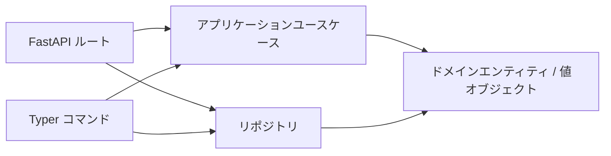

## 概要

**クリーンアーキテクチャ**で実装された最小構成のテキストチャットアプリです。
同じビジネスロジック (`application/use_cases.py` と `domain/entities.py`) を
Typer CLI と FastAPI Web API の 2 つの入口から呼び出します。



## 60 秒で試す

```bash
# 1. API サーバ起動（デフォルトは in-memory）
uv run chat-web

# 2. Swagger UI を開く
open http://localhost:8080/docs

# 3. CLI で会話作成・投稿
uv run chat-cli conversation create --title "general" --display-name "alice"
uv run chat-cli message post <conversation_id> --content "こんにちは" --display-name "alice"
```

## 永続化バックエンドを選ぶ

Chat アプリの設定は `concierge.settings.ChatSettings` に集約されています。

| `CHAT_REPOSITORY_BACKEND` | 列挙メンバー | 使いどころ |
|---|---|---|
| `memory`（デフォルト） | `ChatRepositoryBackend.MEMORY` | 最初の試運転。再起動でデータ消失 |
| `postgres` | `ChatRepositoryBackend.POSTGRES` | ローカル Docker Compose PostgreSQL |
| `azure-postgres` | `ChatRepositoryBackend.AZURE_POSTGRES` | Azure Database for PostgreSQL Flexible Server |

### PostgreSQL クイックスタート

```bash
docker compose up -d postgres
CHAT_REPOSITORY_BACKEND=postgres uv run chat-cli db init
CHAT_REPOSITORY_BACKEND=postgres uv run chat-web
```
