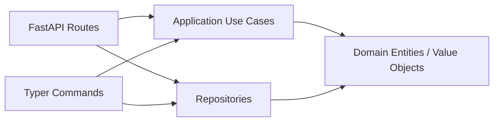

## Overview

A minimal text chat app implemented with **clean architecture**. The same
business logic (`application/use_cases.py`, `domain/entities.py`) is shared
between two entry points - a Typer CLI and a FastAPI Web API - so the
boundaries between layers stay visible.



## TL;DR (60-second tour)

```bash
# 1. Boot the API (in-memory backend by default)
uv run chat-web

# 2. Open Swagger UI
open http://localhost:8080/docs

# 3. Create a conversation + post one message from CLI
uv run chat-cli conversation create --title "general" --display-name "alice"
uv run chat-cli message post <conversation_id> --content "hello" --display-name "alice"
```

## Choose a persistence backend

All Chat configuration is centralised in `concierge.settings.ChatSettings`,
which reads `CHAT_REPOSITORY_BACKEND` and table-name overrides from the
environment (or `.env`).

| `CHAT_REPOSITORY_BACKEND` | Enum member | When to use it |
|---|---|---|
| `memory` (default) | `ChatRepositoryBackend.MEMORY` | First read-through; data is lost on restart |
| `postgres` | `ChatRepositoryBackend.POSTGRES` | Local Docker Compose PostgreSQL (`POSTGRES_*` variables) |
| `azure-postgres` | `ChatRepositoryBackend.AZURE_POSTGRES` | Azure Database for PostgreSQL Flexible Server (`AZURE_*` variables) |

### PostgreSQL Quickstart (Docker Compose)

```bash
docker compose up -d postgres
CHAT_REPOSITORY_BACKEND=postgres uv run chat-cli db init
CHAT_REPOSITORY_BACKEND=postgres uv run chat-web
```
