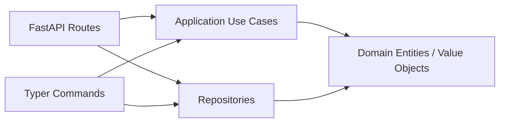

## Overview

A minimal text chat app implemented with **clean architecture**. The same
business logic (`application/use_cases.py`, `domain/entities.py`) is shared
between two entry points - a Typer CLI and a FastAPI Web API - so the
boundaries between layers stay visible.



## TL;DR (60-second tour, in-memory)

The default `memory` backend needs no setup. **Data is lost on restart**, so use it only for the first smoke test.

```bash
# 1. Boot the API (in-memory backend by default)
uv run chat-web

# 2. Open Swagger UI
open http://localhost:8080/docs

# 3. Create a conversation + post one message from CLI
uv run chat-cli conversation create --title "general" --display-name "alice"
uv run chat-cli message post <conversation_id> --content "hello" --display-name "alice"
```

## Choose a persistence backend

All Chat configuration is centralised in `concierge.settings.ChatSettings`,
which reads `CHAT_REPOSITORY_BACKEND` and table-name overrides from the
environment (or `.env`).

| `CHAT_REPOSITORY_BACKEND` | Enum member | When to use it | Schema init |
|---|---|---|---|
| `memory` (default) | `ChatRepositoryBackend.MEMORY` | First read-through; data is lost on restart | Not needed |
| `postgres` | `ChatRepositoryBackend.POSTGRES` | Local Docker Compose PostgreSQL (`POSTGRES_*` variables) | **Required** (see below) |
| `azure-postgres` | `ChatRepositoryBackend.AZURE_POSTGRES` | Azure Database for PostgreSQL Flexible Server (`AZURE_*` variables) | **Required** (see below) |

!!! warning "Run `chat-cli db init` before starting `postgres` / `azure-postgres`"
    Switching the backend alone does not create the chat tables
    (`chat_conversations`, `chat_participants`, `chat_messages`). If you skip
    initialisation, the first message you POST through `chat-web` fails with
    `relation "chat_conversations" does not exist`.

### Setup workflow (any SQL backend)

```bash
# 1. Pick a backend in .env (example: local Postgres)
echo "CHAT_REPOSITORY_BACKEND=postgres" >> .env

# 2. Sanity-check connectivity (optional but recommended)
uv run chat-cli db ping

# 3. Create the tables (idempotent: CREATE TABLE IF NOT EXISTS)
uv run chat-cli db init

# 4. Boot the API / CLI
uv run chat-web
```

Related commands:

| Command | Description |
|---|---|
| `uv run chat-cli db ping` | Connectivity check (`SELECT 1`) |
| `uv run chat-cli db init` | Create chat tables (idempotent) |
| `uv run chat-cli db drop --yes` | Drop chat tables (destructive) |

### PostgreSQL Quickstart (Docker Compose)

Uses the `POSTGRES_*` values from [.env.template](https://github.com/ks6088ts-labs/concierge/blob/main/.env.template) against the Postgres service in `compose.yml`.

```bash
docker compose up -d postgres
echo "CHAT_REPOSITORY_BACKEND=postgres" >> .env
uv run chat-cli db ping
uv run chat-cli db init   # only once
uv run chat-web
```

### Azure Database for PostgreSQL Quickstart

Set `AZURE_DBHOST` / `AZURE_DBNAME` / `AZURE_DBUSER` (Entra principal name) in
`.env`, then:

```bash
echo "CHAT_REPOSITORY_BACKEND=azure-postgres" >> .env
uv run chat-cli db ping
uv run chat-cli db init   # only once
uv run chat-web
```

With Entra ID auth (`AZURE_USE_ENTRA_AUTH=true`), make sure
`DefaultAzureCredential` can resolve a token beforehand (for example via
`az login`).

## Troubleshooting

### `relation "chat_conversations" does not exist`

**Cause**: Backend switched to `postgres` / `azure-postgres` but the chat
tables have not been created yet.

**Fix**:

```bash
uv run chat-cli db ping   # confirm connectivity
uv run chat-cli db init   # create tables
```

You do not need to restart `chat-web` afterwards; subsequent requests succeed.

### `AZURE_DBUSER must be set ...` / `AZURE_DBHOST and AZURE_DBNAME must be set`

Required environment variables for the `azure-postgres` backend are missing.
Fill in the `AZURE_*` section of
[.env.template](https://github.com/ks6088ts-labs/concierge/blob/main/.env.template)
into your `.env`.
