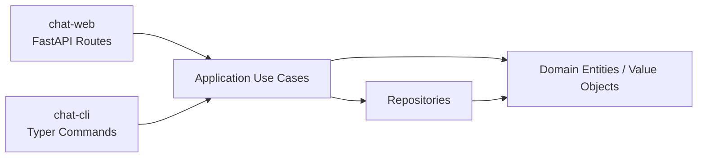
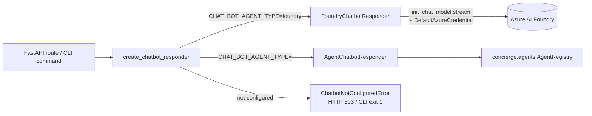

## What is this?

A minimal text chat app with two entry points that share the **same**
business logic. Use whichever feels natural and switch persistence backends
without touching the use cases.

| Entry point | What it is | Use it when |
|---|---|---|
| **`chat-web`** | FastAPI server on `:8080` with REST + a built-in browser UI | You want Swagger UI, curl, or the bundled web client |
| **`chat-cli`** | Typer CLI (`conversation`, `message`, `db`, `realtime` sub-commands) | You want JSON output for scripts or quick local checks |

Both call into the same `concierge.chat.application.use_cases` module, so
features added in either surface show up in both.



Where to go next:

- **Just trying it out?** → [5-minute smoke test](#5-minute-smoke-test-rest-only) below.
- **REST reference** → [REST API Reference](api.md).
- **CLI reference** → [CLI Reference](cli.md).
- **Realtime voice** → [Realtime voice (optional)](#realtime-voice-optional) below.

---

## 5-minute smoke test (REST-only)

This path needs **no Azure account, no Docker, no `.env` editing**. It uses
the default `memory` backend, which keeps data in process memory for as long
as `chat-web` is running.

!!! warning "The `memory` backend is per-process"
    Conversations created by `chat-web` are **not visible** to `chat-cli`
    (they run as separate processes). For an end-to-end smoke test, stick
    to one surface at a time — REST in this section, CLI in
    [its own section](#cli-only-smoke-test). For a CLI ↔ Web shared view,
    switch to the `postgres` backend.

### 1. Start the API

```bash
uv run chat-web
# → Uvicorn running on http://0.0.0.0:8080
```

### 2. Open Swagger UI

```bash
open http://localhost:8080/docs
```

Or browse to the bundled chat UI at <http://localhost:8080/>.

### 3. Drive it with curl

Copy-paste these lines into a second terminal. They run **against the same
`chat-web` process**, so the in-memory data survives between calls.

```bash
# A stable user identity for this session.
export USER_ID=$(python -c 'import uuid; print(uuid.uuid4())')

# Create a conversation, capture its id.
CONV_ID=$(curl -s -X POST http://localhost:8080/conversations \
  -H "X-User-Id: ${USER_ID}" \
  -H 'content-type: application/json' \
  -d '{"title":"smoke-test","display_name":"alice"}' \
  | python -c 'import json,sys; print(json.load(sys.stdin)["id"])')
echo "CONV_ID=$CONV_ID"

# Post a message.
curl -s -X POST "http://localhost:8080/conversations/${CONV_ID}/messages" \
  -H "X-User-Id: ${USER_ID}" \
  -H 'content-type: application/json' \
  -d '{"content":"hello from curl","display_name":"alice"}'

# List messages.
curl -s "http://localhost:8080/conversations/${CONV_ID}/messages"
```

Expected: `201 Created` on the first two calls and a JSON array containing
your message on the last. If you also get `503 Service Unavailable` on
`/agent-replies`, that is **expected** until `AZURE_AI_PROJECT_ENDPOINT` is
configured — see
[AI chatbot replies (optional)](#ai-chatbot-replies-optional) to turn it on.

---

## Voice Input (Speech-to-Text)

The bundled web UI at <http://localhost:8080/> supports voice input through
the browser Web Speech API.

### How to use

1. Create/select a conversation so the message composer is enabled.
2. Click the microphone button (`🎤`) next to the send button.
3. Speak; interim and final recognition text is appended in the message box.
4. Click the button again (`⏹`) to stop recognition.
5. Send manually with the existing send button (or `Shift+Enter`).

Voice input never auto-sends messages. Only text is sent when you explicitly
submit.

### Browser support

- Supported: latest Google Chrome, Microsoft Edge, Safari (macOS / iOS)
- Not supported: Firefox (Web Speech API is not available by default)
- On unsupported browsers, the microphone button is disabled and a warning
  toast is shown in the UI.

### Privacy notes

- Microphone permission is handled by the browser prompt.
- Speech recognition may be processed by the browser vendor cloud service
  (for example, Chrome/Edge implementations).
- The concierge backend does **not** receive raw audio. It only receives text
  if/when you send the message through the existing API flow.

---

## Voice Output (Text-to-Speech)

The bundled web UI at <http://localhost:8080/> supports text-to-speech for
**AGENT** messages through the browser Web Speech API.

### How to use

1. Receive an AGENT message in the conversation view.
2. Click the speaker button (`🔊`) on the message bubble.
3. While speaking, the same button switches to stop (`■`).
4. Click `■` to stop immediately, or click `🔊` on another AGENT message to
   switch playback.

### Browser support

- Supported: latest Google Chrome and Microsoft Edge (Chromium-based)
- Not supported by default: Firefox (Web Speech API speech synthesis may be
  unavailable)
- On unsupported browsers, the speaker button is not rendered.

### Privacy notes

- Speech synthesis may be processed by the browser vendor cloud service,
  depending on browser implementation and selected voice.
- The concierge backend does **not** send message text to any new TTS API.
  Playback uses text already present in the browser.

---

## CLI-only smoke test

The CLI works the same way, but each invocation is its own process. For the
`memory` backend that means: never chain `create` and `post` calls across
two `uv run chat-cli ...` invocations. Two options work:

1. **Use the `postgres` backend** (recommended for multi-step CLI flows).
   Then every command sees the same database. See
   [PostgreSQL Quickstart](#postgresql-quickstart-docker-compose).
2. **Use the REST API** for any multi-step user-side flow, and use the CLI
   only for one-shot operations (`db init`, `db ping`, `conversation list`,
   etc.).

For a single-process sanity check that always works, just inspect the help:

```bash
uv run chat-cli --help
uv run chat-cli conversation --help
uv run chat-cli message --help
uv run chat-cli db --help
```

A full CLI walkthrough lives in the [CLI Reference](cli.md#full-walkthrough-with-the-postgres-backend).

---

## Choose a persistence backend

All Chat configuration is centralised in `concierge.settings.ChatSettings`,
which reads `CHAT_REPOSITORY_BACKEND` and table-name overrides from the
environment (or `.env`).

| `CHAT_REPOSITORY_BACKEND` | Enum member | When to use it | Schema init |
|---|---|---|---|
| `memory` (default) | `ChatRepositoryBackend.MEMORY` | Fastest read-through; data is lost on restart **and not shared between processes** | Not needed |
| `postgres` | `ChatRepositoryBackend.POSTGRES` | Local Docker Compose PostgreSQL (`POSTGRES_*` variables) | **Required** (see below) |
| `azure-postgres` | `ChatRepositoryBackend.AZURE_POSTGRES` | Azure Database for PostgreSQL Flexible Server (`AZURE_*` variables) | **Required** (see below) |

!!! warning "Run `chat-cli db init` before starting `postgres` / `azure-postgres`"
    Switching the backend alone does not create the chat tables
    (`chat_conversations`, `chat_participants`, `chat_messages`). If you skip
    initialisation, the first message you POST through `chat-web` fails with
    `relation "chat_conversations" does not exist`.

### Setup workflow (any SQL backend)

```bash
# 1. Pick a backend in .env (example: local Postgres).
echo "CHAT_REPOSITORY_BACKEND=postgres" >> .env

# 2. Sanity-check connectivity.
uv run chat-cli db ping
# → Connection OK.

# 3. Create the tables (idempotent: CREATE TABLE IF NOT EXISTS).
uv run chat-cli db init
# → Database schema initialised successfully.

# 4. Boot the API / CLI.
uv run chat-web
```

Related commands:

| Command | Description |
|---|---|
| `uv run chat-cli db ping` | Connectivity check (`SELECT 1`) |
| `uv run chat-cli db init` | Create chat tables (idempotent) |
| `uv run chat-cli db drop --yes` | Drop chat tables (destructive) |

### PostgreSQL Quickstart (Docker Compose)

Uses the `POSTGRES_*` values from
[`.env.template`](https://github.com/ks6088ts-labs/concierge/blob/main/.env.template)
against the Postgres service in `compose.yml`.

```bash
docker compose up -d postgres
echo "CHAT_REPOSITORY_BACKEND=postgres" >> .env
uv run chat-cli db ping
uv run chat-cli db init   # only once
uv run chat-web
```

### Azure Database for PostgreSQL Quickstart

Set `AZURE_DBHOST` / `AZURE_DBNAME` / `AZURE_DBUSER` (Entra principal name)
in `.env`, then:

```bash
echo "CHAT_REPOSITORY_BACKEND=azure-postgres" >> .env
uv run chat-cli db ping
uv run chat-cli db init   # only once
uv run chat-web
```

With Entra ID auth (`AZURE_USE_ENTRA_AUTH=true`), make sure
`DefaultAzureCredential` can resolve a token beforehand (for example via
`az login`).

---

## AI chatbot replies (optional)

The Chat app can call **Microsoft Foundry** through LangChain so an agent
participant replies inside a conversation. The wiring lives in
[`concierge/chat/infrastructure/ai/`](https://github.com/ks6088ts-labs/concierge/tree/main/concierge/chat/infrastructure/ai):

- `application/responders.py` — defines the `ChatbotResponder` protocol
  (`stream_reply` yields token-sized strings).
- `infrastructure/ai/foundry_responder.py` — implements it with
  `langchain.chat_models.init_chat_model` + `DefaultAzureCredential`,
  consuming `chat_model.stream(...)`.
- `infrastructure/ai/agent_responder.py` — implements it via the shared
  `concierge.agents` registry (LLM-optional path).
- `infrastructure/ai/factory.py` — single read-side for settings; raises
  `ChatbotNotConfiguredError` when the backend is not properly configured.



`create_chatbot_responder()` selects the responder via `CHAT_BOT_AGENT_TYPE`
(default `foundry`). For `foundry`, `AZURE_AI_PROJECT_ENDPOINT` must be set;
otherwise `ChatbotNotConfiguredError` is raised (HTTP 503 / exit 1). Any other
value (e.g. `echo`, `langgraph`, `github-copilot-sdk`, `microsoft-agent-framework`) is resolved from
the shared `AgentRegistry`.

For external-knowledge retrieval in text chat (`/agent-replies`), use an
AgentRegistry-backed responder (for example `CHAT_BOT_AGENT_TYPE=langgraph`):
that path can execute knowledge tools. The default `foundry` responder remains
a plain chat-completion path without tool-calling.

### Settings reference

All chatbot settings are part of `ChatSettings` (prefix `CHAT_`).

| Variable | Default | Description |
|---|---|---|
| `CHAT_BOT_MODEL` | `azure_ai:gpt-5` | Model identifier passed to `init_chat_model` |
| `CHAT_BOT_SYSTEM_PROMPT` | `あなたは Concierge Chat のアシスタントです。日本語で簡潔に応答してください。` | System message prepended to every reply |
| `CHAT_BOT_DISPLAY_NAME` | `Concierge AI` | Display name shown for the agent participant |
| `CHAT_BOT_PARTICIPANT_ID` | `00000000-0000-0000-0000-000000000001` | Stable UUID for the agent participant |
| `CHAT_BOT_HISTORY_LIMIT` | `20` | Maximum number of past messages forwarded as context |
| `AZURE_AI_PROJECT_ENDPOINT` | unset | Required when `CHAT_BOT_AGENT_TYPE=foundry` |
| `CHAT_BOT_AGENT_TYPE` | `foundry` | Responder selector: `foundry` (default, streaming) or a registered agent type (`echo`, `langgraph`, `github-copilot-sdk`, `microsoft-agent-framework`) |

> **Note:** The previous `CHAT_RESPONDER_BACKEND` variable has been removed.
> If it is still present in your `.env`, it is silently ignored and a
> `DeprecationWarning` is emitted at startup.

### Enable the chatbot (Foundry backend)

```bash
# 1. Configure the Foundry endpoint.
echo "AZURE_AI_PROJECT_ENDPOINT=https://<resource>.services.ai.azure.com/api/projects/<project>" >> .env

# 2. Make sure DefaultAzureCredential can issue a token.
az login

# 3. Boot the API.
uv run chat-web
```

### Agent-backed responder (LLM-optional)

Use the `echo` agent for a quick smoke-test without Azure credentials:

```bash
export CHAT_BOT_AGENT_TYPE=echo
uv run chat-web
```

For the LangGraph echo agent (requires `AZURE_AI_PROJECT_ENDPOINT`):

```bash
export CHAT_BOT_AGENT_TYPE=langgraph
export AGENTS_LANGGRAPH_MODEL=azure_ai:gpt-5
az login
uv run chat-web
```

See [Shared Agent Runtime](../agents/index.md) for more details on available agents
and configuration.

### Sharing an image with a text-chat agent { #text-chat-image-input }

The same camera capture overlay used by the realtime voice call is also
available in **text chat**. When a conversation is selected, the **📷 camera
button** appears at the left of the composer input row (next to the textarea and
the 🎤 voice-input button); capturing a frame attaches it to the composer
(a thumbnail chip appears). Type your question and send — the image rides the
next agent reply as an inline `data:image/*;base64,…` URL.

The image is delivered on the optional JSON body of
`POST /conversations/{id}/agent-replies` (see
[Optional image input](api.md#agent-reply-image-input)) and threaded to the
selected agent as `payload.image_url`:

- **`langgraph`** builds a multimodal user turn (text + image) so a vision
  capable Azure OpenAI model grounds its reply in the image. Select it from the
  **🧠 エージェント** dropdown (or `CHAT_BOT_AGENT_TYPE=langgraph`).
- **`echo`** acknowledges receipt (`🖼️（画像を受信しました）`) — a quick way to
  verify the end-to-end contract without a vision model.
- The default **`foundry`** responder and the other SDK agents accept the
  contract but ignore the image for now; wiring their vision support is an
  incremental follow-up.

!!! note "Images are session-scoped (not persisted)"
    As with the realtime voice call, a shared image is **never written to the
    message repository**. It is rendered locally for the rest of the session and
    passed to a single agent reply, then discarded. Sharing an image is treated
    as an explicit request for a response, so a reply is generated on send even
    when 🤖 auto-reply is off. Attaching an image still requires a typed
    question so the agent has a user turn to answer.

### API design

- `POST /conversations/{id}/messages` — **persists the user message only**.
  It never triggers a bot reply, so clients can rely on a deterministic
  response and decide independently whether to request an agent answer.
- `POST /conversations/{id}/agent-replies` — streams the agent reply via
  Server-Sent Events (`text/event-stream`). Emits `delta` events with
  partial tokens followed by a single `complete` event carrying the persisted
  `AGENT` message. Returns HTTP 503 (or CLI exit code 1) when
  the chatbot is not configured.
- The CLI mirrors the same split: `message post` saves only, `message reply`
  streams the response.

---

## Verification checklist

A copy-paste sequence you can run after any change to confirm both surfaces
still work. Pick the matching backend section.

### A. `memory` backend (REST only)

In **one terminal**:

```bash
# Force memory mode for this run (overrides .env).
CHAT_REPOSITORY_BACKEND=memory uv run chat-web
```

In **another terminal**:

```bash
curl -s http://localhost:8080/healthz
# → {"status":"ok"}

export USER_ID=$(python -c 'import uuid; print(uuid.uuid4())')
CONV_ID=$(curl -s -X POST http://localhost:8080/conversations \
  -H "X-User-Id: ${USER_ID}" -H 'content-type: application/json' \
  -d '{"title":"smoke","display_name":"alice"}' \
  | python -c 'import json,sys; print(json.load(sys.stdin)["id"])')
echo "CONV_ID=$CONV_ID"

curl -s -X POST "http://localhost:8080/conversations/${CONV_ID}/messages" \
  -H "X-User-Id: ${USER_ID}" -H 'content-type: application/json' \
  -d '{"content":"hello","display_name":"alice"}'

curl -s "http://localhost:8080/conversations/${CONV_ID}/messages"

# Expected when the Foundry endpoint is unset.
curl -s -o /dev/null -w "agent-replies → HTTP %{http_code}\n" \
  -X POST "http://localhost:8080/conversations/${CONV_ID}/agent-replies" \
  -H "X-User-Id: ${USER_ID}"
# → agent-replies → HTTP 503
```

Pass criteria:

- `healthz` returns `{"status":"ok"}`.
- The two POSTs return JSON with `role` `USER`.
- `GET .../messages` returns a list containing the message.
- `agent-replies` returns HTTP 503 (or 200 + SSE stream when the Foundry
  endpoint is configured).

### B. `postgres` backend (REST ↔ CLI shared)

```bash
docker compose up -d postgres
echo "CHAT_REPOSITORY_BACKEND=postgres" >> .env

uv run chat-cli db ping
uv run chat-cli db init

# Boot the server in the background, then run the CLI in the same shell.
uv run chat-web &
SERVER_PID=$!
sleep 2

# CLI sees the same database the server uses.
RESPONSE=$(uv run chat-cli conversation create --title "shared" --display-name "alice")
echo "$RESPONSE"
CONV_ID=$(echo "$RESPONSE" | python -c 'import json,sys; print(json.load(sys.stdin)["id"])')

curl -s "http://localhost:8080/conversations/${CONV_ID}"
# → shows the same conversation

uv run chat-cli message post "$CONV_ID" --content "hi" --display-name "alice"
uv run chat-cli message list "$CONV_ID"

kill $SERVER_PID
```

Pass criteria:

- `db ping` prints `Connection OK.`.
- `db init` prints `Database schema initialised successfully.`.
- `GET /conversations/{id}` returns the conversation that the CLI created.
- `message list` shows the message that was posted via CLI.

### C. Chatbot (Foundry) enabled

```bash
# Prerequisites: AZURE_AI_PROJECT_ENDPOINT set, az login completed.

uv run chat-web &
SERVER_PID=$!
sleep 2

export USER_ID=$(python -c 'import uuid; print(uuid.uuid4())')
CONV_ID=$(curl -s -X POST http://localhost:8080/conversations \
  -H "X-User-Id: ${USER_ID}" -H 'content-type: application/json' \
  -d '{"title":"ai","display_name":"alice"}' \
  | python -c 'import json,sys; print(json.load(sys.stdin)["id"])')

# 1. Persist the user message (no reply triggered).
curl -s -X POST "http://localhost:8080/conversations/${CONV_ID}/messages" \
  -H "X-User-Id: ${USER_ID}" -H 'content-type: application/json' \
  -d '{"content":"自己紹介して","display_name":"alice"}'

# 2. Stream the agent reply via SSE.
curl -N -s -X POST "http://localhost:8080/conversations/${CONV_ID}/agent-replies" \
  -H "X-User-Id: ${USER_ID}"

# 3. Confirm the persisted AGENT message is in the conversation.
curl -s "http://localhost:8080/conversations/${CONV_ID}/messages"

kill $SERVER_PID
```

Pass criteria: step 2 streams `event: delta` / `event: complete` frames, and
step 3 returns two messages — yours with `role: USER` and the bot reply with
`role: AGENT` and `display_name: Concierge AI`.

---

## Realtime voice (optional) { #realtime-voice-optional }

The realtime voice feature adds a **bidirectional WebSocket proxy** between
the browser and Microsoft Foundry's GPT Realtime API. Audio is processed
server-side — Foundry credentials never leave the server. User and AI
transcripts are persisted as regular `Message` objects, so they appear in
`/conversations/{id}/messages` alongside text-chat messages.

```
Browser ⇄ FastAPI (chat-web) ⇄ Foundry /openai/v1/realtime
```

### Quick start

```bash
# 1. Configure the realtime endpoint in .env (see the settings table below).
echo "AZURE_AI_PROJECT_ENDPOINT_REALTIME=https://<resource>.openai.azure.com/" >> .env

# 2. Confirm the configuration is picked up (no live call).
uv run chat-cli realtime status
# → ステータス: ✅ 設定済み

# 3. Start the API server.
uv run chat-web
```

Then open <http://localhost:8080/> in a recent Chromium / Firefox / Safari
browser, create a conversation from the sidebar, and click
**🎙 通話開始 (Start call)** in the composer. Microphone permission is requested
on the first call. The legacy URL <http://localhost:8080/realtime> now
returns a `301` redirect to `/`, so existing bookmarks keep working.

The call button appears only when the server reports `{"realtime": true}`
from [`GET /capabilities`](api.md#realtime-voice-websocket). When
`AZURE_AI_PROJECT_ENDPOINT_REALTIME` is empty the call button is hidden and
text chat continues to work normally.

!!! tip "Region note"
    Use a Foundry resource in a region that supports the GPT Realtime model
    (for example `swedencentral` or `eastus2`). This is typically **different**
    from the region used for standard text chat, so a separate endpoint
    variable is provided. Reference:
    [Use the GPT Realtime API via WebSockets (Microsoft Learn)](https://learn.microsoft.com/en-us/azure/foundry/openai/how-to/realtime-audio-websockets?tabs=ga).

### How the UI pipeline works

1. `getUserMedia({ audio: true })` requests microphone permission.
2. An `AudioWorklet` resamples to 24 kHz mono PCM16 (the value of
   `CHAT_REALTIME_AUDIO_SAMPLE_RATE_HZ`) in 200 ms chunks.
3. Each chunk is base64-encoded and sent over the WebSocket as
   `{"type":"oai-event","payload":{"type":"input_audio_buffer.append","audio":"<b64>"}}`.
4. Foundry-emitted `response.output_audio.delta` events are decoded back to
   PCM16 and played through a queued `AudioBufferSource` graph. The partial
   transcript (`response.output_audio_transcript.delta`) streams into the
   interim line (prefixed `🤖`) until the final message is persisted.
5. The user's own speech is shown in the same interim line, prefixed `🗣️`,
   from `conversation.item.input_audio_transcription.delta` / `.completed`
   events. This requires `CHAT_REALTIME_TRANSCRIPTION_MODEL` to be set; when
   it is empty Foundry does not transcribe the user's audio, so no input text
   appears (assistant speech still works).

The text composer is locked while a call is active to avoid input-mode
conflicts. The conversation list, message log, and `localStorage` profile
(`chat_user_id` / `chat_display_name`) are shared between text chat and
voice calls. Legacy keys `chat_rt_user_id` / `chat_rt_display_name` from
the previous standalone realtime UI are migrated automatically on first
load.

### Seeing your own recognized speech (input transcription) { #realtime-input-transcription }

By default a realtime call shows only the **assistant's** words in the interim
line (prefixed `🤖`). Your own speech is still streamed to Foundry as audio and
the model replies correctly, but the text of what *you* said is not shown —
Foundry transcribes the user's microphone audio only when you explicitly enable
an input-transcription model. Enable it to make your recognized speech appear
live in the interim line (prefixed `🗣️`) and to have the final text saved as a
USER message in the conversation log.

#### How to enable

1. **Deploy a transcription model** in the **same** Foundry resource as
   `AZURE_AI_PROJECT_ENDPOINT_REALTIME` (the realtime resource — not necessarily
   the one used for text chat). Suitable models include `gpt-4o-mini-transcribe`,
   `gpt-4o-transcribe`, and `whisper`.
2. **Set the deployment name** (not the bare OpenAI model id) in `.env`:

   ```bash
   CHAT_REALTIME_TRANSCRIPTION_MODEL=gpt-4o-mini-transcribe
   ```

3. Restart `chat-web` and start a new call. As you speak, the recognized text
   streams into the interim line; when you finish, it is persisted as a USER
   `Message` and appears in the conversation alongside the assistant's reply.

#### What happens under the hood

When `CHAT_REALTIME_TRANSCRIPTION_MODEL` is non-empty, the server adds a
`transcription` block to the `audio.input` section of `session.update`, using
the deployment name as `model` and the ISO-639-1 primary subtag of
`CHAT_REALTIME_LOCALE` as `language` (so `ja-JP` becomes `ja`). Foundry then
emits two server events that the web UI consumes:

- `conversation.item.input_audio_transcription.delta` — partial user transcript,
  streamed into the `🗣️` interim line as you speak (some models skip deltas and
  send only the final result).
- `conversation.item.input_audio_transcription.completed` — final user
  transcript. The server persists it as a USER `Message`, which replaces the
  interim line with a real message bubble on the next reload.

!!! warning "Use a deployment name, not the OpenAI model id"
    On Azure the `model` field must be the name of a deployment in the same
    resource. The OpenAI model id `gpt-4o-mini-transcribe` does **not**
    correspond to a deployment in most resources, so the default is left empty
    to avoid a silent failure (no transcript and no error). If you set this and
    no input text appears, confirm that a deployment with exactly that name
    exists in the realtime Foundry resource and that the signed-in principal can
    use it.

### Sharing a photo during a call { #realtime-image-input }

While a call is active the **📷 camera button** in the composer input row stays
active (the rest of the composer is locked during a call). It is designed for
phones: tapping it opens an in-app live
viewfinder (no context switch to the OS camera app) with a shutter, a
front/back toggle, and cancel. After capturing, you confirm or retake; on
send the frame is downscaled to a 1024 px JPEG and delivered over the same
WebSocket as a `concierge.image.input` control frame.

The server injects it into the live session as a `conversation.item.create`
`input_image` item, so the model can ground its next spoken turn in what you
showed — just snap the photo, then ask *"これ何に見える？"*. No reply is
forced on send, which keeps turn-taking natural. The captured image is shown
inline in the message log for the rest of the session.

!!! note "Images are session-scoped (not persisted)"
    Shared images are injected into the live conversation and rendered
    locally, but they are **not** written to the message repository, so they
    disappear on a full page reload. The assistant's spoken answer about the
    image is still persisted as a normal AGENT transcript. Persisting images
    (blob storage + `Message` attachments) is a deliberate future extension —
    the server-side seam for it is `StreamRealtimeVoiceUseCase.send_image`.

### Browser support

The UI relies on `AudioWorklet`, `WebSocket`, `MediaDevices.getUserMedia`,
and `crypto.randomUUID`. Recent Chrome, Edge, Firefox, and Safari all work.
Safari requires the **通話開始** click before the `AudioContext` can start
producing audio.

### Settings reference

All realtime settings use the `CHAT_` prefix (full schema in
`ChatSettings`).

| Variable | Default | Description |
|---|---|---|
| `AZURE_AI_PROJECT_ENDPOINT_REALTIME` | `""` (disabled) | Foundry endpoint for the realtime model. Accepts both `https://<r>.openai.azure.com/` and `https://<r>.services.ai.azure.com/` (auto-normalised). When empty the realtime WebSocket closes with code `4503`. |
| `CHAT_REALTIME_MODEL` | `gpt-realtime-1.5` | Realtime model deployment name |
| `CHAT_REALTIME_VOICE` | `alloy` | Voice id: `alloy` / `ash` / `ballad` / `coral` / `echo` / `sage` / `shimmer` / `verse` |
| `CHAT_REALTIME_LOCALE` | `ja-JP` | Transcription locale. BCP-47 values like `ja-JP` are reduced to the ISO-639-1 primary subtag (`ja`) when forwarded to Foundry. |
| `CHAT_REALTIME_SYSTEM_PROMPT` | Japanese default prompt | System message for the realtime session |
| `CHAT_REALTIME_AUDIO_SAMPLE_RATE_HZ` | `24000` | PCM16 sample rate (Foundry fixed value) |
| `CHAT_REALTIME_MAX_SESSION_SECONDS` | `600` | Server-side session timeout in seconds |
| `CHAT_REALTIME_TRANSCRIPTION_MODEL` | `""` | Azure deployment name for input-audio transcription. When empty the `transcription` block is omitted from `session.update` and your spoken input is neither shown nor saved. See [Seeing your own recognized speech](#realtime-input-transcription). |
| `CHAT_REALTIME_TURN_DETECTION_TYPE` | `server_vad` | How the model decides the user finished a turn: `server_vad` (silence-based), `semantic_vad` (decides from sentence meaning; much less likely to interrupt), or `none` (push-to-talk; client commits the buffer and sends `response.create`). |
| `CHAT_REALTIME_VAD_THRESHOLD` | `0.5` | `server_vad` activation threshold (0.0-1.0). Higher needs louder speech, better in noisy rooms. |
| `CHAT_REALTIME_VAD_PREFIX_PADDING_MS` | `300` | `server_vad` audio (ms) retained before detected speech start. |
| `CHAT_REALTIME_VAD_SILENCE_DURATION_MS` | `700` | `server_vad` silence (ms) required before the turn ends. Raised above the API default so brief pauses don't trigger a reply; increase further if the model still cuts in. |
| `CHAT_REALTIME_VAD_EAGERNESS` | `low` | `semantic_vad` eagerness: `low` / `medium` / `high` / `auto`. `low` lets the user finish before the model responds. |
| `CHAT_REALTIME_VAD_CREATE_RESPONSE` | `true` | Auto-generate a response when a turn ends. `false` requires an explicit `response.create`. |
| `CHAT_REALTIME_VAD_INTERRUPT_RESPONSE` | `true` | Whether new user speech interrupts (barges in on) an in-progress response. |

#### Stopping the AI from interrupting you { #realtime-turn-detection-tuning }

If the assistant starts talking the moment you pause — before you've finished
your thought — the turn-detection (VAD) settings above are the fix. The model
is taking its turn too eagerly. Two recommended approaches:

- **Semantic VAD (recommended).** Set `CHAT_REALTIME_TURN_DETECTION_TYPE=semantic_vad`
  and `CHAT_REALTIME_VAD_EAGERNESS=low`. The model decides you've finished based
  on sentence meaning rather than raw silence, so mid-sentence pauses no longer
  trigger a response.
- **Tune server VAD.** Keep `server_vad` and raise
  `CHAT_REALTIME_VAD_SILENCE_DURATION_MS` (e.g. `1000`-`1200`) so a longer pause
  is required before the model replies. Raise `CHAT_REALTIME_VAD_THRESHOLD`
  (e.g. `0.6`) if background noise is triggering false speech detection.

For full manual control (push-to-talk), set
`CHAT_REALTIME_TURN_DETECTION_TYPE=none`; the client must then send
`input_audio_buffer.commit` and `response.create` itself.

### Tool calling (function calling) { #realtime-tool-calling }

The realtime session is wired as a tool-using AI agent: the model can call
server-side Python functions mid-conversation and continue speaking with the
result in context. This follows the
[OpenAI Realtime function-calling contract](https://learn.microsoft.com/en-us/azure/ai-foundry/openai/realtime-audio-reference)
(also used by Foundry's GA endpoint):

1. `session.update` advertises the available tools under `session.tools`
   (`tool_choice: "auto"`).
2. When the model decides to call a tool it emits a `function_call` item,
   surfaced as a `response.output_item.done` server event.
3. The server runs the tool locally and replies with a
   `conversation.item.create` event carrying a `function_call_output` item.
4. A `response.create` event asks the model to continue with the tool result.

All of this happens server-side inside `StreamRealtimeVoiceUseCase`; the
browser only hears the spoken answer (no front-end changes are required).

#### Built-in tools

| Tool | Description |
|---|---|
| `get_current_time` | Returns the current date/time, optionally for a given IANA timezone (e.g. `Asia/Tokyo`). |
| `echo` | Echoes text back (useful for smoke-testing tool calling). |
| `read_file` / `list_directory` / `file_search` | Read-only sandbox file tools shared with `concierge.agents`. |
| `<AGENTS_KNOWLEDGE__TOOLS names>` (optional) | Knowledge-retrieval tools backed by PostgreSQL/pgvector, loaded from `AGENTS_KNOWLEDGE__...` settings. |

Enable a knowledge tool in `.env`:

```bash
AGENTS_KNOWLEDGE__TOOLS=search_docs
AGENTS_KNOWLEDGE__SEARCH_DOCS__COLLECTION=knowledge_default
AGENTS_KNOWLEDGE__SEARCH_DOCS__DESCRIPTION="Search the docs knowledge base"
```

#### Adding a new tool

Tools live in a single registry,
[`concierge/chat/application/realtime_tools.py`](https://github.com/ks6088ts-labs/concierge/blob/main/concierge/chat/application/realtime_tools.py).
Each tool bundles its JSON schema and its Python handler in one `RealtimeTool`,
so the responder (which needs the schema) and the use case (which runs the
handler) share a single source of truth. To add a capability, append a new
entry to `build_default_realtime_tools()`:

```python
from concierge.chat.application.realtime_tools import RealtimeTool

RealtimeTool(
    name="get_weather",
    description="Get the current weather for a city. Use when the user asks about weather.",
    parameters={
        "type": "object",
        "properties": {
            "city": {"type": "string", "description": "City name, e.g. 'Tokyo'."},
        },
        "required": ["city"],
    },
    handler=lambda args: fetch_weather(args["city"]),  # returns a str (JSON recommended)
)
```

Guidelines:

- The `handler` signature is `dict -> str`. Return a JSON string when possible;
  the value is sent back to the model verbatim as `function_call_output`.
- Keep handlers fast and synchronous — they run on the relay thread between
  audio turns. Offload slow I/O or wrap it with a short timeout.
- Handler exceptions are caught and returned to the model as
  `{"error": "..."}`, so a failing tool degrades gracefully instead of
  dropping the call.
- No env var or restart wiring is needed beyond editing the registry:
  `create_realtime_responder()` and the WebSocket route both pull from
  `build_default_realtime_tools()` automatically.

#### Minimal end-to-end check

```bash
# 1. Configure + verify the realtime endpoint (see Quick start above).
uv run chat-cli realtime status   # → ステータス: ✅ 設定済み

# 2. Start the server and open http://localhost:8080/.
uv run chat-web

# 3. Start a call and ask a question that triggers a tool, e.g.
#    「今何時?」(What time is it?) → the model calls get_current_time and
#    answers with the real time. Server logs show:
#       INFO Executed realtime tool name=get_current_time call_id=...
```

Unit tests for the flow (tool execution, unknown-tool error output, and the
no-tools fall-through) live in
[`tests/chat/test_realtime_use_case.py`](https://github.com/ks6088ts-labs/concierge/blob/main/tests/chat/test_realtime_use_case.py)
and run without any live Foundry call:

```bash
uv run pytest tests/chat/test_realtime_use_case.py -o addopts=""
```

### Where to look next

- WebSocket wire protocol (events, close codes) → [REST API Reference → Realtime voice WebSocket](api.md#realtime-voice-websocket).
- Non-interactive sanity check → [`chat-cli realtime status`](cli.md#realtime-status).

---

## Troubleshooting

### `relation "chat_conversations" does not exist`

**Cause**: Backend switched to `postgres` / `azure-postgres` but the chat
tables have not been created yet.

**Fix**:

```bash
uv run chat-cli db ping   # confirm connectivity
uv run chat-cli db init   # create tables
```

You do not need to restart `chat-web` afterwards; subsequent requests
succeed.

### `Conversation not found: ...` between two CLI invocations

You are using the `memory` backend, which is **per-process**. Each `uv run
chat-cli ...` call starts a fresh interpreter with an empty store. Switch to
the `postgres` backend (`chat-cli db init` first) and rerun.

### `AZURE_DBUSER must be set ...` / `AZURE_DBHOST and AZURE_DBNAME must be set`

Required environment variables for the `azure-postgres` backend are missing.
Fill in the `AZURE_*` section of
[`.env.template`](https://github.com/ks6088ts-labs/concierge/blob/main/.env.template)
into your `.env`.

### `Chatbot is not configured` (HTTP 503) or CLI exits `1` on `message reply`

`create_chatbot_responder()` raised `ChatbotNotConfiguredError` because
`AZURE_AI_PROJECT_ENDPOINT` is empty. Set it and restart `chat-web`. The
`POST /messages` endpoint never triggers replies, so this error only ever
surfaces on `/agent-replies` (or `chat-cli message reply`).

### Foundry call fails with `ClientAuthenticationError` / `DefaultAzureCredential failed`

`FoundryChatbotResponder` builds the chat model with
`DefaultAzureCredential()`. Make sure your shell can issue a token (for
example via `az login`, a managed identity, or environment variables that the
credential chain accepts).

### Realtime WebSocket closes with `4503` / call button hidden

`AZURE_AI_PROJECT_ENDPOINT_REALTIME` is empty, so `GET /capabilities`
returns `{"realtime": false}` and the **通話開始** button is hidden. Set the
variable in `.env` and restart `chat-web`. Use
[`chat-cli realtime status`](cli.md#realtime-status) for a quick check
without opening a browser.

### Realtime WebSocket closes with `4404`

The `conversation_id` in the URL does not exist. Reselect or create a
conversation, then start the call again.

### Realtime WebSocket closes with `4400`

The `user_id` query parameter is missing or is not a valid UUID. Clear
`localStorage` (`chat_user_id`) in the browser DevTools and reload — the
page regenerates a UUID on next visit.

### Microphone permission denied (red banner in the UI)

The browser blocked microphone access. Allow microphone for
`localhost:8080` in the browser's site permissions (`chrome://settings/content/microphone`
in Chrome / Edge) and reload the tab.
