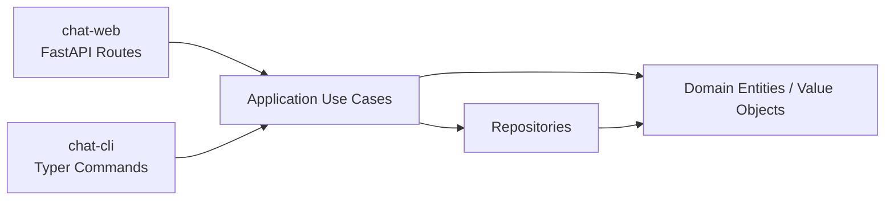
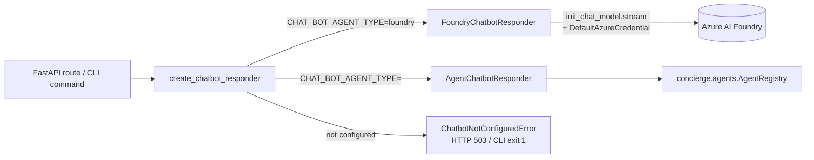

## What is this?

A minimal text chat app with two entry points that share the **same**
business logic. Use whichever feels natural and switch persistence backends
without touching the use cases.

| Entry point | What it is | Use it when |
|---|---|---|
| **`chat-web`** | FastAPI server on `:8080` with REST + a built-in browser UI | You want Swagger UI, curl, or the bundled web client |
| **`chat-cli`** | Typer CLI (`conversation`, `message`, `db`, `realtime` sub-commands) | You want JSON output for scripts or quick local checks |

Both call into the same `concierge.chat.application.use_cases` module, so
features added in either surface show up in both.



Where to go next:

- **Just trying it out?** → [5-minute smoke test](#5-minute-smoke-test-rest-only) below.
- **REST reference** → [REST API Reference](api.md).
- **CLI reference** → [CLI Reference](cli.md).
- **Realtime voice** → [Realtime Voice Chat](realtime.md).

---

## 5-minute smoke test (REST-only)

This path needs **no Azure account, no Docker, no `.env` editing**. It uses
the default `memory` backend, which keeps data in process memory for as long
as `chat-web` is running.

!!! warning "The `memory` backend is per-process"
    Conversations created by `chat-web` are **not visible** to `chat-cli`
    (they run as separate processes). For an end-to-end smoke test, stick
    to one surface at a time — REST in this section, CLI in
    [its own section](#cli-only-smoke-test). For a CLI ↔ Web shared view,
    switch to the `postgres` backend.

### 1. Start the API

```bash
uv run chat-web
# → Uvicorn running on http://0.0.0.0:8080
```

### 2. Open Swagger UI

```bash
open http://localhost:8080/docs
```

Or browse to the bundled chat UI at <http://localhost:8080/>.

### 3. Drive it with curl

Copy-paste these lines into a second terminal. They run **against the same
`chat-web` process**, so the in-memory data survives between calls.

```bash
# A stable user identity for this session.
export USER_ID=$(python -c 'import uuid; print(uuid.uuid4())')

# Create a conversation, capture its id.
CONV_ID=$(curl -s -X POST http://localhost:8080/conversations \
  -H "X-User-Id: ${USER_ID}" \
  -H 'content-type: application/json' \
  -d '{"title":"smoke-test","display_name":"alice"}' \
  | python -c 'import json,sys; print(json.load(sys.stdin)["id"])')
echo "CONV_ID=$CONV_ID"

# Post a message.
curl -s -X POST "http://localhost:8080/conversations/${CONV_ID}/messages" \
  -H "X-User-Id: ${USER_ID}" \
  -H 'content-type: application/json' \
  -d '{"content":"hello from curl","display_name":"alice"}'

# List messages.
curl -s "http://localhost:8080/conversations/${CONV_ID}/messages"
```

Expected: `201 Created` on the first two calls and a JSON array containing
your message on the last. If you also get `503 Service Unavailable` on
`/agent-replies`, that is **expected** until `AZURE_AI_PROJECT_ENDPOINT` is
configured — see
[AI chatbot replies (optional)](#ai-chatbot-replies-optional) to turn it on.

---

## Voice Input (Speech-to-Text)

The bundled web UI at <http://localhost:8080/> supports voice input through
the browser Web Speech API.

### How to use

1. Create/select a conversation so the message composer is enabled.
2. Click the microphone button (`🎤`) next to the send button.
3. Speak; interim and final recognition text is appended in the message box.
4. Click the button again (`⏹`) to stop recognition.
5. Send manually with the existing send button (or `Shift+Enter`).

Voice input never auto-sends messages. Only text is sent when you explicitly
submit.

### Browser support

- Supported: latest Google Chrome, Microsoft Edge, Safari (macOS / iOS)
- Not supported: Firefox (Web Speech API is not available by default)
- On unsupported browsers, the microphone button is disabled and a warning
  toast is shown in the UI.

### Privacy notes

- Microphone permission is handled by the browser prompt.
- Speech recognition may be processed by the browser vendor cloud service
  (for example, Chrome/Edge implementations).
- The concierge backend does **not** receive raw audio. It only receives text
  if/when you send the message through the existing API flow.

---

## Voice Output (Text-to-Speech)

The bundled web UI at <http://localhost:8080/> supports text-to-speech for
**AGENT** messages through the browser Web Speech API.

### How to use

1. Receive an AGENT message in the conversation view.
2. Click the speaker button (`🔊`) on the message bubble.
3. While speaking, the same button switches to stop (`■`).
4. Click `■` to stop immediately, or click `🔊` on another AGENT message to
   switch playback.

### Browser support

- Supported: latest Google Chrome and Microsoft Edge (Chromium-based)
- Not supported by default: Firefox (Web Speech API speech synthesis may be
  unavailable)
- On unsupported browsers, the speaker button is not rendered.

### Privacy notes

- Speech synthesis may be processed by the browser vendor cloud service,
  depending on browser implementation and selected voice.
- The concierge backend does **not** send message text to any new TTS API.
  Playback uses text already present in the browser.

---

## CLI-only smoke test

The CLI works the same way, but each invocation is its own process. For the
`memory` backend that means: never chain `create` and `post` calls across
two `uv run chat-cli ...` invocations. Two options work:

1. **Use the `postgres` backend** (recommended for multi-step CLI flows).
   Then every command sees the same database. See
   [PostgreSQL Quickstart](#postgresql-quickstart-docker-compose).
2. **Use the REST API** for any multi-step user-side flow, and use the CLI
   only for one-shot operations (`db init`, `db ping`, `conversation list`,
   etc.).

For a single-process sanity check that always works, just inspect the help:

```bash
uv run chat-cli --help
uv run chat-cli conversation --help
uv run chat-cli message --help
uv run chat-cli db --help
```

A full CLI walkthrough lives in the [CLI Reference](cli.md#full-walkthrough-with-the-postgres-backend).

---

## Choose a persistence backend

All Chat configuration is centralised in `concierge.settings.ChatSettings`,
which reads `CHAT_REPOSITORY_BACKEND` and table-name overrides from the
environment (or `.env`).

| `CHAT_REPOSITORY_BACKEND` | Enum member | When to use it | Schema init |
|---|---|---|---|
| `memory` (default) | `ChatRepositoryBackend.MEMORY` | Fastest read-through; data is lost on restart **and not shared between processes** | Not needed |
| `postgres` | `ChatRepositoryBackend.POSTGRES` | Local Docker Compose PostgreSQL (`POSTGRES_*` variables) | **Required** (see below) |
| `azure-postgres` | `ChatRepositoryBackend.AZURE_POSTGRES` | Azure Database for PostgreSQL Flexible Server (`AZURE_*` variables) | **Required** (see below) |

!!! warning "Run `chat-cli db init` before starting `postgres` / `azure-postgres`"
    Switching the backend alone does not create the chat tables
    (`chat_conversations`, `chat_participants`, `chat_messages`). If you skip
    initialisation, the first message you POST through `chat-web` fails with
    `relation "chat_conversations" does not exist`.

### Setup workflow (any SQL backend)

```bash
# 1. Pick a backend in .env (example: local Postgres).
echo "CHAT_REPOSITORY_BACKEND=postgres" >> .env

# 2. Sanity-check connectivity.
uv run chat-cli db ping
# → Connection OK.

# 3. Create the tables (idempotent: CREATE TABLE IF NOT EXISTS).
uv run chat-cli db init
# → Database schema initialised successfully.

# 4. Boot the API / CLI.
uv run chat-web
```

Related commands:

| Command | Description |
|---|---|
| `uv run chat-cli db ping` | Connectivity check (`SELECT 1`) |
| `uv run chat-cli db init` | Create chat tables (idempotent) |
| `uv run chat-cli db drop --yes` | Drop chat tables (destructive) |

### PostgreSQL Quickstart (Docker Compose)

Uses the `POSTGRES_*` values from
[`.env.template`](https://github.com/ks6088ts-labs/concierge/blob/main/.env.template)
against the Postgres service in `compose.yml`.

```bash
docker compose up -d postgres
echo "CHAT_REPOSITORY_BACKEND=postgres" >> .env
uv run chat-cli db ping
uv run chat-cli db init   # only once
uv run chat-web
```

### Azure Database for PostgreSQL Quickstart

Set `AZURE_DBHOST` / `AZURE_DBNAME` / `AZURE_DBUSER` (Entra principal name)
in `.env`, then:

```bash
echo "CHAT_REPOSITORY_BACKEND=azure-postgres" >> .env
uv run chat-cli db ping
uv run chat-cli db init   # only once
uv run chat-web
```

With Entra ID auth (`AZURE_USE_ENTRA_AUTH=true`), make sure
`DefaultAzureCredential` can resolve a token beforehand (for example via
`az login`).

---

## AI chatbot replies (optional)

The Chat app can call **Microsoft Foundry** through LangChain so an agent
participant replies inside a conversation. The wiring lives in
[`concierge/chat/infrastructure/ai/`](https://github.com/ks6088ts-labs/concierge/tree/main/concierge/chat/infrastructure/ai):

- `application/responders.py` — defines the `ChatbotResponder` protocol
  (`stream_reply` yields token-sized strings).
- `infrastructure/ai/foundry_responder.py` — implements it with
  `langchain.chat_models.init_chat_model` + `DefaultAzureCredential`,
  consuming `chat_model.stream(...)`.
- `infrastructure/ai/agent_responder.py` — implements it via the shared
  `concierge.agents` registry (LLM-optional path).
- `infrastructure/ai/factory.py` — single read-side for settings; raises
  `ChatbotNotConfiguredError` when the backend is not properly configured.



`create_chatbot_responder()` selects the responder via `CHAT_BOT_AGENT_TYPE`
(default `foundry`). For `foundry`, `AZURE_AI_PROJECT_ENDPOINT` must be set;
otherwise `ChatbotNotConfiguredError` is raised (HTTP 503 / exit 1). Any other
value (e.g. `echo`, `langgraph-echo`, `github-copilot-echo`) is resolved from
the shared `AgentRegistry`.

### Settings reference

All chatbot settings are part of `ChatSettings` (prefix `CHAT_`).

| Variable | Default | Description |
|---|---|---|
| `CHAT_BOT_MODEL` | `azure_ai:gpt-5` | Model identifier passed to `init_chat_model` |
| `CHAT_BOT_SYSTEM_PROMPT` | `あなたは Concierge Chat のアシスタントです。日本語で簡潔に応答してください。` | System message prepended to every reply |
| `CHAT_BOT_DISPLAY_NAME` | `Concierge AI` | Display name shown for the agent participant |
| `CHAT_BOT_PARTICIPANT_ID` | `00000000-0000-0000-0000-000000000001` | Stable UUID for the agent participant |
| `CHAT_BOT_HISTORY_LIMIT` | `20` | Maximum number of past messages forwarded as context |
| `AZURE_AI_PROJECT_ENDPOINT` | unset | Required when `CHAT_BOT_AGENT_TYPE=foundry` |
| `CHAT_BOT_AGENT_TYPE` | `foundry` | Responder selector: `foundry` (default, streaming) or a registered agent type (`echo`, `langgraph-echo`, `github-copilot-echo`) |

> **Note:** The previous `CHAT_RESPONDER_BACKEND` variable has been removed.
> If it is still present in your `.env`, it is silently ignored and a
> `DeprecationWarning` is emitted at startup.

### Enable the chatbot (Foundry backend)

```bash
# 1. Configure the Foundry endpoint.
echo "AZURE_AI_PROJECT_ENDPOINT=https://<resource>.services.ai.azure.com/api/projects/<project>" >> .env

# 2. Make sure DefaultAzureCredential can issue a token.
az login

# 3. Boot the API.
uv run chat-web
```

### Agent-backed responder (LLM-optional)

Use the `echo` agent for a quick smoke-test without Azure credentials:

```bash
export CHAT_BOT_AGENT_TYPE=echo
uv run chat-web
```

For the LangGraph echo agent (requires `AZURE_AI_PROJECT_ENDPOINT`):

```bash
export CHAT_BOT_AGENT_TYPE=langgraph-echo
export AGENTS_LANGGRAPH_MODEL=azure_ai:gpt-5
az login
uv run chat-web
```

See [Shared Agent Runtime](../agents/index.md) for more details on available agents
and configuration.

### API design

- `POST /conversations/{id}/messages` — **persists the user message only**.
  It never triggers a bot reply, so clients can rely on a deterministic
  response and decide independently whether to request an agent answer.
- `POST /conversations/{id}/agent-replies` — streams the agent reply via
  Server-Sent Events (`text/event-stream`). Emits `delta` events with
  partial tokens followed by a single `complete` event carrying the persisted
  `AGENT` message. Returns HTTP 503 (or CLI exit code 1) when
  the chatbot is not configured.
- The CLI mirrors the same split: `message post` saves only, `message reply`
  streams the response.

---

## Verification checklist

A copy-paste sequence you can run after any change to confirm both surfaces
still work. Pick the matching backend section.

### A. `memory` backend (REST only)

In **one terminal**:

```bash
# Force memory mode for this run (overrides .env).
CHAT_REPOSITORY_BACKEND=memory uv run chat-web
```

In **another terminal**:

```bash
curl -s http://localhost:8080/healthz
# → {"status":"ok"}

export USER_ID=$(python -c 'import uuid; print(uuid.uuid4())')
CONV_ID=$(curl -s -X POST http://localhost:8080/conversations \
  -H "X-User-Id: ${USER_ID}" -H 'content-type: application/json' \
  -d '{"title":"smoke","display_name":"alice"}' \
  | python -c 'import json,sys; print(json.load(sys.stdin)["id"])')
echo "CONV_ID=$CONV_ID"

curl -s -X POST "http://localhost:8080/conversations/${CONV_ID}/messages" \
  -H "X-User-Id: ${USER_ID}" -H 'content-type: application/json' \
  -d '{"content":"hello","display_name":"alice"}'

curl -s "http://localhost:8080/conversations/${CONV_ID}/messages"

# Expected when the Foundry endpoint is unset.
curl -s -o /dev/null -w "agent-replies → HTTP %{http_code}\n" \
  -X POST "http://localhost:8080/conversations/${CONV_ID}/agent-replies" \
  -H "X-User-Id: ${USER_ID}"
# → agent-replies → HTTP 503
```

Pass criteria:

- `healthz` returns `{"status":"ok"}`.
- The two POSTs return JSON with `role` `USER`.
- `GET .../messages` returns a list containing the message.
- `agent-replies` returns HTTP 503 (or 200 + SSE stream when the Foundry
  endpoint is configured).

### B. `postgres` backend (REST ↔ CLI shared)

```bash
docker compose up -d postgres
echo "CHAT_REPOSITORY_BACKEND=postgres" >> .env

uv run chat-cli db ping
uv run chat-cli db init

# Boot the server in the background, then run the CLI in the same shell.
uv run chat-web &
SERVER_PID=$!
sleep 2

# CLI sees the same database the server uses.
RESPONSE=$(uv run chat-cli conversation create --title "shared" --display-name "alice")
echo "$RESPONSE"
CONV_ID=$(echo "$RESPONSE" | python -c 'import json,sys; print(json.load(sys.stdin)["id"])')

curl -s "http://localhost:8080/conversations/${CONV_ID}"
# → shows the same conversation

uv run chat-cli message post "$CONV_ID" --content "hi" --display-name "alice"
uv run chat-cli message list "$CONV_ID"

kill $SERVER_PID
```

Pass criteria:

- `db ping` prints `Connection OK.`.
- `db init` prints `Database schema initialised successfully.`.
- `GET /conversations/{id}` returns the conversation that the CLI created.
- `message list` shows the message that was posted via CLI.

### C. Chatbot (Foundry) enabled

```bash
# Prerequisites: AZURE_AI_PROJECT_ENDPOINT set, az login completed.

uv run chat-web &
SERVER_PID=$!
sleep 2

export USER_ID=$(python -c 'import uuid; print(uuid.uuid4())')
CONV_ID=$(curl -s -X POST http://localhost:8080/conversations \
  -H "X-User-Id: ${USER_ID}" -H 'content-type: application/json' \
  -d '{"title":"ai","display_name":"alice"}' \
  | python -c 'import json,sys; print(json.load(sys.stdin)["id"])')

# 1. Persist the user message (no reply triggered).
curl -s -X POST "http://localhost:8080/conversations/${CONV_ID}/messages" \
  -H "X-User-Id: ${USER_ID}" -H 'content-type: application/json' \
  -d '{"content":"自己紹介して","display_name":"alice"}'

# 2. Stream the agent reply via SSE.
curl -N -s -X POST "http://localhost:8080/conversations/${CONV_ID}/agent-replies" \
  -H "X-User-Id: ${USER_ID}"

# 3. Confirm the persisted AGENT message is in the conversation.
curl -s "http://localhost:8080/conversations/${CONV_ID}/messages"

kill $SERVER_PID
```

Pass criteria: step 2 streams `event: delta` / `event: complete` frames, and
step 3 returns two messages — yours with `role: USER` and the bot reply with
`role: AGENT` and `display_name: Concierge AI`.

---

## Troubleshooting

### `relation "chat_conversations" does not exist`

**Cause**: Backend switched to `postgres` / `azure-postgres` but the chat
tables have not been created yet.

**Fix**:

```bash
uv run chat-cli db ping   # confirm connectivity
uv run chat-cli db init   # create tables
```

You do not need to restart `chat-web` afterwards; subsequent requests
succeed.

### `Conversation not found: ...` between two CLI invocations

You are using the `memory` backend, which is **per-process**. Each `uv run
chat-cli ...` call starts a fresh interpreter with an empty store. Switch to
the `postgres` backend (`chat-cli db init` first) and rerun.

### `AZURE_DBUSER must be set ...` / `AZURE_DBHOST and AZURE_DBNAME must be set`

Required environment variables for the `azure-postgres` backend are missing.
Fill in the `AZURE_*` section of
[`.env.template`](https://github.com/ks6088ts-labs/concierge/blob/main/.env.template)
into your `.env`.

### `Chatbot is not configured` (HTTP 503) or CLI exits `1` on `message reply`

`create_chatbot_responder()` raised `ChatbotNotConfiguredError` because
`AZURE_AI_PROJECT_ENDPOINT` is empty. Set it and restart `chat-web`. The
`POST /messages` endpoint never triggers replies, so this error only ever
surfaces on `/agent-replies` (or `chat-cli message reply`).

### Foundry call fails with `ClientAuthenticationError` / `DefaultAzureCredential failed`

`FoundryChatbotResponder` builds the chat model with
`DefaultAzureCredential()`. Make sure your shell can issue a token (for
example via `az login`, a managed identity, or environment variables that the
credential chain accepts).
