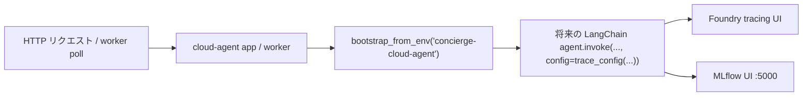

## API の起動

```bash
uv run cloud-agent-web
```

サーバーは `http://localhost:8081` で起動します。
[`http://localhost:8081/docs`](http://localhost:8081/docs) でインタラクティブな
Swagger UI を確認できます。

## observability 配線

`cloud-agent-web` と worker は環境変数で observability を切り替えます。

```bash
CONCIERGE_TRACING_ENABLED=true CONCIERGE_MLFLOW_ENABLED=true uv run cloud-agent-web
```



## エンドポイント一覧

| メソッド | パス | 説明 |
|----------|------|------|
| POST | `/cloud-agent/tasks` | タスクをディスパッチ |
| GET | `/cloud-agent/tasks` | タスク一覧（フィルタあり） |
| GET | `/cloud-agent/tasks/{id}` | タスク詳細取得（ポーリング用途） |
| PATCH | `/cloud-agent/tasks/{id}` | タスク結果更新（ワーカー内部用） |
| DELETE | `/cloud-agent/tasks/{id}` | タスクキャンセル |
| GET | `/cloud-agent/agents` | 登録済みエージェント一覧 |
| GET | `/healthz` | ヘルスチェック |

## POST /cloud-agent/tasks

キューにタスクを投入します。

**リクエストボディ:**

```json
{
  "agent_type": "echo",
  "payload": {"message": "hello"},
  "max_retries": 3
}
```

`langgraph-echo` エージェントへのディスパッチ例:

```bash
curl -X POST http://localhost:8081/cloud-agent/tasks \
  -H "Content-Type: application/json" \
  -d '{"agent_type": "langgraph-echo", "payload": {"message": "Hello LangGraph"}}'
```

- `agent_type` — 登録済みエージェント識別子（必須、1〜100 文字）
- `payload` — エージェントに渡す辞書（最大 64 KiB）
- `max_retries` — 既定の最大リトライ回数を上書き（省略可）

**レスポンス `201 Created`:**

```json
{
  "id": "550e8400-e29b-41d4-a716-446655440000",
  "agent_type": "echo",
  "payload": {"message": "hello"},
  "status": "QUEUED",
  "result": null,
  "error": null,
  "retry_count": 0,
  "max_retries": 3,
  "created_at": "2026-01-01T00:00:00Z",
  "updated_at": "2026-01-01T00:00:00Z",
  "started_at": null,
  "finished_at": null
}
```

**エラーコード:**
- `400` — 未登録の `agent_type`
- `413` / `422` — バリデーションエラー（payload が大きすぎる、不正なフィールド）

## GET /cloud-agent/tasks

クエリパラメータでタスクを絞り込んで取得します:

| パラメータ | 型 | 説明 |
|------------|----|------|
| `status` | enum | ステータスでフィルタ（`QUEUED`, `RUNNING`, `SUCCEEDED` 等） |
| `agent_type` | string | エージェントタイプでフィルタ |
| `limit` | int | 最大件数（デフォルト 100） |
| `offset` | int | ページングオフセット（デフォルト 0） |

## PATCH /cloud-agent/tasks/{id}

タスクの結果を更新します。ワーカープロセスからの内部用途を想定しています。

> **注意:** このエンドポイントはワーカー内部専用です。本番環境ではネットワークポリシーや
> 内部トークンで保護することを推奨します。

## DELETE /cloud-agent/tasks/{id}

タスクをキャンセルします。`QUEUED` 状態のタスクのみ確実にキャンセルできます。
`SUCCEEDED`、`FAILED`、`DEAD_LETTER` 状態のタスクは `409` を返します。

## エラーレスポンスの形式

```json
{"detail": "エラーメッセージ"}
```
