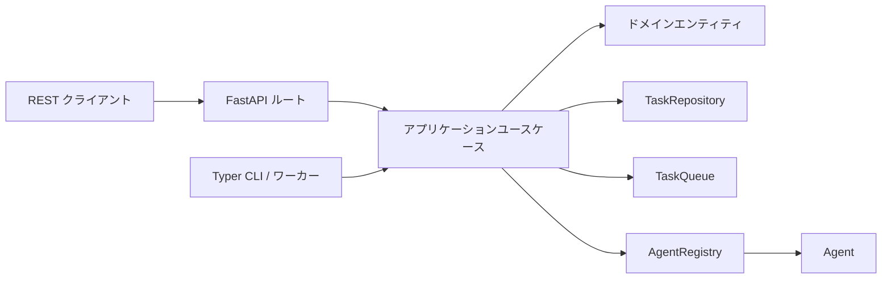

## 概要

`concierge/cloud_agent` は、**クリーンアーキテクチャ**（DDDレイヤード構造）で
実装された非同期タスクディスパッチアプリケーションです。REST API 経由でタスクを
受け取り、バックグラウンドキューを通じて適切なエージェントに割り当て、結果を
返します。



## 主要な設計方針

- **キュー非依存の抽象化** — `InMemory`（ローカル開発）と
  `AzureStorageQueue` の 2 実装を提供。`CLOUD_AGENT_QUEUE_BACKEND` で切り替え可能。
- **エージェント I/O の標準化** — すべてのエージェントは `TaskInput` を受け取り、
  `TaskOutput` を返す（Pydantic スキーマ）。`AgentRegistry` が `agent_type` 文字列を
  具体的な `Agent` 実装にマッピングする。
- **実行環境非依存のワーカー** — 現在はローカル CLI プロセスとして動作するが、
  同じ `Agent` インタフェースを将来 Azure Functions でも再利用できる。
- **Dead Letter Queue（DLQ）** — `max_retries` を超えたタスクは自動的に DLQ に移動される。

## ディレクトリ構成

```
concierge/cloud_agent/
  domain/
    entities.py        # Task データクラス（状態機械遷移付き）
    value_objects.py   # TaskStatus 列挙型 + 許可遷移
    exceptions.py      # ドメイン固有例外
  application/
    agents.py          # Agent Protocol, TaskInput/Output, AgentRegistry
    queues.py          # TaskQueue Protocol + QueueMessage スキーマ
    repositories.py    # TaskRepository Protocol
    use_cases.py       # DispatchTask, GetTask, ListTasks, CancelTask など
  infrastructure/
    persistence/       # InMemoryTaskRepository, SqlAlchemyTaskRepository
    queue/             # InMemoryTaskQueue, AzureStorageQueueTaskQueue
    agents/            # EchoAgent, デフォルト AgentRegistry
    web/               # FastAPI アプリ、ルート、スキーマ、例外ハンドラ
    cli/               # Typer CLI アプリ、ワーカーループ
```

## クイックスタート

```bash
# REST API 起動（デフォルトはインメモリバックエンド）
uv run cloud-agent-web

# ワーカー起動（別ターミナル）
uv run cloud-agent-cli worker

# タスク投入
uv run cloud-agent-cli task dispatch --agent-type echo --payload '{"msg": "hello"}'

# 登録済みエージェント一覧
uv run cloud-agent-cli agents
```

## タスクライフサイクル

```
QUEUED → RUNNING → SUCCEEDED
                 → FAILED → （リトライ）→ QUEUED
                          → （上限超過）→ DEAD_LETTER
       → CANCELLED
```
