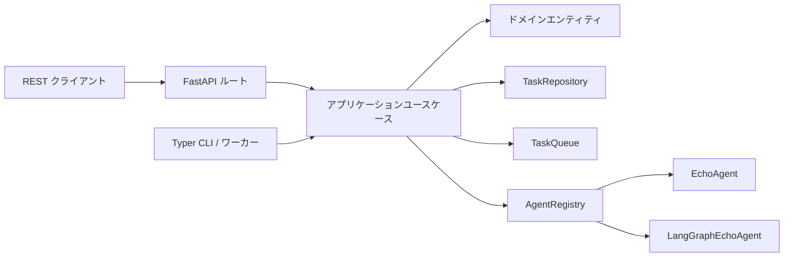
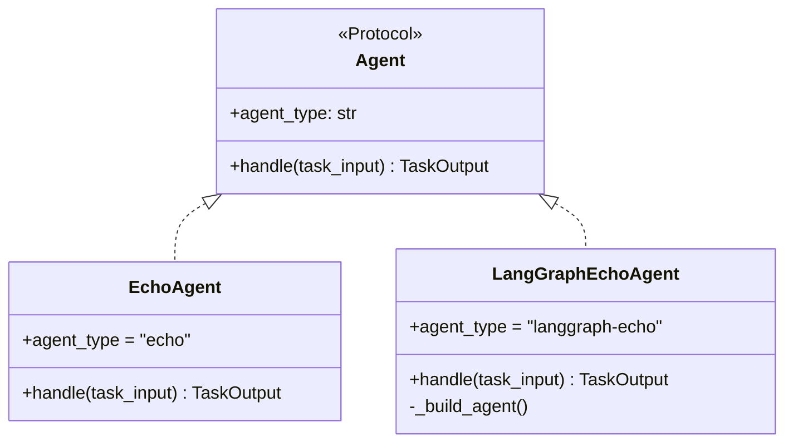

## 概要

`concierge/cloud_agent` は、**クリーンアーキテクチャ**（DDDレイヤード構造）で
実装された非同期タスクディスパッチアプリケーションです。REST API 経由でタスクを
受け取り、バックグラウンドキューを通じて適切なエージェントに割り当て、結果を
返します。



## エージェント拡張ポイント

エージェントは
`concierge/cloud_agent/infrastructure/agents/registry.py` に登録します。
各エージェントは `application` 層が定義する `Agent` Protocol を実装します。

```python
class Agent(Protocol):
    agent_type: ClassVar[str]
    async def handle(self, task_input: TaskInput) -> TaskOutput: ...
```

LangChain / LangGraph のインポートは `infrastructure` 層のみに許可されます。
`domain` 層・`application` 層はフレームワーク非依存を維持します
（`tests/cloud_agent/test_architecture.py` で機械的に検証）。



## 主要な設計方針

- **キュー非依存の抽象化** — `InMemory`（ローカル開発）と
  `AzureStorageQueue` の 2 実装を提供。`CLOUD_AGENT_QUEUE_BACKEND` で切り替え可能。
- **エージェント I/O の標準化** — すべてのエージェントは `TaskInput` を受け取り、
  `TaskOutput` を返す（Pydantic スキーマ）。`AgentRegistry` が `agent_type` 文字列を
  具体的な `Agent` 実装にマッピングする。
- **実行環境非依存のワーカー** — 現在はローカル CLI プロセスとして動作するが、
  同じ `Agent` インタフェースを将来 Azure Functions でも再利用できる。
- **Dead Letter Queue（DLQ）** — `max_retries` を超えたタスクは自動的に DLQ に移動される。

## ディレクトリ構成

```
concierge/cloud_agent/
  domain/
    entities.py        # Task データクラス（状態機械遷移付き）
    value_objects.py   # TaskStatus 列挙型 + 許可遷移
    exceptions.py      # ドメイン固有例外
  application/
    agents.py          # Agent Protocol, TaskInput/Output, AgentRegistry
    queues.py          # TaskQueue Protocol + QueueMessage スキーマ
    repositories.py    # TaskRepository Protocol
    use_cases.py       # DispatchTask, GetTask, ListTasks, CancelTask など
  infrastructure/
    persistence/       # InMemoryTaskRepository, SqlAlchemyTaskRepository
    queue/             # InMemoryTaskQueue, AzureStorageQueueTaskQueue
    agents/            # EchoAgent, デフォルト AgentRegistry
    web/               # FastAPI アプリ、ルート、スキーマ、例外ハンドラ
    cli/               # Typer CLI アプリ、ワーカーループ
```

## クイックスタート

```bash
# REST API 起動（デフォルトはインメモリバックエンド）
uv run cloud-agent-web

# ワーカー起動（別ターミナル）
uv run cloud-agent-cli worker

# タスク投入
uv run cloud-agent-cli task dispatch --agent-type echo --payload '{"msg": "hello"}'

# 登録済みエージェント一覧
uv run cloud-agent-cli agents
```

## タスクライフサイクル

```
QUEUED → RUNNING → SUCCEEDED
                 → FAILED → （リトライ）→ QUEUED
                          → （上限超過）→ DEAD_LETTER
       → CANCELLED
```

---

## 設定 { #configuration }

Cloud Agent の設定はすべて
[`concierge.settings.CloudAgentSettings`](https://github.com/ks6088ts-labs/concierge/blob/main/concierge/settings/cloud_agent.py)
に集約されており、`CLOUD_AGENT_` プレフィックスの環境変数から読み込みます
（[`.env.template`](https://github.com/ks6088ts-labs/concierge/blob/main/.env.template) を参照）。
コード内で `os.environ` を直接参照することはありません。REST API
（`cloud-agent-web`）とディスパッチャ / ワーカー CLI（`cloud-agent-cli`）は
まったく同じ設定オブジェクトを共有します。

### 設定一覧

| 環境変数 | デフォルト | 説明 |
|---------|-----------|------|
| `CLOUD_AGENT_REPOSITORY_BACKEND` | `memory` | タスク永続化バックエンド: `memory` / `postgres` / `azure-postgres` |
| `CLOUD_AGENT_TABLE_NAME` | `cloud_agent_tasks` | SQL バックエンド時のテーブル名 |
| `CLOUD_AGENT_QUEUE_BACKEND` | `memory` | ジョブキューバックエンド: `memory` / `azure-storage-queue` |
| `CLOUD_AGENT_QUEUE_NAME` | `cloud-agent-tasks` | メインキュー名（Azure Storage Queue のリソース名） |
| `CLOUD_AGENT_DLQ_NAME` | `cloud-agent-dlq` | Dead Letter Queue 名（初回利用時に自動作成） |
| `CLOUD_AGENT_AZURE_STORAGE_ACCOUNT_URL` | _(空)_ | `CLOUD_AGENT_QUEUE_BACKEND=azure-storage-queue` のとき**必須**。Queue サービスエンドポイント（例: `https://<account>.queue.core.windows.net`）。認証は Microsoft Entra ID（`DefaultAzureCredential`）のみ、接続文字列 / アカウントキーは**未サポート** |
| `CLOUD_AGENT_VISIBILITY_TIMEOUT_SECONDS` | `60` | デキューしたメッセージが他ワーカーから見えなくなる時間（秒）。エージェントの最悪実行時間より十分長く設定する |
| `CLOUD_AGENT_MAX_RETRIES` | `3` | `DispatchTaskUseCase` のデフォルトリトライ予算。`retry_count > max_retries` で DLQ 行き。API / CLI でディスパッチごとに上書き可能 |
| `CLOUD_AGENT_WORKER_CONCURRENCY` | `1` | 1 ワーカー内の同時実行数（将来拡張用）。現状の実装は逐次処理のため、スケールしたい場合はワーカープロセスを増やす |
| `CLOUD_AGENT_POLL_INTERVAL_SECONDS` | `1.0` | キューが空のときの再ポーリング間隔（秒） |
| `CLOUD_AGENT_LANGGRAPH_MODEL` | `azure_ai:gpt-5` | LangGraph ベースエージェントで使う `init_chat_model` のモデル文字列（例: `"azure_ai:gpt-5"`, `"azure_ai:gpt-4o-mini"`） |
| `CLOUD_AGENT_LANGGRAPH_SYSTEM_PROMPT` | _(組み込み)_ | LangGraph エージェントに注入するシステムプロンプト。エージェントの動作をカスタマイズする際に上書きします |

### リポジトリバックエンドの選択

リポジトリは `Task` 集約を永続化し、`cloud-agent-web` とワーカーの両方から
参照されます。`CLOUD_AGENT_REPOSITORY_BACKEND` で切り替えます。

| 値 | 列挙メンバー | 使いどころ | スキーマ初期化 |
|---|---|---|---|
| `memory`（デフォルト） | `CloudAgentRepositoryBackend.MEMORY` | ローカルの最速試運転。再起動でデータ消失、**プロセスをまたいで共有されない**（API と worker を別プロセスで起動するとそれぞれ別のストアになる） | 不要 |
| `postgres` | `CloudAgentRepositoryBackend.POSTGRES` | Docker Compose のローカル PostgreSQL（`POSTGRES_*`）。`SqlAlchemyTaskRepository` が初回利用時にテーブルを自動作成 | 自動 |
| `azure-postgres` | `CloudAgentRepositoryBackend.AZURE_POSTGRES` | Azure Database for PostgreSQL Flexible Server（`AZURE_*`）。`AZURE_USE_ENTRA_AUTH=true` で Microsoft Entra ID 認証 | 自動 |

!!! tip "`memory` バックエンドとマルチプロセス構成"
    `InMemoryTaskRepository` は Python の dict にデータを保持します。
    `cloud-agent-web` と `cloud-agent-cli worker` を別ターミナルで
    `memory` モード起動すると、2 つの独立したタスクストアになります。
    プロセスを分けるなら `postgres` か `azure-postgres` に切り替えてください。

### キューバックエンドの選択

| 値 | 使いどころ | 必須変数 |
|---|---|---|
| `memory`（デフォルト） | ローカル試運転。`asyncio.Queue` を使う in-process 実装。API と worker が同一 Python プロセス内にいる場合のみ機能 | — |
| `azure-storage-queue` | 本番向けの永続キュー。メインキューと DLQ は起動時に自動作成。認証は `DefaultAzureCredential` による Entra ID のみ | `CLOUD_AGENT_AZURE_STORAGE_ACCOUNT_URL` |

アカウント URL なしで `azure-storage-queue` を選ぶとファクトリが `ValueError` を送出します。
認証は `DefaultAzureCredential` による Microsoft Entra ID のみサポートされ、
呼び出し側プリンシパルにはストレージアカウント上で **Storage Queue Data Contributor**
（または同等のカスタム RBAC）ロールが必要です。
可視性タイムアウトと DLQ ルーティングは
`CLOUD_AGENT_VISIBILITY_TIMEOUT_SECONDS` と `CLOUD_AGENT_DLQ_NAME` で制御します。

### 例: ローカル開発（memory のみ）

```bash
# .env（最小構成）
CLOUD_AGENT_REPOSITORY_BACKEND=memory
CLOUD_AGENT_QUEUE_BACKEND=memory
```

`memory` モードでは API と worker が同一プロセスに居る必要があるため、
ユニットレベルのエンドツーエンド確認用途に限定してください。

### 例: PostgreSQL + Azure Storage Queue

```bash
# .env
CLOUD_AGENT_REPOSITORY_BACKEND=postgres
CLOUD_AGENT_QUEUE_BACKEND=azure-storage-queue
CLOUD_AGENT_AZURE_STORAGE_ACCOUNT_URL=https://<account>.queue.core.windows.net
CLOUD_AGENT_QUEUE_NAME=cloud-agent-tasks
CLOUD_AGENT_DLQ_NAME=cloud-agent-dlq
CLOUD_AGENT_VISIBILITY_TIMEOUT_SECONDS=120
CLOUD_AGENT_MAX_RETRIES=5

# ローカル Postgres 接続情報（Chat / Todo アプリと共有）
POSTGRES_HOST=localhost
POSTGRES_PORT=5432
POSTGRES_USER=concierge
POSTGRES_PASSWORD=concierge
POSTGRES_DB=concierge
```

```bash
docker compose up -d postgres
az login                       # DefaultAzureCredential がトークンを取得できる状態に
uv run cloud-agent-web        # ターミナル 1
uv run cloud-agent-cli worker # ターミナル 2
```

起動前に、サインイン済みプリンシパル（またはマネージド ID）に
ストレージアカウントへの **Storage Queue Data Contributor** ロールを付与しておいてください。

### 例: Azure Database for PostgreSQL（Entra ID）+ Azure Storage Queue

```bash
# .env
CLOUD_AGENT_REPOSITORY_BACKEND=azure-postgres
CLOUD_AGENT_QUEUE_BACKEND=azure-storage-queue
CLOUD_AGENT_AZURE_STORAGE_ACCOUNT_URL=https://<account>.queue.core.windows.net

AZURE_DBHOST=<server-name>.postgres.database.azure.com
AZURE_DBNAME=postgres
AZURE_USE_ENTRA_AUTH=true
AZURE_DBUSER=<entra-principal>
```

API / worker 起動前に `az login` などで `DefaultAzureCredential` がトークンを
発行できる状態にしておいてください。同じプリンシパルに、`AZURE_DBUSER` に使う
PostgreSQL ロールに加えてストレージアカウントで **Storage Queue Data Contributor**
ロールも付与しておく必要があります。
