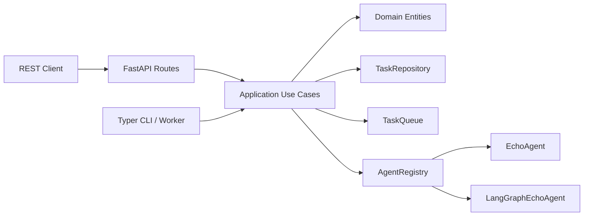
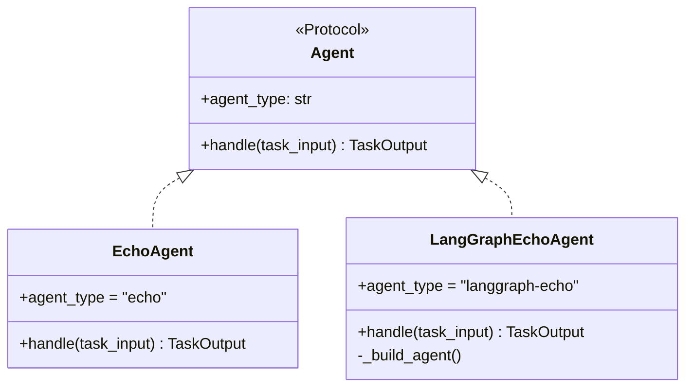

## Overview

`concierge/cloud_agent` is an asynchronous task dispatch application built with
**clean architecture** (DDD layered structure). It receives tasks via a REST API,
enqueues them in a background job queue, routes them to the appropriate agent,
and returns results.



## Agent Extension Point

Agents are registered in
`concierge/cloud_agent/infrastructure/agents/registry.py`.  Each agent
implements the `Agent` Protocol from the `application` layer:

```python
class Agent(Protocol):
    agent_type: ClassVar[str]
    async def handle(self, task_input: TaskInput) -> TaskOutput: ...
```

The `infrastructure` layer is the only place that may import LangChain /
LangGraph.  The `domain` and `application` layers must remain framework-free
(enforced by `tests/cloud_agent/test_architecture.py`).



## Key Design Principles

- **Queue-agnostic abstraction** — ships with `InMemory` (local dev) and
  `AzureStorageQueue` backends; switch via `CLOUD_AGENT_QUEUE_BACKEND`.
- **Agent I/O standardised** — every agent receives `TaskInput` and returns
  `TaskOutput` (Pydantic schemas).  The `AgentRegistry` maps `agent_type`
  strings to concrete `Agent` implementations.
- **Runtime-agnostic workers** — the worker loop runs as a local CLI process
  today; the same `Agent` interface can be reused on Azure Functions in the
  future.
- **Dead Letter Queue (DLQ)** — tasks that exceed `max_retries` are moved to a
  DLQ automatically.

## Directory Layout

```
concierge/cloud_agent/
  domain/
    entities.py        # Task dataclass with state-machine transitions
    value_objects.py   # TaskStatus enum + allowed transitions
    exceptions.py      # Domain-specific exceptions
  application/
    agents.py          # Agent Protocol, TaskInput/Output, AgentRegistry
    queues.py          # TaskQueue Protocol + QueueMessage schema
    repositories.py    # TaskRepository Protocol
    use_cases.py       # DispatchTask, GetTask, ListTasks, CancelTask, …
  infrastructure/
    persistence/       # InMemoryTaskRepository, SqlAlchemyTaskRepository
    queue/             # InMemoryTaskQueue, AzureStorageQueueTaskQueue
    agents/            # EchoAgent, default AgentRegistry
    web/               # FastAPI app, routes, schemas, exception handlers
    cli/               # Typer CLI app, worker loop
```

## Quick Start

```bash
# Start the REST API (in-memory backend by default)
uv run cloud-agent-web

# Run the worker (separate terminal)
uv run cloud-agent-cli worker

# Dispatch a task
uv run cloud-agent-cli task dispatch --agent-type echo --payload '{"msg": "hello"}'

# List registered agents
uv run cloud-agent-cli agents
```

## Task Lifecycle

```
QUEUED → RUNNING → SUCCEEDED
                 → FAILED → (retry) → QUEUED
                          → (max retries) → DEAD_LETTER
       → CANCELLED
```

---

## Configuration

All Cloud Agent settings are aggregated in
[`concierge.settings.CloudAgentSettings`](https://github.com/ks6088ts-labs/concierge/blob/main/concierge/settings/cloud_agent.py)
and read from environment variables with the **`CLOUD_AGENT_`** prefix
(see [`.env.template`](https://github.com/ks6088ts-labs/concierge/blob/main/.env.template)).
The rest of the codebase never touches `os.environ` directly — both the REST
API (`cloud-agent-web`) and the worker / dispatcher CLI (`cloud-agent-cli`)
share the exact same configuration object.

### Settings reference

| Variable | Default | Description |
|----------|---------|-------------|
| `CLOUD_AGENT_REPOSITORY_BACKEND` | `memory` | Task persistence backend: `memory` / `postgres` / `azure-postgres`. |
| `CLOUD_AGENT_TABLE_NAME` | `cloud_agent_tasks` | Table name used by the SQL backends. |
| `CLOUD_AGENT_QUEUE_BACKEND` | `memory` | Job queue backend: `memory` / `azure-storage-queue`. |
| `CLOUD_AGENT_QUEUE_NAME` | `cloud-agent-tasks` | Main task queue name (Azure Storage Queue resource name). |
| `CLOUD_AGENT_DLQ_NAME` | `cloud-agent-dlq` | Dead Letter Queue name (created automatically on first use). |
| `CLOUD_AGENT_AZURE_STORAGE_ACCOUNT_URL` | _(empty)_ | **Required** when `CLOUD_AGENT_QUEUE_BACKEND=azure-storage-queue`. Queue service endpoint (e.g. `https://<account>.queue.core.windows.net`). Authentication is performed only via Microsoft Entra ID (`DefaultAzureCredential`); connection strings / account keys are **not** supported. |
| `CLOUD_AGENT_VISIBILITY_TIMEOUT_SECONDS` | `60` | How long a dequeued message is hidden from other workers while a task is being processed. Should comfortably exceed the worst-case agent execution time. |
| `CLOUD_AGENT_MAX_RETRIES` | `3` | Default retry budget injected into `DispatchTaskUseCase`. A task is moved to the DLQ when `retry_count > max_retries`. Can be overridden per dispatch via the API / CLI. |
| `CLOUD_AGENT_WORKER_CONCURRENCY` | `1` | Reserved for future concurrent processing per worker. The current loop processes one task at a time; scale horizontally instead. |
| `CLOUD_AGENT_POLL_INTERVAL_SECONDS` | `1.0` | How long the worker sleeps after an empty `dequeue()` before polling again. |
| `CLOUD_AGENT_LANGGRAPH_MODEL` | `azure_ai:gpt-5` | Model string for `init_chat_model` used by LangGraph-based agents (e.g. `"azure_ai:gpt-5"`, `"azure_ai:gpt-4o-mini"`). |
| `CLOUD_AGENT_LANGGRAPH_SYSTEM_PROMPT` | _(built-in)_ | System prompt injected into LangGraph agents.  Override to customise agent behaviour. |

### Repository backend selection

The repository persists `Task` aggregates and is consumed by both `cloud-agent-web`
and the worker. The choice is made by `CLOUD_AGENT_REPOSITORY_BACKEND`:

| Value | Enum member | When to use | Schema init |
|-------|-------------|-------------|-------------|
| `memory` (default) | `CloudAgentRepositoryBackend.MEMORY` | Local smoke tests. Data is lost on restart and **not shared across processes** — the worker and API must run in the same process to see each other’s tasks. | Not needed |
| `postgres` | `CloudAgentRepositoryBackend.POSTGRES` | Local Docker Compose PostgreSQL using the `POSTGRES_*` variables. Tables are created lazily by `SqlAlchemyTaskRepository` on first use. | Auto |
| `azure-postgres` | `CloudAgentRepositoryBackend.AZURE_POSTGRES` | Azure Database for PostgreSQL Flexible Server using the `AZURE_*` variables. Supports Microsoft Entra ID auth via `AZURE_USE_ENTRA_AUTH=true`. | Auto |

!!! tip "`memory` and multi-process setups"
    Because `InMemoryTaskRepository` stores state in a Python dict, running
    `cloud-agent-web` and `cloud-agent-cli worker` in separate terminals
    with `memory` mode will produce two completely independent task stores.
    Switch to `postgres` (or `azure-postgres`) whenever you split processes.

### Queue backend selection

| Value | When to use | Required variables |
|-------|-------------|--------------------|
| `memory` (default) | Local smoke tests. Uses an in-process `asyncio.Queue`. Only useful when the API and the worker live in the same Python process. | — |
| `azure-storage-queue` | Production-grade durable queue. The main queue and DLQ are auto-created on startup. Auth is Entra ID only via `DefaultAzureCredential`. | `CLOUD_AGENT_AZURE_STORAGE_ACCOUNT_URL` |

The factory raises `ValueError` if `azure-storage-queue` is selected without an
account URL. Authentication is performed exclusively via Microsoft Entra ID
using `DefaultAzureCredential` — the calling principal must hold the
**Storage Queue Data Contributor** role (or equivalent custom RBAC) on the
storage account. Visibility timeouts and DLQ routing are driven by
`CLOUD_AGENT_VISIBILITY_TIMEOUT_SECONDS` and `CLOUD_AGENT_DLQ_NAME`.

### Example: local development (memory only)

```bash
# .env (minimum)
CLOUD_AGENT_REPOSITORY_BACKEND=memory
CLOUD_AGENT_QUEUE_BACKEND=memory
```

Run the API and worker in the **same process group** so they share the
in-memory store and queue. The simplest way is to keep them in one terminal
each but understand they will use independent in-memory state — use this mode
only for unit-style end-to-end checks.

### Example: PostgreSQL + Azure Storage Queue

```bash
# .env
CLOUD_AGENT_REPOSITORY_BACKEND=postgres
CLOUD_AGENT_QUEUE_BACKEND=azure-storage-queue
CLOUD_AGENT_AZURE_STORAGE_ACCOUNT_URL=https://<account>.queue.core.windows.net
CLOUD_AGENT_QUEUE_NAME=cloud-agent-tasks
CLOUD_AGENT_DLQ_NAME=cloud-agent-dlq
CLOUD_AGENT_VISIBILITY_TIMEOUT_SECONDS=120
CLOUD_AGENT_MAX_RETRIES=5

# Local Postgres connection (shared with the Chat / Todo apps)
POSTGRES_HOST=localhost
POSTGRES_PORT=5432
POSTGRES_USER=concierge
POSTGRES_PASSWORD=concierge
POSTGRES_DB=concierge
```

```bash
docker compose up -d postgres
az login                       # so DefaultAzureCredential can mint a token
uv run cloud-agent-web        # terminal 1
uv run cloud-agent-cli worker # terminal 2
```

Grant the signed-in principal (or managed identity) the **Storage Queue Data
Contributor** role on the target storage account before starting the
services.

### Example: Azure Database for PostgreSQL (Entra ID) + Azure Storage Queue

```bash
# .env
CLOUD_AGENT_REPOSITORY_BACKEND=azure-postgres
CLOUD_AGENT_QUEUE_BACKEND=azure-storage-queue
CLOUD_AGENT_AZURE_STORAGE_ACCOUNT_URL=https://<account>.queue.core.windows.net

AZURE_DBHOST=<server-name>.postgres.database.azure.com
AZURE_DBNAME=postgres
AZURE_USE_ENTRA_AUTH=true
AZURE_DBUSER=<entra-principal>
```

Ensure `DefaultAzureCredential` can mint a token (e.g. `az login` or a
managed identity) before starting the API / worker. The same principal must
have the **Storage Queue Data Contributor** role on the storage account in
addition to the PostgreSQL role used for `AZURE_DBUSER`.
