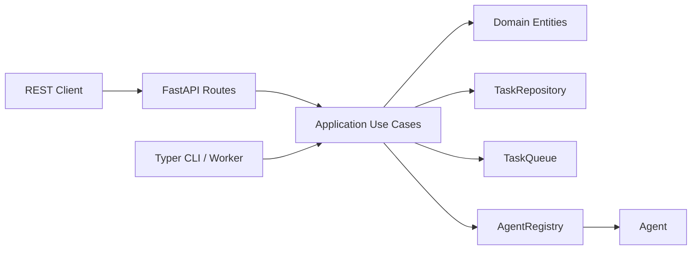

## Overview

`concierge/cloud_agent` is an asynchronous task dispatch application built with
**clean architecture** (DDD layered structure). It receives tasks via a REST API,
enqueues them in a background job queue, routes them to the appropriate agent,
and returns results.



## Key Design Principles

- **Queue-agnostic abstraction** — ships with `InMemory` (local dev) and
  `AzureStorageQueue` backends; switch via `CLOUD_AGENT_QUEUE_BACKEND`.
- **Agent I/O standardised** — every agent receives `TaskInput` and returns
  `TaskOutput` (Pydantic schemas).  The `AgentRegistry` maps `agent_type`
  strings to concrete `Agent` implementations.
- **Runtime-agnostic workers** — the worker loop runs as a local CLI process
  today; the same `Agent` interface can be reused on Azure Functions in the
  future.
- **Dead Letter Queue (DLQ)** — tasks that exceed `max_retries` are moved to a
  DLQ automatically.

## Directory Layout

```
concierge/cloud_agent/
  domain/
    entities.py        # Task dataclass with state-machine transitions
    value_objects.py   # TaskStatus enum + allowed transitions
    exceptions.py      # Domain-specific exceptions
  application/
    agents.py          # Agent Protocol, TaskInput/Output, AgentRegistry
    queues.py          # TaskQueue Protocol + QueueMessage schema
    repositories.py    # TaskRepository Protocol
    use_cases.py       # DispatchTask, GetTask, ListTasks, CancelTask, …
  infrastructure/
    persistence/       # InMemoryTaskRepository, SqlAlchemyTaskRepository
    queue/             # InMemoryTaskQueue, AzureStorageQueueTaskQueue
    agents/            # EchoAgent, default AgentRegistry
    web/               # FastAPI app, routes, schemas, exception handlers
    cli/               # Typer CLI app, worker loop
```

## Quick Start

```bash
# Start the REST API (in-memory backend by default)
uv run cloud-agent-web

# Run the worker (separate terminal)
uv run cloud-agent-cli worker

# Dispatch a task
uv run cloud-agent-cli task dispatch --agent-type echo --payload '{"msg": "hello"}'

# List registered agents
uv run cloud-agent-cli agents
```

## Task Lifecycle

```
QUEUED → RUNNING → SUCCEEDED
                 → FAILED → (retry) → QUEUED
                          → (max retries) → DEAD_LETTER
       → CANCELLED
```
