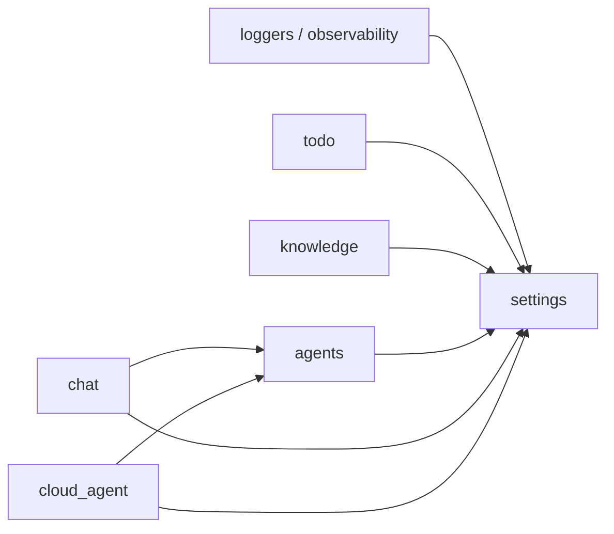

## concierge とは

`concierge` は、[Microsoft Foundry](https://learn.microsoft.com/ja-jp/azure/foundry/)
上のモデルを [LangChain](https://docs.langchain.com/) /
[LangGraph](https://docs.langchain.com/oss/python/langgraph/quickstart)
から扱う LLM アプリケーション構築用の Python ハンズオンリポジトリです。
読みどころは大きく 2 つあります。

| 構成 | 完全ローカルで動く？ | 学べること |
| :--- | :---: | :--- |
| [Todo アプリ (クリーンアーキテクチャ)](todo/index.md) | はい | FastAPI + Typer + クリーンアーキテクチャの小さな参考実装 |
| [ハンズオンチュートリアル](tutorial/index.md) | 一部 | Foundry チャット / 埋め込み、観測性、pgvector、LangGraph エージェント |

## サービス構成と依存関係

[`concierge/`](https://github.com/ks6088ts-labs/concierge/tree/main/concierge)
配下の Python コードは、機能ごとに小さなパッケージに分かれています。
各パッケージは同じクリーンアーキテクチャの構成 (`domain` / `application`
/ `infrastructure`) を踏襲し、共通の `concierge.settings`
設定レイヤを経由して結線されます。

| パッケージ | 役割 | 提供する Surface | 依存先 (concierge) |
| :--- | :--- | :--- | :--- |
| [`settings`](https://github.com/ks6088ts-labs/concierge/tree/main/concierge/settings) | サービスごとに名前空間化された Pydantic-Settings 設定 (Foundry / Postgres / 観測性 など) | — | — |
| [`loggers`](https://github.com/ks6088ts-labs/concierge/blob/main/concierge/loggers.py), [`observability`](https://github.com/ks6088ts-labs/concierge/blob/main/concierge/observability.py) | 共通ロギング + Foundry / Azure Monitor / MLflow トレーシングのヘルパー | — | `settings` |
| [`todo`](todo/index.md) | タスク CRUD のリファレンス実装 | REST API, CLI | `settings` |
| [`knowledge`](knowledge/index.md) | Markdown 取り込み + pgvector ベースの RAG ストア | CLI | `settings` |
| [`agents`](agents/index.md) | 共有エージェントランタイム。`AgentRegistry`、各種アダプタ (Echo / GitHub Copilot SDK / LangGraph / Microsoft Agent Framework)、組み込みツール (echo、ファイル操作、シェル、画像生成) | CLI | `settings` |
| [`chat`](chat/index.md) | チャット会話・応答 (同期チャット + リアルタイム音声) | REST API, CLI, Realtime | `settings`, `agents` (任意、エージェント連動レスポンダ利用時のみ) |
| [`cloud_agent`](cloud_agent/index.md) | キュー + リポジトリ経由でエージェントジョブを実行する非同期ディスパッチャ | REST API, CLI | `settings`, `agents` |

依存方向は厳密に一方向です。

* `agents`, `todo`, `knowledge` は独立した bounded context です。
  これらは他のサービスパッケージを import しません。
* `agents` を import するのは `chat` と `cloud_agent` の 2 つだけで、
  どちらも infrastructure / application 層からの参照に限定されており、
  domain 層は依存しません。
* これらのルールは
  [`pyproject.toml`](https://github.com/ks6088ts-labs/concierge/blob/main/pyproject.toml)
  に定義された `import-linter` コントラクトで CI 強制されています
  (ローカルでは `make lint-imports` で実行)。

!!! note

    チュートリアル用の CLI
    [`scripts/langgraph/vanilla.py`](https://github.com/ks6088ts-labs/concierge/blob/main/scripts/langgraph/vanilla.py)
    は `httpx` 経由で Todo アプリの公開 REST API を叩いており、
    `concierge.todo` を直接 import してはいません。これはランタイム
    レベルの結合に過ぎない点に注意してください。

## どこから読むか

目的にいちばん近いところから始めてください。各経路は次のステップに繋がっ
ているので、必要なところまで進めばOKです。

=== "まずコードを読みたい"

    [Todo アプリ概要](todo/index.md) から始めます。`uv run todo-web`
    の 1 コマンドで起動し、Azure 認証も不要です。FastAPI / Typer /
    リポジトリ層の繋がりを最小構成で確認できます。

=== "Foundry をとにかく呼んでみたい"

    [ステップ 1 - Microsoft Foundry + LangChain](tutorial/01-foundry-langchain.md)
    に進みます。Typer CLI から Foundry プロジェクトに対するチャット
    completion を 5 分以内に実行できます。

=== "LLM トレースをデバッグしたい"

    [ステップ 2 - 観測性 (トレース & MLflow)](tutorial/02-observability.md)
    を読みます。LangChain 実行を Azure Monitor に送り、ローカル MLflow
    UI で閲覧する方法をスクリーンショット付きで紹介しています。

=== "永続ベクトルストアを使いたい"

    [ステップ 3 - PostgreSQL (pgvector) CRUD](tutorial/03-postgres-vector-store.md)
    を読みます。1 本の Typer CLI で Docker Compose 上の pgvector と
    Azure Database for PostgreSQL Flexible Server の両方を切り替えて使えます。

=== "エージェントを動かしてみたい"

    [ステップ 4 - LangGraph Todo Agent CLI](tutorial/04-langgraph-todo-agent.md)
    を読みます。LangGraph エージェントがツール経由で Todo Web API を操作
    し、ステップ 1～3 の要素をひとまとめにします。

## クイックリファレンス

* [開発ガイド](development.md): 環境構築、`make` ターゲット、Docker 操作。
* [チュートリアル概要](tutorial/index.md): 推奨される読み進め方。
* [Appendix - 外部参考リンク](tutorial/appendix.md): Microsoft Learn /
  上流ドキュメントへのリンク集。
