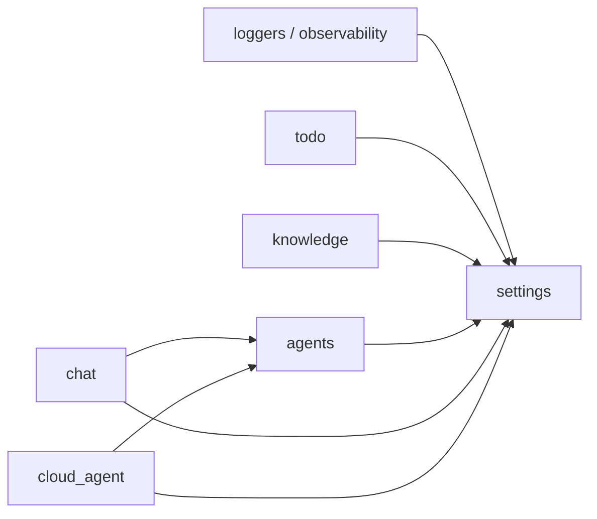

## What is concierge?

`concierge` is a Python hands-on repository for building LLM applications on
[Microsoft Foundry](https://learn.microsoft.com/en-us/azure/foundry/) using
[LangChain](https://docs.langchain.com/) and
[LangGraph](https://docs.langchain.com/oss/python/langgraph/quickstart). It
ships with two complementary surfaces:

| Surface | Runs entirely local? | What you learn |
| :--- | :---: | :--- |
| [Todo App (Clean Architecture)](todo/index.md) | yes | A small FastAPI + Typer + clean-architecture reference |
| [Hands-on Tutorial](tutorial/index.md) | partly | Foundry chat / embeddings, observability, pgvector, a LangGraph agent |

## Service modules & dependencies

The Python source under
[`concierge/`](https://github.com/ks6088ts-labs/concierge/tree/main/concierge)
is split into small per-feature packages. Each one follows the same
clean-architecture layout (`domain` / `application` / `infrastructure`)
and is wired together through a shared `concierge.settings`
configuration layer.

| Package | Role | Surfaces | Depends on (concierge) |
| :--- | :--- | :--- | :--- |
| [`settings`](https://github.com/ks6088ts-labs/concierge/tree/main/concierge/settings) | Pydantic-Settings config with per-service namespaces (Foundry, Postgres, observability, ...) | — | — |
| [`loggers`](https://github.com/ks6088ts-labs/concierge/blob/main/concierge/loggers.py), [`observability`](https://github.com/ks6088ts-labs/concierge/blob/main/concierge/observability.py) | Shared logging + Foundry / Azure Monitor / MLflow tracing helpers | — | `settings` |
| [`todo`](todo/index.md) | Task CRUD reference application | REST API, CLI | `settings` |
| [`knowledge`](knowledge/index.md) | Markdown ingest + pgvector RAG store | CLI | `settings` |
| [`agents`](agents/index.md) | Shared agent runtime — `AgentRegistry`, adapters (Echo / GitHub Copilot SDK / LangGraph / Microsoft Agent Framework) and built-in tools (echo, file management, shell command, image generation) | CLI | `settings` |
| [`chat`](chat/index.md) | Chat conversations and replies (synchronous + realtime voice) | REST API, CLI, Realtime | `settings`, `agents` (optional, agent-backed responder) |
| [`cloud_agent`](cloud_agent/index.md) | Async task dispatcher that runs agent jobs through a queue + repository | REST API, CLI | `settings`, `agents` |

The dependency direction is strictly one-way:

* `agents`, `todo`, and `knowledge` are independent bounded contexts —
  nothing in them imports another service package.
* `chat` and `cloud_agent` are the only services that import `agents`,
  and they do so at the infrastructure / application boundary, never
  from their domain layer.
* These rules are enforced in CI by `import-linter` contracts declared
  in [`pyproject.toml`](https://github.com/ks6088ts-labs/concierge/blob/main/pyproject.toml)
  (run locally with `make lint-imports`).

!!! note

    The tutorial CLI
    [`scripts/langgraph/vanilla.py`](https://github.com/ks6088ts-labs/concierge/blob/main/scripts/langgraph/vanilla.py)
    drives the Todo app over the public REST API via `httpx` — it does
    not import `concierge.todo` directly. Treat that as a runtime
    integration only.

## Where do I start?

Pick the closest match to your goal. Each path links forward into the next
so you can keep going as far as you want.

=== "I want to read code first"

    Start with the [Todo App overview](todo/index.md). It boots with one
    command (`uv run todo-web`), needs no Azure credentials, and shows how
    the FastAPI / Typer / repository layers fit together.

=== "I want to call Foundry as fast as possible"

    Jump to [Step 1 - Microsoft Foundry + LangChain](tutorial/01-foundry-langchain.md).
    You will run a chat completion against your Foundry project from a Typer
    CLI in under five minutes.

=== "I want to debug LLM traces"

    Read [Step 2 - Observability (Tracing & MLflow)](tutorial/02-observability.md).
    It shows how to send LangChain runs to Azure Monitor and how to view them
    locally in the MLflow UI - screenshots included.

=== "I want a persistent vector store"

    Read [Step 3 - PostgreSQL (pgvector) CRUD](tutorial/03-postgres-vector-store.md).
    One Typer CLI runs against either Docker Compose pgvector or Azure
    Database for PostgreSQL Flexible Server.

=== "I want to drive an agent end-to-end"

    Read [Step 4 - LangGraph Todo Agent CLI](tutorial/04-langgraph-todo-agent.md).
    The LangGraph agent talks to the Todo Web API through tools and combines
    everything from steps 1-3.

## Quick reference

* [Development Guide](development.md) - environment setup, `make` targets,
  Docker workflow.
* [Tutorial Overview](tutorial/index.md) - the recommended end-to-end
  reading order.
* [Appendix - External references](tutorial/appendix.md) - every Microsoft
  Learn / upstream link in one place.
