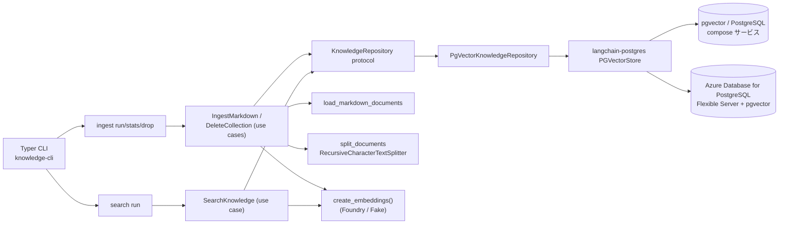

## 概要

`concierge.knowledge` は、Markdown ファイルを
[pgvector](https://github.com/pgvector/pgvector) ベースのベクターストアに
取り込む**独立したバウンデッドコンテキスト**です。永続化は
[`langchain-postgres`](https://pypi.org/project/langchain-postgres/) 経由で行い、
本リポジトリの他サービスと同じクリーンアーキテクチャ階層に従います。

エントリポイントは Typer CLI（`knowledge-cli`）のみで、サブコマンド
グループが 2 つあります。

* `ingest`（`run` / `stats` / `drop`）: ベクターテーブルの作成、
  Markdown の分割・埋め込み、コレクション管理を行う書き込み系。
* `search`（`run`）: 同じ `create_embeddings()` factory を使って既存
  コレクションに対して `similarity_search` を走らせる読み取り系。
  人間可読出力と `--json` 出力をサポートします。

埋め込み・永続化・ローダの実体は `concierge.knowledge.infrastructure`
配下の factory で組み立て、アプリケーション層からはフレームワークを
直接 import しません。



## ディレクトリ構成

```
concierge/knowledge/
  domain/
    entities.py          # KnowledgeDocument / KnowledgeChunk / KnowledgeSearchResult
    value_objects.py     # CollectionName / ChunkId / ContentHash
    exceptions.py        # CollectionValidationError
  application/
    repositories.py      # KnowledgeRepository プロトコル
    use_cases.py         # IngestMarkdown / DeleteCollection / SearchKnowledge
  infrastructure/
    cli/app.py           # knowledge-cli (Typer)
    embeddings/factory.py    # create_embeddings() （foundry|fake）
    loaders/markdown.py      # load_markdown_documents() / split_documents()
    persistence/
      factory.py             # get_knowledge_repository()
      pgvector.py            # PgVectorKnowledgeRepository (langchain-postgres)
```

`infrastructure -> application -> domain` の依存方向は
`pyproject.toml` の `import-linter` 契約
（`knowledge-layers` / `knowledge-domain-no-frameworks` /
`knowledge-application-no-infrastructure` / `knowledge-no-agents-coupling`）
で静的に強制されます。

## 最小手順（Docker Compose + fake embeddings）

Azure 認証不要で動かせる最短のスモークテストです。

!!! warning "`fake` embeddings は配線確認専用"
    `KNOWLEDGE_EMBEDDING_PROVIDER=fake` は決定論的でも**意味を持たない**
    ベクターを生成するため、検索の順位は実質ランダムです。Azure を呼ばずに
    インジェスト/検索の配線を確認する用途にのみ使用してください。実際の
    意味検索（RAG エージェント、realtime 音声）では `foundry` を使い、
    入れ直してください。詳細は[トラブルシューティング](#トラブルシューティング)を参照。

```bash
# 1. ローカル pgvector を起動
docker compose up -d postgres

# 2. Foundry を呼ばないように、deterministic な fake embeddings を使う
export KNOWLEDGE_EMBEDDING_PROVIDER=fake

# 3. このリポジトリの docs/ 配下を新規コレクションに取り込み
uv run knowledge-cli ingest run --collection demo_md docs

# 4. 行数を確認
uv run knowledge-cli ingest stats --collection demo_md

# 5. 同じコレクションにクエリを投げる
uv run knowledge-cli search run --collection demo_md "vector store" --k 3

# 6. 後片付け（コレクション削除）
uv run knowledge-cli ingest drop --collection demo_md --yes
```

3 番の期待出力:

```
ingest completed: files=<N> chunks=<M> records=<M>
```

## 最小手順（Azure Database for PostgreSQL + Foundry）

マネージド構成では、
[ステップ 3 – PostgreSQL (pgvector) CRUD](../tutorial/03-postgres-vector-store.ja.md)
と [ステップ 2 – 観測性](../tutorial/02-observability.ja.md)
で説明している `AZURE_*` / `AZURE_AI_PROJECT_ENDPOINT` をそのまま使い回します。

```bash
# 1. Entra ID 認証用に az login（Azure PostgreSQL と Foundry の両方で利用）
az login

# 2. Flexible Server で vector 拡張が有効化され、Entra プリンシパルが
#    PostgreSQL ロールにマッピングされていることを確認
#    （SQL 例はチュートリアル Step 3 を参照）

# 3. Foundry embeddings を使って Azure pgvector にインジェスト
uv run knowledge-cli ingest run \
  --collection demo_md \
  --target azure \
  docs

# 4. 必要に応じて確認・検索・削除
uv run knowledge-cli ingest stats --collection demo_md --target azure
uv run knowledge-cli search run --collection demo_md --target azure "vector store"
uv run knowledge-cli ingest drop  --collection demo_md --target azure --yes
```

!!! tip "デフォルトコレクション"
    `--collection` を省略すると `KNOWLEDGE_DEFAULT_COLLECTION`
    （既定値 `knowledge_default`）にフォールバックします。全 Markdown を
    1 テーブルにまとめたい場合に便利です。

## 設定

`concierge.settings.KnowledgeSettings` が **`KNOWLEDGE_`** プレフィックスで
読み取ります。PostgreSQL 接続情報は `--target docker` で `PostgresSettings`
（`POSTGRES_*`）を、`--target azure` で `AzurePostgresSettings`
（`AZURE_*`）を再利用します。

| 環境変数 | デフォルト | 説明 |
|---------|-----------|------|
| `KNOWLEDGE_EMBEDDING_PROVIDER` | `foundry` | `foundry`: Azure AI Foundry を `DefaultAzureCredential` で利用。`fake`: ネットワーク不要の `DeterministicFakeEmbedding`。 |
| `KNOWLEDGE_EMBEDDING_MODEL` | `text-embedding-3-small` | `init_embeddings("azure_ai:<model>")` に渡す Foundry デプロイ名。 |
| `KNOWLEDGE_VECTOR_SIZE` | `1536` | pgvector テーブル作成時の次元数。埋め込みモデルと一致させる必要があります。 |
| `KNOWLEDGE_VECTOR_BACKEND` | `pgvector` | ベクターストアバックエンド。現状は `pgvector` のみ実装。 |
| `KNOWLEDGE_DEFAULT_COLLECTION` | `knowledge_default` | `--collection` 省略時のテーブル名。`^[A-Za-z0-9_]+$` にマッチする必要があります。 |
| `KNOWLEDGE_CHUNK_SIZE` | `1000` | `RecursiveCharacterTextSplitter` の `chunk_size`。 |
| `KNOWLEDGE_CHUNK_OVERLAP` | `200` | `RecursiveCharacterTextSplitter` の `chunk_overlap`。 |
| `AZURE_AI_PROJECT_ENDPOINT` | `""` | `KNOWLEDGE_EMBEDDING_PROVIDER=foundry` のときに必須。CLI が自動的に `/openai/v1` エンドポイントを導出します。 |

`--target azure` ではさらに `AZURE_DBHOST` / `AZURE_DBNAME` / `AZURE_DBUSER` /
`AZURE_USE_ENTRA_AUTH`、および Entra 認証を無効化した場合の
`AZURE_DBPASSWORD` が必要です。詳細やプロビジョニング手順は
[ステップ 3 – PostgreSQL (pgvector) CRUD](../tutorial/03-postgres-vector-store.ja.md)
を参照してください。

## トラブルシューティング

### 検索結果が無関係なチャンクばかり（ヒットはあるのにエージェントが「該当なし」と回答する）

`KNOWLEDGE_EMBEDDING_PROVIDER=fake` は `DeterministicFakeEmbedding` を使い、
テキストをハッシュして**意味を持たない**ベクターに変換します。これは Azure を
呼ばずにインジェスト/検索の配線を確認するためだけのものです。`fake` では
`similarity_search` がほぼランダムなチャンクを返し（コサイン距離がどれも同じ
~0.9 付近に張り付く）、結果を根拠に回答する側（RAG エージェントや realtime
音声ツール）は、ヒットが返っていても「関連情報が見つからない」と報告します。

実運用の検索では Foundry embeddings に切り替えてください:

```dotenv
KNOWLEDGE_EMBEDDING_PROVIDER=foundry
KNOWLEDGE_EMBEDDING_MODEL=text-embedding-3-small
AZURE_AI_PROJECT_ENDPOINT=https://<resource>.services.ai.azure.com/api/projects/<project>
```

コーパスに答えがあると分かっているクエリで確認します。明らかに関連する
ドキュメントが先頭に来るはずです:

```bash
uv run knowledge-cli search run --collection knowledge_default "MLflow" --k 4
```

### プロバイダやモデルを変えたのに結果が変わらない

埋め込みは**インジェスト時**に計算されテーブルへ保存されます。
`KNOWLEDGE_EMBEDDING_PROVIDER` / `KNOWLEDGE_EMBEDDING_MODEL` /
`KNOWLEDGE_VECTOR_SIZE` を変更しても既存行には反映されず、`ingest run` は
置き換えではなく**追記**します。コレクション全体を 1 つの埋め込み空間に
そろえるため、drop してから入れ直してください:

```bash
uv run knowledge-cli ingest drop --collection knowledge_default --yes
uv run knowledge-cli ingest run  --collection knowledge_default docs
```

!!! warning "`.env` 変更後は常駐サーバを再起動する"
    `chat-web` などのアプリは起動時に `.env` を読み込み設定をキャッシュする
    ため、`.env` のプロバイダ変更はプロセスを停止・再起動するまで反映され
    ません。

### ポート 5432 で `OperationalError` / `connection refused`

pgvector が起動していません。インジェスト/検索の前に起動してください
（ヘルスチェックの完了を待ちます）:

```bash
docker compose up -d postgres
```

## プログラムからの利用

CLI を介さずに同じユースケースを Python から呼び出すこともできます。
既存コレクション上にリトリーバを組む RAG / agents 側の典型例:

```python
from concierge.knowledge.application.use_cases import SearchKnowledge
from concierge.knowledge.domain.value_objects import CollectionName
from concierge.knowledge.infrastructure.embeddings.factory import create_embeddings
from concierge.knowledge.infrastructure.persistence.factory import get_knowledge_repository
from concierge.settings import KnowledgeTarget

collection = CollectionName("demo_md")
repository = get_knowledge_repository(
    collection=collection,
    target=KnowledgeTarget.DOCKER,
    embeddings=create_embeddings(),
)

results = SearchKnowledge(repository).execute(collection, query="vector store", k=3)
for result in results:
    print(result.metadata.get("source"), result.content[:80])
```

各コマンド・フラグの詳細は
[Knowledge CLI リファレンス](cli.ja.md) を参照してください。

Related: agents ランタイムからの retrieval ツール化は
[Shared Agent Runtime](../agents/index.ja.md)（`AGENTS_KNOWLEDGE__*`）を参照してください。
