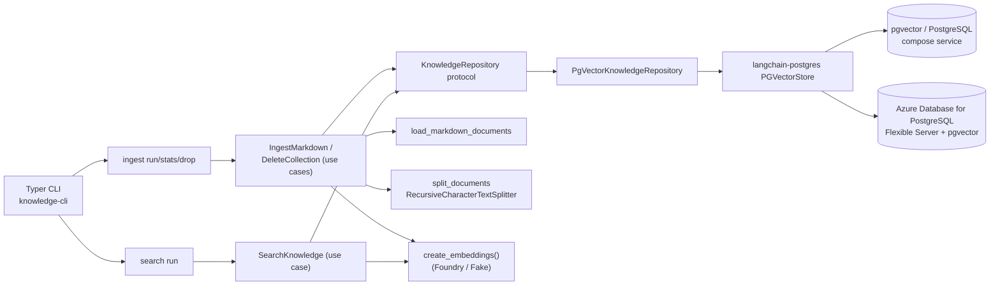

## Overview

`concierge.knowledge` is a **standalone bounded context** that ingests
Markdown files into a [pgvector](https://github.com/pgvector/pgvector)-backed
vector store via [`langchain-postgres`](https://pypi.org/project/langchain-postgres/).
It follows the same clean-architecture layering used by the other services in
this repository.

The bounded context exposes a single CLI entry point (`knowledge-cli`)
with two subcommand groups:

* `ingest` (`run` / `stats` / `drop`) — write side that creates the
  pgvector table, splits + embeds Markdown chunks, and manages the
  collection.
* `search` (`run`) — read side that runs `similarity_search` against an
  existing collection using the same embeddings factory, with both
  human-readable and `--json` output for piping.

All embedding / persistence / loader concerns are wired through
factories in `concierge.knowledge.infrastructure`, so the application
layer never imports a framework directly.



## Directory Layout

```
concierge/knowledge/
  domain/
    entities.py          # KnowledgeDocument, KnowledgeChunk, KnowledgeSearchResult
    value_objects.py     # CollectionName, ChunkId, ContentHash
    exceptions.py        # CollectionValidationError
  application/
    repositories.py      # KnowledgeRepository protocol
    use_cases.py         # IngestMarkdown / DeleteCollection / SearchKnowledge
  infrastructure/
    cli/app.py           # knowledge-cli (Typer)
    embeddings/factory.py    # create_embeddings() (foundry|fake)
    loaders/markdown.py      # load_markdown_documents() / split_documents()
    persistence/
      factory.py             # get_knowledge_repository()
      pgvector.py            # PgVectorKnowledgeRepository (langchain-postgres)
```

The import direction `infrastructure -> application -> domain` is enforced
by `import-linter` (`knowledge-layers`, `knowledge-domain-no-frameworks`,
`knowledge-application-no-infrastructure`, `knowledge-no-agents-coupling`
in `pyproject.toml`).

## Minimal Quickstart (Docker Compose, fake embeddings)

The fastest end-to-end smoke test. **No Azure credentials required.**

```bash
# 1. Boot local pgvector
docker compose up -d postgres

# 2. Use deterministic fake embeddings so no Foundry call happens
export KNOWLEDGE_EMBEDDING_PROVIDER=fake

# 3. Ingest this repository's docs/ folder into a fresh collection
uv run knowledge-cli ingest run --collection demo_md docs

# 4. Verify the row count
uv run knowledge-cli ingest stats --collection demo_md

# 5. Try a query against the same collection
uv run knowledge-cli search run --collection demo_md "vector store" --k 3

# 6. Tear down the collection when you are done
uv run knowledge-cli ingest drop --collection demo_md --yes
```

Expected output of step 3 looks like:

```
ingest completed: files=<N> chunks=<M> records=<M>
```

## Minimal Quickstart (Azure Database for PostgreSQL + Foundry)

For the managed target, reuse the `AZURE_*` and `AZURE_AI_PROJECT_ENDPOINT`
variables described in
[Step 3 – PostgreSQL (pgvector) CRUD](../tutorial/03-postgres-vector-store.md)
and [Step 2 – Observability](../tutorial/02-observability.md).

```bash
# 1. Sign in so DefaultAzureCredential can fetch tokens for both
#    Azure PostgreSQL (Entra auth) and Foundry embeddings.
az login

# 2. Make sure your Flexible Server has the vector extension enabled
#    and your Entra principal is mapped to a PostgreSQL role
#    (see the Tutorial Step 3 page for the SQL snippet).

# 3. Ingest a Markdown directory into Azure pgvector using Foundry embeddings
uv run knowledge-cli ingest run \
  --collection demo_md \
  --target azure \
  docs

# 4. Inspect / search / drop as needed
uv run knowledge-cli ingest stats --collection demo_md --target azure
uv run knowledge-cli search run --collection demo_md --target azure "vector store"
uv run knowledge-cli ingest drop  --collection demo_md --target azure --yes
```

!!! tip "Default collection"
    Omitting `--collection` falls back to `KNOWLEDGE_DEFAULT_COLLECTION`
    (default `knowledge_default`). Useful when you want to keep all
    Markdown in a single table.

## Configuration

All knowledge settings are read by `concierge.settings.KnowledgeSettings`
with the **`KNOWLEDGE_`** prefix. PostgreSQL connection settings are reused
from `PostgresSettings` (`POSTGRES_*`) for `--target docker` and
`AzurePostgresSettings` (`AZURE_*`) for `--target azure`.

| Variable | Default | Description |
|----------|---------|-------------|
| `KNOWLEDGE_EMBEDDING_PROVIDER` | `foundry` | `foundry` uses Azure AI Foundry with `DefaultAzureCredential`; `fake` uses `DeterministicFakeEmbedding` (no network calls). |
| `KNOWLEDGE_EMBEDDING_MODEL` | `text-embedding-3-small` | Foundry deployment name passed to `init_embeddings("azure_ai:<model>")`. |
| `KNOWLEDGE_VECTOR_SIZE` | `1536` | Embedding dimension used when creating the pgvector table. Must match the embedding model. |
| `KNOWLEDGE_VECTOR_BACKEND` | `pgvector` | Vector store backend. Only `pgvector` is implemented today. |
| `KNOWLEDGE_DEFAULT_COLLECTION` | `knowledge_default` | Table name used when `--collection` is omitted. Must match `^[A-Za-z0-9_]+$`. |
| `KNOWLEDGE_CHUNK_SIZE` | `1000` | `RecursiveCharacterTextSplitter` `chunk_size`. |
| `KNOWLEDGE_CHUNK_OVERLAP` | `200` | `RecursiveCharacterTextSplitter` `chunk_overlap`. |
| `AZURE_AI_PROJECT_ENDPOINT` | `""` | Required when `KNOWLEDGE_EMBEDDING_PROVIDER=foundry`. The CLI derives the OpenAI-compatible `/openai/v1` endpoint automatically. |

`--target azure` additionally consumes `AZURE_DBHOST`, `AZURE_DBNAME`,
`AZURE_DBUSER`, `AZURE_USE_ENTRA_AUTH`, and (when Entra auth is disabled)
`AZURE_DBPASSWORD`. See
[Step 3 – PostgreSQL (pgvector) CRUD](../tutorial/03-postgres-vector-store.md)
for the full description and provisioning steps.

## Programmatic use

You can also drive the same use cases from Python without going through the
CLI. This is how `agents` / RAG callers wire a retriever on top of an
existing collection:

```python
from concierge.knowledge.application.use_cases import SearchKnowledge
from concierge.knowledge.domain.value_objects import CollectionName
from concierge.knowledge.infrastructure.embeddings.factory import create_embeddings
from concierge.knowledge.infrastructure.persistence.factory import get_knowledge_repository
from concierge.settings import KnowledgeTarget

collection = CollectionName("demo_md")
repository = get_knowledge_repository(
    collection=collection,
    target=KnowledgeTarget.DOCKER,
    embeddings=create_embeddings(),
)

results = SearchKnowledge(repository).execute(collection, query="vector store", k=3)
for result in results:
    print(result.metadata.get("source"), result.content[:80])
```

See the [Knowledge CLI Reference](cli.md) for every command and flag.
