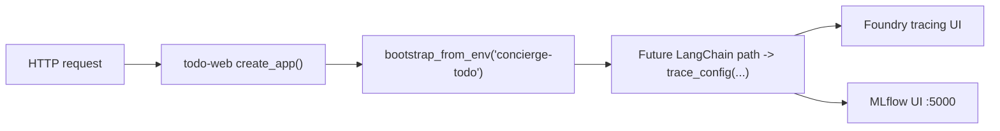
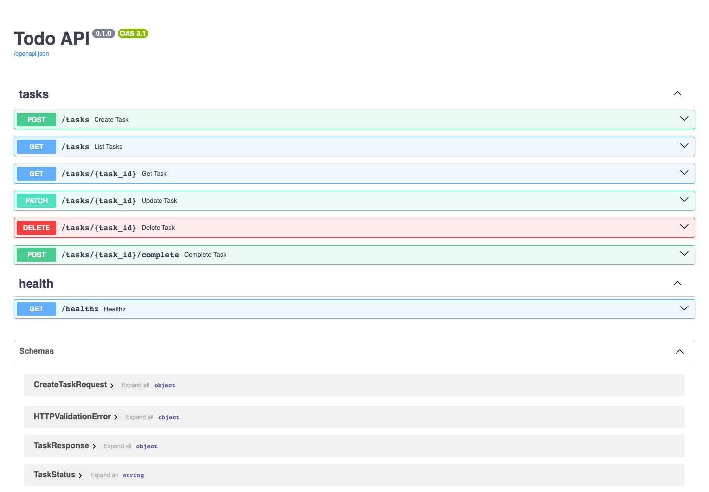
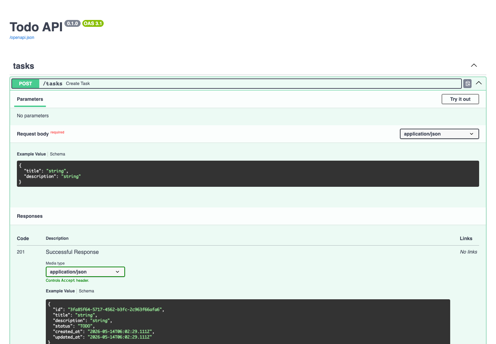
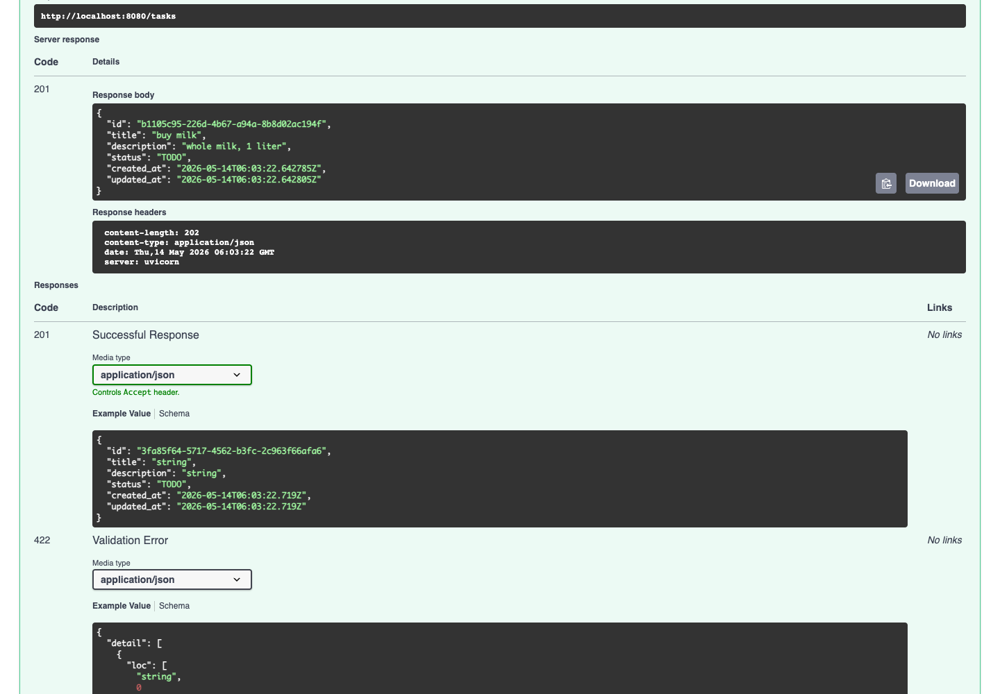

## Boot the API

```bash
uv run todo-web
```

The server listens on `http://localhost:8080`. Open
[`http://localhost:8080/docs`](http://localhost:8080/docs) to load the
interactive Swagger UI (rendered by FastAPI from the OpenAPI schema at
[`/openapi.json`](http://localhost:8080/openapi.json)).

## Observability wiring

```bash
CONCIERGE_TRACING_ENABLED=true CONCIERGE_MLFLOW_ENABLED=true uv run todo-web
```

`todo` currently does not execute LangChain calls, so tracing output is limited.
The bootstrap is still enabled to keep future LLM features observable without
additional wiring.





## Endpoints at a glance

| Method | Path | Description |
|---|---|---|
| POST | `/tasks` | Create task |
| GET | `/tasks` | List tasks |
| GET | `/tasks/{task_id}` | Get task |
| PATCH | `/tasks/{task_id}` | Update task |
| POST | `/tasks/{task_id}/complete` | Complete task (`status -> DONE`) |
| DELETE | `/tasks/{task_id}` | Delete task |
| GET | `/healthz` | Health check |

## Try a request from the browser

Swagger UI exposes every endpoint with built-in request/response examples.
The screenshot below shows what you see after clicking the `POST /tasks` row:
the request body schema, the example payload, and the response codes.



1. Click any endpoint row to expand it.
2. Click **Try it out**, edit the request body, then click **Execute**.
3. The "Server response" panel shows the status code, body, and headers.

For `POST /tasks`, sending `{"title": "buy milk", "description": "whole milk, 1 liter"}`
returns `201 Created` with the persisted task:



## Curl equivalents

The Swagger UI prints the equivalent `curl` invocation for every request, so
the flow below is identical to clicking through the UI.

```bash
# 1. Create
curl -X POST http://localhost:8080/tasks \
  -H 'content-type: application/json' \
  -d '{"title":"buy milk","description":"whole milk, 1 liter"}'

# 2. List
curl http://localhost:8080/tasks

# 3. Update (replace <id> with the id returned from step 1)
curl -X PATCH http://localhost:8080/tasks/<id> \
  -H 'content-type: application/json' \
  -d '{"status":"IN_PROGRESS"}'

# 4. Complete
curl -X POST http://localhost:8080/tasks/<id>/complete

# 5. Delete
curl -X DELETE http://localhost:8080/tasks/<id>
```

## Response shape

The `TaskResponse` schema is auto-generated from the Pydantic model and is
visible at the bottom of the Swagger page. Every task carries a UUID `id`,
the `title` / `description`, a `status` value (`TODO` / `IN_PROGRESS` /
`DONE`), and timestamps:

```json
{
  "id": "3fa85f64-5717-4562-b3fc-2c963f66afa6",
  "title": "buy milk",
  "description": "whole milk, 1 liter",
  "status": "TODO",
  "created_at": "2026-05-14T06:03:22.642785Z",
  "updated_at": "2026-05-14T06:03:22.642805Z"
}
```
