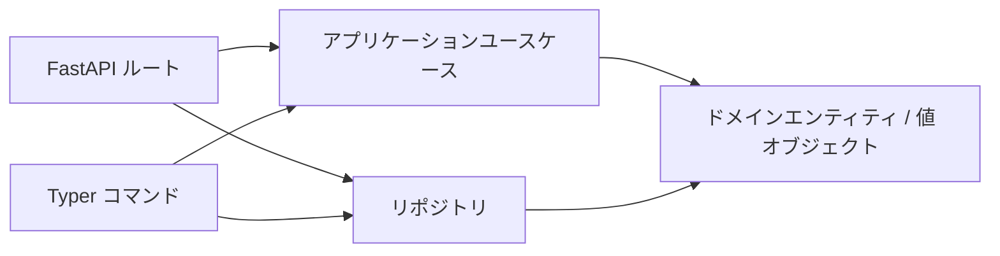

## 概要

この Todo サンプルは、本リポジトリで最小構成のクリーンアーキテクチャを示します。



## クイックスタート

```bash
uv run todo-web
```

```bash
uv run todo-cli task create --title "buy milk"
```

## 永続化バックエンド

Todo アプリの設定は `concierge.settings.TodoSettings`
に集約されており、`TODO_REPOSITORY_BACKEND` および
`TODO_TABLE_NAME` を環境変数（または `.env`）から読み込みます。
バックエンドは `concierge.settings.TodoRepositoryBackend`
列挙型に限定されているため、未定義の値が指定された場合は
起動時にバリデーションエラーになり、タイプミスが暗黙的に
挙動を変えることはありません。

| `TODO_REPOSITORY_BACKEND` | 列挙メンバー | 説明 |
|---|---|---|
| `memory`（デフォルト） | `TodoRepositoryBackend.MEMORY` | インメモリ保存。プロセス再起動でデータは失われます |
| `postgres` | `TodoRepositoryBackend.POSTGRES` | ローカル Docker Compose PostgreSQL（`POSTGRES_*` 変数を使用） |
| `azure-postgres` | `TodoRepositoryBackend.AZURE_POSTGRES` | Azure Database for PostgreSQL Flexible Server（`AZURE_*` 変数を使用） |

### PostgreSQL クイックスタート（Docker Compose）

`.env` に `TODO_REPOSITORY_BACKEND=postgres` を設定し（`.env.template` 参照）、以下を実行します:

```bash
# 1. ローカル PostgreSQL サービスを起動
docker compose up -d postgres

# 2. スキーマを初期化
uv run todo-cli db init

# 3. PostgreSQL バックエンドで API サーバを起動
uv run todo-web

# 4. タスクを作成・一覧表示（データが永続化されます）
uv run todo-cli task create --title "牛乳を買う"
uv run todo-cli task list
```

### Azure Database for PostgreSQL

`.env` に `TODO_REPOSITORY_BACKEND=azure-postgres` および `AZURE_*` 変数を設定し（`.env.template` 参照）、以下を実行します:

```bash
# Entra ID 認証（AZURE_USE_ENTRA_AUTH=true）
uv run todo-cli db init
uv run todo-cli task create --title "クラウドタスク"
```

### データベース CLI コマンド

```bash
# スキーマ初期化（CREATE TABLE IF NOT EXISTS）
uv run todo-cli db init

# 接続確認（SELECT 1）
uv run todo-cli db ping

# テーブル削除（確認プロンプトあり）
uv run todo-cli db drop
```
