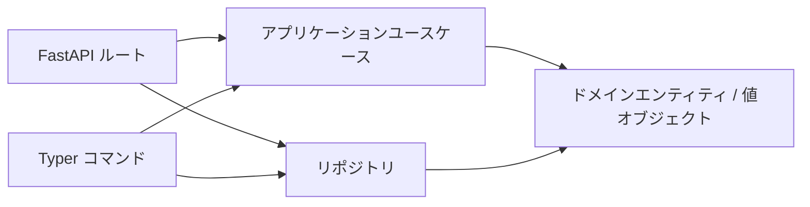

## 概要

**クリーンアーキテクチャ**で実装された最小構成の Todo アプリです。
同じビジネスロジック (`application/use_cases.py` と `domain/entities.py`)
を Typer CLI と FastAPI Web API の 2 つの入口から呼び出すことで、層の境界
が見える形になっています。



## 60 秒で試す

```bash
# 1. API サーバを起動 (デフォルトは in-memory バックエンド)
uv run todo-web

# 2. ブラウザで Swagger UI を開く
open http://localhost:8080/docs

# 3. 別ターミナルから CLI でも操作できます
uv run todo-cli task create --title "buy milk"
uv run todo-cli task list
```

Swagger UI は以下のような画面です。各行をクリックして **Try it out** を
押すと、起動中のサーバに対して実際のリクエストを送れます。


エンドポイントごとの使い方は [REST API リファレンス](api.md) を、CLI 側は
[CLI リファレンス](cli.md) を参照してください。

## 永続化バックエンドを選ぶ

Todo アプリの設定は `concierge.settings.TodoSettings`
に集約されており、`TODO_REPOSITORY_BACKEND` および
`TODO_TABLE_NAME` を環境変数（または `.env`）から読み込みます。
バックエンドは `concierge.settings.TodoRepositoryBackend`
列挙型に限定されているため、未定義の値は起動時に弾かれます。

| `TODO_REPOSITORY_BACKEND` | 列挙メンバー | 使いどころ |
|---|---|---|
| `memory`（デフォルト） | `TodoRepositoryBackend.MEMORY` | 最初の試運転。プロセス再起動でデータは失われます |
| `postgres` | `TodoRepositoryBackend.POSTGRES` | ローカル Docker Compose PostgreSQL（`POSTGRES_*` 変数） |
| `azure-postgres` | `TodoRepositoryBackend.AZURE_POSTGRES` | Azure Database for PostgreSQL Flexible Server（`AZURE_*` 変数） |

### PostgreSQL クイックスタート（Docker Compose）

`.env` に `TODO_REPOSITORY_BACKEND=postgres` を設定し（`.env.template` 参照）、以下を実行します:

```bash
# 1. ローカル PostgreSQL サービスを起動
docker compose up -d postgres

# 2. スキーマを初期化
uv run todo-cli db init

# 3. PostgreSQL バックエンドで API サーバを起動
uv run todo-web

# 4. タスクを作成・一覧表示（データが永続化されます）
uv run todo-cli task create --title "牛乳を買う"
uv run todo-cli task list
```

### Azure Database for PostgreSQL

`.env` に `TODO_REPOSITORY_BACKEND=azure-postgres` および `AZURE_*` 変数を設定し（`.env.template` 参照）、以下を実行します:

```bash
# Entra ID 認証（AZURE_USE_ENTRA_AUTH=true）
uv run todo-cli db init
uv run todo-cli task create --title "クラウドタスク"
```

### データベース CLI コマンド

```bash
# スキーマ初期化（CREATE TABLE IF NOT EXISTS）
uv run todo-cli db init

# 接続確認（SELECT 1）
uv run todo-cli db ping

# テーブル削除（確認プロンプトあり）
uv run todo-cli db drop
```
