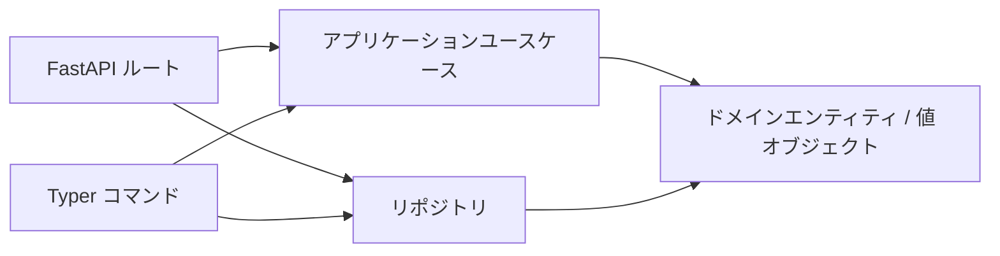

## 概要

この Todo サンプルは、本リポジトリで最小構成のクリーンアーキテクチャを示します。



## クイックスタート

```bash
uv run uvicorn concierge.todo.infrastructure.web.app:create_app --factory --host 0.0.0.0 --port 8000
```

```bash
uv run python -m concierge.todo.infrastructure.cli.app task create --title "buy milk"
```

## 永続化バックエンド

永続化バックエンドは `TODO_REPOSITORY_BACKEND` 環境変数で切り替えます。

| 値 | 説明 |
|---|---|
| `memory`（デフォルト） | インメモリ保存。プロセス再起動でデータは失われます |
| `postgres` | ローカル Docker Compose PostgreSQL（`POSTGRES_*` 変数を使用） |
| `azure-postgres` | Azure Database for PostgreSQL Flexible Server（`AZURE_*` 変数を使用） |

### PostgreSQL クイックスタート（Docker Compose）

```bash
# 1. ローカル PostgreSQL サービスを起動
docker compose up -d postgres

# 2. スキーマを初期化
TODO_REPOSITORY_BACKEND=postgres uv run todo-cli db init

# 3. PostgreSQL バックエンドで API サーバを起動
TODO_REPOSITORY_BACKEND=postgres uv run uvicorn concierge.todo.infrastructure.web.app:create_app --factory --host 0.0.0.0 --port 8000

# 4. タスクを作成・一覧表示（データが永続化されます）
TODO_REPOSITORY_BACKEND=postgres uv run todo-cli task create --title "牛乳を買う"
TODO_REPOSITORY_BACKEND=postgres uv run todo-cli task list
```

### Azure Database for PostgreSQL

`.env` に `AZURE_*` 環境変数を設定し（`.env.template` 参照）、以下を実行します:

```bash
# Entra ID 認証（AZURE_USE_ENTRA_AUTH=true）
TODO_REPOSITORY_BACKEND=azure-postgres uv run todo-cli db init
TODO_REPOSITORY_BACKEND=azure-postgres uv run todo-cli task create --title "クラウドタスク"
```

### データベース CLI コマンド

```bash
# スキーマ初期化（CREATE TABLE IF NOT EXISTS）
uv run todo-cli db init

# 接続確認（SELECT 1）
uv run todo-cli db ping

# テーブル削除（確認プロンプトあり）
uv run todo-cli db drop
```
