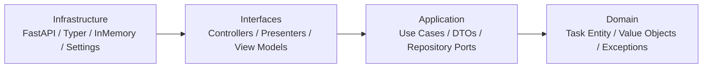

# Todo アプリ

このリポジトリには、4 層のクリーンアーキテクチャを示す小さな Todo アプリを追加しています。



## エントリポイント

```bash
uv run python -m concierge.todo.web_main
uv run python -m concierge.todo.cli_main task create --title "buy milk"
```

Web API では `/docs` で OpenAPI、`/healthz` でヘルスチェックを利用できます。
