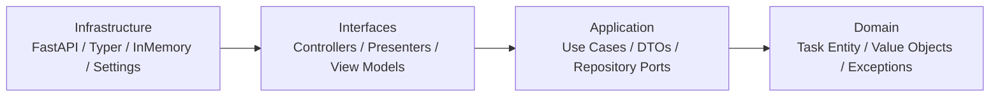

# Todo App

This repository now includes a small Todo application that demonstrates clean architecture with four layers:



## Entry points

```bash
uv run python -m concierge.todo.web_main
uv run python -m concierge.todo.cli_main task create --title "buy milk"
```

The web API exposes `/docs` for OpenAPI and `/healthz` for a lightweight health check.
