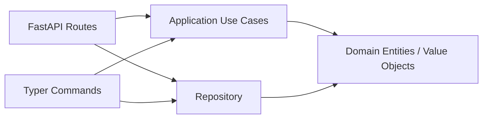

## Overview

This Todo sample demonstrates a minimal clean architecture implementation in this repository.



## Quickstart

```bash
uv run uvicorn concierge.todo.infrastructure.web.app:create_app --factory --host 0.0.0.0 --port 8000
```

```bash
uv run python -m concierge.todo.infrastructure.cli.app task create --title "buy milk"
```

## Persistence Backend

The persistence backend is selected via the `TODO_REPOSITORY_BACKEND` environment variable.

| Value | Description |
|---|---|
| `memory` (default) | In-process storage; data is lost on restart |
| `postgres` | Local Docker Compose PostgreSQL (`POSTGRES_*` variables) |
| `azure-postgres` | Azure Database for PostgreSQL Flexible Server (`AZURE_*` variables) |

### PostgreSQL Quickstart (Docker Compose)

```bash
# 1. Start the local PostgreSQL service
docker compose up -d postgres

# 2. Initialise the schema
TODO_REPOSITORY_BACKEND=postgres uv run todo-cli db init

# 3. Start the API server backed by PostgreSQL
TODO_REPOSITORY_BACKEND=postgres uv run uvicorn concierge.todo.infrastructure.web.app:create_app --factory --host 0.0.0.0 --port 8000

# 4. Create and list tasks (data is now persisted)
TODO_REPOSITORY_BACKEND=postgres uv run todo-cli task create --title "buy milk"
TODO_REPOSITORY_BACKEND=postgres uv run todo-cli task list
```

### Azure Database for PostgreSQL

Set the `AZURE_*` environment variables in `.env` (see `.env.template`), then:

```bash
# Entra ID authentication (AZURE_USE_ENTRA_AUTH=true)
TODO_REPOSITORY_BACKEND=azure-postgres uv run todo-cli db init
TODO_REPOSITORY_BACKEND=azure-postgres uv run todo-cli task create --title "cloud task"
```

### Database CLI Commands

```bash
# Initialise schema (CREATE TABLE IF NOT EXISTS)
uv run todo-cli db init

# Check connectivity (SELECT 1)
uv run todo-cli db ping

# Drop table (with confirmation)
uv run todo-cli db drop
```
