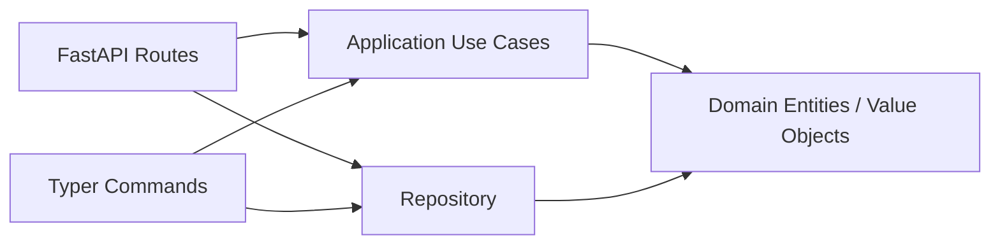

## Overview

A minimal Todo app implemented with **clean architecture**. The same
business logic (`application/use_cases.py`, `domain/entities.py`) is shared
between two entry points - a Typer CLI and a FastAPI Web API - so the
boundaries between layers stay visible.



## TL;DR (60-second tour)

```bash
# 1. Boot the API (uses the in-memory backend by default)
uv run todo-web

# 2. Open Swagger UI in your browser
open http://localhost:8080/docs

# 3. Or drive it from the CLI in another terminal
uv run todo-cli task create --title "buy milk"
uv run todo-cli task list
```

The Swagger UI looks like this. Every endpoint is interactive - click any
row, then **Try it out**, to send real requests against the running server.


Continue to the [REST API Reference](api.md) for a verb-by-verb walkthrough,
or the [CLI Reference](cli.md) for the Typer commands.

## Choose a persistence backend

All Todo configuration is centralised in `concierge.settings.TodoSettings`,
which reads `TODO_REPOSITORY_BACKEND` and `TODO_TABLE_NAME` from the
environment (or `.env`). The backend is restricted to the
`concierge.settings.TodoRepositoryBackend` enum - typos are rejected at
startup.

| `TODO_REPOSITORY_BACKEND` | Enum member | When to use it |
|---|---|---|
| `memory` (default) | `TodoRepositoryBackend.MEMORY` | First read-through; data is lost on restart |
| `postgres` | `TodoRepositoryBackend.POSTGRES` | Local Docker Compose PostgreSQL (`POSTGRES_*` variables) |
| `azure-postgres` | `TodoRepositoryBackend.AZURE_POSTGRES` | Azure Database for PostgreSQL Flexible Server (`AZURE_*` variables) |

### PostgreSQL Quickstart (Docker Compose)

Set `TODO_REPOSITORY_BACKEND=postgres` in `.env` (see `.env.template`), then:

```bash
# 1. Start the local PostgreSQL service
docker compose up -d postgres

# 2. Initialise the schema
uv run todo-cli db init

# 3. Start the API server backed by PostgreSQL
uv run todo-web

# 4. Create and list tasks (data is now persisted)
uv run todo-cli task create --title "buy milk"
uv run todo-cli task list
```

### Azure Database for PostgreSQL

Set `TODO_REPOSITORY_BACKEND=azure-postgres` and the `AZURE_*` variables in
`.env` (see `.env.template`), then:

```bash
# Entra ID authentication (AZURE_USE_ENTRA_AUTH=true)
uv run todo-cli db init
uv run todo-cli task create --title "cloud task"
```

### Database CLI Commands

```bash
# Initialise schema (CREATE TABLE IF NOT EXISTS)
uv run todo-cli db init

# Check connectivity (SELECT 1)
uv run todo-cli db ping

# Drop table (with confirmation)
uv run todo-cli db drop
```
