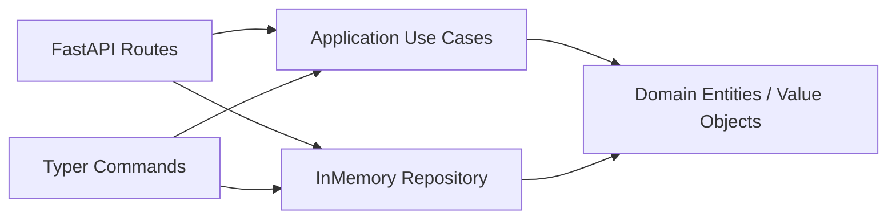

## Overview

This Todo sample demonstrates a minimal clean architecture implementation in this repository.



## Quickstart

```bash
uv run uvicorn concierge.todo.infrastructure.web.app:create_app --factory --host 0.0.0.0 --port 8000
```

```bash
uv run python -m concierge.todo.infrastructure.cli.app task create --title "buy milk"
```
