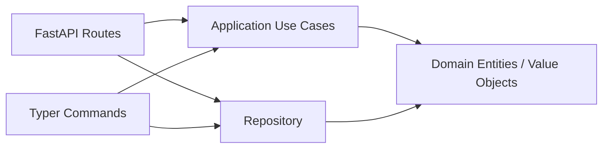

## Overview

This Todo sample demonstrates a minimal clean architecture implementation in this repository.



## Quickstart

```bash
uv run todo-web
```

```bash
uv run todo-cli task create --title "buy milk"
```

## Persistence Backend

All Todo configuration is centralised in `concierge.settings.TodoSettings`,
which reads `TODO_REPOSITORY_BACKEND` and `TODO_TABLE_NAME` from the
environment (or `.env`). The backend is restricted to the
`concierge.settings.TodoRepositoryBackend` enum — passing an unknown
value raises a validation error at startup, so typos cannot silently
change behaviour.

| `TODO_REPOSITORY_BACKEND` | Enum member | Description |
|---|---|---|
| `memory` (default) | `TodoRepositoryBackend.MEMORY` | In-process storage; data is lost on restart |
| `postgres` | `TodoRepositoryBackend.POSTGRES` | Local Docker Compose PostgreSQL (`POSTGRES_*` variables) |
| `azure-postgres` | `TodoRepositoryBackend.AZURE_POSTGRES` | Azure Database for PostgreSQL Flexible Server (`AZURE_*` variables) |

### PostgreSQL Quickstart (Docker Compose)

Set `TODO_REPOSITORY_BACKEND=postgres` in `.env` (see `.env.template`), then:

```bash
# 1. Start the local PostgreSQL service
docker compose up -d postgres

# 2. Initialise the schema
uv run todo-cli db init

# 3. Start the API server backed by PostgreSQL
uv run todo-web

# 4. Create and list tasks (data is now persisted)
uv run todo-cli task create --title "buy milk"
uv run todo-cli task list
```

### Azure Database for PostgreSQL

Set `TODO_REPOSITORY_BACKEND=azure-postgres` and the `AZURE_*` variables in
`.env` (see `.env.template`), then:

```bash
# Entra ID authentication (AZURE_USE_ENTRA_AUTH=true)
uv run todo-cli db init
uv run todo-cli task create --title "cloud task"
```

### Database CLI Commands

```bash
# Initialise schema (CREATE TABLE IF NOT EXISTS)
uv run todo-cli db init

# Check connectivity (SELECT 1)
uv run todo-cli db ping

# Drop table (with confirmation)
uv run todo-cli db drop
```
