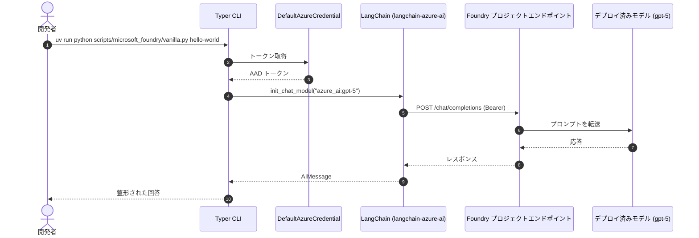

# ステップ 1 - Microsoft Foundry + LangChain

!!! info "参照 Issue"
    [#3 - set up LangGraph project](https://github.com/ks6088ts-labs/concierge/issues/3) (Closed)

## ゴール

このステップ完了時には、以下の状態になります。

- uv で管理された Python 環境が動作している。
- Microsoft Foundry プロジェクトを指す `.env` が用意されている。
- Foundry にホストされたモデルに対して **チャット**、**エージェント**、
  **埋め込み**、**ベクトル検索** を実行できる Typer CLI が動作する。

これは Issue [#3](https://github.com/ks6088ts-labs/concierge/issues/3) で
完了した内容そのものです。

## なぜこのステップが必要か

Microsoft Foundry のモデルは 2 種類のエンドポイント形状で公開されています。

- **プロジェクトエンドポイント**
  (`https://<resource>.services.ai.azure.com/api/projects/<project>`):
  チャット、エージェントなど多くの API で利用します。
- **リソース直下の OpenAI v1 エンドポイント**
  (`https://<resource>.services.ai.azure.com/openai/v1`):
  埋め込み API はプロジェクトスコープのパスでは提供されないため、
  こちらを使う必要があります。
  この差分は [`scripts/microsoft_foundry/vanilla.py`](https://github.com/ks6088ts-labs/concierge/blob/main/scripts/microsoft_foundry/vanilla.py)
  の `_resource_openai_v1_endpoint()` に集約されています。

LangChain は
[`langchain-azure-ai`](https://docs.langchain.com/oss/python/integrations/providers/microsoft#azure-ai)
を介して Foundry 統合をファーストクラスでサポートしているため、本リポジトリ
ではこのパッケージを標準採用してコード量を抑えています。



## 事前チェック

- [x] [Overview の前提条件](index.md#前提条件) を満たしている。
- [x] `az login` 済みで、Foundry プロジェクトを保有するサブスクリプションを
      選択している。
- [x] Foundry プロジェクトにチャットモデルが少なくとも 1 つデプロイされて
      いる。

## 手順

### 1.1 クローンと依存関係のインストール

```shell
git clone https://github.com/ks6088ts-labs/concierge.git
cd concierge

# uv 経由で runtime + dev + docs を .venv にインストールします
make install-deps-dev

# リポジトリのテンプレートからローカル用の環境ファイルを作成します
cp .env.template .env
```

`make install-deps-dev` は `uv sync --all-groups` と pre-commit フックの
インストールを行います。完了後、`.venv` には `langchain` / `langgraph` /
`langchain-azure-ai` / `azure-identity` などが入っています。

### 1.2 環境変数の設定

`.env.template` からコピーした `.env` を開きます。必須項目は Foundry プロ
ジェクトの概要ページ (Microsoft Foundry → 該当プロジェクト → *概要* →
*プロジェクト詳細*) で確認できます。

```dotenv
# .env
AZURE_AI_PROJECT_ENDPOINT=https://<your-resource>.services.ai.azure.com/api/projects/<your-project>
```

このエンドポイントは
[`concierge/settings/microsoft_foundry.py`](https://github.com/ks6088ts-labs/concierge/blob/main/concierge/settings/microsoft_foundry.py)
で型付き設定としてバインドされます。

```python
class MicrosoftFoundrySettings(BaseSettings):
    azure_ai_project_endpoint: str = ""

    model_config = SettingsConfigDict(
        env_file=".env",
        env_file_encoding="utf-8",
        case_sensitive=False,
        extra="ignore",
    )
```

!!! note "なぜ Pydantic Settings なのか"
    `pydantic-settings` で読み込むと、ローカルの `.env`、CI シークレット、
    コンテナの環境変数のいずれも同じ型インターフェースで扱えます。
    `os.environ` をコード全体に散らさずに済むのが利点です。

### 1.3 最初のチャット呼び出し

```shell
uv run python scripts/microsoft_foundry/vanilla.py hello-world \
    --query "Hello, how are you doing today?"
```

内部では以下のようなコードが走ります。

```python
# scripts/microsoft_foundry/vanilla.py (抜粋)
from langchain.chat_models import init_chat_model

chat_model = init_chat_model("azure_ai:gpt-5")
response = chat_model.invoke(query)
response.pretty_print()
```

`init_chat_model` は `"<provider>:<model>"` 形式の文字列を受け取り、
`azure_ai` の場合は `langchain-azure-ai` 統合に解決されます。スクリプトは
Typer 起動前に `.env` を読み込むため、`AZURE_AI_PROJECT_ENDPOINT` はプロ
バイダ統合から参照できます。`direct-client`、トレーシング、埋め込みのよう
にクライアントを直接生成するコマンドでは、同じ値を
`get_microsoft_foundry_settings()` 経由でも読み込みます。

!!! tip "モデル名ではなくデプロイ名を使う"
    例で指定している `--model` は Foundry のデプロイ名です。プロジェクトの
    デプロイ名が `gpt-5` / `text-embedding-3-small` でない場合は、Foundry の
    *Models + endpoints* に表示される名前に置き換えてください。

### 1.4 そのほかの CLI コマンドを試す

サブコマンド一覧:

```shell
uv run python scripts/microsoft_foundry/vanilla.py --help
```

| サブコマンド          | 内容                                                                                | 公式ドキュメント |
| :-------------------- | :---------------------------------------------------------------------------------- | :--------------- |
| `hello-world`         | `init_chat_model` でのシンプルなチャット                                            | [Use chat models](https://learn.microsoft.com/ja-jp/azure/foundry/how-to/develop/langchain-models#use-chat-models) |
| `configurable`        | `temperature` を渡し、呼び出しごとにモデルを切り替える                              | [Configurable models](https://learn.microsoft.com/ja-jp/azure/foundry/how-to/develop/langchain-models#configurable-models) |
| `direct-client`       | `AzureAIOpenAIApiChatModel` を直接生成                                              | [Configure clients directly](https://learn.microsoft.com/ja-jp/azure/foundry/how-to/develop/langchain-models#configure-clients-directly) |
| `async-call`          | 非同期 `DefaultAzureCredential` と `ainvoke`                                        | [Run asynchronous calls](https://learn.microsoft.com/ja-jp/azure/foundry/how-to/develop/langchain-models#run-asynchronous-calls) |
| `reasoning`           | 推論ブロックをストリーミング (推論対応モデルが必要)                                 | [Reasoning](https://learn.microsoft.com/ja-jp/azure/foundry/how-to/develop/langchain-models#reasoning) |
| `server-side-tools`   | 組み込みツール `WebSearchTool` をバインド                                           | [Server-side tools](https://learn.microsoft.com/ja-jp/azure/foundry/how-to/develop/langchain-models#server-side-tools) |
| `use-in-agents`       | `langchain.agents.create_agent` でエージェント化                                    | [Use Foundry models in agents](https://learn.microsoft.com/ja-jp/azure/foundry/how-to/develop/langchain-models#use-foundry-models-in-agents) |
| `embeddings`          | `init_embeddings` で埋め込みモデルを呼び出す                                        | [Use embedding models](https://learn.microsoft.com/ja-jp/azure/foundry/how-to/develop/langchain-models#use-embedding-models) |
| `embeddings-direct`   | `AzureAIOpenAIApiEmbeddingsModel` を直接生成                                        | [Use embedding models](https://learn.microsoft.com/ja-jp/azure/foundry/how-to/develop/langchain-models#use-embedding-models) |
| `vector-store-search` | 埋め込み + `InMemoryVectorStore` で類似検索                                         | [Run similarity search with a vector store](https://learn.microsoft.com/ja-jp/azure/foundry/how-to/develop/langchain-models#example-run-similarity-search-with-a-vector-store) |

代表的な実行例:

=== "Configurable"

    ```shell
    uv run python scripts/microsoft_foundry/vanilla.py configurable \
        --model gpt-5 --temperature 0.2 \
        --query "LangGraph を一文で要約してください。"
    ```

=== "Reasoning ストリーミング"

    ```shell
    uv run python scripts/microsoft_foundry/vanilla.py reasoning \
        --model azure_ai:DeepSeek-R1-0528
    ```

=== "埋め込み + ベクトル検索"

    ```shell
    uv run python scripts/microsoft_foundry/vanilla.py embeddings \
        --text "The quick brown fox jumps over the lazy dog."

    uv run python scripts/microsoft_foundry/vanilla.py vector-store-search \
        --query thud --k 1
    ```

!!! warning "埋め込み API はリソース直下のエンドポイントを使う"
    [`scripts/microsoft_foundry/vanilla.py`](https://github.com/ks6088ts-labs/concierge/blob/main/scripts/microsoft_foundry/vanilla.py)
    内の `_resource_openai_v1_endpoint()` が `AZURE_AI_PROJECT_ENDPOINT`
    から `/api/projects/<project>` を取り除き `/openai/v1` に置き換えます。
    追加の環境変数は不要ですが、同じリソースに `text-embedding-*` モデルが
    デプロイされている必要があります。

## 動作確認

正常に動作すると以下のような出力になります (一部省略)。

```text
================================== Ai Message ==================================

Hello! I'm doing well, thanks for asking. ...
```

`pretty_print` 経由で `AIMessage` の内容が表示されればモデル連携は成功
しています。

## トラブルシューティング

??? failure "`DefaultAzureCredential failed to retrieve a token`"
    `az login` を再実行するか、サービスプリンシパルを使う場合は
    `AZURE_TENANT_ID` / `AZURE_CLIENT_ID` / `AZURE_CLIENT_SECRET` を設定
    します。詳細は
    [DefaultAzureCredential のドキュメント](https://learn.microsoft.com/ja-jp/python/api/azure-identity/azure.identity.defaultazurecredential)。

??? failure "`DeploymentNotFound` または `404 model_not_found`"
    `init_chat_model` に渡す文字列 (例: `azure_ai:gpt-5`) は Foundry プロ
    ジェクトの **デプロイ名** と一致している必要があります (モデル名では
    ありません)。Foundry → モデル + エンドポイントで確認してください。

??? failure "埋め込み API が 404 を返す"
    プロジェクトを支えるリソースに埋め込みモデル
    (例: `text-embedding-3-small`) がデプロイされているか、`_resource_openai_v1_endpoint()`
    が返す URL に到達可能かを確認してください。

## 次のステップ

Foundry のモデルとは話せるようになりましたが、各呼び出しの中身を観測する
仕組みがまだありません。次のステップでは、プロンプト・レイテンシ・トーク
ン使用量をエンドツーエンドで追えるようにします。

[ステップ 2 - 観測性 (トレース & MLflow)](02-observability.md) に進みます。
