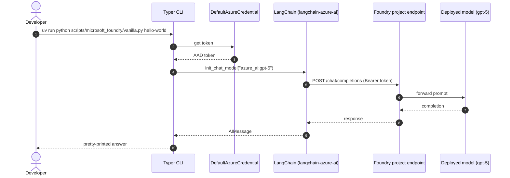

# Step 1 - Microsoft Foundry + LangChain

!!! info "Reference issue"
    [#3 - set up LangGraph project](https://github.com/ks6088ts-labs/concierge/issues/3) (Closed)

## Goal

By the end of this step you will have:

- a working uv-managed Python environment,
- a `.env` pointing at your Microsoft Foundry project,
- and a working Typer CLI that can call **chat**, **agent**, **embedding**, and
  **vector-store** flows against a Foundry-hosted model.

This is exactly what Issue [#3](https://github.com/ks6088ts-labs/concierge/issues/3)
delivered.

## Why this step exists

Microsoft Foundry exposes models behind two endpoint shapes:

- a **project endpoint** (`https://<resource>.services.ai.azure.com/api/projects/<project>`)
  used for chat completions, agents, and most APIs,
- a **resource-level OpenAI v1 endpoint** (`https://<resource>.services.ai.azure.com/openai/v1`)
  required for embeddings (the project-scoped path does not currently serve
  embeddings - this nuance is encoded in
  [`scripts/microsoft_foundry/vanilla.py`](https://github.com/ks6088ts-labs/concierge/blob/main/scripts/microsoft_foundry/vanilla.py).

LangChain ships first-class integrations through
[`langchain-azure-ai`](https://docs.langchain.com/oss/python/integrations/providers/microsoft#azure-ai),
so we standardise on that package and keep our code thin.



## Prerequisites checklist

- [x] You completed the [Overview prerequisites](index.md#prerequisites).
- [x] You have run `az login` and selected the subscription that owns the
      Foundry project.
- [x] At least one chat model is deployed in your Foundry project.

## Steps

### 1.1 Clone and bootstrap

```shell
git clone https://github.com/ks6088ts-labs/concierge.git
cd concierge

# Installs runtime + dev + docs groups into .venv via uv
make install-deps-dev

# Creates a local environment file from the repository template
cp .env.template .env
```

`make install-deps-dev` runs `uv sync --all-groups` and installs the
pre-commit hooks. After this you have an isolated `.venv` containing
`langchain`, `langgraph`, `langchain-azure-ai`, `azure-identity`, and the rest
of [`pyproject.toml`](https://github.com/ks6088ts-labs/concierge/blob/main/pyproject.toml).

### 1.2 Configure environment variables

Open the `.env` file you copied from `.env.template`. The required Foundry value
comes from your project overview page (Microsoft Foundry → your project →
*Overview* → *Project details*).

```dotenv
# .env
AZURE_AI_PROJECT_ENDPOINT=https://<your-resource>.services.ai.azure.com/api/projects/<your-project>
```

The endpoint is bound to a typed settings class in
[`concierge/settings/microsoft_foundry.py`](https://github.com/ks6088ts-labs/concierge/blob/main/concierge/settings/microsoft_foundry.py):

```python
class MicrosoftFoundrySettings(BaseSettings):
    azure_ai_project_endpoint: str = ""

    model_config = SettingsConfigDict(
        env_file=".env",
        env_file_encoding="utf-8",
        case_sensitive=False,
        extra="ignore",
    )
```

!!! note "Why Pydantic Settings?"
    Reading config through `pydantic-settings` gives us a single typed entry
    point that works the same way for local `.env` files, CI secrets, and
    container environment variables - no `os.environ` scattered across the
    code.

### 1.3 Run your first chat call

```shell
uv run python scripts/microsoft_foundry/vanilla.py hello-world \
    --query "Hello, how are you doing today?"
```

What happens under the hood:

```python
# scripts/microsoft_foundry/vanilla.py (simplified)
from langchain.chat_models import init_chat_model

chat_model = init_chat_model("azure_ai:gpt-5")
response = chat_model.invoke(query)
response.pretty_print()
```

`init_chat_model` accepts the `"<provider>:<model>"` shorthand and resolves
`azure_ai` to the `langchain-azure-ai` integration. The script loads `.env`
before Typer runs, so `AZURE_AI_PROJECT_ENDPOINT` is available to the provider
integration. Commands that build clients directly (`direct-client`, tracing,
and embeddings) also read the same value through `get_microsoft_foundry_settings()`.

!!! tip "Use deployment names"
    The `--model` values in the examples are deployment names. Keep the
    defaults if your Foundry project uses `gpt-5` and `text-embedding-3-small`;
    otherwise replace them with the names shown under *Models + endpoints* in
    your project.

### 1.4 Explore the other CLI commands

List every subcommand:

```shell
uv run python scripts/microsoft_foundry/vanilla.py --help
```

| Subcommand            | What it demonstrates                                                                 | Upstream docs |
| :-------------------- | :----------------------------------------------------------------------------------- | :------------ |
| `hello-world`         | Plain chat call with `init_chat_model`                                               | [Use chat models](https://learn.microsoft.com/en-us/azure/foundry/how-to/develop/langchain-models#use-chat-models) |
| `configurable`        | Pass `temperature` and switch model at call time                                     | [Configurable models](https://learn.microsoft.com/en-us/azure/foundry/how-to/develop/langchain-models#configurable-models) |
| `direct-client`       | Build `AzureAIOpenAIApiChatModel` directly                                           | [Configure clients directly](https://learn.microsoft.com/en-us/azure/foundry/how-to/develop/langchain-models#configure-clients-directly) |
| `async-call`          | `ainvoke` with the async `DefaultAzureCredential`                                    | [Run asynchronous calls](https://learn.microsoft.com/en-us/azure/foundry/how-to/develop/langchain-models#run-asynchronous-calls) |
| `reasoning`           | Stream reasoning content blocks (use a reasoning-capable model)                      | [Reasoning](https://learn.microsoft.com/en-us/azure/foundry/how-to/develop/langchain-models#reasoning) |
| `server-side-tools`   | Bind built-in `WebSearchTool` to the model                                           | [Server-side tools](https://learn.microsoft.com/en-us/azure/foundry/how-to/develop/langchain-models#server-side-tools) |
| `use-in-agents`       | Wrap the model in a `langchain.agents.create_agent` agent                            | [Use Foundry models in agents](https://learn.microsoft.com/en-us/azure/foundry/how-to/develop/langchain-models#use-foundry-models-in-agents) |
| `embeddings`          | Call an embedding model via `init_embeddings`                                        | [Use embedding models](https://learn.microsoft.com/en-us/azure/foundry/how-to/develop/langchain-models#use-embedding-models) |
| `embeddings-direct`   | Same flow with `AzureAIOpenAIApiEmbeddingsModel`                                     | [Use embedding models](https://learn.microsoft.com/en-us/azure/foundry/how-to/develop/langchain-models#use-embedding-models) |
| `vector-store-search` | End-to-end embed + similarity search with `InMemoryVectorStore`                      | [Run similarity search with a vector store](https://learn.microsoft.com/en-us/azure/foundry/how-to/develop/langchain-models#example-run-similarity-search-with-a-vector-store) |

A few worth running now:

=== "Configurable model"

    ```shell
    uv run python scripts/microsoft_foundry/vanilla.py configurable \
        --model gpt-5 --temperature 0.2 \
        --query "Summarise LangGraph in one sentence."
    ```

=== "Reasoning stream"

    ```shell
    uv run python scripts/microsoft_foundry/vanilla.py reasoning \
        --model azure_ai:DeepSeek-R1-0528
    ```

=== "Embedding + vector search"

    ```shell
    uv run python scripts/microsoft_foundry/vanilla.py embeddings \
        --text "The quick brown fox jumps over the lazy dog."

    uv run python scripts/microsoft_foundry/vanilla.py vector-store-search \
        --query thud --k 1
    ```

!!! warning "Embeddings need the resource-level endpoint"
    The helper `_resource_openai_v1_endpoint()` in
    [`scripts/microsoft_foundry/vanilla.py`](https://github.com/ks6088ts-labs/concierge/blob/main/scripts/microsoft_foundry/vanilla.py)
    strips `/api/projects/<project>` off your `AZURE_AI_PROJECT_ENDPOINT` and
    replaces it with `/openai/v1`. You do not need to set a second env var,
    but you do need a `text-embedding-*` deployment on the same resource.

## Verify

A successful run looks like this (output truncated):

```text
================================== Ai Message ==================================

Hello! I'm doing well, thanks for asking. ...
```

If you see `AIMessage` content printed via `pretty_print`, the model wiring is
correct.

## Troubleshooting

??? failure "`DefaultAzureCredential failed to retrieve a token`"
    Run `az login` again, or set `AZURE_TENANT_ID` / `AZURE_CLIENT_ID` /
    `AZURE_CLIENT_SECRET` if you must use a service principal. See
    [DefaultAzureCredential docs](https://learn.microsoft.com/en-us/python/api/azure-identity/azure.identity.defaultazurecredential).

??? failure "`DeploymentNotFound` or `404 model_not_found`"
    The string passed to `init_chat_model` (e.g. `azure_ai:gpt-5`) must match a
    deployment name in your Foundry project, not the *model* name. Open Foundry
    → Models + endpoints to check.

??? failure "Embeddings call returns 404"
    Confirm that an embedding model (e.g. `text-embedding-3-small`) is
    deployed on the **resource** that backs the project, and that the
    `_resource_openai_v1_endpoint()` URL is reachable from your machine.

## What's next

You can talk to Foundry models, but you cannot yet see what is happening
inside each call. The next step adds observability so you can debug prompts,
latency, and token usage end-to-end.

Continue with [Step 2 - Observability (Tracing & MLflow)](02-observability.md).
