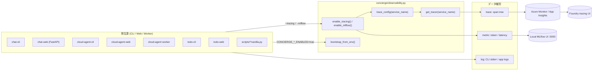
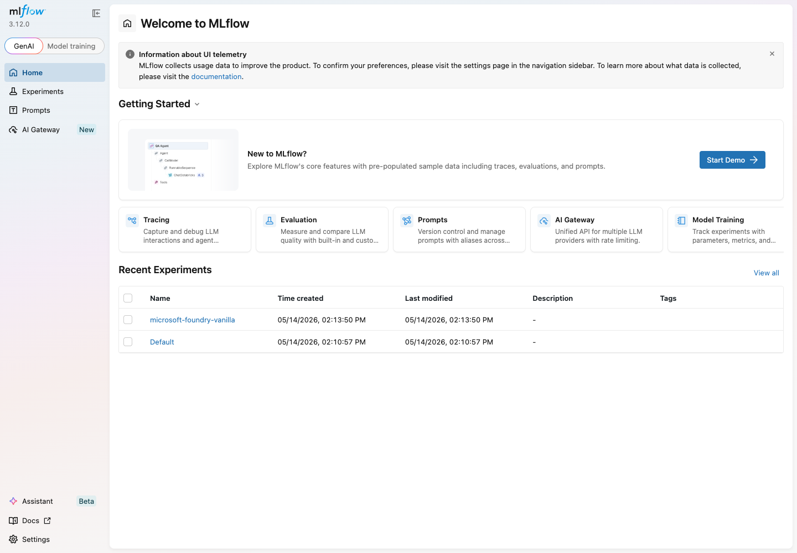
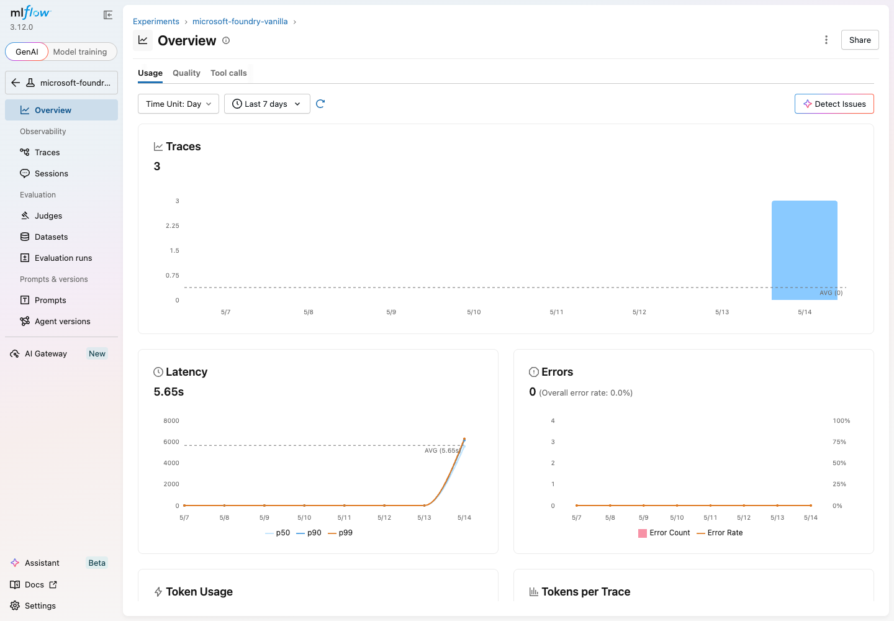
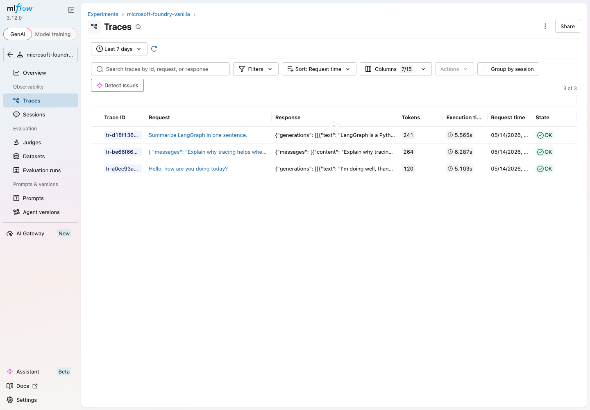
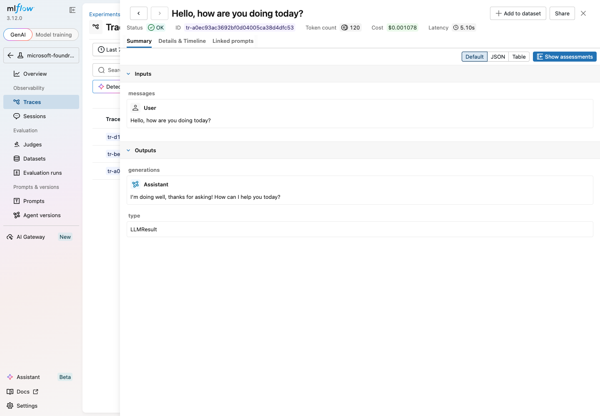
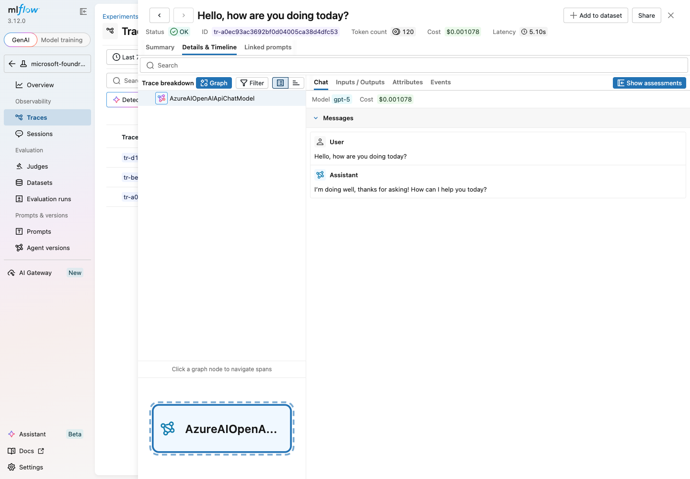

# ステップ 2 - 観測性 (トレース & MLflow)

## ゴール

同じ Typer CLI に対して、補完的な 2 つの観測バックエンドを有効化します。

| バックエンド            | 用途                                                    | 切替フラグ  |
| :---------------------- | :------------------------------------------------------ | :---------- |
| Azure Monitor / Foundry | Foundry ポータル上での LangChain トレース                 | `--tracing` |
| MLflow (ローカル)       | LangChain / LangGraph 実行のローカルトレース確認          | `--mlflow`  |

両者は独立しており、同時に有効化することもできます。

## なぜこのステップが必要か

LLM アプリのデバッグが難しい理由は、興味のある状態がプロンプト・モデル・
ツールの「あいだ」に存在するからです。**トレース** として記録できれば、
次のような問いに答えられるようになります。

- どのプロンプトでこの誤答が生まれたのか?
- 各ステップでどれくらい時間がかかったのか?
- 各呼び出しで何トークン消費したのか?

このステップでは LangChain を
[`AzureAIOpenTelemetryTracer`](https://learn.microsoft.com/ja-jp/azure/foundry/how-to/develop/langchain-traces)
経由で Azure Monitor に接続し、さらに MLflow autologging を追加してローカル
だけで反復開発できるようにします。



## サービス横展開 (`chat` / `cloud_agent` / `todo`)

- 共有配線は `concierge/observability.py` に集約。
- CLI は `--tracing` / `--mlflow` / `--verbose`。
- Web / worker は次の環境変数で切り替え:
  - `CONCIERGE_TRACING_ENABLED=true`
  - `CONCIERGE_MLFLOW_ENABLED=true`
- サービス別 tracer 名:
  - `concierge-chat`
  - `concierge-cloud-agent`
  - `concierge-todo`

## 切替の実装

CLI には Typer コールバックが定義されており、グローバルフラグを切り替えて
対応するバックエンドを遅延的に有効化します
([`scripts/microsoft_foundry/vanilla.py`](https://github.com/ks6088ts-labs/concierge/blob/main/scripts/microsoft_foundry/vanilla.py))。

```python title="簡略化した Typer コールバック"
@app.callback()
def _global_options(
    tracing: bool = typer.Option(False, "--tracing", "-t"),
    verbose: bool = typer.Option(False, "--verbose", "-v"),
    mlflow:  bool = typer.Option(False, "--mlflow",  "-m"),
):
    global _tracing_enabled
    _tracing_enabled = tracing
    if mlflow:
        _enable_mlflow()
```

各コマンドは共通ヘルパで `invoke` / `ainvoke` / `stream` を包みます。

```python title="実際のヘルパに近い形"
def _trace_config(extra=None) -> RunnableConfig:
    config = dict(extra or {})
    if _tracing_enabled:
        callbacks = list(config.get("callbacks", []))
        callbacks.append(_get_tracer())
        config["callbacks"] = callbacks
    return RunnableConfig(**config)
```

これによりコマンド側に条件分岐を持ち込まずに、トレーサーを一括で適用できる
ようになっています。

## ステップ 2a - Azure Monitor トレーシング

### なぜ Azure Monitor か

Foundry プロジェクトには Azure Monitor をベースにしたトレーシング機能が
組み込まれています。これに繋ぐと、すべての LangChain 実行を Foundry ポー
タル上から横断検索でき、追加のダッシュボードを作る必要がありません。

### Foundry 側の有効化

トレーシングには Foundry プロジェクトが Application Insights リソースと
リンクされている必要があります。まだの場合は
[Trace LangChain and LangGraph apps with Microsoft Foundry and Azure Monitor](https://learn.microsoft.com/ja-jp/azure/foundry/how-to/develop/langchain-traces)
の手順でポータルから有効化してください。

### `--tracing` 付きで実行

```shell
uv run python scripts/microsoft_foundry/vanilla.py --tracing hello-world \
    --query "Trace this call please."
```

このとき内部で生成されるトレーサ:

```python
# _get_tracer() はプロセスごとに一度だけ生成され再利用されます
AzureAIOpenTelemetryTracer(
    project_endpoint=get_microsoft_foundry_settings().azure_ai_project_endpoint,
    credential=DefaultAzureCredential(),
    name="microsoft-foundry-vanilla",
)
```

### 動作確認

Microsoft Foundry → 該当プロジェクト → *トレース* を開きます。数秒以内に
`microsoft-foundry-vanilla` という名前のトレースが現れます。クリックすれば
LangChain 実行ツリー、プロンプト、応答、トークン数を確認できます。

!!! tip "コストと粒度のトレードオフ"
    本トレーサはプロンプトと応答を完全に取得します。本番運用に近づける
    フェーズでは、サンプリングや
    [LangChain コールバックフィルター](https://docs.langchain.com/oss/python/langchain/callbacks)
    による機密情報のマスキングを併用してください。

## ステップ 2b - MLflow によるローカル autologging

### なぜ MLflow か

Foundry トレーシングはチーム共有の本番用途に向きますが、開発ループでは
ローカル完結のツールが欲しくなります。MLflow の
[LangGraph 統合](https://mlflow.org/docs/latest/genai/tracing/integrations/listing/langgraph/)
は 1 行で LangChain / LangGraph の実行を自動記録し、ローカルで動く UI を
備えています。

### MLflow サーバの起動

リポジトリには `http://127.0.0.1:5000` で MLflow を起動する `make` ター
ゲットがあります。サーバプロセスはフォアグラウンドで動き続けるため、別
ターミナルで実行してください。

```shell
make mlflow
```

実体は以下の通りです。

```text
uv run mlflow server \
    --host 0.0.0.0 --port 5000 \
    --allowed-hosts "*" --cors-allowed-origins "*"
```

CLI が使う tracking URI や実験名は `.env` で上書きできます (既定値は
[`concierge/settings/observability.py`](https://github.com/ks6088ts-labs/concierge/blob/main/concierge/settings/observability.py)
で定義)。

```dotenv
# .env
MLFLOW_TRACKING_URI=http://127.0.0.1:5000
# 省略可能。未指定時もこの値が既定値です。
MLFLOW_EXPERIMENT_NAME=microsoft-foundry-vanilla
```

同梱の `make mlflow` ターゲットは常にポート `5000` で起動します。別ポート
を使う場合は MLflow を手動で起動し、CLI 側の `MLFLOW_TRACKING_URI` も同じ
URL に合わせてください。

```shell
uv run mlflow server \
    --host 0.0.0.0 --port 5050 \
    --allowed-hosts "*" --cors-allowed-origins "*"

MLFLOW_TRACKING_URI=http://127.0.0.1:5050 \
    uv run python scripts/microsoft_foundry/vanilla.py --mlflow hello-world
```

### `--mlflow` 付きで実行

```shell
uv run python scripts/microsoft_foundry/vanilla.py --mlflow use-in-agents \
    --query "LLM アプリのデバッグにトレースが役立つ理由を一文で説明してください。"
```

`_enable_mlflow()` は観測性設定を読み、tracking URI / 実験名を設定したうえ
で `mlflow.langchain.autolog()` を呼び出します。この初期化は同じ Python
プロセス内でキャッシュされます。

### 動作確認

ブラウザで `http://127.0.0.1:5000` を開きます。MLflow GenAI ホームに
**Recent Experiments** として実験が並びます。



`microsoft-foundry-vanilla` をクリックすると **Overview** が開きます。
直近 7 日間のトレース数、レイテンシ、エラー率、トークン使用量が集計され
ます。



左サイドバーの **Traces** タブには autolog で捕捉された LangChain
実行が並びます。各行にはリクエスト・レスポンス・トークン数・レイテンシ・
ステータスが表示されます。



任意の行をクリックすると **Summary** ビューが開き、入出力・レイテンシ・
トークン数・推定コストを確認できます。



隣の **Details & Timeline** タブは実行を span 単位に分解して表示し、どの
LangChain プリミティブ（`ChatPromptTemplate`、モデル呼び出しなど）が
レイテンシを消費したかを把握できます。



## 両方を組み合わせる

Foundry 側の監査ログとローカルのデバッグビューを同時に確認したいケースで
は両方を有効化できます。

```shell
uv run python scripts/microsoft_foundry/vanilla.py --tracing --mlflow --verbose \
    reasoning --model azure_ai:DeepSeek-R1-0528
```

`--verbose` を付けるとローカルロガーが `DEBUG` レベルになり、新規コマンド
を組み込む際の確認に便利です。

## サービス別の実行例

```bash
# chat CLI / web
uv run chat-cli --tracing --mlflow message post <conversation_id> --content "hello"
CONCIERGE_TRACING_ENABLED=true CONCIERGE_MLFLOW_ENABLED=true uv run chat-web

# cloud_agent CLI / worker / web
uv run cloud-agent-cli --tracing --mlflow worker --max-iterations 1
CONCIERGE_TRACING_ENABLED=true CONCIERGE_MLFLOW_ENABLED=true uv run cloud-agent-web

# todo CLI / web (現状 LangChain 呼び出しは無いが、同じ bootstrap を利用)
uv run todo-cli --tracing --mlflow task list
CONCIERGE_TRACING_ENABLED=true CONCIERGE_MLFLOW_ENABLED=true uv run todo-web
```

## 周辺コードをテストで確認

観測性まわりが依存するロガーと設定クラスは現在のテストで検証されています。

```shell
make test
```

ただし `_trace_config`、トレーサ生成、MLflow autolog フックはまだ直接テスト
されていません。これらの配線を変更する場合は、モックを使った焦点の狭い
テストを追加し、そのうえでこのスイートを回してください。

## トラブルシューティング

??? failure "Foundry にトレースが現れない"
    Foundry プロジェクトで *トレース* が有効化されているか、自分の ID に
    `Azure AI Developer` ロールが付与されているか確認します。`--tracing`
    を付けて最初の呼び出しが走るまで何も送信されない点にも注意してくだ
    さい。

??? failure "MLflow UI が空のまま"
    autolog フックは `_enable_mlflow()` が呼ばれた **後** にのみ動きます。
    `make mlflow` 側ではなく、モデルを実行する **呼び出し** に `--mlflow`
    を付ける必要があります。

??? failure "ポート 5000 が使用中"
    前回の `make mlflow` を `Ctrl+C` で停止するか、MLflow を手動で別ポート
    起動し、CLI 実行時の `MLFLOW_TRACKING_URI` も同じ URL に合わせます。
    `make mlflow` ターゲット自体はポート `5000` 固定です。

## 次のステップ

Foundry + LangChain CLI を観測できる状態まで進めました。永続ベクトル
ストア (pgvector) をローカル Docker Compose またはマネージドな Azure
Database for PostgreSQL Flexible Server に追加したい場合は、
[ステップ 3 - PostgreSQL (pgvector) CRUD](03-postgres-vector-store.md) に
進みます。
