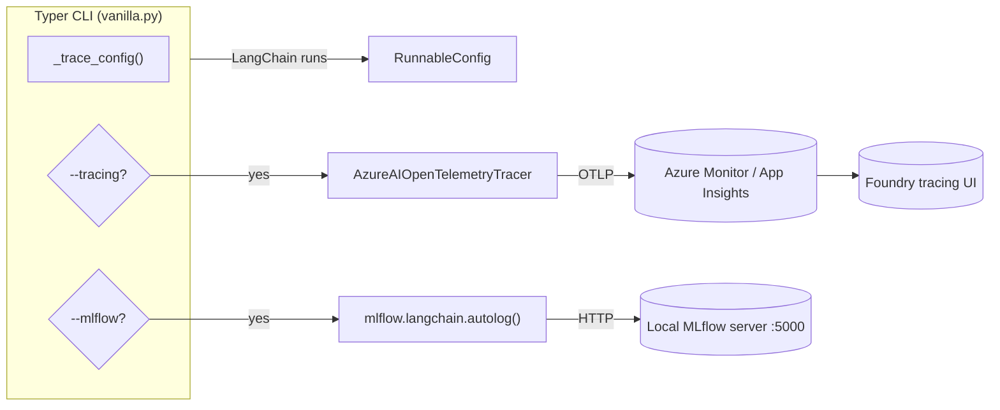

# Step 2 - Observability (Tracing & MLflow)

## Goal

In this step you will enable two complementary observability backends for the
same Typer CLI:

| Backend                 | Use case                                                | Toggle      |
| :---------------------- | :------------------------------------------------------ | :---------- |
| Azure Monitor / Foundry | Portal-based tracing of LangChain calls in Foundry      | `--tracing` |
| MLflow (local)          | Quick local trace inspection for LangChain / LangGraph  | `--mlflow`  |

Both toggles are mutually independent and can be combined.

## Why this step exists

LLM applications are hard to debug because the interesting state lives between
the prompt, the model, and the tools. Capturing that state in **traces** lets
you answer questions like:

- which prompt produced the bad answer?
- how long did each step take?
- how many tokens did each call consume?

This step wires LangChain to Azure Monitor through the
[`AzureAIOpenTelemetryTracer`](https://learn.microsoft.com/en-us/azure/foundry/how-to/develop/langchain-traces),
and adds MLflow autologging so you can iterate offline without leaving the
laptop.



## How the toggles are implemented

The CLI defines a Typer callback that flips two module-level flags and lazily
enables the corresponding backend (see
[`scripts/microsoft_foundry/vanilla.py`](https://github.com/ks6088ts-labs/concierge/blob/main/scripts/microsoft_foundry/vanilla.py)):

```python title="Simplified Typer callback"
@app.callback()
def _global_options(
    tracing: bool = typer.Option(False, "--tracing", "-t"),
    verbose: bool = typer.Option(False, "--verbose", "-v"),
    mlflow:  bool = typer.Option(False, "--mlflow",  "-m"),
):
    global _tracing_enabled
    _tracing_enabled = tracing
    if mlflow:
        _enable_mlflow()
```

Every command then wraps its `invoke` / `ainvoke` / `stream` call with the
shared helper:

```python title="Actual trace helper shape"
def _trace_config(extra=None) -> RunnableConfig:
    config = dict(extra or {})
    if _tracing_enabled:
        callbacks = list(config.get("callbacks", []))
        callbacks.append(_get_tracer())
        config["callbacks"] = callbacks
    return RunnableConfig(**config)
```

This is what keeps the per-command code free of conditional logic: the toggle
is set once globally, and every LangChain call picks it up uniformly.

## Step 2a - Azure Monitor tracing

### Why Azure Monitor

Foundry projects ship with a built-in tracing experience powered by Azure
Monitor. Connecting it makes every LangChain run searchable from the Foundry
portal alongside your other resources - no extra dashboards required.

### Provision tracing in Foundry

Tracing requires that your Foundry project is linked to an Application Insights
resource. Follow
[Trace LangChain and LangGraph apps with Microsoft Foundry and Azure Monitor](https://learn.microsoft.com/en-us/azure/foundry/how-to/develop/langchain-traces)
to enable it from the portal if you have not yet.

### Run with `--tracing`

```shell
uv run python scripts/microsoft_foundry/vanilla.py --tracing hello-world \
    --query "Trace this call please."
```

What this changes:

```python
# _get_tracer() is created once per process and reused
AzureAIOpenTelemetryTracer(
    project_endpoint=get_microsoft_foundry_settings().azure_ai_project_endpoint,
    credential=DefaultAzureCredential(),
    name="microsoft-foundry-vanilla",
)
```

### Verify

Open Microsoft Foundry → your project → *Tracing*. A new trace named
`microsoft-foundry-vanilla` should appear within a few seconds. You can drill
into the LangChain run tree, prompt, response, and token counts.

!!! tip "Cost vs. fidelity"
    The tracer captures full prompts and completions. Pair it with sampling or
    redact sensitive content via [LangChain callback filters](https://docs.langchain.com/oss/python/langchain/callbacks)
    when you graduate beyond exploration.

## Step 2b - MLflow local autologging

### Why MLflow

Foundry tracing is excellent for shared environments, but during inner-loop
development you want something fully local. MLflow's
[LangGraph integration](https://mlflow.org/docs/latest/genai/tracing/integrations/listing/langgraph/)
auto-captures every LangChain / LangGraph run with a one-line setup and ships
with a UI you can run on your laptop.

### Start the MLflow server

The repository ships with a `make` target that exposes MLflow on
`http://127.0.0.1:5000`. Run it in a separate terminal because it keeps the
server process in the foreground:

```shell
make mlflow
```

This runs:

```text
uv run mlflow server \
    --host 0.0.0.0 --port 5000 \
    --allowed-hosts "*" --cors-allowed-origins "*"
```

The CLI reads the tracking URI and experiment name from `.env` if present. The
defaults are declared in
[`concierge/settings/observability.py`](https://github.com/ks6088ts-labs/concierge/blob/main/concierge/settings/observability.py):

```dotenv
# .env
MLFLOW_TRACKING_URI=http://127.0.0.1:5000
# Optional; defaults to this value when omitted.
MLFLOW_EXPERIMENT_NAME=microsoft-foundry-vanilla
```

The shipped `make mlflow` target always starts the server on port `5000`. If
you need another port, start MLflow manually and point the CLI at the same URL:

```shell
uv run mlflow server \
    --host 0.0.0.0 --port 5050 \
    --allowed-hosts "*" --cors-allowed-origins "*"

MLFLOW_TRACKING_URI=http://127.0.0.1:5050 \
    uv run python scripts/microsoft_foundry/vanilla.py --mlflow hello-world
```

### Run with `--mlflow`

```shell
uv run python scripts/microsoft_foundry/vanilla.py --mlflow use-in-agents \
    --query "Explain why tracing helps debug LLM applications in one sentence."
```

`_enable_mlflow()` reads the observability settings, sets the tracking URI /
experiment, and calls `mlflow.langchain.autolog()`. The setup is cached within
the current Python process.

### Verify

Open `http://127.0.0.1:5000` in your browser. The
`microsoft-foundry-vanilla` experiment should contain a new run with the
LangChain trace, inputs, and outputs attached.

## Combining both toggles

You can enable both backends at once when you want a Foundry-side audit trail
and a local debugging view of the same call:

```shell
uv run python scripts/microsoft_foundry/vanilla.py --tracing --mlflow --verbose \
    reasoning --model azure_ai:DeepSeek-R1-0528
```

`--verbose` raises the local logger to `DEBUG`, which is useful while wiring
new commands.

## Verify the nearby code with tests

The current tests cover the logger and the settings classes the observability
flow relies on:

```shell
make test
```

They do not yet exercise `_trace_config`, tracer creation, or the MLflow
autolog hook. If you change that wiring, add focused tests with mocks and run
the suite before pushing.

## Troubleshooting

??? failure "Traces never appear in Foundry"
    Confirm that *Tracing* is enabled on your Foundry project and that your
    identity has the `Azure AI Developer` role on the project. The tracer is
    lazy: nothing is sent until the first call after `--tracing` is passed.

??? failure "MLflow UI is empty"
    The autolog hook only fires *after* `_enable_mlflow()` has been called.
    Make sure `--mlflow` is on the **invocation that runs the model**, not on
    `make mlflow` (the server does not see your CLI runs unless they share the
    same tracking URI).

??? failure "Port 5000 already in use"
    Stop the previous `make mlflow` (`Ctrl+C`) or start MLflow manually on a
    different port and set `MLFLOW_TRACKING_URI` on the CLI invocation. The
    `make mlflow` target itself is fixed to port `5000`.

## What's next

You now have a working, observable Foundry + LangChain CLI. To add a
persistent vector store backed by pgvector (locally via Docker Compose or
managed via Azure Database for PostgreSQL Flexible Server), continue with
[Step 3 - PostgreSQL (pgvector) CRUD](03-postgres-vector-store.md).
