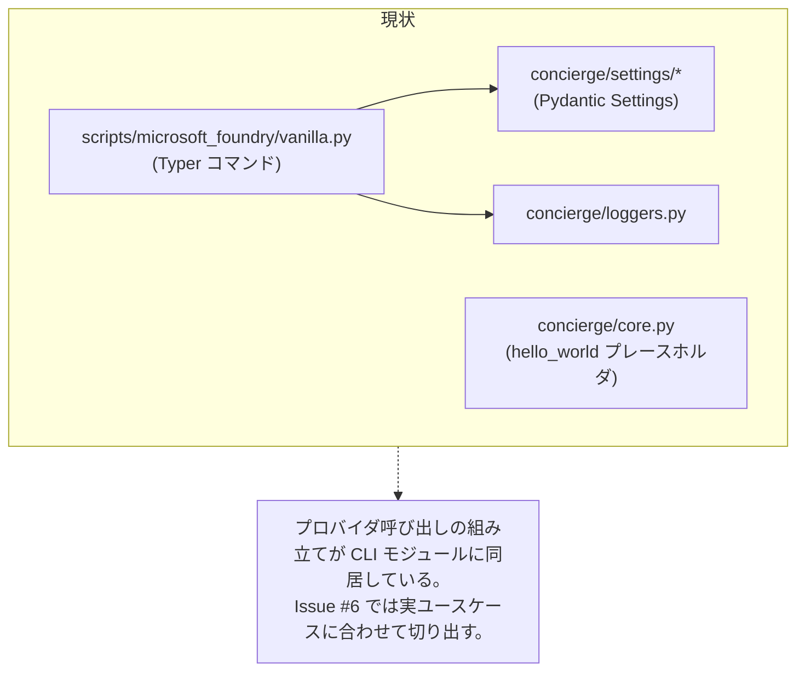
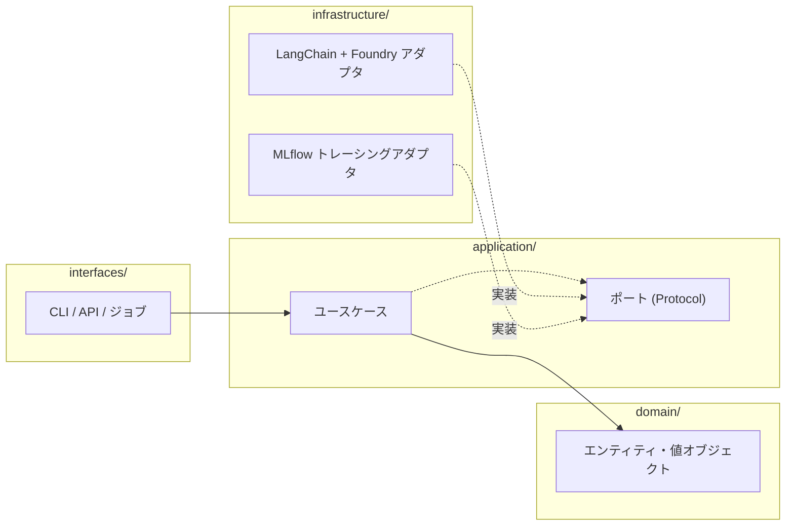
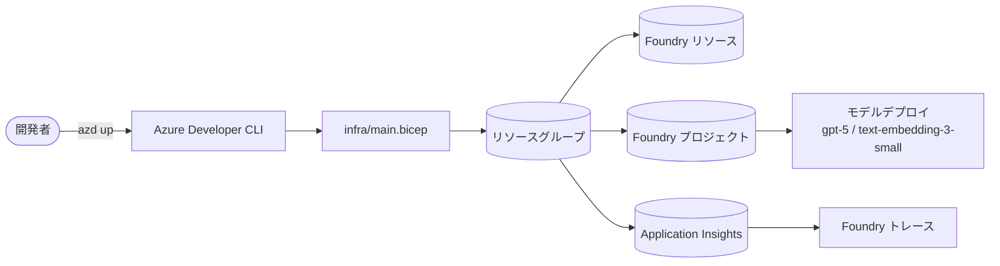

# ステップ 3 - 次の一歩 (クリーンアーキテクチャ & IaC)

!!! info "参照 Issue"
    - [#6 - apply clean architecture](https://github.com/ks6088ts-labs/concierge/issues/6) (Open)
    - [#10 - set up infra via IaC](https://github.com/ks6088ts-labs/concierge/issues/10) (Open)

これまでのステップは **マージ済み** の作業を追体験しました。本ページは
2 つの Open Issue を引き取るための前向きな設計メモです。実装方針を固定す
るものではなく、小さく始めてレビューしやすい単位に分けるための出発点です。

## 現状のコードベース



CLI は単一ファイルに以下の責務を抱えています。

- **トランスポート** (Typer オプション、dotenv の読み込み)
- **インフラ** (Azure SDK クライアント、MLflow autolog)
- 将来的に **アプリケーションロジック** になりうるデモ用の組み立て処理
    (利用するモデル選定、入力の整形、出力整形)

探索フェーズではこれで十分です。重要なのは、守るべきユースケースが見える
前にレイヤだけを増やさないことです。まずは重複している部分、またはテスト
しづらい部分から切り出します。

## 3a - クリーンアーキテクチャの適用 (Issue #6)

### ゴール

以下のような構造に再編します。

- 将来のドメイン/アプリケーションロジックは LangChain・Foundry・CLI に
    依存しない。
- アダプタが抽象 (ポート) と具体実装 (フレームワーク) を橋渡しする。
- CLI / API / ジョブなどのエントリポイントは薄く保つ。

### 背景

Issue [#6](https://github.com/ks6088ts-labs/concierge/issues/6) は書籍
[*Pythonではじめるクリーンアーキテクチャ*](https://book.impress.co.jp/books/1125101112)
と [PacktPublishing/Clean-Architecture-with-Python](https://github.com/PacktPublishing/Clean-Architecture-with-Python)
を参照リソースとしています。狙う効果は次の通りです。

- **テスト容易性**: ドメインに触れずに LLM 呼び出しをフェイクに置換できる。
- **入れ替え容易性**: Foundry を別ベンダーに置き換える際の影響範囲を局所化。
- **境界の安定性**: 上流 SDK の破壊的変更に巻き込まれにくくする。

### 目標レイアウト案

```text
concierge/
├── domain/
│   ├── __init__.py
│   ├── conversation.py        # エンティティ: Message, Conversation, ...
│   └── value_objects.py
├── application/
│   ├── __init__.py
│   ├── ports.py               # Protocol: ChatPort / EmbeddingPort / TracingPort
│   └── use_cases/
│       ├── ask_question.py
│       └── search_similar.py
├── infrastructure/
│   ├── __init__.py
│   ├── langchain_foundry.py   # langchain-azure-ai を用いた実装
│   └── mlflow_tracing.py
├── interfaces/
│   ├── __init__.py
│   └── cli/
│       └── microsoft_foundry.py  # 現 vanilla.py の薄いラッパ
└── settings/                   # 既存
```



### 段階的移行プラン

1. **プロバイダ生成処理** をまず切り出す。同じセットアップが 2 つ以上の
   コマンドで重複したタイミングを目安にする。
2. **ポート** はテストのための境界が必要になった箇所から導入する。まずは
   チャットと埋め込みを候補にし、トレーシングは CLI 外の呼び出し元が見え
   てからでよい。
3. **アダプタ** を `vanilla.py` から `infrastructure/` に 1 コマンドずつ移
   し、`vanilla.py` はユースケースとアダプタを結線するだけにする。
4. **テスト** をフェイクアダプタで `tests/` に追加し、ユースケース単位で
   検証する。
5. **段階的に反復** - まず `hello-world` から、CLI の挙動を維持しながら
   進める。

### 参考

- [Issue #6 スレッド](https://github.com/ks6088ts-labs/concierge/issues/6)
- [PacktPublishing/Clean-Architecture-with-Python](https://github.com/PacktPublishing/Clean-Architecture-with-Python)
- [Pythonではじめるクリーンアーキテクチャ (Impress)](https://book.impress.co.jp/books/1125101112)

## 3b - IaC によるインフラ構築 (Issue #10)

### ゴール

CLI が依存する想定の Azure リソース (Foundry リソース、プロジェクト、モデ
ルデプロイ、トレース用 Application Insights) をバージョン管理されたテンプ
レートから再現できるようにします。

### 背景

現状は `AZURE_AI_PROJECT_ENDPOINT` の値が「誰かがポータルで作成した」前
提に依存しています。Issue [#10](https://github.com/ks6088ts-labs/concierge/issues/10)
で再現可能にすることで、

- 新規参加者がポータル操作だけに依存せず、同等の環境をプロビジョニングで
    きる。
- dev / stg / prod の構成を揃え続けられる。
- クラウド構成の変更をプルリクエストでレビューできる。

### 参考アセット

Issue は次の 2 つの上流サンプルを参照しています。

- [microsoft/CAIRA](https://github.com/microsoft/CAIRA) - Bicep ベースの
  Azure AI リファレンスアーキテクチャ。ネットワーク隔離バリエーションも
  含みます。
- [microsoft-foundry/foundry-samples - infrastructure](https://github.com/microsoft-foundry/foundry-samples/tree/main/infrastructure)
  - Foundry リソースとモデルデプロイにフォーカスした小さな Bicep モジュ
    ール集。

### 概略プラン



想定するファイル構成:

```text
infra/
├── main.bicep              # azure.yaml から参照されるエントリ
├── modules/
│   ├── foundry.bicep
│   ├── model-deployment.bicep
│   └── monitoring.bicep
└── main.parameters.json
azure.yaml                  # azd メタデータ (services, hooks)
```

### 作業フロー案

1. **スキャフォルド**: [microsoft-foundry/foundry-samples/infrastructure](https://github.com/microsoft-foundry/foundry-samples/tree/main/infrastructure)
   から `azure.yaml` と `infra/main.bicep` を派生させる。
2. **パラメータ化**: モデル名を [`scripts/microsoft_foundry/vanilla.py`](https://github.com/ks6088ts-labs/concierge/blob/main/scripts/microsoft_foundry/vanilla.py)
   の `DEFAULT_SETTINGS` と揃える。
3. **トレース配線**: Application Insights をデプロイし Foundry プロジェ
   クトとリンクする ([`AzureAIOpenTelemetryTracer`](https://learn.microsoft.com/ja-jp/azure/foundry/how-to/develop/langchain-traces)
   参照)。
4. **`.env` 自動生成**: `azd` の出力から `AZURE_AI_PROJECT_ENDPOINT` を
   流し込む。
5. **CAIRA で強化**: プライベートエンドポイント、AAD RBAC、コンテンツセー
   フティなど本番向けの設定を段階的に取り込む。

### 参考

- [Issue #10 スレッド](https://github.com/ks6088ts-labs/concierge/issues/10)
- [microsoft/CAIRA](https://github.com/microsoft/CAIRA)
- [foundry-samples / infrastructure](https://github.com/microsoft-foundry/foundry-samples/tree/main/infrastructure)
- [Azure Developer CLI 概要](https://learn.microsoft.com/ja-jp/azure/developer/azure-developer-cli/overview)

## まとめ

Closed Issue を一通り追体験し、Open Issue にもすぐ着手できる状態になり
ました。本ハンズオン全体で参照したドキュメントをまとめた
[Appendix](appendix.md) をブックマークしておくと、後から戻ってきたときに
便利です。
