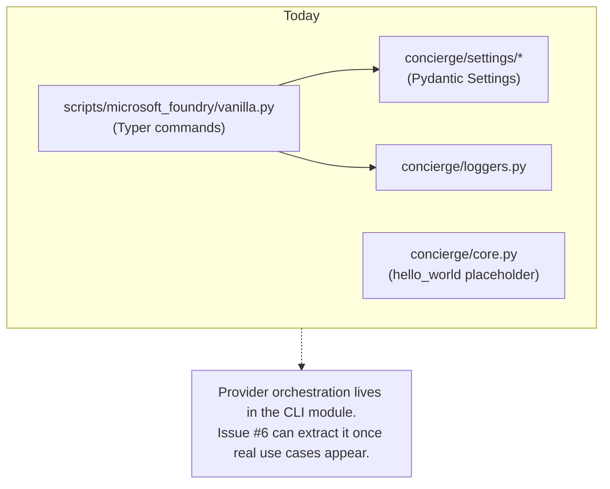
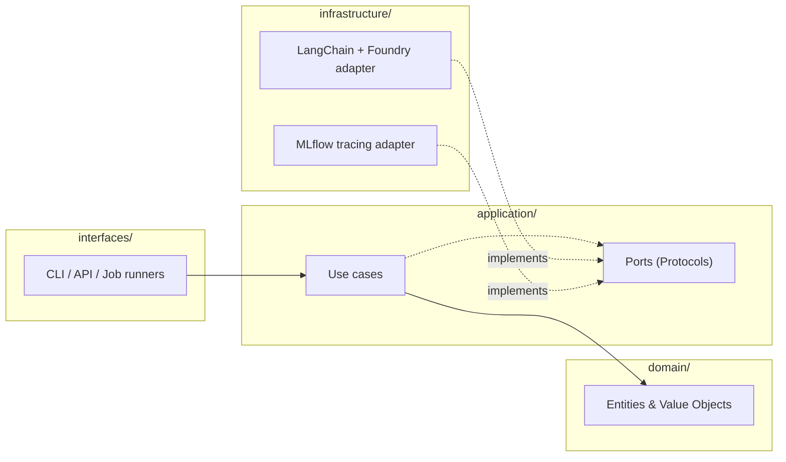
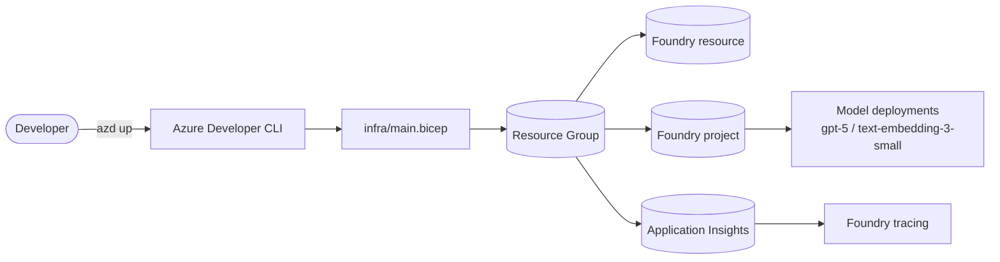

# Step 3 - Next steps (Clean Architecture & IaC)

!!! info "Reference issues"
    - [#6 - apply clean architecture](https://github.com/ks6088ts-labs/concierge/issues/6) (Open)
    - [#10 - set up infra via IaC](https://github.com/ks6088ts-labs/concierge/issues/10) (Open)

The previous steps covered work that is **already merged**. This page is a
forward-looking design note for the two open issues. It is not an implementation
commitment; use it to start small and keep each pull request reviewable.

## Where the codebase stands today



Today the CLI is a single-file script that mixes:

- **transport** (Typer options, dotenv loading),
- **infrastructure** (Azure SDK clients, MLflow autolog),
- and **demo orchestration** that may become application logic (which models to
    call, how to shape inputs, how to format output).

For exploration this is fine. The key is to avoid creating layers before there
is a real use case to protect. Start by extracting only the parts that are
already repeated or hard to test.

## 3a - Apply Clean Architecture (Issue #6)

### Goal

Restructure the codebase gradually so that:

- future domain/application logic is independent of LangChain, Foundry, and the CLI,
- adapters wire concrete frameworks to abstract ports,
- the entry points (CLI, future API, future jobs) stay thin.

### Why

The originating Issue [#6](https://github.com/ks6088ts-labs/concierge/issues/6)
points at the book *Pythonではじめるクリーンアーキテクチャ* and at
[PacktPublishing/Clean-Architecture-with-Python](https://github.com/PacktPublishing/Clean-Architecture-with-Python)
as the canonical reference. The benefits we are after:

- **Testability** - replace LLM calls with fakes without touching the domain.
- **Swap-ability** - swap Foundry for any other provider behind an interface.
- **Stable boundaries** - reduce the blast radius of upstream SDK changes.

### Proposed target layout

```text
concierge/
├── domain/
│   ├── __init__.py
│   ├── conversation.py        # entities: Message, Conversation, ...
│   └── value_objects.py
├── application/
│   ├── __init__.py
│   ├── ports.py               # protocols: ChatPort, EmbeddingPort, TracingPort
│   └── use_cases/
│       ├── ask_question.py
│       └── search_similar.py
├── infrastructure/
│   ├── __init__.py
│   ├── langchain_foundry.py   # implements ports via langchain-azure-ai
│   └── mlflow_tracing.py
├── interfaces/
│   ├── __init__.py
│   └── cli/
│       └── microsoft_foundry.py  # current vanilla.py, slimmed down
└── settings/                   # already in place
```



### Suggested incremental migration

1. **Extract provider factories first** from `vanilla.py` when two commands
   start sharing the same setup logic.
2. **Introduce protocols only where tests need seams**, starting with chat and
   embeddings. Avoid a tracing port until the tracing behaviour has a real
   caller outside the CLI.
3. **Move adapter code** out of `vanilla.py` into `infrastructure/` one command
   at a time. Keep `vanilla.py` as a thin Typer wrapper that wires use cases to
   adapters.
4. **Add tests** under `tests/` against the use cases using fake adapters.
5. **Iterate** - tackle one command at a time (`hello-world` first), keeping
   the CLI behaviour stable.

### References

- [Issue #6 thread](https://github.com/ks6088ts-labs/concierge/issues/6)
- [PacktPublishing/Clean-Architecture-with-Python](https://github.com/PacktPublishing/Clean-Architecture-with-Python)
- [Pythonではじめるクリーンアーキテクチャ (Impress)](https://book.impress.co.jp/books/1125101112)

## 3b - Provision infrastructure via IaC (Issue #10)

### Goal

Provision the Azure footprint the CLI is expected to rely on (Foundry resource,
project, model deployments, Application Insights for tracing) from
version-controlled templates.

### Why

Today the `.env` value `AZURE_AI_PROJECT_ENDPOINT` assumes someone has clicked
through the portal. Issue [#10](https://github.com/ks6088ts-labs/concierge/issues/10)
makes the setup repeatable so:

- a new contributor can provision a comparable environment without portal-only steps,
- environments (dev / stg / prod) stay aligned,
- changes to the cloud topology arrive as reviewable pull requests.

### Reference assets

The Issue points at two upstream samples worth borrowing from:

- [microsoft/CAIRA](https://github.com/microsoft/CAIRA) - Microsoft's
  Azure-AI-on-Bicep reference architecture, including network-isolated
  variants.
- [microsoft-foundry/foundry-samples - infrastructure](https://github.com/microsoft-foundry/foundry-samples/tree/main/infrastructure)
  - smaller, focused Bicep modules for Foundry resources and model deployments.

### High-level plan



Suggested layout:

```text
infra/
├── main.bicep              # entry point referenced from azure.yaml
├── modules/
│   ├── foundry.bicep
│   ├── model-deployment.bicep
│   └── monitoring.bicep
└── main.parameters.json
azure.yaml                  # azd metadata (services, hooks)
```

### Suggested workflow

1. **Scaffold** `azure.yaml` and `infra/main.bicep` from
   [microsoft-foundry/foundry-samples/infrastructure](https://github.com/microsoft-foundry/foundry-samples/tree/main/infrastructure).
2. **Parameterise** model names so they line up with `DEFAULT_SETTINGS` in
   [`scripts/microsoft_foundry/vanilla.py`](https://github.com/ks6088ts-labs/concierge/blob/main/scripts/microsoft_foundry/vanilla.py).
3. **Wire tracing** by deploying Application Insights and linking it to the
   Foundry project (see [`AzureAIOpenTelemetryTracer`](https://learn.microsoft.com/en-us/azure/foundry/how-to/develop/langchain-traces)).
4. **Emit `.env`** from `azd` outputs so `AZURE_AI_PROJECT_ENDPOINT` is filled
   in automatically.
5. **Iterate against CAIRA** for production hardening: private endpoints, AAD
   RBAC, content safety, etc.

### References

- [Issue #10 thread](https://github.com/ks6088ts-labs/concierge/issues/10)
- [microsoft/CAIRA](https://github.com/microsoft/CAIRA)
- [foundry-samples / infrastructure](https://github.com/microsoft-foundry/foundry-samples/tree/main/infrastructure)
- [Azure Developer CLI overview](https://learn.microsoft.com/en-us/azure/developer/azure-developer-cli/overview)

## Wrap-up

You have walked through every closed Issue that shaped the current code, and
have a starting point for the two open ones. Use the
[Appendix](appendix.md) as a single page to bookmark the upstream
documentation referenced throughout the tutorial.
