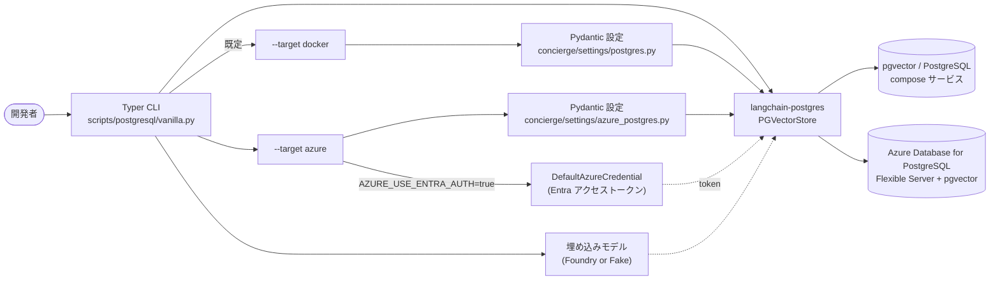

# ステップ 3 - PostgreSQL (pgvector) CRUD

## ゴール

このステップを終えると、次のことができるようになります。

- [pgvector](https://github.com/pgvector/pgvector) を有効化した PostgreSQL
  をローカル (Docker Compose) **または** マネージドな
  [Azure Database for PostgreSQL Flexible Server](https://learn.microsoft.com/ja-jp/azure/postgresql/flexible-server/overview)
  上で使える。
- CLI からベクトルストア用テーブルの作成と削除ができる。
- LangChain の
  [`langchain-postgres`](https://pypi.org/project/langchain-postgres/) パッケージ
  を用いて **C**reate / **R**ead / **U**pdate / **D**elete をすべて試せる。

1 本の Typer CLI (`scripts/postgresql/vanilla.py`) で両方をカバーします。
グローバルオプション `--target/-T` (`docker` または `azure`) で接続先を
切り替えてください。`azure` ターゲットでは `DefaultAzureCredential` 経由の
Microsoft Entra 認証もサポートします。

## なぜこのステップが必要か

ステップ 1～2 では `InMemoryVectorStore` を使っていたため、Python プロセス
を終了するとデータが消えてしまいました。実運用では再起動後も残るベクトル
ストアが必要です。PostgreSQL に
[pgvector](https://github.com/pgvector/pgvector) 拡張を入れる構成は、リレー
ショナルデータとベクトルを同じ DB で扱えるため広く採用されています。

LangChain は `langchain-postgres` を介して pgvector をファーストクラスで
サポートしているため、本リポジトリでは `PGVectorStore` API を標準採用して
います。Azure Database for PostgreSQL Flexible Server も `vector` 拡張を
入れた素の PostgreSQL なので、同じ `langchain-postgres` のコードがそのまま
動きます。違うのは接続文字列と、データベースパスワードをどう用意するか
だけです。

CLI ではその差分を 1 つのヘルパー (`scripts/postgresql/vanilla.py` 内の
`_build_connection_url`) に閉じ込めているので、将来別のデプロイ先を
増やすときも基本的にここに分岐を 1 つ足すだけで済みます。

このステップは Microsoft Learn の
[Azure Database for PostgreSQL で LangChain を使う](https://learn.microsoft.com/ja-jp/azure/postgresql/azure-ai/generative-ai-develop-with-langchain)
を参考にしていますが、本リポジトリで既に固定済みの `langchain-postgres`
を再利用し、追加の依存衝突を避ける構成にしています。詳細は下の
[トラブルシュート](#トラブルシュート) を参照してください。



## 事前チェック

- [x] [ステップ 1](01-foundry-langchain.md) で `uv` 環境を整備済みである。
- [ ] **`--target docker` (既定) を使う場合:** [Docker](https://docs.docker.com/get-docker/)
      がインストール済みで起動している。
- [ ] **`--target azure` を使う場合:**
      [Azure Database for PostgreSQL Flexible Server](https://learn.microsoft.com/ja-jp/azure/postgresql/flexible-server/quickstart-create-server-portal)
      が作成済み (または作成可能) で、
      [`pgvector` 拡張](https://learn.microsoft.com/ja-jp/azure/postgresql/extensions/how-to-use-pgvector)
      が許可一覧に追加され有効化されており、Microsoft Entra 認証 (または
      DB パスワード) の準備が済んでいる。さらに
      [Azure CLI](https://learn.microsoft.com/ja-jp/cli/azure/install-azure-cli)
      にサインイン済み (`az login`) であること。
- [ ] Microsoft Foundry の資格情報 (任意。`--fake-embeddings` で省略可)。

!!! tip "Azure 側の簡易プロビジョニング"
    動作確認用のサーバが必要なときは
    [Azure ポータルのクイックスタート](https://learn.microsoft.com/ja-jp/azure/postgresql/flexible-server/quickstart-create-server-portal)
    に従って Flexible Server を作成し、**サーバ パラメータ** ブレードから
    `pgvector` を有効化してください。必要な Azure 側手順は、Microsoft Learn
    の LangChain ガイドにもまとめて記載されています:
    <https://learn.microsoft.com/ja-jp/azure/postgresql/azure-ai/generative-ai-develop-with-langchain>。

## ターゲットを選ぶ

CLI のグローバルオプション `--target/-T` で接続先を指定します。サブ
コマンドやその他のフラグは両ターゲットで完全に共通です。

| ターゲット | 利用シーン | 設定モジュール | 既定? |
| :--- | :--- | :--- | :---: |
| `docker` | [`compose.yml`](https://github.com/ks6088ts-labs/concierge/blob/main/compose.yml) の `pgvector/pgvector:pg18` サービスでローカル反復する。 | [`concierge/settings/postgres.py`](https://github.com/ks6088ts-labs/concierge/blob/main/concierge/settings/postgres.py) | はい |
| `azure` | `pgvector` 有効済みの [Azure Database for PostgreSQL Flexible Server](https://learn.microsoft.com/ja-jp/azure/postgresql/flexible-server/overview)。Microsoft Entra 認証も可。 | [`concierge/settings/azure_postgres.py`](https://github.com/ks6088ts-labs/concierge/blob/main/concierge/settings/azure_postgres.py) | いいえ |

以降の手順は両ターゲットの実行例を併記しているので、自分の状況に合う方
を選んでください。最初に `uv run python scripts/postgresql/vanilla.py --help`
を実行して、CLI が問題なくロードされることと、表示されるヘルプが下の
記載と一致していることを確認しておくと安心です。

## 手順

### 3.1 接続情報を設定する

どちらのターゲットも環境変数 / `.env` から接続情報を読みます。ローカル
ターゲットは `POSTGRES_*`、Azure ターゲットは `AZURE_*` のブロックを
使います。
[`.env.template`](https://github.com/ks6088ts-labs/concierge/blob/main/.env.template)
の該当ブロックを `.env` にコピーしてください。

```dotenv
# --- ローカル Docker Compose の pgvector (--target docker, 既定) ---
# 既定値は compose.yml の `postgres` サービスに揃えています。必要なときだけ上書きしてください。
POSTGRES_HOST=localhost
POSTGRES_PORT=5432
POSTGRES_USER=concierge
POSTGRES_PASSWORD=concierge
POSTGRES_DB=concierge
POSTGRES_COLLECTION=concierge_docs

# --- Azure Database for PostgreSQL Flexible Server (--target azure) ---
AZURE_DBHOST=<server-name>.postgres.database.azure.com
AZURE_DBNAME=postgres
AZURE_DBPORT=5432
AZURE_SSLMODE=require
# AZURE_USE_ENTRA_AUTH=true で Microsoft Entra ID 経由の認証を使います。
AZURE_USE_ENTRA_AUTH=true
AZURE_DBUSER=<entra-principal-or-db-user>
# AZURE_DBPASSWORD は AZURE_USE_ENTRA_AUTH=false のときだけ必要です。
AZURE_DBPASSWORD=
```

接続情報は Pydantic のモデルとして定義されています。

```python
# concierge/settings/postgres.py
class PostgresSettings(BaseSettings):
    postgres_host: str = "localhost"
    postgres_port: int = 5432
    postgres_user: str = "concierge"
    postgres_password: str = "concierge"
    postgres_db: str = "concierge"
    postgres_collection: str = "concierge_docs"


# concierge/settings/azure_postgres.py
class AzurePostgresSettings(BaseSettings):
    dbhost: str = ""
    dbname: str = ""
    dbuser: str = ""
    dbpassword: str = ""
    dbport: int = 5432
    sslmode: str = "require"
    use_entra_auth: bool = True
    entra_token_scope: str = "https://ossrdbms-aad.database.windows.net/.default"

    model_config = SettingsConfigDict(env_prefix="AZURE_", ...)
```

### 3.2 接続先を起動する (またはサインインする)

=== "ローカル Docker Compose"

    [`pgvector/pgvector:pg18`](https://hub.docker.com/r/pgvector/pgvector)
    イメージを起動します。`vector` 拡張がプリインストール済みで、データは
    名前付きボリューム (`postgres-data`) に永続化されます。

    ```shell
    docker compose up -d postgres
    ```

    !!! tip "サービスの確認・停止"
        - `docker compose logs -f postgres` でログを tail できます。
        - `docker compose exec postgres psql -U concierge -d concierge` でコンテナ内の `psql` シェルを起動します。
        - `docker compose stop postgres` でサービスを停止します (ボリュームは保持)。

=== "Azure Flexible Server"

    1. **`vector` 拡張をサーバで有効化する。** Azure ポータルで対象
       Flexible Server の **サーバ パラメータ** を開き、`azure.extensions`
       のカンマ区切りリストに `VECTOR` を追加して保存します
       (サーバが再起動します)。続いて対象データベースに 1 度接続し、
       `CREATE EXTENSION IF NOT EXISTS vector;` を実行します。CLI の
       `create-table` でも同じ DDL を発行しますが、データベースごとの権限
       チェックを通すために手動でも一度確認しておくと安全です。
    2. **Microsoft Entra 認証を構成する (推奨)。** Azure ポータルで
       Flexible Server の
       [Microsoft Entra 認証を有効化](https://learn.microsoft.com/ja-jp/azure/postgresql/flexible-server/how-to-configure-sign-in-azure-ad-authentication)
       し、自身 (または所属グループ) を Entra 管理者として追加します。
       そのプリンシパルをそのまま使うか、管理者接続から対応する
       PostgreSQL ロールを作成します。

        ```sql
        -- 既存の Entra ユーザを PostgreSQL ロールにマッピング
        SELECT * FROM pgaadauth_create_principal('<entra-user@tenant>', false, false);
        GRANT ALL PRIVILEGES ON DATABASE <db> TO "<entra-user@tenant>";
        ```

        `.env` の `AZURE_DBUSER` にそのプリンシパル名 (例:
        `alice@contoso.com`) を設定します。パスワード認証を選ぶ場合は
        `AZURE_USE_ENTRA_AUTH=false` にして `AZURE_DBPASSWORD` を埋めます。
    3. **Azure CLI でサインインする。** `DefaultAzureCredential` が
       資格情報を参照できるようにします。

        ```shell
        az login
        # (任意) アクティブなサブスクリプションを確認
        az account show --query "{name:name, id:id}" -o table
        ```

    !!! note "Entra トークンの有効期限"
        Entra アクセストークンの有効期間は通常 1 時間程度と短いです。CLI
        は実行ごとにフレッシュなトークンを取得するため、`uv run python …`
        を走らせるたびに新しい接続が張られます。長寿命のサービスでは別途
        トークン更新ロジックを用意してください。

### 3.3 ベクトルテーブルを作成する

```shell
# ローカル (既定の --target docker)
uv run python scripts/postgresql/vanilla.py create-table

# Azure
uv run python scripts/postgresql/vanilla.py --target azure create-table
```

内部では
[`PGEngine.init_vectorstore_table`](https://github.com/langchain-ai/langchain-postgres)
を呼び出します。

```python
from langchain_postgres import PGEngine

engine = PGEngine.from_connection_string(url=connection_url)  # --target ごとに組み立て
engine.init_vectorstore_table(
    table_name="concierge_docs",
    vector_size=1536,  # text-embedding-3-small の次元数
)
```

埋め込みモデルを変えるときは `--vector-size` を渡してください (例:
`text-embedding-3-large` は 3072)。前回作成済みのテーブルを置き換える
場合は `--overwrite` を付けます。

### 3.4 サンプル文書を一括投入する (Create)

```shell
uv run python scripts/postgresql/vanilla.py bulk-create
# Azure 側に投入するとき:
uv run python scripts/postgresql/vanilla.py --target azure bulk-create
```

`bulk-create` サブコマンドは 4 件のサンプル文書を投入するので、続く検索
が成立します。任意の文書を 1 件だけ追加するときは `create` を使います。

```shell
uv run python scripts/postgresql/vanilla.py create \
    --id ml --source manual \
    --text "Machine learning models are trained on data."
```

### 3.5 検索と取得 (Read)

```shell
# クエリに近い上位 3 件
uv run python scripts/postgresql/vanilla.py search --query "fruit" --k 3

# id 指定で個別取得
uv run python scripts/postgresql/vanilla.py read --id apple --id car
```

### 3.6 更新と削除

```shell
uv run python scripts/postgresql/vanilla.py update --id apple \
    --text "Apples, oranges, and bananas are fruits."

uv run python scripts/postgresql/vanilla.py delete --id apple --id car
```

`update` は同じ id で `delete` → `create` を行う実装にしているため、埋
め込みベクトルも作り直されます。

### 3.7 埋め込みデプロイなしで通しで試す

Microsoft Foundry の用意が間に合わないときはグローバルフラグ
`--fake-embeddings` を付けると CLI が
[`DeterministicFakeEmbedding`](https://docs.langchain.com/oss/python/integrations/vectorstores/index)
を使うようになり、再現性のあるオフライン埋め込みになります。フラグの動
作は両ターゲットで同じで、埋め込み計算をローカル化しつつ DB 接続は
指定したターゲットへ向かいます。

```shell
# 純ローカルの確認 (既定の --target docker)
uv run python scripts/postgresql/vanilla.py --fake-embeddings create-table --overwrite
uv run python scripts/postgresql/vanilla.py --fake-embeddings bulk-create
uv run python scripts/postgresql/vanilla.py --fake-embeddings search --query "fruit"

# Azure 接続パスだけを確認したい場合
uv run python scripts/postgresql/vanilla.py --target azure --fake-embeddings create-table --overwrite
uv run python scripts/postgresql/vanilla.py --target azure --fake-embeddings bulk-create
uv run python scripts/postgresql/vanilla.py --target azure --fake-embeddings search --query "fruit"
```

!!! warning "フェイク埋め込みは意味検索になりません"
    `DeterministicFakeEmbedding` は安定はしますが意味のないベクトルを
    返すので、類似度スコアは見栄えだけで実意味は持ちません。

### 3.8 後片付け

```shell
# ローカル
uv run python scripts/postgresql/vanilla.py drop-table
docker compose stop postgres

# Azure (Flexible Server 自体は影響を受けず、concierge_docs テーブルだけ削除されます)
uv run python scripts/postgresql/vanilla.py --target azure drop-table
```

## 動作確認

`--fake-embeddings` を使った典型的な出力例は次の通りです。

```text
[create-table] table 'concierge_docs' ready (vector_size=1536, overwrite=False)
[bulk-create] inserted 4 sample documents into 'concierge_docs'
[search] query='fruit' k=3
  - id=apple text='Apples and oranges are fruits.' metadata={'source': 'seed'}
  - id=dog   text='Dogs and cats are common pets.' metadata={'source': 'seed'}
  - id=train text='A train runs on rails.'         metadata={'source': 'seed'}
```

### CRUD 全コマンドの実行手順 (動作確認済み)

以下の 11 ステップで全サブコマンドを通しで実行します。`docker compose up -d postgres`
でサービスを起動した直後の状態で、各ステップが終了ステータス 0 で完了す
ることを確認済みです。`--target docker` を `--target azure` に置き換える
だけで、`.env` を埋め `az login` を済ませた Flexible Server に対して
同じ流れを実行できます。`--fake-embeddings` は埋め込み計算をオフライン
化するためのもので、Microsoft Foundry の埋め込みデプロイが揃ったら外し
てください。

```shell
# 1. テーブル作成 (前回の残骸があるときは --overwrite)
uv run python scripts/postgresql/vanilla.py --fake-embeddings create-table --overwrite

# 2. サンプル文書を一括投入
uv run python scripts/postgresql/vanilla.py --fake-embeddings bulk-create

# 3. 類似度検索
uv run python scripts/postgresql/vanilla.py --fake-embeddings search --query "fruit"

# 4. id 指定で取得
uv run python scripts/postgresql/vanilla.py --fake-embeddings read --id apple --id dog

# 5. 文書を 1 件追加
uv run python scripts/postgresql/vanilla.py --fake-embeddings create \
    --text "Sushi is a Japanese dish." --id sushi --source manual

# 6. 追加した文書を取得
uv run python scripts/postgresql/vanilla.py --fake-embeddings read --id sushi

# 7. 文書を更新
uv run python scripts/postgresql/vanilla.py --fake-embeddings update --id sushi \
    --text "Updated: Sushi is a famous Japanese dish made with vinegared rice." \
    --source manual

# 8. 更新内容を確認
uv run python scripts/postgresql/vanilla.py --fake-embeddings read --id sushi

# 9. 文書を削除
uv run python scripts/postgresql/vanilla.py --fake-embeddings delete --id sushi

# 10. 削除を確認 ("no documents found" が出れば OK)
uv run python scripts/postgresql/vanilla.py --fake-embeddings read --id sushi

# 11. テーブルを削除
uv run python scripts/postgresql/vanilla.py --fake-embeddings drop-table
```

各ステップで観測される代表的な出力は以下の通りです。

| # | サブコマンド | 期待する出力 |
| - | ------------ | ------------ |
| 1 | `create-table --overwrite` | `[create-table] table 'concierge_docs' ready (vector_size=1536, overwrite=True)` |
| 2 | `bulk-create` | `[bulk-create] inserted 4 sample documents into 'concierge_docs'` |
| 3 | `search` | `[search] query='fruit' k=3` と 3 件の結果行 |
| 4 | `read apple dog` | `- id=... text=...` が 2 行 |
| 5 | `create sushi` | `[create] id=sushi text='Sushi is a Japanese dish.' metadata={'source': 'manual'}` |
| 6 | `read sushi` | `sushi` の結果行 1 件 |
| 7 | `update sushi` | `[update] id=sushi text='Updated: ...' metadata={'source': 'manual'}` |
| 8 | `read sushi` | 更新後のテキストが表示される |
| 9 | `delete sushi` | `[delete] deleted ids=['sushi']` |
| 10 | `read sushi` | `[read] no documents found for ids=['sushi']` |
| 11 | `drop-table` | `[drop-table] table 'concierge_docs' dropped` |

### Azure ターゲットのオフライン疎通確認

Azure アカウントが手元になくても、CLI がロードできることと、必要な環境
変数が未設定の場合にきちんとエラーになることは確認できます。

```shell
# 1. help の表示は Azure に接続しないので最初の確認に最適
uv run python scripts/postgresql/vanilla.py --help

# 2. AZURE_DBHOST / AZURE_DBNAME が未設定なら --target azure のサブコマンドは
#    Typer の BadParameter で不足変数を告げて終了します。CLI は起動時に
#    `load_dotenv(override=True)` を呼ぶため、一時的に `.env` を退避させるのが
#    最も手っ取り早いシミュレート方法です。
mv .env .env.bak 2>/dev/null || true
uv run python scripts/postgresql/vanilla.py --target azure --fake-embeddings create-table || \
    echo "(想定どおり) AZURE_DBHOST / AZURE_DBNAME が未設定 (exit code 2)"
mv .env.bak .env 2>/dev/null || true
```

ステップ 2 で期待されるメッセージ:

```text
Usage: vanilla.py create-table [OPTIONS]
Try 'vanilla.py create-table --help' for help.
╭─ Error ──────────────────────────────────────────────────────────────────────╮
│ Invalid value: AZURE_DBHOST and AZURE_DBNAME must be set in the environment  │
│ (.env). See .env.template for the required Azure PostgreSQL variables.       │
╰──────────────────────────────────────────────────────────────────────────────╯
```

!!! warning "`.env` のリネームについて"
    上記の `mv .env .env.bak` / `mv .env.bak .env` は未設定状態をシミュレートする
    ためだけの手順です。`.env` をすでに埋めて Flexible Server に接続する場合は
    この 2 行は不要です。

## トラブルシュート

??? failure "CLI 実行時に `connection refused` が出る (`--target docker`)"
    `docker compose up -d postgres` で Compose サービスが起動しているか、
    `.env` の `POSTGRES_HOST` / `POSTGRES_PORT` が Docker が公開するポート
    と一致しているかを確認してください。

??? failure "`extension \"vector\" is not available` (`--target docker`)"
    既定の `pgvector/pgvector:pg18` イメージには拡張が同梱されており、
    テーブル初期化時に `CREATE EXTENSION IF NOT EXISTS vector` が走ります。
    `postgres:*` 系の素の image に差し替える場合は pgvector を手動で
    インストールしてください。

??? failure "insert 時に `dimension mismatch` が出る"
    `create-table` で固定次元のカラムを作成しています。以降のコマンドにも同じ
    `--vector-size` を渡すか、埋め込みモデルを変えたときはテーブルを
    `drop-table` → `create-table` し直してください。

??? failure "`AZURE_DBHOST and AZURE_DBNAME must be set in the environment (.env)`"
    `--target azure` でこれら 2 つの変数が未設定または空のときに CLI が
    `typer.BadParameter` で失敗します。`.env.template` の Azure 用ブロック
    を `.env` にコピーして値を埋めて再実行してください。

??? failure "`AZURE_DBUSER must be set to the Entra principal name`"
    `AZURE_USE_ENTRA_AUTH=true` のときは `AZURE_DBUSER` に、サーバ側で
    PostgreSQL ロールが付与済みの Entra プリンシパル名を入れてください。
    あるいはパスワード認証に切り替える (`AZURE_USE_ENTRA_AUTH=false` と
    `AZURE_DBPASSWORD` を設定) ことも選べます。

??? failure "`FATAL: password authentication failed` (`--target azure`)"
    Entra プリンシパルが PostgreSQL ロールとして登録されていないか、
    アクセストークンの audience が Azure PostgreSQL 向けでない可能性が
    あります。
    [Microsoft Entra 認証のセットアップ](https://learn.microsoft.com/ja-jp/azure/postgresql/flexible-server/how-to-configure-sign-in-azure-ad-authentication)
    を見直し、`az login` をやり直してください。テナント固有の audience
    が必要な場合のみ `AZURE_ENTRA_TOKEN_SCOPE` を上書きします。

??? failure "`extension \"vector\" is not available` (`--target azure`)"
    **サーバ パラメータ** の `azure.extensions` に `VECTOR` を追加し、
    サーバ再起動後に対象データベースで一度
    `CREATE EXTENSION IF NOT EXISTS vector;` を実行してください。詳細は
    [how-to-use-pgvector](https://learn.microsoft.com/ja-jp/azure/postgresql/extensions/how-to-use-pgvector)
    を参照。

??? failure "`SSL connection is required` (`--target azure`)"
    接続文字列は既定で `sslmode=require` を付けます。`AZURE_SSLMODE` を
    上書きした場合は `require` (または `verify-full`) に戻してください。

??? failure "`pgvector` と `langchain-azure-postgresql` のバージョン衝突"
    `langchain-azure-postgresql` は `pgvector>=0.4,<0.5` を要求しますが、
    本リポジトリの `langchain-postgres==0.0.17` は `pgvector>=0.2.5,<0.4`
    を要求するため、現時点では同居できません。CLI が
    `langchain-postgres` を再利用し、Azure 向けの接続文字列を組み立て
    る形にしているのはこのためです。詳細は
    [`scripts/postgresql/vanilla.py`](https://github.com/ks6088ts-labs/concierge/blob/main/scripts/postgresql/vanilla.py)
    の冒頭 docstring を参照してください。

## 次のステップ

これで再起動後も残るベクトルストアを、ローカル Compose とマネージド
Azure サーバの両方で同じ CLI から扱えるようになりました。自然な次の一手は、
Azure Flexible Server や関連リソースを
[Bicep](https://learn.microsoft.com/ja-jp/azure/azure-resource-manager/bicep/) や
[Terraform](https://learn.microsoft.com/ja-jp/azure/developer/terraform/overview)
などの Infrastructure as Code でプロビジョニングすることです。
