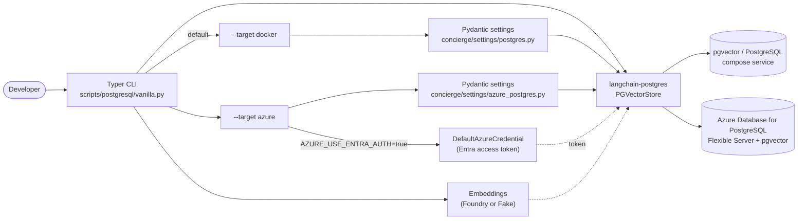

# Step 3 - PostgreSQL (pgvector) CRUD

## Goal

By the end of this step you will be able to:

- run a [pgvector](https://github.com/pgvector/pgvector)-enabled PostgreSQL
  service either locally through Docker Compose **or** against a managed
  [Azure Database for PostgreSQL Flexible Server](https://learn.microsoft.com/en-us/azure/postgresql/flexible-server/overview),
- create and tear down a vector store table from the CLI,
- and exercise the full **C**reate / **R**ead / **U**pdate / **D**elete cycle
  against the table with the LangChain
  [`langchain-postgres`](https://pypi.org/project/langchain-postgres/) package.

A single Typer CLI (`scripts/postgresql/vanilla.py`) covers both targets;
switch between them with the global `--target/-T` option (`docker` or
`azure`). The Azure target additionally supports Microsoft Entra
authentication via `DefaultAzureCredential`.

## Why this step exists

Steps 1 and 2 used `InMemoryVectorStore`, which loses its contents the moment
the Python process exits. Real applications need a vector store that survives
restarts. PostgreSQL with the
[pgvector](https://github.com/pgvector/pgvector) extension is a popular choice
because it keeps relational data and vector embeddings in the same database.

LangChain ships first-class bindings to pgvector via the `langchain-postgres`
package, so we standardise on its `PGVectorStore` API. Because Azure
Database for PostgreSQL Flexible Server is plain PostgreSQL with the
`vector` extension, the same `langchain-postgres` code works against both
targets - only the connection string (and the way the database password is
resolved) changes.

The CLI keeps that target-specific code isolated to a single helper
(`_build_connection_url` in
[`scripts/postgresql/vanilla.py`](https://github.com/ks6088ts-labs/concierge/blob/main/scripts/postgresql/vanilla.py)),
so adding another deployment in the future is mostly a matter of adding a
new branch there.

This step is shaped after the Microsoft Learn guide
[Use LangChain with Azure Database for PostgreSQL](https://learn.microsoft.com/en-us/azure/postgresql/azure-ai/generative-ai-develop-with-langchain),
but uses the `langchain-postgres` package already pinned by this project so
that no extra dependency conflict has to be resolved (see the
[Troubleshooting](#troubleshooting) section below for the rationale).



## Prerequisites checklist

- [x] You completed [Step 1](01-foundry-langchain.md) so `uv` and the project
      are bootstrapped.
- [ ] **For `--target docker` (default):** [Docker](https://docs.docker.com/get-docker/)
      installed and the daemon running.
- [ ] **For `--target azure`:** an Azure subscription with an
      [Azure Database for PostgreSQL Flexible Server](https://learn.microsoft.com/en-us/azure/postgresql/flexible-server/quickstart-create-server-portal),
      the [`pgvector` extension](https://learn.microsoft.com/en-us/azure/postgresql/extensions/how-to-use-pgvector)
      allow-listed and enabled, Microsoft Entra authentication configured (or
      a database password ready), and
      [Azure CLI](https://learn.microsoft.com/en-us/cli/azure/install-azure-cli)
      installed and signed in (`az login`).
- [ ] Microsoft Foundry credentials (optional - skip with `--fake-embeddings`).

!!! tip "Quick Azure provisioning"
    For a minimal sandbox server, follow the
    [Azure portal quickstart](https://learn.microsoft.com/en-us/azure/postgresql/flexible-server/quickstart-create-server-portal)
    and then enable `pgvector` from the **Server parameters** blade. The
    Microsoft Learn LangChain guide also lists every required Azure step in
    one place:
    <https://learn.microsoft.com/en-us/azure/postgresql/azure-ai/generative-ai-develop-with-langchain>.

## Pick a target

The CLI takes a `--target/-T` option that decides which deployment to talk
to. All other subcommands and flags are identical.

| Target | When to use it | Settings module | Default? |
| :--- | :--- | :--- | :---: |
| `docker` | Local iteration on the Docker Compose `pgvector/pgvector:pg18` service from [`compose.yml`](https://github.com/ks6088ts-labs/concierge/blob/main/compose.yml). | [`concierge/settings/postgres.py`](https://github.com/ks6088ts-labs/concierge/blob/main/concierge/settings/postgres.py) | yes |
| `azure` | Managed [Azure Database for PostgreSQL Flexible Server](https://learn.microsoft.com/en-us/azure/postgresql/flexible-server/overview) with `pgvector` enabled, optionally with Microsoft Entra authentication. | [`concierge/settings/azure_postgres.py`](https://github.com/ks6088ts-labs/concierge/blob/main/concierge/settings/azure_postgres.py) | no |

Pick whichever fits your situation - the rest of the steps are written so
each command shows both forms. Run `uv run python scripts/postgresql/vanilla.py --help`
once to confirm the CLI loads and the help text matches what you see below.

## Steps

### 3.1 Configure the connection

Both targets read connection settings from environment variables / `.env`.
The local target uses the `POSTGRES_*` block; the Azure target uses the
`AZURE_*` block. Copy the relevant block from
[`.env.template`](https://github.com/ks6088ts-labs/concierge/blob/main/.env.template):

```dotenv
# --- Local Docker Compose pgvector (used by --target docker, the default) ---
# Defaults match the `postgres` service in compose.yml; override only if needed.
POSTGRES_HOST=localhost
POSTGRES_PORT=5432
POSTGRES_USER=concierge
POSTGRES_PASSWORD=concierge
POSTGRES_DB=concierge
POSTGRES_COLLECTION=concierge_docs

# --- Azure Database for PostgreSQL Flexible Server (used by --target azure) ---
AZURE_DBHOST=<server-name>.postgres.database.azure.com
AZURE_DBNAME=postgres
AZURE_DBPORT=5432
AZURE_SSLMODE=require
# Set AZURE_USE_ENTRA_AUTH=true to authenticate via Microsoft Entra ID.
AZURE_USE_ENTRA_AUTH=true
AZURE_DBUSER=<entra-principal-or-db-user>
# AZURE_DBPASSWORD is only required when AZURE_USE_ENTRA_AUTH=false.
AZURE_DBPASSWORD=
```

Settings are described as Pydantic models:

```python
# concierge/settings/postgres.py
class PostgresSettings(BaseSettings):
    postgres_host: str = "localhost"
    postgres_port: int = 5432
    postgres_user: str = "concierge"
    postgres_password: str = "concierge"
    postgres_db: str = "concierge"
    postgres_collection: str = "concierge_docs"


# concierge/settings/azure_postgres.py
class AzurePostgresSettings(BaseSettings):
    dbhost: str = ""
    dbname: str = ""
    dbuser: str = ""
    dbpassword: str = ""
    dbport: int = 5432
    sslmode: str = "require"
    use_entra_auth: bool = True
    entra_token_scope: str = "https://ossrdbms-aad.database.windows.net/.default"

    model_config = SettingsConfigDict(env_prefix="AZURE_", ...)
```

### 3.2 Start (or sign in to) the target service

=== "Local Docker Compose"

    Boot the [`pgvector/pgvector:pg18`](https://hub.docker.com/r/pgvector/pgvector)
    image. The `vector` extension is preinstalled and data persists in a
    named volume (`postgres-data`).

    ```shell
    docker compose up -d postgres
    ```

    !!! tip "Inspect or stop the service"
        - `docker compose logs -f postgres` tails the container logs.
        - `docker compose exec postgres psql -U concierge -d concierge` opens a `psql` shell inside the container.
        - `docker compose stop postgres` stops the service (the volume is preserved).

=== "Azure Flexible Server"

    1. **Enable the `vector` extension on the server.** Open **Server
       parameters** for your Flexible Server in the Azure portal, find
       `azure.extensions`, add `VECTOR` to the comma-separated list, save
       (this restarts the server), and then connect to the target database
       once to run `CREATE EXTENSION IF NOT EXISTS vector;`. The CLI's
       `create-table` command also issues this DDL, but the per-database
       privilege check needs to succeed.
    2. **Configure Microsoft Entra authentication (recommended).** From the
       Azure portal, enable
       [Microsoft Entra authentication](https://learn.microsoft.com/en-us/azure/postgresql/flexible-server/how-to-configure-sign-in-azure-ad-authentication)
       on the Flexible Server and add yourself (or a group you belong to)
       as an Entra administrator. Either use that Entra principal directly
       or, from the admin connection, map it to a regular PostgreSQL role:

        ```sql
        -- Map an existing Entra user to a PostgreSQL role
        SELECT * FROM pgaadauth_create_principal('<entra-user@tenant>', false, false);
        GRANT ALL PRIVILEGES ON DATABASE <db> TO "<entra-user@tenant>";
        ```

        Set `AZURE_DBUSER` in your `.env` to that Entra principal name (for
        example `alice@contoso.com`). Prefer password auth? Set
        `AZURE_USE_ENTRA_AUTH=false` and fill in `AZURE_DBPASSWORD` instead.
    3. **Sign in with Azure CLI** so `DefaultAzureCredential` can pick up
       your identity:

        ```shell
        az login
        # (Optional) verify which subscription is active
        az account show --query "{name:name, id:id}" -o table
        ```

    !!! note "Entra token expiry"
        Entra access tokens are short-lived (typically one hour). The CLI
        fetches a fresh token at every CLI invocation, so each
        `uv run python …` command starts with a clean connection.
        Long-running services should refresh the token before it expires.

### 3.3 Create the vector table

```shell
# Local target (default, --target docker)
uv run python scripts/postgresql/vanilla.py create-table

# Azure target
uv run python scripts/postgresql/vanilla.py --target azure create-table
```

Under the hood the script calls
[`PGEngine.init_vectorstore_table`](https://github.com/langchain-ai/langchain-postgres):

```python
from langchain_postgres import PGEngine

engine = PGEngine.from_connection_string(url=connection_url)  # built per --target
engine.init_vectorstore_table(
    table_name="concierge_docs",
    vector_size=1536,  # text-embedding-3-small dimension
)
```

Pass `--vector-size` if you switch to an embedding model with a different
dimension (for example `text-embedding-3-large` returns 3072) and
`--overwrite` to drop a previous incarnation of the table first.

### 3.4 Bulk-insert sample documents (Create)

```shell
uv run python scripts/postgresql/vanilla.py bulk-create
# or against Azure:
uv run python scripts/postgresql/vanilla.py --target azure bulk-create
```

The `bulk-create` subcommand inserts four short documents so subsequent
searches return something useful. To insert a single document of your own
use `create`:

```shell
uv run python scripts/postgresql/vanilla.py create \
    --id ml --source manual \
    --text "Machine learning models are trained on data."
```

### 3.5 Search and read (Read)

```shell
# Top-3 documents close to the query
uv run python scripts/postgresql/vanilla.py search --query "fruit" --k 3

# Fetch one or more documents by id
uv run python scripts/postgresql/vanilla.py read --id apple --id car
```

### 3.6 Update and delete

```shell
uv run python scripts/postgresql/vanilla.py update --id apple \
    --text "Apples, oranges, and bananas are fruits."

uv run python scripts/postgresql/vanilla.py delete --id apple --id car
```

The CLI implements `update` as `delete` + `create` for the same id so the
embedding is recomputed and the row stays consistent.

### 3.7 Run end-to-end without an embedding deployment

Use the global `--fake-embeddings` flag if you do not have a Microsoft
Foundry deployment handy. The CLI then uses
[`DeterministicFakeEmbedding`](https://docs.langchain.com/oss/python/integrations/vectorstores/index)
so every step is reproducible and offline. The flag is identical for both
targets: it keeps the embedding computation local while the database
connection still goes to whichever target you selected.

```shell
# Pure-local smoke test (default --target docker)
uv run python scripts/postgresql/vanilla.py --fake-embeddings create-table --overwrite
uv run python scripts/postgresql/vanilla.py --fake-embeddings bulk-create
uv run python scripts/postgresql/vanilla.py --fake-embeddings search --query "fruit"

# Exercise the Azure connection path without calling out to an embedding deployment
uv run python scripts/postgresql/vanilla.py --target azure --fake-embeddings create-table --overwrite
uv run python scripts/postgresql/vanilla.py --target azure --fake-embeddings bulk-create
uv run python scripts/postgresql/vanilla.py --target azure --fake-embeddings search --query "fruit"
```

!!! warning "Fake embeddings are not semantic"
    `DeterministicFakeEmbedding` produces stable but meaningless vectors, so
    similarity scores look reasonable but do not reflect actual semantics.

### 3.8 Clean up

```shell
# Local target
uv run python scripts/postgresql/vanilla.py drop-table
docker compose stop postgres

# Azure target (the Flexible Server itself is unaffected;
# only the concierge_docs table is removed)
uv run python scripts/postgresql/vanilla.py --target azure drop-table
```

## Verify

A typical session looks like this (`--fake-embeddings` shown for brevity):

```text
[create-table] table 'concierge_docs' ready (vector_size=1536, overwrite=False)
[bulk-create] inserted 4 sample documents into 'concierge_docs'
[search] query='fruit' k=3
  - id=apple text='Apples and oranges are fruits.' metadata={'source': 'seed'}
  - id=dog   text='Dogs and cats are common pets.' metadata={'source': 'seed'}
  - id=train text='A train runs on rails.'         metadata={'source': 'seed'}
```

### Verified full CRUD walkthrough

The following 11-step sequence exercises every subcommand end-to-end. It has
been verified to exit with status 0 against a freshly-started
`docker compose up -d postgres` service. Swap `--target docker` for
`--target azure` to run the exact same walkthrough against your Flexible
Server (with `.env` filled in and `az login` succeeded). `--fake-embeddings`
keeps the run completely offline for embeddings; drop the flag once
Microsoft Foundry credentials are in place.

```shell
# 1. Create the table (use --overwrite if a previous run left it behind)
uv run python scripts/postgresql/vanilla.py --fake-embeddings create-table --overwrite

# 2. Bulk-insert sample documents
uv run python scripts/postgresql/vanilla.py --fake-embeddings bulk-create

# 3. Similarity search
uv run python scripts/postgresql/vanilla.py --fake-embeddings search --query "fruit"

# 4. Read documents by id
uv run python scripts/postgresql/vanilla.py --fake-embeddings read --id apple --id dog

# 5. Create a new document
uv run python scripts/postgresql/vanilla.py --fake-embeddings create \
    --text "Sushi is a Japanese dish." --id sushi --source manual

# 6. Read it back
uv run python scripts/postgresql/vanilla.py --fake-embeddings read --id sushi

# 7. Update its content
uv run python scripts/postgresql/vanilla.py --fake-embeddings update --id sushi \
    --text "Updated: Sushi is a famous Japanese dish made with vinegared rice." \
    --source manual

# 8. Confirm the update
uv run python scripts/postgresql/vanilla.py --fake-embeddings read --id sushi

# 9. Delete the document
uv run python scripts/postgresql/vanilla.py --fake-embeddings delete --id sushi

# 10. Confirm deletion (prints "no documents found")
uv run python scripts/postgresql/vanilla.py --fake-embeddings read --id sushi

# 11. Drop the table
uv run python scripts/postgresql/vanilla.py --fake-embeddings drop-table
```

Key lines you should see for each step:

| # | Subcommand | Expected output |
| - | ---------- | --------------- |
| 1 | `create-table --overwrite` | `[create-table] table 'concierge_docs' ready (vector_size=1536, overwrite=True)` |
| 2 | `bulk-create` | `[bulk-create] inserted 4 sample documents into 'concierge_docs'` |
| 3 | `search` | `[search] query='fruit' k=3` plus three result lines |
| 4 | `read apple dog` | Two `- id=... text=...` lines |
| 5 | `create sushi` | `[create] id=sushi text='Sushi is a Japanese dish.' metadata={'source': 'manual'}` |
| 6 | `read sushi` | One result line for `sushi` |
| 7 | `update sushi` | `[update] id=sushi text='Updated: ...' metadata={'source': 'manual'}` |
| 8 | `read sushi` | Updated text echoed back |
| 9 | `delete sushi` | `[delete] deleted ids=['sushi']` |
| 10 | `read sushi` | `[read] no documents found for ids=['sushi']` |
| 11 | `drop-table` | `[drop-table] table 'concierge_docs' dropped` |

### Offline smoke check for the Azure target

Even without an Azure account you can confirm the CLI loads and that the
expected error surfaces when `AZURE_DBHOST` / `AZURE_DBNAME` are missing.

```shell
# 1. The help screen never connects to Azure - good first check.
uv run python scripts/postgresql/vanilla.py --help

# 2. With AZURE_DBHOST / AZURE_DBNAME missing, --target azure subcommands
#    exit with a Typer BadParameter that lists the missing variables. The
#    script calls `load_dotenv(override=True)` at startup, so the simplest
#    way to simulate a missing config is to temporarily move .env aside.
mv .env .env.bak 2>/dev/null || true
uv run python scripts/postgresql/vanilla.py --target azure --fake-embeddings create-table || \
    echo "(expected) missing AZURE_DBHOST / AZURE_DBNAME (exit code 2)"
mv .env.bak .env 2>/dev/null || true
```

Expected message from step 2:

```text
Usage: vanilla.py create-table [OPTIONS]
Try 'vanilla.py create-table --help' for help.
╭─ Error ──────────────────────────────────────────────────────────────────────╮
│ Invalid value: AZURE_DBHOST and AZURE_DBNAME must be set in the environment  │
│ (.env). See .env.template for the required Azure PostgreSQL variables.       │
╰──────────────────────────────────────────────────────────────────────────────╯
```

!!! warning "`.env` rename"
    The two-line `mv .env .env.bak` / `mv .env.bak .env` dance only exists to
    *simulate* a fresh environment. Skip it if your real `.env` already has
    the Azure block filled in and you just want to run against your Flexible
    Server.

## Troubleshooting

??? failure "`connection refused` when calling the CLI (`--target docker`)"
    Make sure the Compose service is running (`docker compose up -d postgres`) and the
    `POSTGRES_HOST` / `POSTGRES_PORT` values in `.env` match the host port
    exposed by Docker.

??? failure "`extension \"vector\" is not available` (`--target docker`)"
    The default image (`pgvector/pgvector:pg18`) ships the extension; the
    table-init call runs `CREATE EXTENSION IF NOT EXISTS vector` for you. If
    you swap the image to a vanilla `postgres:*` tag, install pgvector
    manually or revert to the bundled image.

??? failure "`dimension mismatch` on insert"
    The `create-table` command writes a column with a fixed vector dimension.
    Use the same `--vector-size` for every subsequent command, or
    `drop-table` and re-create the table if you change embedding models.

??? failure "`AZURE_DBHOST and AZURE_DBNAME must be set in the environment (.env)`"
    The CLI raises this `typer.BadParameter` when those two variables are
    missing or empty under `--target azure`. Copy the Azure block from
    `.env.template` into your `.env` and re-run.

??? failure "`AZURE_DBUSER must be set to the Entra principal name`"
    With `AZURE_USE_ENTRA_AUTH=true`, the CLI expects `AZURE_DBUSER` to hold
    the Entra principal that already has a PostgreSQL role on the server.
    Either set it, or switch to password auth by setting
    `AZURE_USE_ENTRA_AUTH=false` and providing `AZURE_DBPASSWORD`.

??? failure "`FATAL: password authentication failed` (`--target azure`)"
    Either the Entra principal is not registered as a PostgreSQL role on
    the server, or the access token does not target the Azure PostgreSQL
    audience. Confirm with
    [Microsoft Entra authentication setup](https://learn.microsoft.com/en-us/azure/postgresql/flexible-server/how-to-configure-sign-in-azure-ad-authentication)
    and re-run `az login`. Override `AZURE_ENTRA_TOKEN_SCOPE` only if your
    tenant uses a non-default audience.

??? failure "`extension \"vector\" is not available` (`--target azure`)"
    Add `VECTOR` to `azure.extensions` in **Server parameters** and let the
    server restart, then run `CREATE EXTENSION IF NOT EXISTS vector;` once
    against the target database with a privileged role. See
    [how-to-use-pgvector](https://learn.microsoft.com/en-us/azure/postgresql/extensions/how-to-use-pgvector).

??? failure "`SSL connection is required` (`--target azure`)"
    The connection string defaults to `sslmode=require`, which is what
    Azure expects. If you overrode it via `AZURE_SSLMODE`, set it back to
    `require` (or `verify-full`).

??? failure "`pgvector` version conflict with `langchain-azure-postgresql`"
    `langchain-azure-postgresql` pins `pgvector>=0.4,<0.5` while
    `langchain-postgres==0.0.17` pins `pgvector>=0.2.5,<0.4`, so they cannot
    coexist today. This is why the CLI deliberately reuses
    `langchain-postgres` and supplies an Azure-aware connection string
    instead. See the docstring at the top of
    [`scripts/postgresql/vanilla.py`](https://github.com/ks6088ts-labs/concierge/blob/main/scripts/postgresql/vanilla.py)
    for the full rationale.

## What's next

You now have a persistent vector store that survives restarts, runnable
against either Docker Compose or a managed Azure server with the same CLI.
A natural follow-up is to provision the Azure Flexible Server (and any
related resources) via Infrastructure as Code such as
[Bicep](https://learn.microsoft.com/en-us/azure/azure-resource-manager/bicep/)
or [Terraform](https://learn.microsoft.com/en-us/azure/developer/terraform/overview).
