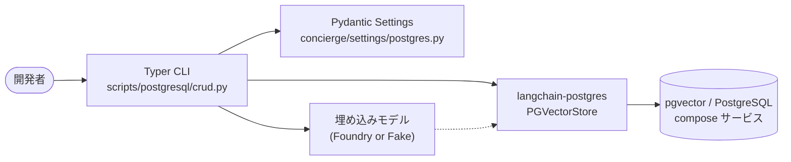

# ステップ 4 - PostgreSQL (pgvector) CRUD

## ゴール

このステップを終えると、次のことができるようになります。

- [pgvector](https://github.com/pgvector/pgvector) を有効化した PostgreSQL
  サービスを Docker Compose でローカル起動できる。
- CLI からベクトルストア用テーブルの作成と削除ができる。
- LangChain の
  [`langchain-postgres`](https://pypi.org/project/langchain-postgres/) パッケージ
  を用いて **C**reate / **R**ead / **U**pdate / **D**elete をすべて試せる。

## なぜこのステップが必要か

ステップ 1〜3 では `InMemoryVectorStore` を使っていたため、Python プロセス
を終了するとデータが消えてしまいました。実運用では再起動後も残るベクトル
ストアが必要です。PostgreSQL に
[pgvector](https://github.com/pgvector/pgvector) 拡張を入れる構成は、リレー
ショナルデータとベクトルを同じ DB で扱えるため広く採用されています。

LangChain は `langchain-postgres` を介して pgvector をファーストクラスで
サポートしているため、本リポジトリでは `PGVectorStore` API を標準採用して
います。



## 事前チェック

- [x] [ステップ 1](01-foundry-langchain.md) で `uv` 環境を整備済みである。
- [x] [Docker](https://docs.docker.com/get-docker/) が動作する。
- [ ] Microsoft Foundry の資格情報 (任意。`--fake-embeddings` で省略可)。

## 手順

### 4.1 接続情報の設定

接続情報は
[`concierge/settings/postgres.py`](https://github.com/ks6088ts-labs/concierge/blob/main/concierge/settings/postgres.py)
の型付き設定で表現します。

```python
class PostgresSettings(BaseSettings):
    postgres_host: str = "localhost"
    postgres_port: int = 5432
    postgres_user: str = "concierge"
    postgres_password: str = "concierge"
    postgres_db: str = "concierge"
    postgres_collection: str = "concierge_docs"
```

デフォルト値は
[`compose.yml`](https://github.com/ks6088ts-labs/concierge/blob/main/compose.yml)
の `postgres` サービスに揃えています。環境変数や `.env` で上書きできます。

### 4.2 サービス起動

```shell
docker compose up -d postgres
```

`vector` 拡張をプリインストール済みの
[`pgvector/pgvector:pg18`](https://hub.docker.com/r/pgvector/pgvector)
イメージを起動します。データは名前付きボリューム (`postgres-data`) に
永続化されます。

!!! tip "サービスの確認・停止"
    - `docker compose logs -f postgres` でログを tail できます。
    - `docker compose exec postgres psql -U concierge -d concierge` でコンテナ内の `psql` シェルを起動します。
    - `docker compose stop postgres` でサービスを停止します (ボリュームは保持)。

### 4.3 ベクトルテーブルの作成

```shell
uv run python scripts/postgresql/crud.py create-table
```

内部では
[`PGEngine.init_vectorstore_table`](https://github.com/langchain-ai/langchain-postgres)
を呼び出します。

```python
from langchain_postgres import PGEngine

engine = PGEngine.from_connection_string(url=settings.connection_string)
engine.init_vectorstore_table(
    table_name="concierge_docs",
    vector_size=1536,  # text-embedding-3-small の次元数
)
```

次元数が異なる埋め込みモデルに切り替える場合は `--vector-size` を渡してくださ
い (例: `text-embedding-3-large` は 3072)。

### 4.4 サンプルを一括投入 (Create)

```shell
uv run python scripts/postgresql/crud.py bulk-create
```

`bulk-create` サブコマンドは 4 件のサンプル文書を投入するので、続く検索が
成立します。任意の文書を 1 件だけ追加するときは `create` を使います。

```shell
uv run python scripts/postgresql/crud.py create \
    --id ml --source manual \
    --text "Machine learning models are trained on data."
```

### 4.5 検索と取得 (Read)

```shell
# クエリに近い上位 3 件を取得
uv run python scripts/postgresql/crud.py search --query "fruit" --k 3

# id 指定で個別取得
uv run python scripts/postgresql/crud.py read --id apple --id car
```

### 4.6 更新と削除

```shell
uv run python scripts/postgresql/crud.py update --id apple \
    --text "Apples, oranges, and bananas are fruits."

uv run python scripts/postgresql/crud.py delete --id apple --id car
```

`update` は同じ id で `delete` → `create` を行う実装にしているため、埋め込み
ベクトルも作り直されます。

### 4.7 Azure 認証なしで通しで試す

Microsoft Foundry の用意が間に合わないときは、グローバルフラグ
`--fake-embeddings` を付けると CLI が
[`DeterministicFakeEmbedding`](https://docs.langchain.com/oss/python/integrations/vectorstores/index)
を使うようになり、再現性のあるオフライン実行が可能になります。

```shell
uv run python scripts/postgresql/crud.py --fake-embeddings create-table
uv run python scripts/postgresql/crud.py --fake-embeddings bulk-create
uv run python scripts/postgresql/crud.py --fake-embeddings search --query "fruit"
```

!!! warning "フェイク埋め込みは意味検索になりません"
    `DeterministicFakeEmbedding` は安定はしますが意味のないベクトルを返す
    ので、類似度スコアは見栄えだけで実意味は持ちません。

### 4.8 後片付け

```shell
uv run python scripts/postgresql/crud.py drop-table
docker compose stop postgres
```

## 動作確認

`--fake-embeddings` を使った典型的な出力例は次の通りです。

```text
[create-table] table 'concierge_docs' ready (vector_size=1536, overwrite=False)
[bulk-create] inserted 4 sample documents into 'concierge_docs'
[search] query='fruit' k=3
  - id=apple text='Apples and oranges are fruits.' metadata={'source': 'seed'}
  - id=dog   text='Dogs and cats are common pets.' metadata={'source': 'seed'}
  - id=train text='A train runs on rails.'         metadata={'source': 'seed'}
```

### CRUD 全コマンドの実行手順 (動作確認済み)

以下の 11 ステップで全サブコマンドを通しで実行します。`docker compose up -d postgres`
でサービスを起動した直後の状態で、各ステップが終了ステータス 0 で完了す
ることを確認済みです。`--fake-embeddings` を付けると Azure 認証なしで完
全オフライン実行できます。Microsoft Foundry を使う場合はフラグを外して
ください。

```shell
# 1. テーブル作成 (前回の残骸があるときは --overwrite)
uv run python scripts/postgresql/crud.py --fake-embeddings create-table --overwrite

# 2. サンプル文書を一括投入
uv run python scripts/postgresql/crud.py --fake-embeddings bulk-create

# 3. 類似度検索
uv run python scripts/postgresql/crud.py --fake-embeddings search --query "fruit"

# 4. id 指定で取得
uv run python scripts/postgresql/crud.py --fake-embeddings read --id apple --id dog

# 5. 文書を 1 件追加
uv run python scripts/postgresql/crud.py --fake-embeddings create \
    --text "Sushi is a Japanese dish." --id sushi --source manual

# 6. 追加した文書を取得
uv run python scripts/postgresql/crud.py --fake-embeddings read --id sushi

# 7. 文書を更新
uv run python scripts/postgresql/crud.py --fake-embeddings update --id sushi \
    --text "Updated: Sushi is a famous Japanese dish made with vinegared rice." \
    --source manual

# 8. 更新内容を確認
uv run python scripts/postgresql/crud.py --fake-embeddings read --id sushi

# 9. 文書を削除
uv run python scripts/postgresql/crud.py --fake-embeddings delete --id sushi

# 10. 削除を確認 ("no documents found" が出れば OK)
uv run python scripts/postgresql/crud.py --fake-embeddings read --id sushi

# 11. テーブルを削除
uv run python scripts/postgresql/crud.py --fake-embeddings drop-table
```

各ステップで観測される代表的な出力は以下の通りです。

| # | サブコマンド | 期待する出力 |
| - | ------------ | ------------ |
| 1 | `create-table --overwrite` | `[create-table] table 'concierge_docs' ready (vector_size=1536, overwrite=True)` |
| 2 | `bulk-create` | `[bulk-create] inserted 4 sample documents into 'concierge_docs'` |
| 3 | `search` | `[search] query='fruit' k=3` と 3 件の結果行 |
| 4 | `read apple dog` | `- id=... text=...` が 2 行 |
| 5 | `create sushi` | `[create] id=sushi text='Sushi is a Japanese dish.' metadata={'source': 'manual'}` |
| 6 | `read sushi` | `sushi` の結果行 1 件 |
| 7 | `update sushi` | `[update] id=sushi text='Updated: ...' metadata={'source': 'manual'}` |
| 8 | `read sushi` | 更新後のテキストが表示される |
| 9 | `delete sushi` | `[delete] deleted ids=['sushi']` |
| 10 | `read sushi` | `[read] no documents found for ids=['sushi']` |
| 11 | `drop-table` | `[drop-table] table 'concierge_docs' dropped` |

## トラブルシュート

??? failure "CLI 実行時に `connection refused` が出る"
    `docker compose up -d postgres` で Compose サービスが起動しているか、`.env` の
    `POSTGRES_HOST` / `POSTGRES_PORT` が Docker が公開するポートと一致して
    いるかを確認してください。

??? failure "`extension \"vector\" is not available`"
    既定の `pgvector/pgvector:pg18` イメージには拡張が同梱されており、
    テーブル初期化時に `CREATE EXTENSION IF NOT EXISTS vector` が走ります。
    `postgres:*` 系の素の image に差し替える場合は pgvector を手動で
    インストールしてください。

??? failure "insert 時に `dimension mismatch` が出る"
    `create-table` で固定次元のカラムを作成しています。以降のコマンドにも同じ
    `--vector-size` を渡すか、埋め込みモデルを変えたときはテーブルを
    `drop-table` → `create-table` し直してください。

## 次のステップ

これでベクトルストアが再起動後も残るようになりました。
[ステップ 3 - 次の一歩 (クリーンアーキテクチャ & IaC)](03-next-steps.md)
の設計メモに進むか、[ステップ 2 - 可観測性](02-observability.md) に戻って
新しい CRUD フローにトレースを足してみてください。
