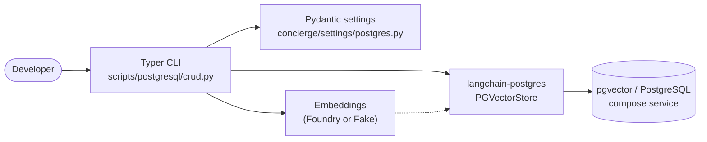

# Step 4 - PostgreSQL (pgvector) CRUD

## Goal

By the end of this step you will be able to:

- run a local [pgvector](https://github.com/pgvector/pgvector)-enabled
  PostgreSQL service through Docker Compose,
- create and tear down a vector store table from the CLI,
- and exercise the full **C**reate / **R**ead / **U**pdate / **D**elete cycle
  against the table with the LangChain
  [`langchain-postgres`](https://pypi.org/project/langchain-postgres/) package.

## Why this step exists

Steps 1 to 3 used `InMemoryVectorStore`, which loses its contents the moment
the Python process exits. Real applications need a vector store that survives
restarts. PostgreSQL with the
[pgvector](https://github.com/pgvector/pgvector) extension is a popular choice
because it keeps relational data and vector embeddings in the same database.

LangChain ships first-class bindings to pgvector via the `langchain-postgres`
package, so we standardise on its `PGVectorStore` API.



## Prerequisites checklist

- [x] You completed [Step 1](01-foundry-langchain.md) so `uv` and the project
      are bootstrapped.
- [x] [Docker](https://docs.docker.com/get-docker/) is installed and the
      daemon is running.
- [ ] Microsoft Foundry credentials (optional - skip with `--fake-embeddings`).

## Steps

### 4.1 Configure the connection

The PostgreSQL connection is described by typed settings in
[`concierge/settings/postgres.py`](https://github.com/ks6088ts-labs/concierge/blob/main/concierge/settings/postgres.py):

```python
class PostgresSettings(BaseSettings):
    postgres_host: str = "localhost"
    postgres_port: int = 5432
    postgres_user: str = "concierge"
    postgres_password: str = "concierge"
    postgres_db: str = "concierge"
    postgres_collection: str = "concierge_docs"
```

Defaults match the `postgres` service in
[`compose.yml`](https://github.com/ks6088ts-labs/concierge/blob/main/compose.yml).
Override any value via environment variables or `.env`.

### 4.2 Start the service

```shell
docker compose up -d postgres
```

This boots the
[`pgvector/pgvector:pg18`](https://hub.docker.com/r/pgvector/pgvector) image
with the `vector` extension preinstalled. Data persists in a named volume
(`postgres-data`).

!!! tip "Inspect or stop the service"
    - `docker compose logs -f postgres` tails the container logs.
    - `docker compose exec postgres psql -U concierge -d concierge` opens a `psql` shell inside the container.
    - `docker compose stop postgres` stops the service (the volume is preserved).

### 4.3 Create the vector table

```shell
uv run python scripts/postgresql/crud.py create-table
```

Under the hood the script calls
[`PGEngine.init_vectorstore_table`](https://github.com/langchain-ai/langchain-postgres):

```python
from langchain_postgres import PGEngine

engine = PGEngine.from_connection_string(url=settings.connection_string)
engine.init_vectorstore_table(
    table_name="concierge_docs",
    vector_size=1536,  # text-embedding-3-small dimension
)
```

Pass `--vector-size` if you switch to an embedding model with a different
dimension (for example `text-embedding-3-large` returns 3072).

### 4.4 Bulk-insert sample documents (Create)

```shell
uv run python scripts/postgresql/crud.py bulk-create
```

The `bulk-create` subcommand inserts four short documents so subsequent
searches return something useful. To insert a single document of your own use
`create`:

```shell
uv run python scripts/postgresql/crud.py create \
    --id ml --source manual \
    --text "Machine learning models are trained on data."
```

### 4.5 Search and read (Read)

```shell
# Top-3 documents close to the query
uv run python scripts/postgresql/crud.py search --query "fruit" --k 3

# Fetch one or more documents by id
uv run python scripts/postgresql/crud.py read --id apple --id car
```

### 4.6 Update and delete

```shell
uv run python scripts/postgresql/crud.py update --id apple \
    --text "Apples, oranges, and bananas are fruits."

uv run python scripts/postgresql/crud.py delete --id apple --id car
```

The CLI implements `update` as `delete` + `create` for the same id so the
embedding is recomputed and the row stays consistent.

### 4.7 Run end-to-end without Azure credentials

Use the global `--fake-embeddings` flag if you do not have a Microsoft
Foundry deployment handy. The CLI then uses
[`DeterministicFakeEmbedding`](https://docs.langchain.com/oss/python/integrations/vectorstores/index)
so every step is reproducible and offline.

```shell
uv run python scripts/postgresql/crud.py --fake-embeddings create-table
uv run python scripts/postgresql/crud.py --fake-embeddings bulk-create
uv run python scripts/postgresql/crud.py --fake-embeddings search --query "fruit"
```

!!! warning "Fake embeddings are not semantic"
    `DeterministicFakeEmbedding` produces stable but meaningless vectors, so
    similarity scores look reasonable but do not reflect actual semantics.

### 4.8 Clean up

```shell
uv run python scripts/postgresql/crud.py drop-table
docker compose stop postgres
```

## Verify

A typical session looks like this (`--fake-embeddings` shown for brevity):

```text
[create-table] table 'concierge_docs' ready (vector_size=1536, overwrite=False)
[bulk-create] inserted 4 sample documents into 'concierge_docs'
[search] query='fruit' k=3
  - id=apple text='Apples and oranges are fruits.' metadata={'source': 'seed'}
  - id=dog   text='Dogs and cats are common pets.' metadata={'source': 'seed'}
  - id=train text='A train runs on rails.'         metadata={'source': 'seed'}
```

### Verified full CRUD walkthrough

The following 11-step sequence exercises every subcommand end-to-end. Every
step has been verified to exit with status 0 against a freshly-started
`docker compose up -d postgres` service. `--fake-embeddings` keeps the run completely
offline; drop the flag once Microsoft Foundry credentials are in place.

```shell
# 1. Create the table (use --overwrite if a previous run left it behind)
uv run python scripts/postgresql/crud.py --fake-embeddings create-table --overwrite

# 2. Bulk-insert sample documents
uv run python scripts/postgresql/crud.py --fake-embeddings bulk-create

# 3. Similarity search
uv run python scripts/postgresql/crud.py --fake-embeddings search --query "fruit"

# 4. Read documents by id
uv run python scripts/postgresql/crud.py --fake-embeddings read --id apple --id dog

# 5. Create a new document
uv run python scripts/postgresql/crud.py --fake-embeddings create \
    --text "Sushi is a Japanese dish." --id sushi --source manual

# 6. Read it back
uv run python scripts/postgresql/crud.py --fake-embeddings read --id sushi

# 7. Update its content
uv run python scripts/postgresql/crud.py --fake-embeddings update --id sushi \
    --text "Updated: Sushi is a famous Japanese dish made with vinegared rice." \
    --source manual

# 8. Confirm the update
uv run python scripts/postgresql/crud.py --fake-embeddings read --id sushi

# 9. Delete the document
uv run python scripts/postgresql/crud.py --fake-embeddings delete --id sushi

# 10. Confirm deletion (prints "no documents found")
uv run python scripts/postgresql/crud.py --fake-embeddings read --id sushi

# 11. Drop the table
uv run python scripts/postgresql/crud.py --fake-embeddings drop-table
```

Key lines you should see for each step:

| # | Subcommand | Expected output |
| - | ---------- | --------------- |
| 1 | `create-table --overwrite` | `[create-table] table 'concierge_docs' ready (vector_size=1536, overwrite=True)` |
| 2 | `bulk-create` | `[bulk-create] inserted 4 sample documents into 'concierge_docs'` |
| 3 | `search` | `[search] query='fruit' k=3` plus three result lines |
| 4 | `read apple dog` | Two `- id=... text=...` lines |
| 5 | `create sushi` | `[create] id=sushi text='Sushi is a Japanese dish.' metadata={'source': 'manual'}` |
| 6 | `read sushi` | One result line for `sushi` |
| 7 | `update sushi` | `[update] id=sushi text='Updated: ...' metadata={'source': 'manual'}` |
| 8 | `read sushi` | Updated text echoed back |
| 9 | `delete sushi` | `[delete] deleted ids=['sushi']` |
| 10 | `read sushi` | `[read] no documents found for ids=['sushi']` |
| 11 | `drop-table` | `[drop-table] table 'concierge_docs' dropped` |

## Troubleshooting

??? failure "`connection refused` when calling the CLI"
    Make sure the Compose service is running (`docker compose up -d postgres`) and the
    `POSTGRES_HOST` / `POSTGRES_PORT` values in `.env` match the host port
    exposed by Docker.

??? failure "`extension \"vector\" is not available`"
    The default image (`pgvector/pgvector:pg18`) ships the extension; the
    table-init call runs `CREATE EXTENSION IF NOT EXISTS vector` for you. If
    you swap the image to a vanilla `postgres:*` tag, install pgvector
    manually or revert to the bundled image.

??? failure "`dimension mismatch` on insert"
    The `create-table` command writes a column with a fixed vector dimension.
    Use the same `--vector-size` for every subsequent command, or
    `drop-table` and re-create the table if you change embedding models.

## What's next

You now have a persistent vector store that survives restarts. Continue with
[Step 3 - Next steps (Clean Architecture & IaC)](03-next-steps.md) for the
forward-looking architectural plans, or revisit
[Step 2 - Observability](02-observability.md) to add tracing to the new CRUD
flows.
