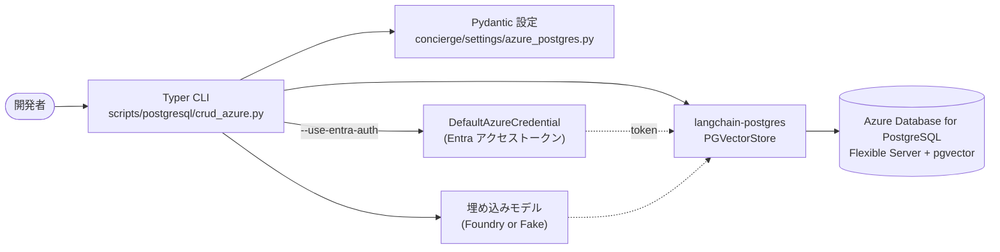

# ステップ 5 - Azure Database for PostgreSQL (pgvector) で CRUD

## ゴール

このステップを終えると、次のことができるようになります。

- `pgvector` 拡張を有効化したマネージド
  [Azure Database for PostgreSQL Flexible Server](https://learn.microsoft.com/ja-jp/azure/postgresql/flexible-server/overview)
  に LangChain から接続できる。
- 従来のパスワード認証、または `DefaultAzureCredential` 経由で取得した
  Microsoft Entra アクセストークンによる認証のどちらかを選んで使える。
- [`scripts/postgresql/crud_azure.py`](https://github.com/ks6088ts-labs/concierge/blob/main/scripts/postgresql/crud_azure.py)
  CLI で CRUD を一通り実行できる。これは
  [ステップ 4](04-postgres-vector-store.md) の
  [`scripts/postgresql/crud.py`](https://github.com/ks6088ts-labs/concierge/blob/main/scripts/postgresql/crud.py)
  と対をなす Azure 向け実装です。

## なぜこのステップが必要か

[ステップ 4](04-postgres-vector-store.md) ではローカル Docker Compose の
pgvector を使いました。オフラインで反復するには便利ですが、運用環境では
マネージドな DB を使いたい場面が多いはずです。
Azure Database for PostgreSQL Flexible Server は
[`pgvector` 拡張](https://learn.microsoft.com/ja-jp/azure/postgresql/extensions/how-to-use-pgvector)
を公式サポートしており、Microsoft Entra ID とも統合されているため、同じ
LangChain [`PGVectorStore`](https://github.com/langchain-ai/langchain-postgres)
コードを変更ゼロで動かせます。変わるのは接続文字列と認証フローだけです。

このステップは Microsoft Learn の
[Azure Database for PostgreSQL で LangChain を使う](https://learn.microsoft.com/ja-jp/azure/postgresql/azure-ai/generative-ai-develop-with-langchain)
を参考にしていますが、本リポジトリで既に固定済みの `langchain-postgres`
パッケージを再利用し、追加の依存衝突を避ける構成にしています。理由の詳細は
[`scripts/postgresql/crud_azure.py`](https://github.com/ks6088ts-labs/concierge/blob/main/scripts/postgresql/crud_azure.py)
の冒頭 docstring に書いています。



## 事前チェック

- [x] [ステップ 1](01-foundry-langchain.md) で `uv` 環境を整備済みである。
- [x] [Azure Database for PostgreSQL Flexible Server](https://learn.microsoft.com/ja-jp/azure/postgresql/flexible-server/quickstart-create-server-portal)
      を作成済み、または作成可能な Azure サブスクリプションを持っている。
- [x] 対象 DB で `pgvector` 拡張が
      [許可一覧に追加され、有効化済み](https://learn.microsoft.com/ja-jp/azure/postgresql/extensions/how-to-use-pgvector)。
- [x] Microsoft Entra 認証がサーバで有効化されており、自分の ID
      (または SQL ユーザ) に DB ロールが付与されている。
- [x] [Azure CLI](https://learn.microsoft.com/ja-jp/cli/azure/install-azure-cli)
      にサインイン済み (`az login`) で、`DefaultAzureCredential` が
      認証情報として参照できる。
- [ ] Microsoft Foundry の資格情報 (任意。`--fake-embeddings` で省略可)。

!!! tip "簡易プロビジョニング"
    動作確認用のサーバが必要なときは
    [Azure ポータルのクイックスタート](https://learn.microsoft.com/ja-jp/azure/postgresql/flexible-server/quickstart-create-server-portal)
    に従って Flexible Server を作成し、**サーバ パラメータ** ブレードから
    `pgvector` を有効化してください。必要な Azure 側手順は、Microsoft Learn
    の LangChain ガイドにもまとめて記載されています:
    <https://learn.microsoft.com/ja-jp/azure/postgresql/azure-ai/generative-ai-develop-with-langchain>。

## 手順

### 5.1 `vector` 拡張をサーバで有効化する

Azure Database for PostgreSQL には `pgvector` が同梱されていますが、既定では
ロードされていません。
[how-to-use-pgvector](https://learn.microsoft.com/ja-jp/azure/postgresql/extensions/how-to-use-pgvector)
の手順で次のように設定します。

1. Azure ポータルで対象 Flexible Server の **サーバ パラメータ** を開きます。
2. `azure.extensions` の値に `VECTOR` を追加します (カンマ区切り)。
3. 保存します (サーバが再起動します)。
4. 対象データベースに 1 度接続し、`CREATE EXTENSION IF NOT EXISTS vector;`
    を実行します。CLI の `create-table` も同じ DDL を発行しますが、データ
    ベースごとの権限チェックを通すために手動でも一度確認しておくと安全です。

### 5.2 Microsoft Entra 認証を構成する (推奨)

CLI は既定で Entra アクセストークンを使って認証するため、固定のデータベース
パスワードを保持する必要がありません。

1. Azure ポータルで Flexible Server の
    [Microsoft Entra 認証を有効化](https://learn.microsoft.com/ja-jp/azure/postgresql/flexible-server/how-to-configure-sign-in-azure-ad-authentication)
    し、自身 (または所属グループ) を **Entra 管理者** として追加します。
2. その Entra プリンシパルをそのまま使うか、管理者接続から次のように
    対応する PostgreSQL ロールを作成します。

    ```sql
    -- 既存の Entra ユーザを PostgreSQL ロールにマッピング
    SELECT * FROM pgaadauth_create_principal('<entra-user@tenant>', false, false);
    GRANT ALL PRIVILEGES ON DATABASE <db> TO "<entra-user@tenant>";
    ```

3. `.env` の `AZURE_DBUSER` に、その Entra プリンシパル名 (例:
    `alice@contoso.com`) を設定します。

!!! note "トークン有効期限"
    Entra アクセストークンの有効期間は通常 1 時間程度と短いです。CLI は
    実行ごとにフレッシュなトークンを取得するので、`uv run python …` を
    走らせるたびに新しい接続が張られます。長寿命のサービスではトークン
    の更新ロジックを別途用意してください。

### 5.3 接続情報を設定する

接続情報は
[`concierge/settings/azure_postgres.py`](https://github.com/ks6088ts-labs/concierge/blob/main/concierge/settings/azure_postgres.py)
の型付き設定で表現します。

```python
class AzurePostgresSettings(BaseSettings):
    dbhost: str = ""
    dbname: str = ""
    dbuser: str = ""
    dbpassword: str = ""
    dbport: int = 5432
    sslmode: str = "require"
    use_entra_auth: bool = True
    entra_token_scope: str = "https://ossrdbms-aad.database.windows.net/.default"

    model_config = SettingsConfigDict(env_prefix="AZURE_", ...)
```

[`.env.template`](https://github.com/ks6088ts-labs/concierge/blob/main/.env.template)
の Azure 用ブロックを `.env` にコピーして埋めてください。

```dotenv
# Azure Database for PostgreSQL Flexible Server Settings
AZURE_DBHOST=<server-name>.postgres.database.azure.com
AZURE_DBNAME=postgres
AZURE_DBPORT=5432
AZURE_SSLMODE=require
# AZURE_USE_ENTRA_AUTH=true で Microsoft Entra ID 経由の認証を使います
AZURE_USE_ENTRA_AUTH=true
AZURE_DBUSER=<entra-principal-or-db-user>
# AZURE_DBPASSWORD は AZURE_USE_ENTRA_AUTH=false のときだけ必要です。
AZURE_DBPASSWORD=
```

パスワード認証を選ぶ場合は `AZURE_USE_ENTRA_AUTH=false` にして、
`AZURE_DBUSER` / `AZURE_DBPASSWORD` を埋めます。

### 5.4 Azure CLI でサインインする

`DefaultAzureCredential` は `az login` → 環境変数 → マネージド ID の順に
資格情報を探します。ローカル開発では `az login` 1 回で十分です。

```shell
az login
# (任意) アクティブなサブスクリプションを確認
az account show --query "{name:name, id:id}" -o table
```

### 5.5 CLI を確認する

最初にスクリプトが読み込めるかを確認します。ネットワーク呼び出しが発生
しないので、`.env` の typo を早期発見できます。

```shell
uv run python scripts/postgresql/crud_azure.py --help
```

ローカル版と同じサブコマンド一覧 (`create-table`, `drop-table`, `create`,
`bulk-create`, `read`, `search`, `update`, `delete`) が出力されれば OK
です。

### 5.6 ベクトルテーブルを作成する

```shell
uv run python scripts/postgresql/crud_azure.py create-table
```

内部では Azure 向け接続文字列 (`sslmode=require`、Entra トークンを
パスワードとして利用) を使って
[`PGEngine.from_connection_string`](https://github.com/langchain-ai/langchain-postgres)
を呼び出し、`init_vectorstore_table` でスキーマを作成します。

```python
from langchain_postgres import PGEngine

engine = PGEngine.from_connection_string(url=azure_settings.build_connection_string(
    user="<entra-user>",
    password="<entra-access-token>",
))
engine.init_vectorstore_table(
    table_name="concierge_docs",
    vector_size=1536,  # text-embedding-3-small の次元数
)
```

埋め込みモデルを変えるときは `--vector-size` を渡してください (例:
`text-embedding-3-large` は 3072)。前回作成済みのテーブルを置き換えたい
ときは `--overwrite` を付けます。

### 5.7 サンプル文書を一括投入する (Create)

```shell
uv run python scripts/postgresql/crud_azure.py bulk-create
```

任意の 1 件を追加するときは `create` を使います。

```shell
uv run python scripts/postgresql/crud_azure.py create \
    --id ml --source manual \
    --text "Machine learning models are trained on data."
```

### 5.8 検索と取得 (Read)

```shell
# クエリに近い上位 3 件
uv run python scripts/postgresql/crud_azure.py search --query "fruit" --k 3

# id 指定で個別取得
uv run python scripts/postgresql/crud_azure.py read --id apple --id car
```

### 5.9 更新と削除

```shell
uv run python scripts/postgresql/crud_azure.py update --id apple \
    --text "Apples, oranges, and bananas are fruits."

uv run python scripts/postgresql/crud_azure.py delete --id apple --id car
```

ステップ 4 と同じく、`update` は同じ id で `delete` → `create` を行うた
め、埋め込みベクトルも作り直されます。

### 5.10 埋め込みデプロイなしで通しで試す

ステップ 4 と同じく `--fake-embeddings` を付けると
[`DeterministicFakeEmbedding`](https://docs.langchain.com/oss/python/integrations/vectorstores/index)
を使ってローカルで埋め込みを生成するので、Foundry の埋め込みデプロイが
未準備でも Azure 接続パスを通しで動作確認できます。

```shell
uv run python scripts/postgresql/crud_azure.py --fake-embeddings create-table --overwrite
uv run python scripts/postgresql/crud_azure.py --fake-embeddings bulk-create
uv run python scripts/postgresql/crud_azure.py --fake-embeddings search --query "fruit"
```

!!! warning "フェイク埋め込みは意味検索になりません"
    `DeterministicFakeEmbedding` は安定はしますが意味のないベクトルを
    返すので、類似度スコアは見栄えだけで実意味は持ちません。

### 5.11 後片付け

```shell
uv run python scripts/postgresql/crud_azure.py drop-table
```

Flexible Server 自体は影響を受けず、`concierge_docs` テーブルだけが削除
されます。

## 動作確認

`--fake-embeddings` を使った典型的な出力例は次の通りです。

```text
[create-table] table 'concierge_docs' ready (vector_size=1536, overwrite=False)
[bulk-create] inserted 4 sample documents into 'concierge_docs'
[search] query='fruit' k=3
  - id=apple text='Apples and oranges are fruits.' metadata={'source': 'seed'}
  - id=dog   text='Dogs and cats are common pets.' metadata={'source': 'seed'}
  - id=train text='A train runs on rails.'         metadata={'source': 'seed'}
```

### Azure 不要のオフライン疎通確認

Azure アカウントが手元になくても、CLI がロードできることと、必要な環境
変数が未設定の場合にきちんとエラーになることは確認できます。

```shell
# 1. help の表示は Azure に接続しないので最初の確認に最適
uv run python scripts/postgresql/crud_azure.py --help

# 2. AZURE_DBHOST / AZURE_DBNAME が未設定なら、どのサブコマンドも Typer の
#    BadParameter で不足変数を告げて終了します。この CLI は起動時に
#    `load_dotenv(override=True)` を呼ぶため、一時的に `.env` を退避させるのが
#    最も手っ取り早いシミュレート方法です。
mv .env .env.bak 2>/dev/null || true
uv run python scripts/postgresql/crud_azure.py --fake-embeddings create-table || \
    echo "(想定どおり) AZURE_DBHOST / AZURE_DBNAME が未設定 (exit code 2)"
mv .env.bak .env 2>/dev/null || true
```

ステップ 2 で期待されるメッセージ:

```text
Usage: crud_azure.py [OPTIONS] COMMAND [ARGS]...
Try 'crud_azure.py --help' for help.
╭─ Error ───────────────────────────────────────────────────────────────────────────────────────────╮
│ Invalid value: AZURE_DBHOST and AZURE_DBNAME must be set in the          │
│ environment (.env). See .env.template for the required Azure PostgreSQL │
│ variables.                                                              │
╰──────────────────────────────────────────────────────────────────────────────────────────────╯
```

!!! warning "`.env` のリネームについて"
    上記の `mv .env .env.bak` / `mv .env.bak .env` は未設定状態をシミュレートする
    ためだけの手順です。`.env` をすでに埋めて Flexible Server に接続する場合は
    この 2 行は不要です。

### CRUD 全コマンドの実行手順 (Flexible Server に対して)

`.env` が埋まり `az login` も済んだら、次の順序で全サブコマンドを試せ
ます。

```shell
# 1. テーブル作成 (前回の残骸がある場合は --overwrite)
uv run python scripts/postgresql/crud_azure.py create-table --overwrite

# 2. サンプル文書を一括投入
uv run python scripts/postgresql/crud_azure.py bulk-create

# 3. 類似度検索
uv run python scripts/postgresql/crud_azure.py search --query "fruit"

# 4. id 指定で取得
uv run python scripts/postgresql/crud_azure.py read --id apple --id dog

# 5. 文書を 1 件追加
uv run python scripts/postgresql/crud_azure.py create \
    --text "Sushi is a Japanese dish." --id sushi --source manual

# 6. 追加した文書を取得
uv run python scripts/postgresql/crud_azure.py read --id sushi

# 7. 文書を更新
uv run python scripts/postgresql/crud_azure.py update --id sushi \
    --text "Updated: Sushi is a famous Japanese dish made with vinegared rice." \
    --source manual

# 8. 更新内容を確認
uv run python scripts/postgresql/crud_azure.py read --id sushi

# 9. 文書を削除
uv run python scripts/postgresql/crud_azure.py delete --id sushi

# 10. 削除を確認 ("no documents found" が出れば OK)
uv run python scripts/postgresql/crud_azure.py read --id sushi

# 11. テーブルを削除
uv run python scripts/postgresql/crud_azure.py drop-table
```

各ステップで期待される出力は
[ステップ 4 の表](04-postgres-vector-store.md#crud-全コマンドの実行手順-動作確認済み)
と同じです。実体としての違いは、データの保存先がローカル Compose
ボリュームではなく Azure サーバ側になる、という点だけです。

## トラブルシュート

??? failure "`AZURE_DBHOST and AZURE_DBNAME must be set in the environment (.env)`"
    上記 2 つの変数が未設定または空のときに CLI が `typer.BadParameter`
    で失敗します。`.env.template` の Azure 用ブロックを `.env` にコピー
    して値を埋めて再実行してください。

??? failure "`AZURE_DBUSER must be set to the Entra principal name`"
    `AZURE_USE_ENTRA_AUTH=true` のときは `AZURE_DBUSER` に、サーバ側で
    PostgreSQL ロールが付与済みの Entra プリンシパル名を入れてください。
    あるいはパスワード認証に切り替える (`AZURE_USE_ENTRA_AUTH=false` と
    `AZURE_DBPASSWORD` を設定) ことも選べます。

??? failure "`FATAL: password authentication failed`"
    Entra プリンシパルが PostgreSQL ロールとして登録されていないか、
    アクセストークンの audience が Azure PostgreSQL 向けでない可能性が
    あります。
    [Microsoft Entra 認証のセットアップ](https://learn.microsoft.com/ja-jp/azure/postgresql/flexible-server/how-to-configure-sign-in-azure-ad-authentication)
    を見直し、`az login` をやり直してください。テナント固有の audience
    が必要な場合のみ `AZURE_ENTRA_TOKEN_SCOPE` を上書きします。

??? failure "`extension "vector" is not available`"
    **サーバ パラメータ** の `azure.extensions` に `VECTOR` を追加し、
    サーバ再起動後に対象データベースで一度
    `CREATE EXTENSION IF NOT EXISTS vector;` を実行してください。詳細は
    [how-to-use-pgvector](https://learn.microsoft.com/ja-jp/azure/postgresql/extensions/how-to-use-pgvector)
    を参照。

??? failure "`SSL connection is required`"
    接続文字列は既定で `sslmode=require` を付けます。`AZURE_SSLMODE` を
    上書きした場合は `require` (または `verify-full`) に戻してください。

??? failure "`pgvector` と `langchain-azure-postgresql` のバージョン衝突"
    `langchain-azure-postgresql` は `pgvector>=0.4,<0.5` を要求しますが、
    本リポジトリの `langchain-postgres==0.0.17` は `pgvector>=0.2.5,<0.4`
    を要求するため、現時点では同居できません。CLI が
    `langchain-postgres` を再利用し、Azure 向けの接続文字列を組み立て
    る形にしているのはこのためです。詳細は
    [`scripts/postgresql/crud_azure.py`](https://github.com/ks6088ts-labs/concierge/blob/main/scripts/postgresql/crud_azure.py)
    の冒頭 docstring を参照してください。

## 次のステップ

これで同じ CRUD ワークフローをマネージド Azure サーバに対して動かせるよ
うになりました。自然な次の一手は
[ステップ 3 - 次の一歩 (クリーンアーキテクチャ & IaC)](03-next-steps.md)
にあるように、ベクトルストアの実装 (Compose または Flexible Server) を
切り替えられるよう Repository ポートを切り出し、
[Issue #10](https://github.com/ks6088ts-labs/concierge/issues/10) の IaC
で Flexible Server をプロビジョニングすることです。
