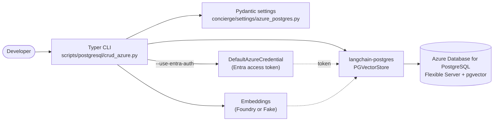

# Step 5 - Azure Database for PostgreSQL (pgvector) CRUD

## Goal

By the end of this step you will be able to:

- connect to a managed
  [Azure Database for PostgreSQL Flexible Server](https://learn.microsoft.com/en-us/azure/postgresql/flexible-server/overview)
  instance that has the `pgvector` extension enabled,
- authenticate against the server either with a classic database password or
  with a Microsoft Entra access token retrieved via `DefaultAzureCredential`,
- and exercise the full CRUD cycle through the
  [`scripts/postgresql/crud_azure.py`](https://github.com/ks6088ts-labs/concierge/blob/main/scripts/postgresql/crud_azure.py)
  CLI - the Azure-targeted companion of the local
  [`scripts/postgresql/crud.py`](https://github.com/ks6088ts-labs/concierge/blob/main/scripts/postgresql/crud.py)
  from [Step 4](04-postgres-vector-store.md).

## Why this step exists

[Step 4](04-postgres-vector-store.md) covered the local Docker Compose
pgvector service. That is great for offline iteration, but production
deployments usually want a managed database. Azure Database for PostgreSQL
Flexible Server natively supports the
[`pgvector` extension](https://learn.microsoft.com/en-us/azure/postgresql/extensions/how-to-use-pgvector)
and integrates with Microsoft Entra ID, so the same LangChain
[`PGVectorStore`](https://github.com/langchain-ai/langchain-postgres) code can
run unchanged against it - only the connection string and the authentication
flow change.

This step is shaped after the Microsoft Learn guide
[Use LangChain with Azure Database for PostgreSQL](https://learn.microsoft.com/en-us/azure/postgresql/azure-ai/generative-ai-develop-with-langchain),
but uses the `langchain-postgres` package already pinned by this project so
that no extra dependency conflict has to be resolved (see the docstring of
[`scripts/postgresql/crud_azure.py`](https://github.com/ks6088ts-labs/concierge/blob/main/scripts/postgresql/crud_azure.py)
for the rationale).



## Prerequisites checklist

- [x] You completed [Step 1](01-foundry-langchain.md) so `uv` and the project
      are bootstrapped.
- [x] An Azure subscription where you can create (or already have) an
      [Azure Database for PostgreSQL Flexible Server](https://learn.microsoft.com/en-us/azure/postgresql/flexible-server/quickstart-create-server-portal).
- [x] The `pgvector` extension is
      [allow-listed and enabled](https://learn.microsoft.com/en-us/azure/postgresql/extensions/how-to-use-pgvector)
      on the target database.
- [x] Microsoft Entra authentication is configured for the server, and your
      identity (or a SQL user) is granted a role on the database.
- [x] [Azure CLI](https://learn.microsoft.com/en-us/cli/azure/install-azure-cli)
      is installed and you ran `az login` so that `DefaultAzureCredential`
      can pick up your identity.
- [ ] Microsoft Foundry credentials (optional - skip with `--fake-embeddings`).

!!! tip "Quick provisioning"
    For a minimal sandbox server, follow the
    [Azure portal quickstart](https://learn.microsoft.com/en-us/azure/postgresql/flexible-server/quickstart-create-server-portal)
    and then enable `pgvector` from the **Server parameters** blade. The
    Microsoft Learn LangChain guide also lists every required Azure step in
    one place:
    <https://learn.microsoft.com/en-us/azure/postgresql/azure-ai/generative-ai-develop-with-langchain>.

## Steps

### 5.1 Enable the `vector` extension on the server

Azure Database for PostgreSQL ships `pgvector` but does not load it by
default. Follow
[how-to-use-pgvector](https://learn.microsoft.com/en-us/azure/postgresql/extensions/how-to-use-pgvector)
to:

1. Open **Server parameters** for your Flexible Server in the Azure portal.
2. Find `azure.extensions` and add `VECTOR` to the comma-separated list.
3. Save (this restarts the server).
4. Connect to the target database once and run `CREATE EXTENSION IF NOT
    EXISTS vector;`. The CLI's `create-table` command also issues this DDL,
    but the per-database privilege check needs to succeed.

### 5.2 Configure Microsoft Entra authentication (recommended)

The CLI authenticates by default with an Entra access token, so you do not
have to store a static database password.

1. From the Azure portal, enable
    [Microsoft Entra authentication](https://learn.microsoft.com/en-us/azure/postgresql/flexible-server/how-to-configure-sign-in-azure-ad-authentication)
    on the Flexible Server and add yourself (or a group you belong to) as an
    **Entra administrator**.
2. Either use that Entra principal directly or, with the admin connection,
    create a regular PostgreSQL role mapped to the principal:

    ```sql
    -- Map an existing Entra user to a PostgreSQL role
    SELECT * FROM pgaadauth_create_principal('<entra-user@tenant>', false, false);
    GRANT ALL PRIVILEGES ON DATABASE <db> TO "<entra-user@tenant>";
    ```

3. Set `AZURE_DBUSER` in your `.env` to that Entra principal name (the value
    you would put in a `WHO` `SET ROLE`, e.g. `alice@contoso.com`).

!!! note "Token expiry"
    Entra access tokens are short-lived (typically one hour). The CLI fetches
    a fresh token at every CLI invocation, so each `uv run python …` command
    starts a clean connection. Long-running services should refresh the
    token before it expires.

### 5.3 Configure the connection

The connection is described by typed settings in
[`concierge/settings/azure_postgres.py`](https://github.com/ks6088ts-labs/concierge/blob/main/concierge/settings/azure_postgres.py):

```python
class AzurePostgresSettings(BaseSettings):
    dbhost: str = ""
    dbname: str = ""
    dbuser: str = ""
    dbpassword: str = ""
    dbport: int = 5432
    sslmode: str = "require"
    use_entra_auth: bool = True
    entra_token_scope: str = "https://ossrdbms-aad.database.windows.net/.default"

    model_config = SettingsConfigDict(env_prefix="AZURE_", ...)
```

Copy the Azure block from
[`.env.template`](https://github.com/ks6088ts-labs/concierge/blob/main/.env.template)
into your `.env` and fill it in:

```dotenv
# Azure Database for PostgreSQL Flexible Server Settings
AZURE_DBHOST=<server-name>.postgres.database.azure.com
AZURE_DBNAME=postgres
AZURE_DBPORT=5432
AZURE_SSLMODE=require
# Set AZURE_USE_ENTRA_AUTH=true to authenticate via Microsoft Entra ID
AZURE_USE_ENTRA_AUTH=true
AZURE_DBUSER=<entra-principal-or-db-user>
# AZURE_DBPASSWORD is only required when AZURE_USE_ENTRA_AUTH=false.
AZURE_DBPASSWORD=
```

If you prefer password authentication, set `AZURE_USE_ENTRA_AUTH=false` and
fill in `AZURE_DBUSER` / `AZURE_DBPASSWORD` instead.

### 5.4 Sign in with Azure CLI

`DefaultAzureCredential` will look at `az login`, environment variables, or a
managed identity (in that order). For local development a single `az login`
is enough.

```shell
az login
# (Optional) verify which subscription is active
az account show --query "{name:name, id:id}" -o table
```

### 5.5 Inspect the CLI

Verify the script loads and prints its subcommands. Run this first to catch
typos in `.env` before any network call.

```shell
uv run python scripts/postgresql/crud_azure.py --help
```

You should see the same subcommand set as the local CRUD CLI:
`create-table`, `drop-table`, `create`, `bulk-create`, `read`, `search`,
`update`, `delete`.

### 5.6 Create the vector table

```shell
uv run python scripts/postgresql/crud_azure.py create-table
```

This calls
[`PGEngine.from_connection_string`](https://github.com/langchain-ai/langchain-postgres)
with an Azure-aware URL (`sslmode=require`, Entra token used as the
password) and then runs `init_vectorstore_table` to create the schema:

```python
from langchain_postgres import PGEngine

engine = PGEngine.from_connection_string(url=azure_settings.build_connection_string(
    user="<entra-user>",
    password="<entra-access-token>",
))
engine.init_vectorstore_table(
    table_name="concierge_docs",
    vector_size=1536,  # text-embedding-3-small dimension
)
```

Pass `--vector-size` to match a different embedding model (for example
`text-embedding-3-large` returns 3072) and `--overwrite` to drop a previous
incarnation of the table.

### 5.7 Bulk-insert sample documents (Create)

```shell
uv run python scripts/postgresql/crud_azure.py bulk-create
```

To add an individual document:

```shell
uv run python scripts/postgresql/crud_azure.py create \
    --id ml --source manual \
    --text "Machine learning models are trained on data."
```

### 5.8 Search and read (Read)

```shell
# Top-3 documents close to the query
uv run python scripts/postgresql/crud_azure.py search --query "fruit" --k 3

# Fetch one or more documents by id
uv run python scripts/postgresql/crud_azure.py read --id apple --id car
```

### 5.9 Update and delete

```shell
uv run python scripts/postgresql/crud_azure.py update --id apple \
    --text "Apples, oranges, and bananas are fruits."

uv run python scripts/postgresql/crud_azure.py delete --id apple --id car
```

As in Step 4, `update` is implemented as `delete` + `create` for the same id
so the embedding is refreshed.

### 5.10 Run end-to-end without an embedding deployment

The global `--fake-embeddings` flag is identical to Step 4 and uses
[`DeterministicFakeEmbedding`](https://docs.langchain.com/oss/python/integrations/vectorstores/index)
locally, so you can exercise the Azure connection path even before your
Foundry embedding deployment is ready:

```shell
uv run python scripts/postgresql/crud_azure.py --fake-embeddings create-table --overwrite
uv run python scripts/postgresql/crud_azure.py --fake-embeddings bulk-create
uv run python scripts/postgresql/crud_azure.py --fake-embeddings search --query "fruit"
```

!!! warning "Fake embeddings are not semantic"
    `DeterministicFakeEmbedding` produces stable but meaningless vectors, so
    similarity scores look reasonable but do not reflect actual semantics.

### 5.11 Clean up

```shell
uv run python scripts/postgresql/crud_azure.py drop-table
```

The Flexible Server itself is unaffected; only the
`concierge_docs` table is removed.

## Verify

A typical session looks like this (`--fake-embeddings` shown for brevity):

```text
[create-table] table 'concierge_docs' ready (vector_size=1536, overwrite=False)
[bulk-create] inserted 4 sample documents into 'concierge_docs'
[search] query='fruit' k=3
  - id=apple text='Apples and oranges are fruits.' metadata={'source': 'seed'}
  - id=dog   text='Dogs and cats are common pets.' metadata={'source': 'seed'}
  - id=train text='A train runs on rails.'         metadata={'source': 'seed'}
```

### Offline smoke check (no Azure required)

Even without an Azure account you can confirm the CLI loads and that the
expected error surfaces when `AZURE_DBHOST` / `AZURE_DBNAME` are missing.

```shell
# 1. The help screen never connects to Azure - good first check.
uv run python scripts/postgresql/crud_azure.py --help

# 2. With AZURE_DBHOST / AZURE_DBNAME missing, every subcommand exits with a
#    Typer BadParameter that lists the missing variables. The script calls
#    `load_dotenv(override=True)` at startup, so the simplest way to simulate
#    a missing config is to temporarily move .env aside.
mv .env .env.bak 2>/dev/null || true
uv run python scripts/postgresql/crud_azure.py --fake-embeddings create-table || \
    echo "(expected) missing AZURE_DBHOST / AZURE_DBNAME (exit code 2)"
mv .env.bak .env 2>/dev/null || true
```

Expected message from step 2:

```text
Usage: crud_azure.py [OPTIONS] COMMAND [ARGS]...
Try 'crud_azure.py --help' for help.
╭─ Error ───────────────────────────────────────────────────────────────────────────────────────────╮
│ Invalid value: AZURE_DBHOST and AZURE_DBNAME must be set in the          │
│ environment (.env). See .env.template for the required Azure PostgreSQL │
│ variables.                                                              │
╰──────────────────────────────────────────────────────────────────────────────────────────────╯
```

!!! warning "`.env` rename"
    The two-line `mv .env .env.bak` / `mv .env.bak .env` dance only exists to
    *simulate* a fresh environment. Skip it if your real `.env` already has
    the Azure block filled in and you just want to run against your Flexible
    Server.

### Full CRUD walkthrough (against your Flexible Server)

Once `.env` is filled in and `az login` succeeded:

```shell
# 1. Create the table (use --overwrite if a previous run left it behind)
uv run python scripts/postgresql/crud_azure.py create-table --overwrite

# 2. Bulk-insert sample documents
uv run python scripts/postgresql/crud_azure.py bulk-create

# 3. Similarity search
uv run python scripts/postgresql/crud_azure.py search --query "fruit"

# 4. Read documents by id
uv run python scripts/postgresql/crud_azure.py read --id apple --id dog

# 5. Create a new document
uv run python scripts/postgresql/crud_azure.py create \
    --text "Sushi is a Japanese dish." --id sushi --source manual

# 6. Read it back
uv run python scripts/postgresql/crud_azure.py read --id sushi

# 7. Update its content
uv run python scripts/postgresql/crud_azure.py update --id sushi \
    --text "Updated: Sushi is a famous Japanese dish made with vinegared rice." \
    --source manual

# 8. Confirm the update
uv run python scripts/postgresql/crud_azure.py read --id sushi

# 9. Delete the document
uv run python scripts/postgresql/crud_azure.py delete --id sushi

# 10. Confirm deletion (prints "no documents found")
uv run python scripts/postgresql/crud_azure.py read --id sushi

# 11. Drop the table
uv run python scripts/postgresql/crud_azure.py drop-table
```

The expected output for each step matches
[Step 4 (table)](04-postgres-vector-store.md#verified-full-crud-walkthrough);
the only operational difference is that data lives in your Azure server
rather than in the local Compose volume.

## Troubleshooting

??? failure "`AZURE_DBHOST and AZURE_DBNAME must be set in the environment (.env)`"
    The CLI raises this `typer.BadParameter` when those two variables are
    missing or empty. Copy the Azure block from `.env.template` into your
    `.env` and re-run.

??? failure "`AZURE_DBUSER must be set to the Entra principal name`"
    With `AZURE_USE_ENTRA_AUTH=true`, the CLI expects `AZURE_DBUSER` to hold
    the Entra principal that already has a PostgreSQL role on the server.
    Either set it, or switch to password auth by setting
    `AZURE_USE_ENTRA_AUTH=false` and providing `AZURE_DBPASSWORD`.

??? failure "`FATAL: password authentication failed`"
    Either the Entra principal is not registered as a PostgreSQL role on
    the server, or the access token does not target the Azure PostgreSQL
    audience. Confirm with
    [Microsoft Entra authentication setup](https://learn.microsoft.com/en-us/azure/postgresql/flexible-server/how-to-configure-sign-in-azure-ad-authentication)
    and re-run `az login`. Override `AZURE_ENTRA_TOKEN_SCOPE` only if your
    tenant uses a non-default audience.

??? failure "`extension "vector" is not available`"
    Add `VECTOR` to `azure.extensions` in **Server parameters** and let the
    server restart, then run `CREATE EXTENSION IF NOT EXISTS vector;` once
    against the target database with a privileged role. See
    [how-to-use-pgvector](https://learn.microsoft.com/en-us/azure/postgresql/extensions/how-to-use-pgvector).

??? failure "`SSL connection is required`"
    The connection string defaults to `sslmode=require`, which is what
    Azure expects. If you overrode it via `AZURE_SSLMODE`, set it back to
    `require` (or `verify-full`).

??? failure "`pgvector` version conflict with `langchain-azure-postgresql`"
    `langchain-azure-postgresql` pins `pgvector>=0.4,<0.5` while
    `langchain-postgres==0.0.17` pins `pgvector>=0.2.5,<0.4`, so they cannot
    coexist today. This is why the CLI deliberately reuses
    `langchain-postgres` and supplies an Azure-aware connection string
    instead. See the docstring at the top of
    [`scripts/postgresql/crud_azure.py`](https://github.com/ks6088ts-labs/concierge/blob/main/scripts/postgresql/crud_azure.py)
    for the full rationale.

## What's next

You now have the same CRUD workflow running against a managed Azure server.
A natural follow-up is to combine it with the work in
[Step 3 - Next steps (Clean Architecture & IaC)](03-next-steps.md): introduce
a repository port so application code is independent of whether the vector
store is the Compose service from Step 4 or the Azure Flexible Server from
this step, and provision the server via the IaC tracked in
[Issue #10](https://github.com/ks6088ts-labs/concierge/issues/10).
