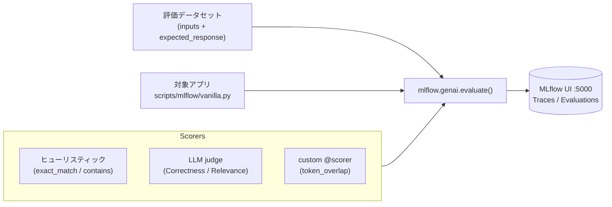

# ステップ 5 - MLflow GenAI 評価

## ゴール

このステップでは、**「トレースを採る」（ステップ 2）から一歩進んで**、
[MLflow 3.x GenAI Evaluation](https://mlflow.org/docs/latest/genai/) で
出力の **品質を定量評価** できるようにします。

このステップを終えると、次のことができるようになります。

- inputs と expected_response を持つ **評価データセット** を定義できる。
- **ヒューリスティック Scorer** でスコアリングできる（Azure / LLM 不要）。
- **LLM-judge Scorer**（Correctness, RelevanceToQuery）でスコアリングできる。
- **カスタム `@scorer`** で独自指標を実装できる。
- CLI と MLflow UI で評価ランを **並べて比較** できる。



!!! tip "ステップ 3 まで Azure 不要で進めます"
    `trace`, `dataset`, `evaluate`, `custom-scorer` の各サブコマンドは
    **ローカルのみで完結します（Azure 資格情報不要）**。
    `judge` のみデプロイ済みチャットモデルが必要です。

## なぜこのステップが必要か

ステップ 2 は *何が起きたか* を記録します。ステップ 5 は *それは良かったか* を答えます。

評価によってできること：

- プロンプト変更やモデル差し替え時の **品質回帰を検知** できる。
- 同じデータセット上で複数の設定（プロンプト / 温度 / モデル）を **定量比較** できる。
- 手動の目視チェックに代わり、**数値で品質を管理** できる。

MLflow GenAI Evaluation はデータセット・スコアリングロジック・結果ストアを
すべてローカルで完結させます。後からリモートに移行するときも評価コードは変更不要です。

## 前提条件

- `make mlflow` が実行済みであること（MLflow サーバーが `http://127.0.0.1:5000` で起動中）。
- プロジェクト依存が解決済みであること（`uv sync`）。
- `judge` サブコマンドのみ：Azure 資格情報（`az login`）とデプロイ済みチャットモデル（例: `azure_ai:gpt-5`）が必要。

## ステップ 5a – トレースを記録する

組み込みの QA 関数を一度実行して MLflow トレースを記録します。

```shell
uv run python scripts/mlflow/vanilla.py trace \
    --question "What is the capital of France?"
```

期待される出力：

```text
Q: What is the capital of France?
A: Paris
```

[http://127.0.0.1:5000](http://127.0.0.1:5000) を開いてトレースを確認できます。

## ステップ 5b – 評価データセットを確認する

組み込みの 5 件の QA ペアを表示します。

```shell
uv run python scripts/mlflow/vanilla.py dataset
```

各行の構造：

| フィールド           | 説明                                          |
| :------------------ | :-------------------------------------------- |
| `inputs.question`   | モデルに送る質問                               |
| `expected_response` | Scorer が参照するゴールドスタンダードの回答      |

ファイルに保存して確認・編集することもできます。

```shell
uv run python scripts/mlflow/vanilla.py dataset --output /tmp/eval_dataset.json
```

## ステップ 5c – ヒューリスティック評価（Azure 不要）

全 5 行に対して QA 関数を実行し、各出力をスコアリングします。

```shell
uv run python scripts/mlflow/vanilla.py evaluate
```

適用される純粋 Python Scorer：

| Scorer        | 計測内容                                              |
| :------------ | :---------------------------------------------------- |
| `exact_match` | 出力 == expected_response のとき 1.0（大文字小文字を無視）|
| `contains`    | 出力に expected_response が含まれるとき 1.0            |
| `non_empty`   | 出力が空でないとき 1.0                                 |

コマンドはメトリクスのサマリーと行ごとの結果テーブルを出力します。
実行結果は MLflow にも保存され、UI から確認できます。

```python title="ヒューリスティック Scorer のパターン"
from mlflow.genai.scorers import scorer

@scorer
def exact_match(outputs: str, expected_response: str) -> float:
    return 1.0 if outputs.strip().lower() == expected_response.strip().lower() else 0.0
```

## ステップ 5d – LLM-judge 評価（Azure 必要）

MLflow 組み込みの LLM judge を使って QA 関数を評価します。

```shell
uv run python scripts/mlflow/vanilla.py judge --model azure_ai:gpt-5
```

適用される Judge：

| Judge              | 計測内容                         |
| :----------------- | :------------------------------- |
| `Correctness`      | 回答が事実として正しいか？         |
| `RelevanceToQuery` | 回答が質問に対して関連しているか？  |

!!! warning "Azure 資格情報が必要です"
    `judge` サブコマンドは出力を評価するためにチャットモデルを呼び出します。
    資格情報が見つからない、またはモデルに到達できない場合は、明確なスキップ
    メッセージを表示してコード `0` で終了します（グレースフルスキップ）。

## ステップ 5e – カスタム Scorer

独自の `token_overlap` Scorer を実装して適用します。

```shell
uv run python scripts/mlflow/vanilla.py custom-scorer
```

この Scorer は `outputs` と `expected_response` のトークン集合の
[Jaccard 類似度](https://ja.wikipedia.org/wiki/%E3%82%B8%E3%83%A3%E3%82%AB%E3%83%BC%E3%83%89%E4%BF%82%E6%95%B0) を計算します。

```python title="カスタム Scorer のパターン"
from mlflow.genai.scorers import scorer

@scorer
def token_overlap(outputs: str, expected_response: str) -> float:
    """outputs と expected_response のトークン集合の Jaccard 類似度。"""
    a = set(outputs.lower().split())
    b = set(expected_response.lower().split())
    if not a and not b:
        return 0.0
    return len(a & b) / len(a | b)
```

このパターンを使えば、BLEU・ROUGE・安全性分類スコアなど任意のドメイン固有指標を
MLflow の第一級 Scorer として追加できます。

## ステップ 5f – 評価ランを比較する

2 つ以上の評価サブコマンドを実行した後、結果を比較します。

```shell
uv run python scripts/mlflow/vanilla.py compare
```

設定された MLflow 実験から最新のランを取得し、メトリクス列を並べたテーブルを
最新順で出力します。

グラフ付きのインタラクティブな比較には MLflow UI を使います。

```text
http://127.0.0.1:5000
```

**Experiments → [実験名] → Evaluation** に移動すると、全ランの色分け比較表が表示されます。

## 動作確認

ローカルの 3 つのサブコマンドを順番に実行し、エラーなく完了することを確認します。

```shell
uv run python scripts/mlflow/vanilla.py trace
uv run python scripts/mlflow/vanilla.py dataset
uv run python scripts/mlflow/vanilla.py evaluate
uv run python scripts/mlflow/vanilla.py custom-scorer
uv run python scripts/mlflow/vanilla.py compare
```

全 5 コマンドが結果を stdout に出力し、コード `0` で終了すれば OK です。
`evaluate`, `custom-scorer`, `judge` の実行結果は MLflow UI の実験にも
記録されます。

## トラブルシューティング

??? failure "MLflow サーバーが起動していない"
    サブコマンドを実行する前にサーバーを起動してください。

    ```shell
    make mlflow
    ```

    CLI は `.env` から `MLFLOW_TRACKING_URI` を読み込みます（既定値 `http://127.0.0.1:5000`）。

??? failure "ModuleNotFoundError: mlflow.genai"
    `mlflow.genai` 名前空間には `mlflow>=3.12.0` が必要です。バージョンを確認してください。

    ```shell
    uv run python -c "import mlflow; print(mlflow.__version__)"
    ```

    必要に応じて依存を再同期します。

    ```shell
    uv sync
    ```

??? failure "`judge` がスキップメッセージを表示して終了する"
    資格情報が見つからない、またはモデルに到達できない場合、`judge` は
    グレースフルスキップします。有効化するには：

    1. `az login` でサインイン。
    2. `.env` に `AZURE_AI_PROJECT_ENDPOINT`（と必要に応じて `AZURE_AI_MODEL`）を設定。
    3. Foundry プロジェクトにモデルがデプロイされているか確認。
    4. 再実行: `uv run python scripts/mlflow/vanilla.py judge --model azure_ai:gpt-5`

??? failure "評価結果テーブルが空になる"
    `mlflow.genai.evaluate()` の `data` 引数には `inputs` キーを持つ辞書のリストが必要です。
    組み込みデータセットはこの形式に従っています。カスタムデータセットを使う場合は
    スキーマを確認してください。

## 次のステップ

これで再現可能なローカル評価ループが整いました。考えられる次の展開：

- **CI での回帰ゲート**: GitHub Actions に `evaluate` ステップを追加し、
  主要指標がしきい値を下回ったらビルドを失敗させる。
- **プロンプト最適化**: `mlflow.genai.optimize_prompt()` でデータセットと
  Scorer を使い、より良いプロンプトを自動探索する。
- **リモート実験ストア**: `MLFLOW_TRACKING_URI` を共有 MLflow サーバーに向けて
  チームでブランチをまたいだ比較を行う。

[チュートリアル概要](index.md) に戻るか、参照資料のまとめは
[Appendix - 参考資料](appendix.md) をご覧ください。
